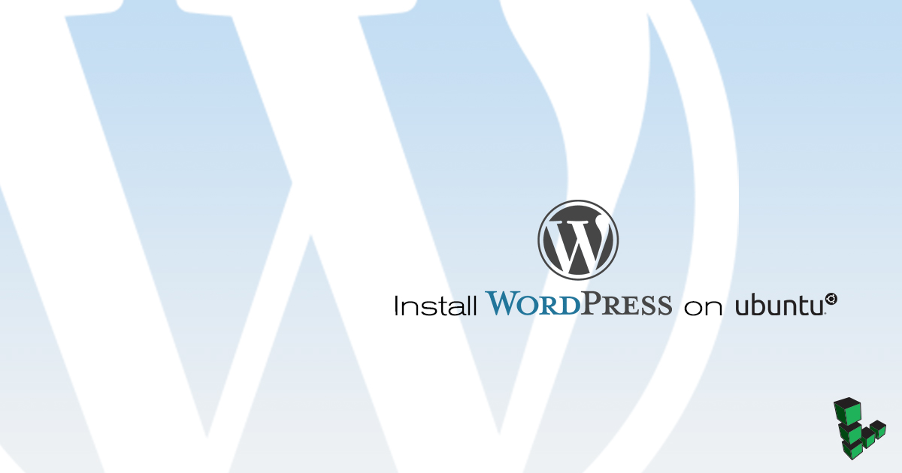
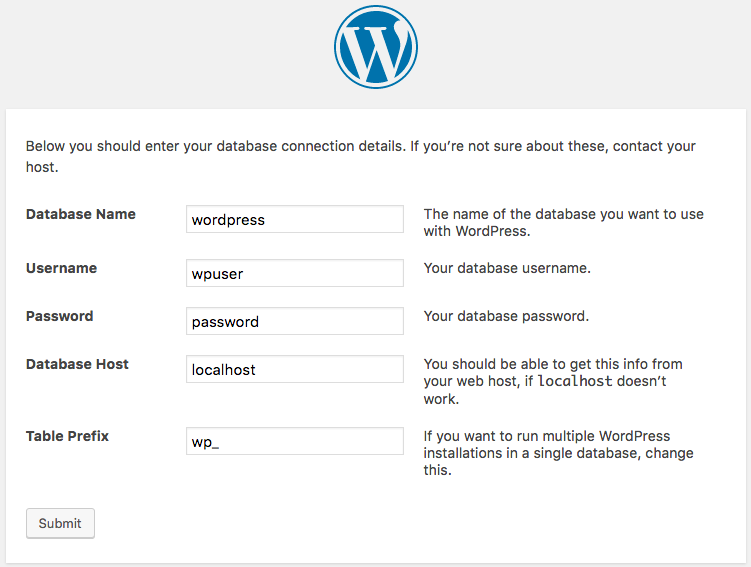
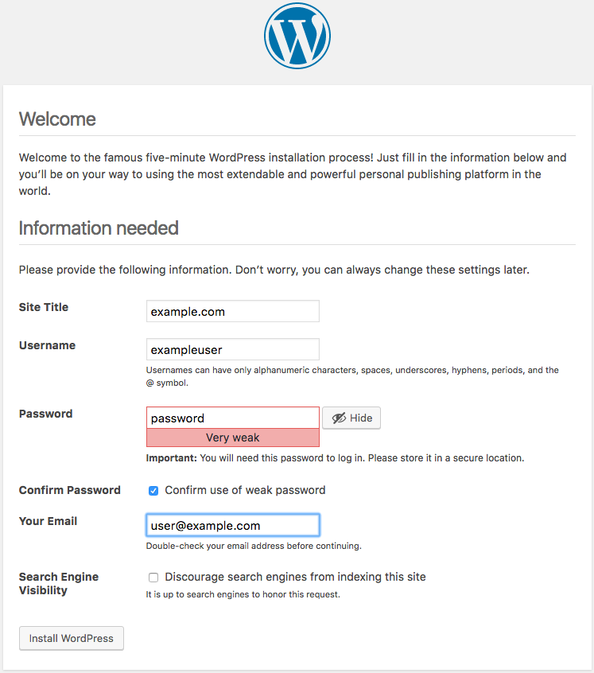
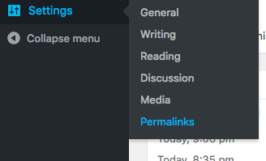

## What is WordPress?

WordPress is a popular PHP-based dynamic content management system (CMS) focused on blogging. You can easily install WordPress on Ubuntu 18.04 because it is configured to work with Apache or NGINIX, MySql, PHP in a LAMP or a LEMP stack. It also features an extensive plugin framework, and theme system that allows site owners to use the simple and powerful publishing tools.

<!--  -->



Replace each instance of `example.com` in this guide with the domain name or IP address of the website.

## Before You Begin Installing WordPress

-   Follow the [Creating a Compute Instance](/docs/guides/creating-a-compute-instance/) and [Setting Up and Securing a Compute Instance](/docs/guides/set-up-and-secure/) guide, and ensure that the Linode's [hostname is set](/docs/guides/set-up-and-secure/#configure-a-custom-hostname).

    To check the hostname run:

        hostname
        hostname -f

    The first command outputs the short hostname; the second, a fully-qualified domain name (FQDN).

-   Configure a [LAMP](/docs/guides/how-to-install-a-lamp-stack-on-ubuntu-18-04/) or [LEMP](/docs/guides/how-to-install-the-lemp-stack-on-ubuntu-18-04/) web stack on Ubuntu 18.04 installation.

-   If you are running NGINX, edit the `location /` block of the configuration to set `index.php` as an index for the site:

    
location / {
    index index.php index.html index.htm;
    try_files $uri $uri/ =404;
}


-    If you are using Apache, run the following commands to ensure that `mod_rewrite` is enabled:

        sudo a2enmod status

    If it isn't already enabled, enable a2enmod and restart Apache:

        sudo a2enmod rewrite
        sudo systemctl restart apache2

## Install WordPress on Ubuntu 18.04

### Prepare the WordPress Database in MySQL

WordPress stores blog posts and other content in a MySQL database, and you need to prepare the database before you can start using WordPress:

1.  Log in to the MySQL command line as the root user:

        sudo mysql -u root

2.  Create the WordPress database:

    
CREATE DATABASE wordpress;


3.  Create a user and grant privileges for the newly created `wordpress` database, replacing `wpuser` and `password` with the username and password you wish to use:

    
CREATE USER 'wpuser' IDENTIFIED BY 'password';
GRANT ALL PRIVILEGES ON wordpress.* TO 'wpuser';


4.  Exit MySQL:

    
quit


### Download WordPress

1.  Create a directory called `src` under the website's directory to store fresh copies of WordPress's source files. In this guide, the home directory `/var/www/html/example.com/` is used as an example. Navigate to that new directory:

        sudo mkdir -p /var/www/html/example.com/src/
        cd /var/www/html/example.com/src/

2.  Set the web server's user, `www-data`, as the owner of the home directory for the site:

        sudo chown -R www-data:www-data /var/www/html/example.com/

3.  Install the latest version of WordPress and extract it:

        sudo wget http://wordpress.org/latest.tar.gz
        sudo -u www-data tar -xvf latest.tar.gz

4.  Rename `latest.tar.gz` as `wordpress` followed by the date to store a backup of the original source files. This is useful if you install new versions in the future and need to revert to a previous release:

        sudo mv latest.tar.gz wordpress-`date "+%Y-%m-%d"`.tar.gz

5.  Create a `public_html` directory as the root directory for WordPress. Move the WordPress files to the `public_html` folder:

        sudo mkdir /var/www/html/example.com/public_html/
        sudo mv wordpress/* ../public_html/

6.  Give the web server ownership of the `public_html` folder:

        sudo chown -R www-data:www-data /var/www/html/example.com/public_html

### Configure WordPress

1.  Visit the domain in a web browser and follow the steps shown onscreen. Select your preferred language, review the information page and click the **Let's go!** button. Enter the database credentials that were set when you installed MySQL:

    

    WordPress tests the credentials and if authentication is successful, prompts you to **Run the install**.

    
If WordPress doesn't display when you visit the domain, try adding `/wp-admin` to the end of the URL. This sometimes happens if you previously created an index file in the site's home directory.


2.  Fill out the administration information and click **Install WordPress**.

    

    Click **Log In**, enter the credentials and proceed to the WordPress Dashboard.

3.  By default, WordPress prompts you for FTP credentials when you install new themes or plugins. To bypass this, modify the `wp-config.php` file by adding the following lines:

    
/** Bypass FTP */
define('FS_METHOD', 'direct');


5.  To make changes to the site in the future, you can access the Dashboard of the WordPress site from the web interface by adding `/wp-admin` to the site's URL: `example.com/wp-admin`.

Congratulations! You have now successfully installed WordPress.

## Create WordPress Permalinks (Optional)

*Permalink* is a portmanteau of the words *permanent* and *link*. Permalinks are URLs that are automatically created for specific posts or pages in WordPress so that you or others can link to them. WordPress's default settings assign post numbers as permalinks, meaning a link to a specific post would look like `example.com/?p=42`. To enforce a "prettier" permalink format, you need to make a few adjustments to Apache or nginx.

For more information on permalinks, visit the [WordPress guide on permalinks](https://codex.wordpress.org/Using_Permalinks).

To configure permalink settings:

1.  Log in to the WordPress admin panel through the site's `/wp-admin` URL.

2.  Mouseover **Settings** in the menu on the left of the screen, then click **Permalinks**:

    

3.  Select a preferred permalink style or create your own *Custom Structure* and click **Save Changes**

4.  Configure the web server to allow WordPress to create the customized URLs using the appropriate section below.

### Configure WordPress to Allow Permalinks on Apache

Instruct Apache to allow individual sites to update the `.htaccess` file, by adding the following options to the *Directory* section in the virtual host configuration:


<Directory /var/www/html/example.com/public_html>
    Options Indexes FollowSymLinks
    AllowOverride All
    Require all granted
</Directory>


Reload Apache to enable the changes:

    sudo systemctl reload apache2

### Configure WordPress to Allow Permalinks on NGINX

Direct nginx to check whether each permalink refers to an existing page. By default, nginx assumes that it doesn't, and returns a server-side 404. Update the following lines in the `location / {` block in the virtual host configuration:


location / {
    index index.php index.html index.htm;
    try_files $uri $uri/ /index.php?$args;
}


Reload NGINX to enable the changes:

    sudo systemctl reload nginx

## Configure Maximum File Size Upload Setting to Allow Larger Files

By default, PHP restricts web uploads to under two megabytes. To allow larger file uploads through the web interface, configure the `upload_max_filesize` setting in `php.ini`:

**Apache**: `/etc/php/7.2/apache2/php.ini`

**NGINX**: `/etc/php/7.2/fpm/php.ini`


; Maximum allowed size for uploaded files.
; http://php.net/upload-max-filesize
upload_max_filesize = 2M


## Install Optional PHP Extensions

WordPress, and many of its plugins, use PHP extensions that you need to install manually. This section is optional, but it allows you to access some WordPress features that you may not have with a basic PHP installation.

-   In order to modify photos or images in Wordpress, you need the PHP-GD extension. For example, when you upload an image to use as a header, you may need to crop the image to make it fit the page.

To install the GD extension:

        sudo apt install php-gd

-   For full non-English language support and to fix certain character encoding-related bugs, install the multibyte string (MBSTRING) extension.

To install MBSTRING:

        sudo apt install php-mbstring

-   To use XML-RPC to access WordPress with the mobile app, or to use Jetpack, you need `php-xmlrpc`. For more information on XML-RPC, visit the [WordPress guide on XML-RPC](https://codex.wordpress.org/XML-RPC_Support). For more information on Jetpack, visit [Jetpack for Wordpress](https://jetpack.com/).

To install the XML-RPC extension:

        sudo apt install php-xmlrpc

These are only a few of the extensions that you may find useful. Plenty of other PHP extensions exist and are required for certain plugin features, such as `php-curl`, and `php-xml`. If you have issues with a plugin or widget, check the official documentation of the plugin to see if a PHP extension is required.
