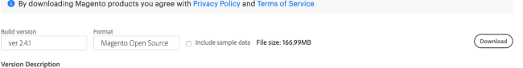

This guide explains how to install [*Magento*](https://magento.com/) on CentOS 8. Magento is a popular Open source e-commerce platform from Adobe. Magento uses *PHP*, *Elasticsearch*, and either a *MySQL* or *MariaDB* database system, along with a web server such as *Apache*. This guide focuses on how to install the free *Magento Open Source Edition*. Magento also offers *Magento Commerce* (with more extensive out of the box features and unlimited scaling), and the paid *Magento Commerce (On-Premises)* version with even more features and support.


Although this guide covers installation of Magento 2.4, version 2.3 is still available and fully supported.


## Before You Begin

1.  If you have not already done so, create a Linode account and Compute Instance. It's recommended to run Magento on at least a 4GB instance. See our [Getting Started with Linode](/docs/guides/getting-started/) and [Creating a Compute Instance](/docs/guides/creating-a-compute-instance/) guides.

1.  Follow our [Setting Up and Securing a Compute Instance](/docs/guides/set-up-and-secure/) guide to update your system. You may also wish to set the timezone, configure your hostname, create a limited user account, and harden SSH access. Do **not** follow the Configure a Firewall section yet. This guide includes firewall rules specifically for an Magento server.

        sudo dnf update && sudo dnf upgrade

1. This guide uses the sample domain name of `example.com` and a Magento root directory of `/var/www/html/example.com/public_html`, along with default username and password variables such as `magentouser` and `magentopassword`. Substitute your own values when you encounter these variables throughout the guide.


The steps in this guide require root privileges. Be sure to run the steps below as `root` or with the `sudo` prefix. For more information on privileges, see our [Users and Groups](/docs/guides/linux-users-and-groups/) guide.


## Advantages/Drawbacks of Magento

Magento is a popular choice for e-commerce platforms due to its large number of features. It includes drag and drop functionality for page development and user experience. Magento scales well, is flexible and customizable, and is useful for both B2B and B2C contexts. Developers can add or develop plug-in modules to extend Magento's core functionality. Magento also has a large user-base and helpful community.

On the other hand, some users find Magento difficult to set up and configure. Non-technical users may have trouble customising their storefront.

## A Summary of the Magento Installation Process

A complete Magento installation consists of the following high-level steps. Each step is described below.

1.  Verify the Magento system requirements;
2.  Upgrade and validate the host, including the CentOS platform;
3.  Install and configure prerequisite components;
4.  Download and extract the Magento software;
5.  Set the necessary ownership and permissions for files and directories;
6.  Run the Magento set-up program to install the software;
7.  Complete the Magento post installation tasks.

After these steps, you can set up your storefront and put your site into production.


This guide describes the process for a standard installation of the free version of Magento via the command-line. It assumes technical knowledge of CentOS essentials and some experience with software installation, as well as command-line access to the Magento server.


## Verify the Magento System Requirements

### Memory Requirements

Magento requires as much as 2GB of free memory. If your system does not have enough free memory, you must create a swap file first. We recommend at least a **Linode 4GB** for the best performance.

If you do not have access to a system with 2GB of memory, you can create a swap file with the following commands. This swap file is temporary and only persists until the next reboot.

1.  Create a directory for the swap file, and add a file within this directory to hold the swap data. The `count` parameter refers to the size of the swap file in MBs. This must be set to at least 2048, but you can configure it to an even larger amount if you want.

        sudo mkdir /swapdir/
        sudo dd if=/dev/zero of=/swapdir/swapfile bs=1MB count=2048
2.  Set the permissions for the file:

        sudo chmod 600 /swapdir/swapfile
3.  Format this file into a functional swap file:

        sudo mkswap /swapdir/swapfile
        sudo swapon /swapdir/swapfile


### Browser Requirements

Magento storefronts are designed to run on one of the latest two releases of the following browsers:
*   Microsoft Edge
*   Firefox (any operating system)
*   Chrome (any operating system)
*   Safari (Mac operating system only)
*   Chrome for mobile (Android 4 or later) for mobile storefronts

Magento can run on iOS 12 or later on the following platforms:
*   Safari Mobile for iPad 2, iPad Mini, iPad with Retina Display (desktop storefronts)
*   Safari Mobile for iPhone 6 or later (mobile storefronts)

## Upgrade and Validate the Host, Including the CentOS Platform

1.  Ensure your host meets the system requirements.
2.  Confirm your host is running the latest version of CentOS 8 and update it if necessary.
3.  Set up and test any load balancing configuration (if applicable).
4.  Back up your system before proceeding with the installation so you can roll back if necessary.


We recommend you make a check point backup before installing and configuring the ancillary software components. Take another checkpoint before installing Magento.



## Install and Configure Prerequisite Components

Several other software components must be present and properly configured before Magento can be installed. The components are:
1.  The web server, preferably Apache
2.  SQL database
3.  PHP 7.4
4.  Elasticsearch

Follow the instructions in the [How to Install a LAMP Stack on CentOS 8](/docs/guides/how-to-install-a-lamp-stack-on-centos-8/) guide to install Apache, SQL, and PHP.


        1. Enable the repositories by using: ```sudo dnf install https://rpms.remirepo.net/enterprise/remi-release-8.rpm -y```
        2. List the available PHP version using: ``` sudo dnf module list php```
        3. Enable the latest version of PHP using: ```sudo dnf module enable php:remi-7.4```



### Web Server

1.  Magento requires Apache version 2.4. You can verify what version of Apache you have with the following command:

        httpd -v
2.  Magento requires the `mod_deflate.c`, `mod_expires.c`, `mod_headers.c`, `mod_rewrite.c`, `mod_security.c`, `mod_ssl.c`, and the `mod_version.c` Apache modules. You can generate a list of the installed modules via the command `sudo httpd -M`. Look for the presence of a component named `deflate_module` to verify `mod_deflate.c` is installed.

3.  Install any missing modules with the following command, replacing `modname` with the name of the actual module:

        sudo dnf install mod_modname
    Check if the ssl module is installed using ```sudo httpd -t -D DUMP_MODULES | grep ssl```command. If `mod_ssl.c` is not already installed, you should create a *Secure Sockets Layer* (SSL) certificate when you install it. Use the following command to create your own self-signed key and certificate:

        openssl req -newkey rsa:2048 -nodes -keyout /etc/pki/tls/private/httpd.key -x509 -days 365 -out /etc/pki/tls/certs/httpd.crt
    After creating the key, edit the `/etc/httpd/conf.d/ssl.conf` file. Set the values of `SSLCertificateFile` and `SSLCertificateKeyFile` to reference the key you created:


    
    SSLCertificateFile /etc/pki/tls/certs/httpd.crt
    SSLCertificateKeyFile /etc/pki/tls/private/httpd.key



    
Most payment processors and financial institutions do not recognise or accept self-signed certificates. Before putting your store into production, you must obtain a commercially-signed certificate. More information can be found in [the Linode guide about SSL certificates](/docs/security/ssl/obtain-a-commercially-signed-ssl-certificate-on-centos-and-fedora).


4.  Configure the virtual host settings for your website on Apache. There are a variety of ways to structure these settings. One straightforward approach is to add them to the `/etc/httpd/conf.d/vhost.conf` file. Add the following contents to the file, replacing `example.com` with your own domain. The directory specified within the virtual host serves as your Magento root directory. Later on, you will install the Magento software from this location.

    To allow URLs with path separators (for example, `%2F` for "/"), set `AllowEncodedSlashes` to `NoDecode` in either the global server config or the virtual host configuration. The default value of `off` causes Apache to refuse this class of URLs and return a 404 error.

    
<Directory /var/www/html/example.com/public_html>
    Require all granted
</Directory>

<VirtualHost *:80>
    ServerName example.com
    ServerAlias www.example.com
    ServerAdmin webmaster@localhost
    DocumentRoot /var/www/html/example.com/public_html

    ErrorLog /var/www/html/example.com/logs/error.log
    CustomLog /var/www/html/example.com/logs/access.log combined

    <Directory /var/www/html/example.com/public_html>
        Options Indexes FollowSymLinks MultiViews
        AllowOverride All
    </Directory>

</VirtualHost>


5.  Add an `IncludeOptional` directive to `etc/httpd/conf/httpd.conf` to parse this directory:

    
    IncludeOptional conf.d/*.conf

6.  SELinux might prevent Apache from writing to these logs or even from starting up with these settings. If this occurs, navigate to the `var/www/html/example.com` directory and run the following commands:

        semanage fcontext -a -t httpd_sys_rw_content_t 'logs'
        sudo semanage fcontext -a -t httpd_sys_rw_content_t 'logs'
7.  If Apache is not already configured to activate at boot, add an entry to `systemctl` to this effect. Then restart the web server:

        sudo systemctl start httpd.service
        sudo systemctl enable httpd.service
        sudo systemctl restart httpd.service


If you require more information on setting up Apache or configuring virtual hosts, consult Linode's [Apache on CentOS 8](/docs/web-servers/apache/how-to-install-apache-web-server-centos-8) guide.



NGINX 1.x can also be used as the Magento web server.


### SQL Database

MySQL 8.0 is recommended, although MariaDB version 10.4+ can also be used. All Magento SQL statements are compatible with MariaDB. Execute the following steps to prepare your database for the Magento installation.

1.  Ensure MySQL is installed. Confirm its release version and upgrade it if necessary.

        sudo dnf install mysql-server
        mysql -V
2.  Ensure the MySQL server is running. If not, start your server and verify its status with the following commands:

        sudo systemctl start mysqld.service
        sudo systemctl status mysqld
3.  Run the `mysql_secure_installation` utility to ensure your database is more secure. This utility walks you through your security settings and allows you to set a root password.

        mysql_secure_installation
4.  Log in to mysql as root:

        mysql -u root -p
5.  Create a database and user account for Magento. Replace `dbpassword` with your own strong password (the exclamation point "!" must not be used in an MySQL password). You can also change the user name to something more specific (in this case, ensure you make the same substitution in the GRANT command).

        CREATE database magento;
        CREATE user 'magento' IDENTIFIED BY 'dbpassword';
        GRANT ALL ON magento.* TO 'magento';
        FLUSH PRIVILEGES;
        EXIT;
6.  Log in to the database as the new user and verify it is accessible:

        mysql -u magento -p
7.  Record the name of the database and password you created and store this information in a safe place for later.
8.  If MySQL is not already configured to become active at start-up time, add this entry to `systemctl`:

        systemctl enable mysqld

### PHP

Magento recommends the use of PHP 7.4.0 or higher.

1.  Verify the following PHP modules are already enabled through the use of the `php -m` command:

        ext-bcmath
        ext-ctype
        ext-curl
        ext-dom
        ext-gd
        ext-hash
        ext-iconv
        ext-intl
        ext-mbstring
        ext-openssl
        ext-pdo_mysql
        ext-simplexml
        ext-soap
        ext-xsl
        ext-zip
        ext-sockets
2.  Install any missing modules. The following example installs `ext-bcmath`, `ext-gd`, and `ext-intl`:

        sudo dnf install php-bcmath php-gd php-intl

The `php.ini` file requires a number of modifications. This file is typically located in the `/etc` directory (if not, its location can be found in the `phpinfo.php` file).

1.  Set the correct system time zone for your host. You can use the [PHP timezone reference](https://www.php.net/manual/en/timezones.php) to locate the right setting for your time zone.

        date.timezone =
2.  Set the PHP memory limit. 1G is recommended for compiling code or deploying assets, while 2G is required for debugging, and 4G for testing.

        memory_limit=2G
3.  Increase the cache amounts to the recommended settings. This allows PHP to cache file paths and increases performance.

        realpath_cache_size=10M
        realpath_cache_ttl=7200
4.  Adjust a few other settings, such as `upload_max_filesize`, `max_input_time`, and `max_execution_time`. See the settings in the following file snippet for the full list.

    
date.timezone = Europe/London
memory_limit= 2G
realpath_cache_size=10M
realpath_cache_ttl=7200
upload_max_filesize = 256M
max_execution_time = 18000
max_input_time = 30
error_reporting = E_COMPILE_ERROR|E_RECOVERABLE_ERROR|E_ERROR|E_CORE_ERROR
error_log = /var/log/php/error.log


Enable the PHP Opcache for better performance. This setting can be found and modified in `opcache.ini`.

1.  Open the `opcache.ini` file. This file is usually found at `/etc/php.d/opcache.ini`, but you can find its exact location using the ```php --ini``` command.
If you do not find the ```opcache.ini``` file, install it using ```sudo dnf install php-opcache```

2.  Set the `opcache.save_comments` variable to 1, uncommenting it if necessary:

        opcache.save_comments = 1
3.  If you have other `opcache.ini` files, modify all of them in the same manner.
4.  Create a log directory for PHP and assign ownership to the web server:

        sudo mkdir /var/log/php
        sudo chown apache /var/log/php
5.  Restart the web server:

        sudo systemctl restart httpd.service

### Elasticsearch

Elasticsearch provides advanced search capabilities for Magento. Magento requires Version 7.6 or higher of Elasticsearch (the current edition is 7.10). Elasticsearch in turn requires *Java Development Kit* (JDK) version 1.8 or higher. Elasticsearch must be installed before installing Magento. We recommend Elasticsearch and the web server run on the same host for a more trouble-free deployment.

1.  Download an Elasticsearch archive for CentOS on [The Elasticsearch download page](https://www.elastic.co/guide/en/elasticsearch/reference/current/targz.html) and follow all instructions.
2.  Enter the directory where Elasticsearch is installed (for example, `elasticsearch-7.10.0`) and start Elasticsearch:

        ./bin/elasticsearch
3.  Run a curl command to confirm Elasticsearch works. A "green" status indicates a successful reply. Use the following command to take an Elasticsearch health check:

        curl -XGET 'localhost:9200/_cat/health?v&pretty'
    
Elasticsearch could potentially be in the "yellow" state if back up capabilities or other features are not available. You can still proceed with the installation in this case, but we recommend you correct this before deployment.

4.  Confirm the version of the Java JDK and install or upgrade it as necessary. The Java Runtime Environment (JRE) is not required.

        java -version
        yum install java-1.8.0-openjdk
5.  Your firewall might be set up to disallow communication between Elasticsearch and your web server. The [CentOS SELinux page](https://wiki.centos.org/HowTos/SELinux) is helpful in case you run into any issues. If you are running SELinux in `enforcing` mode, you can use the following command to allow Linux to connect to local upstream components:

        sudo  setsebool -P httpd_can_network_connect=1
6.  Install and enable the mod_proxy component for the Apache server if it is not already installed. Use the command `httpd -M` to see what modules are installed.

        sudo dnf install mod_proxy
7.  Enable communication between Elasticsearch and the web server. This process sets up an unsecured communication channel between Apache and Elasticsearch because this is easier to set up and verify. To improve the security of this channel later on, consult [Magento's proxy information](https://devdocs.magento.com/guides/v2.4/install-gde/prereq/es-config-apache.html#es-ws-secure-apache-pwd). Open the file `/etc/httpd/sites-available/000-default.conf`, and add the following information to the top of the file:

    
Listen 8080
<VirtualHost *:8080>
    ProxyPass "/" "http://localhost:9200/"
    ProxyPassReverse "/" "http://localhost:9200/"
</VirtualHost>


    Ensure there is an `IncludeOptional` entry for `sites-available/*.conf` in `/etc/httpd/conf/httpd.conf`.
    
IncludeOptional sites-available/*.conf

8.  Restart Apache:

        sudo systemctl restart httpd.service
9.  Use the following command to validate the communication channel between Apache and Elasticsearch. An `HTTP 200 OK` response indicates the components are working together.

        curl -i http://localhost:8080/_cluster/health

    
Elasticsearch's default heap size of 1G is not enough for most deployments and could lead to timeouts or other failures. For production environments, set the `ES_HEAP_SIZE` variable to a higher value with the command `export ES_HEAP_SIZE=4g`


### Secure Socket Layer (SSL)

HTTPS requires a valid commerically-signed certificate. *Transport Layer Security* (TLS) 1.2 or later must be used.

### Required System Dependencies

Magento requires the presence of several system tools in order to work correctly. Most hosts already have these tools.

*   bash
*   gzip
*   lsof
*   mysqldump
*   nice
*   sed
*   tar

### Optional Software Extensions

Magento can be used with the following optional software components:

*   *Redis*: version 5.0 is recommended. You can use Redis to cache pages and for session storage.
*   *Varnish*: version 6.x is recommended.
*   *RabbitMQ*: 3.8.x is required. RabbitMQ provides a facility to publish messages to queues and receive messages asynchronously.

## Download and Extract the Software

Magento software is available to download in several compression formats on [the Magento downloads page](https://magento.com/tech-resources/download).


You can also download Magento using Composer via the downloads page. Composer allows for extra configurability, but Composer is not required in order to download Magento.


1.  Navigate to the [Magento downloads page](https://magento.com/tech-resources/download).
2.  Scroll to the “Archive (zip.tar)” section where you can download either a zipped or tarred file. Choose the desired "Build version" (we recommend you install the latest version… as of November 2020, this is version 2.4.1), and the "Format" (zip, tar.gz, or tar.bz2). You can optionally choose to include the sample/test data set. This data set allows you to view a fully-configured storefront after Magento is fully installed. Click **Download** to begin downloading the file.

    

    
You must create an account before you can download Magento. There is no cost for either the account or the download.

3.  If you have downloaded the software onto a different computer than the host, transfer the Magento files to the host via `scp`, `ftp`, or another file transfer method. Replace the `user` and `yourhost` values with your user name and host IP address:

        scp /localpath/magento-ce-2.*.tar.gz user@LinodeIPaddress:~/
4.  On your host, navigate to the Magento root directory. (This is the directory specified within the virtual host entry for your domain.) Copy the Magento archive to this subdirectory.
5.  Extract the files using the appropriate command from the list below (the one corresponding to your archive format). Substitute the name of your actual archive in place of `archive`. After the extraction process is complete, either delete the archive or store it in a secure place elsewhere on your system.

         tar -zxvf archive.tar.gz
         unzip archive.zip
         tar -jxvf archive.tar.bz2

## Set the Necessary Ownership and Permissions for Files and Directories

You must configure permissions and ownership for some directories and files before installing Magento. This process differs somewhat depending on whether the Magento and the web server users are different or not. A one-user setup is most typical in a shared hosting situation, but it is not as secure as having two users.

If there is only one user, navigate to your Magento root directory and enter the following commands. This ensures certain directories are writable.

        find var generated vendor pub/static pub/media app/etc -type f -exec chmod u+w {} +
        find var generated vendor pub/static pub/media app/etc -type d -exec chmod u+w {} +
        chmod u+x bin/magento

If the Magento and web server users are different, create a shared group for both owners so they both have access to the Magento files. This method is considered more secure than having the same owner for both services.

1.  Create a Linux user to serve as the Magento file system owner and provide this user with a password. The user name here is magento, but you can choose another name if you want.

        sudo adduser "magento"
        sudo passwd "magento"
2.  Determine the web server user's group (this is typically called `apache`):

        grep -Ei '^user|^group' /etc/httpd/conf/httpd.conf
3.  Add the Magento file system owner to the web server group. Substitute the actual user names for the web server group and the Magento file system owner in the following command:

        sudo usermod -a -G "apache" "magento"
4.  Confirm the Magento user is now a member of the webserver group:

        groups "magento"
5.  Restart your web server:

        sudo systemctl restart httpd.service
6.  Ensure you are still in the Magento root directory and type the following commands, using your specific web server user and Magento user names for the `chown` command.

        sudo find var generated vendor pub/static pub/media app/etc -type f -exec chmod g+w {} +
        sudo find var generated vendor pub/static pub/media app/etc -type d -exec chmod g+ws {} +
        sudo chown -R magento:apache .
        sudo chmod u+x bin/magento
7.  SELinux might prevent Apache and PHP from writing to the Magento directory. Replace `magentorootdirectory` with your actual root directory in the following commands to work around this problem:

        sudo restorecon -R "magentorootdirectory"
        sudo setsebool -P httpd_unified 1
8.  Restart the web server again:

        sudo systemctl restart httpd.service


Troubleshoot SELinux issues by changing `SELINUX=enforcing` to `SELINUX=permissive` in the `/etc/selinux/config` file. This setting relaxes security; it only logs potential violations. Ensure you understand all the security implications of this before changing this value on a production system. It is best to leave SELinux in enforcing mode and configure any exceptions on a case-by-case basis.


## Run the Magento Set-up Program to Install the Software

1.  Navigate to the Magento root directory (the directory specified within the virtual host entry for your domain). You must either install Magento from within this directory or specify the complete directory path to this location in the command.
2.  Run the `install` command. Specify all the mandatory options listed right below along with any optional ones you might require. See the table below this section for a list of all of the optional parameters.

        sudo bin/magento setup:install --<option>=<value> ... --<option>=<value>

    -   **admin-firstname** - This is the Magento administrator user’s first name.
    -   **admin-lastname** - This is the Magento administrator user’s last name.
    -   **admin-email** - This is the email of the Magento administrator.
    -   **admin-user** - This is the user name of the Magento administrator (for logging into the Magento Admin page).
    -   **admin-password** - This is the user password for the Magento administrator (enclosed in single quotes).  Magento requires you to use a password with at least one letter and one number.
    -   **base-url** - This is the URL to access the storefront. For example: `http[s]://<website>/<Magento-install-dir>/` or `http[s]://<ip>/<Magento-install-dir>/`. The trailing slash is mandatory. The `Magento-install-dir` is the path of the Magento directory root (the website directory in the virtual hosts file) relative to the web server document root. If these two values are the same, leave `Magento-install-dir` blank. To access this on a localhost, use `http://127.0.0.1/<Magento-install-dir>/`. For a containerised environment, use `‘’`.
    -   **db-host** - This is the address of the database. If the database server resides on the same host as Magento, use localhost. If not, specify the address or name of the server where the database is hosted.
    -   **db-name** - This is the name of the database instance where the Magento database tables are installed. We used `magento` earlier.
    -   **db-user** - This is the user name of the owner of the Magento database instance. The default is root.
    -   **db-password** - This is the password for the Magento database user.
3.  Here is an example of a sample installation. Replace `db-password` and `db-user` with the user name and password you created for MySQL earlier. Create a unique and strong password for the `admin-password`. Replace `your_URL_or_domain` with the proper `base-url` as described above. See the table following this section for more information on each option.

        bin/magento setup:install --admin-firstname="Magento" --admin-lastname="User" --admin-email="user@example.com" --admin-user="Magentouser" --admin-password="password" --db-name="magento" --db-host="localhost" --db-user="magento" --db-password="password" --language=en_US --currency=USD --timezone=Europe/London --cleanup-database --base-url=http://"your_URL_or_domain"
4.  Wait for Magento to complete its installation. This typically takes 5 to 10 minutes. Upon completion, the program displays a "Success" message as well as a `Magento Admin URI` key. The URI provides access to the Magento Admin page. The label begins with "admin_", followed by a six-digit alphanumerical sequence.
5.  For ease of development, you can place your Magento application into development mode while you work on getting it running. See the post-installation section for information on placing your store into production mode.

        sudo bin/magento deploy:mode:set developer


Store the `Magento Admin URI`, the `admin-user` name, and the `admin-password` in a safe place. You will require this information to access your Magento Admin page and administer your site. It is important you keep your admin information secure.



### Optional Magento Parameters

| Option | Definition |
| ------------------- | ------------- |
| backend-frontname | This specifies the *Uniform Resource Identifier* (URI) used to access the Magento Admin page. If you omit this parameter, Magento generates a random URI and displays it at the end of the installation. Magento recommends a random URI for security purposes. The Magento URI must only contain alphanumeric values and the underscore character. |
| db-prefix | This prefix identifies the Magento database tables for the installation. Only specify a value if the Magento database already contains Magento tables from another Magento instance. This prefix has a maximum length of five characters, it must begin with a letter, and it may include only letters, numbers, and underscore characters. |
| db-ssl-key | This is the path to the client key. |
| db-ssl-cert | This is the path to the client certificate. |
| db-ssl-ca | This is the path to the server certificate. |
| language | This is a code specifying the language to use in the Magento Admin page and storefront. The command `magento info:language:list` can be used to list all of the language codes. |
| currency | This is the default currency to use in the storefront. The command `magento info:currency:list` can be used to list all of the currency codes. |
| timezone | This is the default time zone to use in the Magento Admin page and storefront. The command `magento info:timezone:list` can be used to list all of the time codes. |
| use-rewrites | A setting of 1 configures the web server to use rewrites for any generated links in the storefront and Magento Admin page. A setting of 0 disables these rewrites. |
| use-secure | A setting of 1 enables SSL usage in storefront URLs. 0 disables the use of SSL. |
| base-url-secure | This sets a secure base URL for accessing the Magento Admin page and storefront. |
| use-secure-admin | A setting of 1 mandates the use of SSL to access the Magento Admin page. 0 means SSL is not used. |
| admin-use-security-key | The default setting of 1 instructs Magento to generate a random key value to access pages in the Magento Admin page and in forms. This helps prevent cross-site script forgery attacks. 0 disables the key. |
| session-save | A setting of `db` stores session data in the database. This is the recommended setting if you have a clustered database or if your file system access is slow. A setting of `files` stores session data in the file system. A setting of `redis` stores session data in Redis. If you intend to use Redis, it must already be installed. |
| cleanup-database | Use this parameter without any value to drop all existing database tables before installing the Magento software. If the parameter is not specified, the installation program leaves the Magento database intact. |
| db-init-statements | This parameter provides database initialization statements (if any) to run when connecting to the MySQL database. The default is `SET NAMES utf8;`. |
| sales-order-increment-prefix | This specifies a string value to serve as a prefix for sales orders. It guarantees unique numbers for payment processors. |
| consumers-wait-for-messages | A setting of 1 indicates consumers must wait for a message from the queue. 0 disables this setting. |
| key | You can specify a key to encrypt sensitive data in the Magento database. Otherwise, Magento generates one for you. |

### Elasticsearch Options

The following optional configuration items can be used to customise your Elasticsearch setup.

| Option | Definition |
| ------------------- | ------------- |
| search-engine | The version of Elasticsearch you are using. The default is `elasticsearch7`. |
| elasticsearch-host | The host name or IP address where Elasticsearch is running. The default is `localhost`. |
| elasticsearch-port | The port for incoming Elasticsearch HTTP requests. The default is `9200`. |
| elasticsearch-index-prefix | This indicates a prefix to identifies the Elasticsearch index. The default is `magento2`. |
| elasticsearch-timeout | The number of seconds before the system times out. The default is `15`. |
| elasticsearch-enable-auth | A setting of true enables authentication on the Elasticsearch server. The default is `false`. |
| elasticsearch-username | The user ID used to authenticate Elasticsearch (this is only required if `elasticsearch-enable-auth` is set to true). |
| elasticsearch-password | The password used to authenticate Elasticsearch (this is only required if `elasticsearch-enable-auth` is set to true). |

### RabbitMQ and Locking Options

Optional configuration parameters are available if you intend to use the RabbitMQ software or customizable locking. See the [Magento command line options page](https://devdocs.magento.com/guides/v2.4/install-gde/install/cli/install-cli-install.html) for more information on these and all the other options.


The RabbitMQ options can only be used if you have installed the optional RabbitMQ software.


### Generic Commands and Common Options

The following commands can be run at any time, even before installing the software.

*   **magento list** - Lists all available commands.
*   **magento help `command`** - Provides help for the specified command.

The following options can also be used with any command.
| Long | Short   | Meaning |
| ------------------- | -------------------- | ------------- |
| help | -h | Get help for any command. |
| quiet | -q | This runs Magento in "quiet mode" with no output. |
| no-interaction | -n | This turns off interactive prompts |
| verbose=1,2,3 | -v, -vv, or -vvv | This sets the verbosity level. The most verbose level is `--verbose=3` or `-vvv`, whereas the default is `--verbose=1` or `-v`. |
| version | -V | Displays the version of the Magento application. |
| ansi | n/a | This forces output into the ANSI format. |
| no-ansi | n/a | This disables ANSI formatting. |


You can always rerun the Magento installation program later on to set new options or correct errors (for example, to add an optional component such as RabbitMQ). You can also reconfigure many options on the Magento Admin page.


## Complete the Magento Post-installation Tasks

There are a few post-installation tasks remaining to ensure your application is stable and more secure.

### Install the Magento Cron Jobs

Magento relies on several regularly-scheduled tasks in order to run correctly. You should use Magento's cron utility to create the necessary entries in CentOS's cron file.

1. Navigate to the Magento root directory.
2. Execute the following command:

        bin/magento cron:install
3. Review the crontab entries to ensure the Magento-related cron entries are now present:

        crontab -l

### Verifying the Installation

1.  Visit your storefront with your chosen web browser. Use the address you configured as the `base-url` during the installation. If you downloaded the sample dataset, you’ll see a storefront mock-up complete with images. Otherwise the page displays a sample template with some generic default messages such as “homepage content goes here”.

    

2.  Confirm you can access the Magento Admin page at `base-url/Magento_Admin_URI`. Use your actual `base-url` and the Magento Admin URI from the installation. When you access this page, Magento prompts you to log in with the `admin-user` name and `admin-password` you provided during installation.

    

3.  A successful login takes you to the Magento Admin page. This page serves as the storefront dashboard.

    

    
Magento enables two-factor authentication for the Magento Admin page by default. When you first try to access the Magento Admin page, the application sends an email to your `admin-email` address telling you how to set this up. In the interest of efficiency, you can turn this off during development. To disable two-factor authentication, run the following commands from the Magento root directory:

    sudo bin/magento module:disable Magento_TwoFactorAuth
    sudo bin/magento cache:flush


3.  We recommend you take another backup checkpoint at this time before proceeding to further Magento configuration.

### Lockdown Permissions after Installation

After you have installed Magento and no longer want to make any more basic changes, it is important to restrict certain permissions to keep your site more secure.

1.  Enter the Magento root directory and set the following permissions:

        sudo find app/etc -type f -exec chmod g-w {} \;
        sudo find app/etc -type d -exec chmod g-ws {} \;
2.  When you are ready to place your server into production, navigate to your Magento root directory and place Magento into production mode. Consult the [Magento mode info page](https://devdocs.magento.com/guides/v2.4/config-guide/cli/config-cli-subcommands-mode.html) for a more complete explanation of the various modes.

        bin/magento deploy:mode:set production
3.  Remove write access from other sensitive directories:

        find app/code lib var generated vendor pub/static pub/media app/etc \( -type d -or -type f \) -exec chmod g+w {} + && chmod o+rwx app/etc/env.php

### Setting X-Frame Options

We recommend you disable the ability to display your storefront within a frame to prevent clickjacking attempts. Modify the following setting in the `/var/www/html/example.com/public_html/app/etc/env.php` file, replacing example.com in the file path with your own domain:


'x-frame-options' => 'DENY',



### SSL Certificates

SSL certificates encrypt and verify sensitive financial and sales data. You should use them when setting up your storefront. A self-signed certificate (as discussed earlier) is sufficient to complete the Magento installation. However, your site requires a commercially-signed certificate in order to interact with most payment processors and to avoid warning messages when customers navigate to your site. More information is available in the Linode guides to [obtaining a commercially signed SSL certificate](/docs/security/ssl/obtain-a-commercially-signed-ssl-certificate-on-centos-and-fedora) and [using SSL certificates with Apache](/docs/security/ssl/ssl-apache2-centos).

The SSL and the HTTPS protocols are enabled on the Magento Admin page.

1.  Log in to your Magento Admin page with the URL you used during the verification stage earlier.
2.  Click **Stores** in the sidebar and then **Configuration** option under the **Settings** submenu.

    

3.  Click on the **Web** option under the **General** submenu.

    

4.  Expand the **Base URLs (Secure)** selection to display a number of text fields. Modify **Secure Base URL** from `http://` to `https://` in order to use the HTTPS protocol.

    

5.  Save your configuration and then reload your storefront. Your browser now displays a lock icon near the URL (provided you are using a commercially-signed certificate).


## Finishing Up

You are now ready and able to begin setting up your store and adding product data.

You can optimise your Magento installation through the addition of other third-party components, including Varnish, Redis, and RabbitMQ. Information about [these extensions can be found on the Magento development site](https://devdocs.magento.com/guides/v2.4/config-guide/bk-config-guide.html).

In order to keep your site up-to-date and more secure, consult the Magento site on a regular basis to look for updates and patches.
