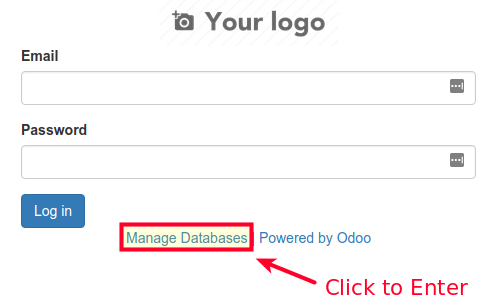
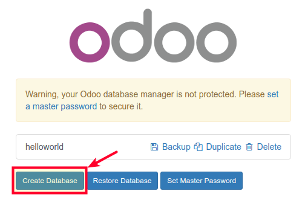
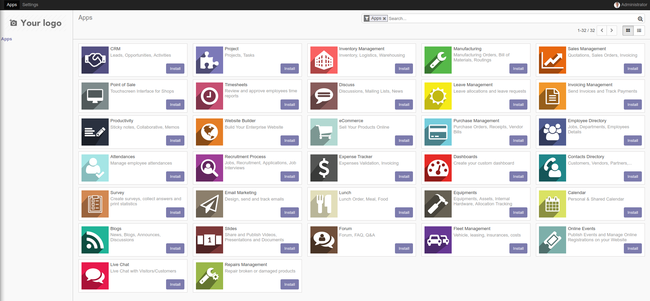

## What is Odoo?

[Odoo](https://www.odoo.com/) (formerly known as OpenERP) is a self-hosted suite of over 10,000 open source applications for a variety of business needs, including CRM, eCommerce, accounting, inventory, point of sale, and project management. These applications are all fully integrated and can be installed and accessed through a web interface, making it easy to automate and manage your company's processes.

For simple installations, Odoo and its dependencies can be installed on a single Linode (see our [Install Odoo 10 on Ubuntu](/docs/guides/install-odoo-10-on-ubuntu-16-04/) guide for details). However, this single-server setup is not suited for production deployments. This guide covers how to configure a production Odoo 11 cluster in which the Odoo server and PostgreSQL database are hosted on separate Linodes, with database replication for added performance and reliability.

## System Requirements

The setup in this guide requires the following *minimal* Linode specifications:

* PostgreSQL databases (primary and standby) - Linode **2GB**
* Odoo 11 web application - Linode **1GB**

Keep in mind that your implementation may need more nodes or higher-memory plans depending on the number of end-users you want to serve and the number of modules you plan to incorporate.

All examples in this guide are for Ubuntu 16.04. If you plan to use a different operating system, adapt the commands as necessary.

## Before You Begin

1.  Familiarize yourself with our [Getting Started](/docs/getting-started) guide and complete the steps for setting your Linode's hostname and timezone.

2.  This guide will use `sudo` wherever possible. Complete the sections of our [Securing Your Server](/docs/security/securing-your-server) to create a standard user account, harden SSH access and remove unnecessary network services.

3.  Update your system:

        sudo apt-get update && sudo apt-get upgrade

4.  Install `software-properties-common`:

        sudo apt install software-properties-common

## Configure Firewall Rules for Odoo

If you want to configure a firewall for your Linodes, open the following ports:

| Node | Open TCP Ports |
| ------------ |:--------:|
| Odoo 11 application | `22, 6010, 5432, 8070` |
| PostgreSQL database (Primary & Standby) | `22, 6010, 5432` |

Ports `22`, `80`, and `5432` are the defaults for SSH, HTTP and PostgreSQL communications respectively. Port `6010` is used for Odoo communications and port `8070` is used by Odoo's webserver. To open a particular port you can use:

    sudo ufw allow 22/tcp

For more detailed information about firewall setup please read our guide [How to Configure a Firewall with UFW](/docs/guides/configure-firewall-with-ufw/).

## Hostname Assignment

In order to simplify communication between Linodes, set hostnames for each server. You can use private IPs if the Linodes are all in the same data center, or Fully Qualified Domain Names (FQDNs) if available. This guide will use the following FQDN and hostname conventions:

| Node | Hostname | FQDN |
| ------------ |:--------:| :-----------:|
| Odoo 11  | odoo | odoo.yourdomain.com |
| PostgreSQL Primary | `primarydb` | `primarydb.yourdomain.com` |
| PostgreSQL Standby | `standbydb` | `standbydb.yourdomain.com` |

1. PostgreSQL Primary:

    
127.0.0.1       localhost
127.0.1.1       primarydb.yourdomain.com   primarydb

10.1.1.20       standbydb.yourdomain.com    standbydb
10.1.3.10       odoo.yourdomain.com       odoo



2. PostgreSQL Standby:

    
127.0.0.1       localhost
127.0.1.1       standbydb.yourdomain.com    standbydb

10.1.1.10       primarydb.yourdomain.com   primarydb
10.1.3.10       odoo.yourdomain.com       odoo


3. Odoo 11 server:

    
127.0.0.1       localhost
127.0.1.1       odoo.yourdomain.com       odoo

10.1.1.10       primarydb.yourdomain.com   primarydb
10.1.1.20       standbydb.yourdomain.com    standbydb


FQDNs will be used throughout this guide whenever possible to avoid confusion.

## Set up PostgreSQL

Configure the database backend. A **Primary** node will be in charge of all transactions and additionally will stream to a secondary server: the **Standby**.

### Install PostgreSQL

PostgreSQL version 9.6 offers significant improvements for database replication, but unfortunately, it is not included in the default Ubuntu 16.04 repositories. Install the newest version on all database nodes.

1.  Add the official PostgreSQL-Xenial repository to your system:

        sudo add-apt-repository "deb http://apt.postgresql.org/pub/repos/apt/ xenial-pgdg main"

2.  Import the repository key:

        wget --quiet -O - https://www.postgresql.org/media/keys/ACCC4CF8.asc | sudo apt-key add -

3.  Update `apt` cache:

        sudo apt update

4.  Install PostgreSQL 9.6 in the database nodes:

        sudo apt install postgresql-9.6 postgresql-server-dev-9.6

### Create PostgreSQL Users

Begin with the PostgreSQL user needed for Odoo communications. Create this user on both **Primary** and **Standby** nodes.

1.  Switch to the `postgres` user and create the database user `odoo` in charge of all operations. Use a strong password and save it in a secure location, you will need it later:

        sudo -u postgres createuser odoo -U postgres -dRSP

    Use the same password for the Odoo `postgres` user on all nodes. Odoo is not aware of database replication, so it will be easier to trigger an eventual failover procedure if both servers share the same information.

2.  Now you need to create the `replicauser` on the **Primary** node:

        sudo -u postgres createuser replicauser -U postgres -P --replication

    Set a strong password that you'll remember.

    The `replicauser` user has fewer privileges than the `odoo` user because the `replicauser`'s only purpose is to allow the **Standby** to read information from the **Primary** nodes. The `--replication` option grants the required privilege that `replicauser` need to perform its job.

### Configure Host Based Authentication

1.  Stop the PostgreSQL service on all nodes:

        sudo systemctl stop postgresql

2. Edit `pg_hba.conf` to allow PostgreSQL nodes to communicate with each other. Add the following lines to the **Primary** database server:

    
host    replication     replicauser      standbydb.yourdomain.com         md5
host    all             odoo             odoo.yourdomain.com            md5


    Each line provides the client authentication permissions to connect to a specific database. For example, the first line allows the **Standby** to connect to the **Primary** node using `replicauser`, and the second line grants the `odoo` user the rights connect to `all` databases within this server.

3. Add a similar configuration to the **Standby** node, this will make it easier to promote it to `primary` status if necessary:

    
host    all             odoo             odoo.yourdomain.com            md5


The settings in the `pg_hba.conf` file are:

* `host`: Enables connections using Unix-domain sockets.
* `replication`: Specifies a replication connection for the given user. No database name is required for this type of connection.
* `replicauser`: The user created in the previous section.
* `md5`: Make use of client-supplied MD5-encrypted password for authentication.
* `all`: Match all databases in the server. You could provide specific Odoo database names (separated by commas if more than one) if you know them beforehand.
* `odoo`: The Odoo user responsible for application/database communications.

### Configure Archiving and Replication

**On the Primary node**

1.  Create an `archive` directory for WAL files:

        sudo mkdir -p /var/lib/postgresql/9.6/main/archive/

2.  Change the `archive` directory permissions to allow the `postgres` user to read and write:

        sudo chown postgres: -R /var/lib/postgresql/9.6/main/archive/

3.  Edit `postgresql.conf`, and uncomment lines as necessary:

    
#From CONNECTIONS AND AUTHENTICATION Section
listen_addresses = '*'
#From WRITE AHEAD LOG Section
wal_level = replica
min_wal_size = 80MB
max_wal_size = 1GB
archive_mode = on
archive_command = 'cp %p /var/lib/postgresql/9.6/main/archive/%f'
archive_timeout = 1h
#From REPLICATION Section
max_wal_senders = 3
wal_keep_segments = 10


**On the Standby node**

Edit the **Standby's** `postgresql.conf`:


listen_addresses = '*'
#From WRITE AHEAD LOG Section
wal_level = replica
#From REPLICATION Section
max_wal_senders = 3
wal_keep_segments = 10
hot_standby = on


These settings are:

* `listen_addresses`: What IP addresses lo listen on. The `'*'` means that the server will listen to all IP addresses. You can limit this to only include the IP addresses that you consider safe.
* `wal_level`: Set to `replica` to perform the required operations.
* `min_wal_size`: Minimum size the transaction log will be.
* `max_wal_size`: Actual target size of WAL at which a new checkpoint is triggered.
* `archive_mode`: Set to `on` to activate the archive storage (see below).
* `archive_timeout`: Forces the server to send a WAL segment periodically (even if `min_wal_size` is not reached). This is useful if you expect little WAL traffic.
* `archive_command`: Local shell command to execute in order to archive a completed WAL file segment.
* `max_wal_senders`: Maximum number of concurrent connections from the **Standby** node.
* `wal_keep_segments`: Minimum number of past log file segments kept in the `pg_xlog` directory, in case a standby server (**Standby** node) needs to fetch them for streaming replication.
* `hot_standby = on`: Specifies that the **Standby** server can connect and run queries during recovery.

### Synchronize Primary and Standby Node Data

1.  Confirm that the **Standby** PostgreSQL service is not running:

        sudo systemctl status postgresql

2.  Start the **Primary** PostgreSQL service:

        sudo systemctl start postgresql

3.  Rename the **Standby's** data directory before continuing:

        sudo mv /var/lib/postgresql/9.6/main /var/lib/postgresql/9.6/main_old

4.  From the **Standby** node, enter the following to transfer all of the **Primary's** data over:

        sudo -u postgres pg_basebackup -h primarydb.yourdomain.com --xlog-method=stream \
         -D /var/lib/postgresql/9.6/main/ -U replicauser -v -P

    You will be prompted with the `replicauser` password. Once the transfer is complete your **Standby** will be synchronized with the **Primary** database. This puts an exact replica of the Primary database on the Standby.


Do not start the Standby's PostgreSQL service until Step 3 of the next section, when all configuration is complete.


### Create the Recovery File on the Standby Node

1.  Copy the sample recovery file as a template for your requirements:

        sudo cp -avr /usr/share/postgresql/9.6/recovery.conf.sample \
        /var/lib/postgresql/9.6/main/recovery.conf

2.  Edit the new copy of the recovery file:

    
standby_mode = 'on'
primary_conninfo = 'host=primarydb.yourdomain.com port=5432 user=replicauser password=REPLICAUSER_PWD'
restore_command = 'cp /var/lib/postgresql/9.6/main/archive/%f %p'
trigger_file = '/tmp/postgresql.trigger.5432'


3.  Start the PostgreSQL service on the **Standby** node:

        sudo systemctl start postgresql

These parameters configure your **Standby** to restore data. Failover and more options are described in the [PostgreSQL documentation for recovery](https://www.postgresql.org/docs/9.6/static/recovery-config.html).

### Test Replication

Test your setup to check that everything works as expected.

1.  In the **Primary** server change to the `postgres` user and verify the replication status:

        sudo -u postgres psql -x -c "select * from pg_stat_replication;"

    
-[ RECORD 1 ]----+------------------------------
pid              | 6005
usesysid         | 16385
usename          | replicauser
application_name | walreceiver
client_addr      | 66.228.54.56
client_hostname  |
client_port      | 36676
backend_start    | 2018-01-23 19:14:26.573184+00
backend_xmin     |
state            | streaming
sent_location    | 0/6000F60
write_location   | 0/6000F60
flush_location   | 0/6000F60
replay_location  | 0/6000F60
sync_priority    | 0
sync_state       | async


2.  To see the replication in action, create a test database on your **Primary** server with the `odoo` user:

        sudo createdb -h localhost -p 5432 -U odoo helloworld

3.  On the **Standby**, check the presence of the new database you just created using the `postgres` user and `psql`:

        sudo -u postgres psql

4.  List all databases:

        \l

5.  Exit `psql`:

        \q

This test not only confirms that replication is working, but also that the `odoo` user is ready to perform database operations.

### Enable PostgreSQL on Startup

Enable the `postgresql` service on both **primarydb** and **standbydb**:

    sudo systemctl enable postgresql

## Odoo 11 Setup

Configure your Odoo 11 web application to work with the PostgreSQL database backend.

### Create the Odoo User

In order to separate Odoo from other services, create a new Odoo system user to run its processes:

    sudo adduser --system --home=/opt/odoo --group odoo

### Configure Logs

The examples in this guide use a separate file for logging Odoo activity:

    sudo mkdir /var/log/odoo

### Install Odoo 11

1.  Install git:

        sudo apt install git

2.  Use Git to clone the Odoo files onto your server:

        sudo git clone https://www.github.com/odoo/odoo --depth 1 \
        --branch 11.0 --single-branch /opt/odoo

    
Odoo 11 application now uses Python 3.x instead of Python 2.7. If you are using Ubuntu 14.04 this may mean additional steps for your installation. Dependencies are now grouped to highlight the new changes.


3.  Enforce the use of POSIX locale this will prevent possible errors during installation (this has nothing to do with the Odoo language):

        export LC_ALL=C

4.  Install new Python3 dependencies:

        sudo apt-get install python3 python3-pip python3-suds python3-all-dev \
        python3-dev python3-setuptools python3-tk

5.  Install global dependencies (common to Odoo version 10):

        sudo apt install git libxml2-dev libxslt1-dev libevent-dev libsasl2-dev libldap2-dev \
        pkg-config libtiff5-dev libjpeg8-dev libjpeg-dev zlib1g-dev libfreetype6-dev \
        liblcms2-dev liblcms2-utils libwebp-dev tcl8.6-dev tk8.6-dev libyaml-dev fontconfig

6.  Install Odoo 11 specific Python dependencies:

        sudo -H pip3 install --upgrade pip
        sudo -H pip3 install -r /opt/odoo/doc/requirements.txt
        sudo -H pip3 install -r /opt/odoo/requirements.txt

7.  Install Less CSS via Node.js and npm:

        sudo curl -sL https://deb.nodesource.com/setup_6.x | sudo -E bash - \
        && sudo apt-get install -y nodejs \
        && sudo npm install -g less less-plugin-clean-css

8.  Download the `wkhtmltopdf` stable package. Replace the version number `0.12.4` in this command with the latest release on [Github](https://github.com/wkhtmltopdf/wkhtmltopdf/releases/):

        cd /tmp
        wget https://github.com/wkhtmltopdf/wkhtmltopdf/releases/download/0.12.4/wkhtmltox-0.12.4_linux-generic-amd64.tar.xz

9.  Extract the package:

        tar -xvf wkhtmltox-0.12.4_linux-generic-amd64.tar.xz

10.  To ensure that `wkhtmltopdf` functions properly, move the binaries to a location in your executable path and give them the necessary permission for execution:

        sudo mv wkhtmltox/bin/wk* /usr/bin/ \
        && sudo chmod a+x /usr/bin/wk*

### Configure the Odoo Server

1.  Copy the included configuration file to `/etc/` and change its name to `odoo-server.conf`

        sudo cp /opt/odoo/debian/odoo.conf /etc/odoo-server.conf

2.  Modify the configuration file. The complete file should look similar to the following, depending on your deployment needs:

    
[options]
admin_passwd = admin
db_host = primarydb.yourdomain.com
db_port = False
db_user = odoo
db_password = odoo_password
addons_path = /opt/odoo/addons
logfile = /var/log/odoo/odoo-server.log
xmlrpc_port = 8070


* `admin_passwd`: The password that allows administrative operations within Odoo GUI. Be sure to change `admin` to something more secure.
* `db_host`: The **primarydb** FQDN.
* `db_port`: Odoo uses PostgreSQL's default port `5432`, change this only if you're using custom PostgreSQL settings.
* `db_user`: Name of the PostgreSQL database user.
* `db_password`: Use the PostgreSQL `odoo` user password you created previously.
* `addons_path`: Default addons path, you can add custom paths separating them with commas: `</path/to/custom/modules>`
* `logfile`: Path to your Odoo logfiles.
* `xmlrpc_port`: Port that Odoo will listen on.

### Create an Odoo Service

Create a systemd unit called `odoo-server` to allow your application to behave as a service. Create a new file at `/lib/systemd/system/odoo-server.service` and add the following:


[Unit]
Description=Odoo Open Source ERP and CRM

[Service]
Type=simple
PermissionsStartOnly=true
SyslogIdentifier=odoo-server
User=odoo
Group=odoo
ExecStart=/opt/odoo/odoo-bin --config=/etc/odoo-server.conf --addons-path=/opt/odoo/addons/
WorkingDirectory=/opt/odoo/

[Install]
WantedBy=multi-user.target


### Change File Ownership and Permissions

1.  Change the `odoo-server` service permissions and ownership so only root can write to it, while the `odoo` user will only be able to read and execute it:

        sudo chmod 755 /lib/systemd/system/odoo-server.service \
        && sudo chown root: /lib/systemd/system/odoo-server.service

2.  Since the `odoo` user will run the application, change its ownership accordingly:

        sudo chown -R odoo: /opt/odoo/

3.  Set the `odoo` user as the owner of log directory as well:

        sudo chown odoo:root /var/log/odoo

4.  Protect the server configuration file. Change its ownership and permissions so no other non-root user can access it:

        sudo chown odoo: /etc/odoo-server.conf \
        && sudo chmod 640 /etc/odoo-server.conf

### Test your Odoo Stack

Confirm that everything is working as expected.

1.  Start the Odoo server:

        sudo systemctl start odoo-server

2.  Confirm that `odoo-server` is running:

        sudo systemctl status odoo-server

3.  In a browser, navigate to `odoo.yourdomain.com` or the IP address of the **odoo** Linode. If your proxy and your DNS configuration are working properly a login screen will appear.

4.  Click on the **Manage Databases** link:

    

    Now you can see the test database you created earlier.

5.  Click **Create Database** and fill out the form with a test database. Check the **Load demonstation data** box to populate your database with sample data.

    

6.  In the browser, you should see a list of available apps, indicating that database creation was successful:

    

    The first time you create a database, Odoo may take several minutes to load all of its add-ons. Do not reload the page during this process.

### Enable the Odoo Service

1.  Enable the `odoo-server` service to start automatically on reboot:

        sudo systemctl enable odoo-server

2.  Reboot your Linode from the Linode Manager.

3.  Check the Odoo logs to verify that the Odoo server is running:

        sudo cat /var/log/odoo/odoo-server.log

## Back Up Odoo Databases

If all components of the Odoo stack are running on a single server, it is simple to back up your databases using the Odoo web interface. However, this will not work with the configuration in this guide, since PostgreSQL was not installed on the **odoo** Linode.

You have two options to backup or transfer your production database:

1.  You can install PostgreSQL 9.6 on the **odoo** server using the procedure used for **primarydb** and **standbydb**. This will install `pg_dump` and other utilities, allowing you to use the Odoo GUI as before. Since Odoo configuration is explicit about database connection you will not have to worry about anything else. This method will restore the database to the **primarydb** server rather than **odoo**.

2.  You can also use a procedure similar to the one in [Synchronize Primary and Standby Node Data](#synchronize-primary-and-standby-node-data). Instead of synchronizing with a standby node, you can synchronize to a test or backup database server:

    1.  Edit `/etc/postgresql/9.6/main/pg_hba.conf` on **primarydb** to allow the test server to connect to it.
    2.  On the test server, stop the PostgreSQL service, move/rename/delete its current data, and run the `pg_basebackup` command as before:

            sudo systemctl stop postgresql

            sudo mv /var/lib/postgresql/9.6/main /var/lib/postgresql/9.6/main_old

            sudo -u postgres pg_basebackup -h <primarydb public ip> --xlog-method=stream -D /var/lib/postgresql/9.6/main/ -U replicauser -v -P

### Update Odoo Modules

Once you have restored, transferred, or synchronized your production database to the testing server you can update Odoo modules.

From your test server restart the Odoo service using the following flags to instruct the system to search for updates and apply any changes to modules:

    sudo service odoo-server restart -u all -d <production_database_name>

### Update your System

If all your tests pass, you can safely update your installation.

1.  From your Linode download the new code from source:

        cd /opt/odoo \
        && sudo git fetch origin 11.0

2.  Apply the changes to your repository:

        sudo git reset --hard origin/11.0


Do not confuse the Odoo system update with an Odoo **version** upgrade. With the method explained above, you are updating your Odoo application within the same version rather than **upgrading** to a newer Odoo version. Migrating from one version to another often requires several tests and manual modifications on the PostgreSQL database which are highly dependent on the version of Odoo you are upgrading from.

