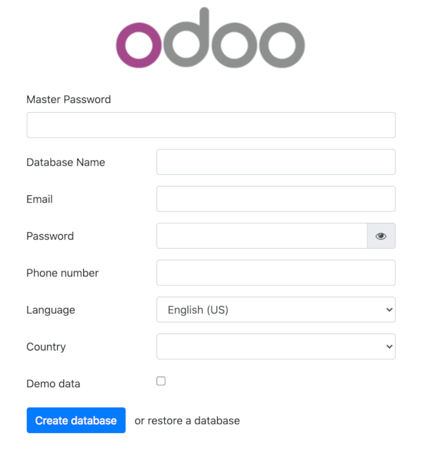
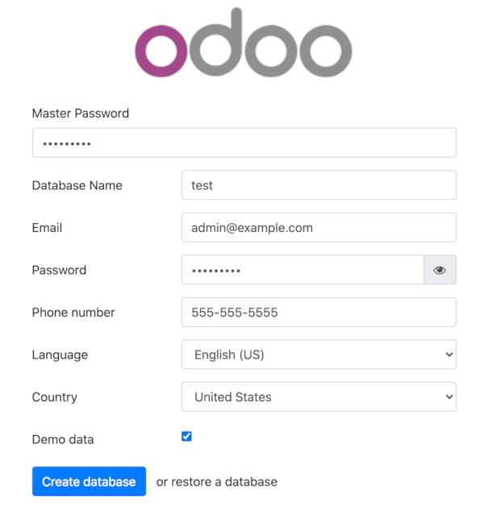
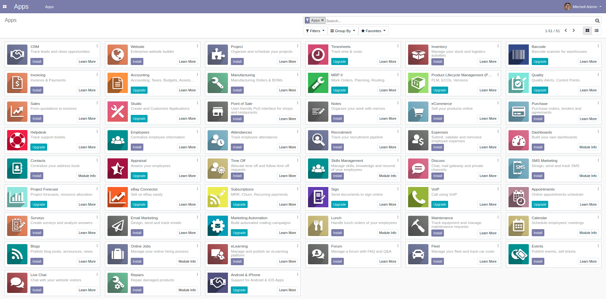

## What is Odoo?

[Odoo](https://www.odoo.com/) (formerly known as OpenERP) is a self-hosted suite of over 10,000 open source applications for a variety of business needs. A few popular applications for Odoo include CRMs, eCommerce, accounting, inventory, point of sale, and project management. These applications are all fully integrated and can be installed and accessed through a web interface. Using Odoo's web interface can make it easier to automate and manage your company's processes.

For simple installations, Odoo and its dependencies can be installed on a single Linode. Our [Install Odoo 10 on Ubuntu 16.04](/docs/guides/install-odoo-10-on-ubuntu-16-04/) guide has an example of this. However, this single-server setup is not suited for production deployments. This guide covers how to configure an Odoo 13 cluster where the Odoo server and PostgreSQL database are hosted on separate Linodes. This configuration gives you more flexibility and scalability while allowing you to use PostgreSQL database replication for added performance and reliability.

## System Requirements

The setup in this guide requires the following *minimal* Linode specifications:

* A Shared **2GB** Linode to install the PostgreSQL 11 database

* A Shared **1GB** Linode (Nanode) to install the Odoo 13 web application

Your implementation may need more nodes or higher-memory plans. Your required server resources depend on the number of end-users you want to serve and the number of modules you plan to incorporate. If you're not sure what size server you need, you can always start with a lower resource tier and then [resize your Linodes](/docs/guides/resizing-a-linode/) to a higher plan later on.


If you set up both servers inside the same data center, then you can configure the database server and the application server to talk to each other over that data center's private network. Communication over the data center's private network can be faster than communication between data centers. As well, the data transfer between your servers does not count against your account's [monthly network transfer usage](/docs/guides/network-transfer/).


All examples in this guide are for Debian 10. If you plan to use a different operating system, adapt the commands as necessary.

## Before You Begin

1.  Familiarize yourself with our [Getting Started](/docs/getting-started) guide. Create the Linodes described in the previous [System Requirements](#system-requirements) section of the current guide. Complete the steps for setting your Linodes' hostname and timezone.

1.  This guide uses `sudo` wherever possible. Complete the sections of our [Securing Your Server](/docs/security/securing-your-server) to create a standard user account, harden SSH access, and remove unnecessary network services.

    
Commands that require elevated privileges are prefixed with `sudo`. If you're not familiar with the `sudo` command, you can check our [Users and Groups](/docs/guides/linux-users-and-groups/) guide.


1.  Update your systems:

        sudo apt-get update && sudo apt-get upgrade

## Configure Firewall Rules for Odoo

If you want to configure a firewall for your Linodes, open the following ports:

| Node | Open TCP Ports |
| ------------ |:--------:|
| PostgreSQL database | `22, 6010, 5432` |
| Odoo 13 application | `22, 6010, 5432, 8069` |

- Port `22` is the default port for SSH.

- Port `5432` is the default port for PostgreSQL communications.

- Port `6010` is used for Odoo communications.

- Port `8069` is used by Odoo's webserver.

A convenient way to open these ports is by using the [UFW firewall utility](/docs/guides/configure-firewall-with-ufw/). However, this utility is not installed by default. Follow these instructions to install and configure UFW:


If you prefer to use a different firewall utility, like [iptables](/docs/guides/control-network-traffic-with-iptables/), be sure to use the same ports as described in the table above when configuring your software.


1. Install `ufw` with the following command:

        sudo apt-get install ufw

1. Allow traffic on the appropriate ports for each server. These lines allow traffic to those ports from all other hosts:

    - **PostgreSQL database server:**

            sudo ufw allow 22,6010,5432/tcp

    - **Odoo 13 application server:**

            sudo ufw allow 22,6010,5432,8069/tcp

    
You may want to only accept connections from certain hosts/IP addresses. The [Advanced Rules](/docs/guides/configure-firewall-with-ufw/#advanced-rules) section of our UFW guide shows how to specify hosts/IP addresses in your rules.


1. After configuring your ports, enable the firewall:

        sudo ufw enable

1. To check on the status of your firewall rules, run:

        sudo ufw status


For more detailed information about firewall setup please read our [How to Configure a Firewall with UFW](/docs/guides/configure-firewall-with-ufw/) guide.


## Hostname Assignment

In order to simplify communication between Linodes, set hostnames for each server. This guide uses the following FQDN and hostname conventions:

| Node | Hostname | FQDN |
| ------------ |:--------:| :-----------:|
| Odoo 13  | odoo | odoo.yourdomain.com |
| PostgreSQL | postgresql | postgresql.yourdomain.com |

On each server, append the following lines to the `/etc/hosts` file. For the second line in each of these snippets, substitute your Linodes' IP addresses. If both servers are in the same Linode data center, then you can use private IP addresses for each Linode. Otherwise, use the public IP addresses of each Linode. Follow our [Find your Linode's IP Address](/docs/guides/find-your-linodes-ip-address/) guide to locate your addresses.


A Linode does not come with a private IP address assigned to it by default. Private IPs are free to set up. If you would like to, follow our [Managing IP Addresses](/docs/guides/managing-ip-addresses/#adding-an-ip-address) guide to set up a private IP address on each Linode. Please note that you need to add the new private address inside your Linodes' networking configuration after it is assigned to your server.

Linode can configure your new private address for you through the [Network Helper](/docs/guides/network-helper/) utility, if it is enabled. After this tool is enabled in the Cloud Manager, reboot your Linode. You should be able to make connections on the private IP after reboot. Then, proceed with the rest of this guide.


- **PostgreSQL database server**:

    
127.0.1.1       postgresql.yourdomain.com   postgresql
192.0.2.2       odoo.yourdomain.com       odoo


    
Use the public or private IP address of your **Odoo application server** on the second line of the above file snippet.


- **Odoo 13 application server**:

    
127.0.1.1       odoo.yourdomain.com       odoo
192.0.2.3       postgresql.yourdomain.com   postgresql


    
Use the public or private IP address of your **PostgreSQL database server** on the second line of the above file snippet.


FQDNs are used throughout this guide whenever possible to avoid confusion.

## Set Up the PostgreSQL Database

Configure Odoo's `postgresql` database backend Linode. The Debian 10 official repository includes PostgreSQL version 11 which offers significant performance improvements as well as database replication compatibility.

Install the PostgreSQL database and developer libraries with the following command:

    sudo apt install postgresql-11 postgresql-server-dev-11 -y

### Create a PostgreSQL User

Odoo requires a separate PostgreSQL user for communications between the web application Linode and the database Linode. Create the database user `odoo`. This user is in charge of all operations. Use a strong password and save it in a secure location to use later:

    sudo -u postgres createuser odoo -U postgres -dP

The options used are described below:

* `-u`: Executes the command as the `postgres` user.
* `-U`: Indicates the user name to connect as.
* `-d`: Grants the user permission to create databases.
* `-P`: Prompts you for the new user's password.

### Configure Host Based Authentication

1. Stop the PostgreSQL service:

        sudo systemctl stop postgresql

1. Edit the `pg_hba.conf` file to allow PostgreSQL Linode to communicate with the Odoo Linode server. Add the following line to the file:

    
host    all             odoo             odoo.yourdomain.com            md5


This line grants the `odoo` user the rights connect to `all` databases within this server.

The settings in the `pg_hba.conf` file are:

* `host`: Enables connections using Unix-domain sockets.
* `all`: Match all databases on the server. You can provide a comma separated list of specific Odoo database names if you know them beforehand.
* `odoo`: The Odoo user responsible for application/database communications.
* `odoo.yourdomain.com`: The address of your Odoo server. You should replace this with your FQDN or IP address.
* `md5`: Make use of client-supplied MD5-encrypted passwords for authentication.

### Configure the PostgreSQL Listening Address

Edit `postgresql.conf` to allow the database server to listen to remote connections:


#From CONNECTIONS AND AUTHENTICATION Section
listen_addresses = '*'


The `listen_addresses` setting lists the IP addresses to listen on. The `'*'` wildcard means that the server listens to all IP addresses. You can limit this to only include the IP addresses that you consider safe.

### Enable PostgreSQL on Startup

Now that you finished PostgreSQL configuration you can start the `postgresql` service and enable it on startup:

    sudo systemctl start postgresql && sudo systemctl enable postgresql

## Odoo 13 Setup

This section shows how to configure your Odoo 13 web application to work with the PostgreSQL database backend. Run the commands in this section on the Linode that you created for your Odoo application server.


Odoo 13 uses Python 3.6+ instead of Python 3.5. [Debian 10 servers run Python 3.7.3 by default](/docs/guides/how-to-install-python-on-debian-10/), so you should not have compatibility problems.


### Prepare Linode for Odoo 13 Installation

1. In order to separate Odoo from other services, create a new Odoo system user to run its processes:

        sudo adduser --system --home=/opt/odoo --group odoo

1. Install system dependencies that are needed during Odoo 13 set up:

        sudo apt install python3 python3-pip python3-suds python3-all-dev python3-venv \
        python3-dev python3-setuptools python3-tk libncurses5-dev libgdbm-dev libnss3-dev \
        libssl-dev libreadline-dev libffi-dev git libxml2-dev libxslt1-dev libevent-dev \
        libsasl2-dev libldap2-dev pkg-config libtiff5-dev libjpeg62-turbo-dev libjpeg-dev \
        zlib1g-dev libfreetype6-dev liblcms2-dev liblcms2-utils libwebp-dev tcl8.6-dev \
        tk8.6-dev libyaml-dev fontconfig xfonts-75dpi xfonts-base xfonts-encodings xfonts-utils -y

1. Use Git to clone the Odoo files onto your server:

        sudo git clone https://www.github.com/odoo/odoo.git --depth 1 \
        --branch 13.0 --single-branch /opt/odoo

1. Enforce the use of POSIX locale to prevent possible errors during installation (this has nothing to do with the Odoo language):

        export LC_ALL=C

1. Install Less CSS via Node.js and npm:

        sudo curl -sL https://deb.nodesource.com/setup_12.x | sudo -E bash - \
        && sudo apt install -y nodejs \
        && sudo npm install -g less less-plugin-clean-css

1. Download `wkhtmltopdf` version `0.12.5` which is the recommended version for Odoo 13. For more information regarding `wkhtmltopdf` recommended versions, visit [Odoo wiki](https://github.com/odoo/odoo/wiki/Wkhtmltopdf)

        cd /tmp
        wget https://github.com/wkhtmltopdf/wkhtmltopdf/releases/download/0.12.5/wkhtmltox_0.12.5-1.buster_amd64.deb

1. Install the package:

        sudo dpkg -i wkhtmltox_0.12.5-1.buster_amd64.deb

1. To ensure that `wkhtmltopdf` functions properly, copy the binaries to a location in your executable path and give them the necessary permission for execution:

        sudo cp /usr/local/bin/wkhtmlto* /usr/bin/ \
        && sudo chmod a+x /usr/bin/wk*

### Set Up Virtualenv

It's considered a best practice to isolate Odoo's Python modules from the modules included as part of the operating system. This prevents unforeseen conflicts in the long run, especially after periodic OS updates. For that reason using `virtualenv` is highly recommended.

1. Create a new `virtualenv` environment for Odoo 13 application:

        python3 -m venv /home/<user>/odoo-env

1. Activate the `odoo-env` virtual environment you created in the previous step:

        source /home/<user>/odoo-env/bin/activate

1. Update `pip3` using the following command:

        pip3 install --upgrade pip

1. Install Python's wheel in the virtual environment:

        pip3 install wheel

Let's review the virtual environment creation:

* `python3 -m venv`: Runs `venv` module using Python 3, this module is in charge of creating the virtual environment.
* `/home/<user>/odoo-env`: Indicates the path used for the virtual Python environment. For the purpose of this guide, `home` directory of the current user was used but you can change it to any location that suits your needs as long as you remember to grant the `odoo` user with proper permissions afterward.

### Install Odoo's Python modules

1. Install the dependencies required by Odoo in the Python 3 environment:

        pip3 install -r /opt/odoo/doc/requirements.txt
        pip3 install -r /opt/odoo/requirements.txt

1. Check that all requirements are properly installed in your virtual environment:

        pip3 list

1. Exit from the Python virtual environment by issuing the command:

        deactivate

### Configure the Odoo Server

1. Copy the included configuration file to `/etc/` and change its name to `odoo-server.conf`

        sudo cp /opt/odoo/debian/odoo.conf /etc/odoo-server.conf

1. Modify the configuration file. The complete file should look similar to the following, depending on your deployment needs:

    
[options]
admin_passwd = admin
db_host = postgresql.yourdomain.com
db_port = False
db_user = odoo
db_password = odoo_password
addons_path = /opt/odoo/addons
xmlrpc_port = 8069


* `admin_passwd`: The password that allows administrative operations within Odoo GUI. Be sure to change `admin` to something more secure.
* `db_host`: The **postgresql** FQDN.
* `db_port`: Odoo uses PostgreSQL's default port `5432`, change this only if you're using custom PostgreSQL settings.
* `db_user`: Name of the PostgreSQL database user.
* `db_password`: Use the PostgreSQL `odoo` user password you created previously.
* `addons_path`: Default addons path. You can add custom paths separating them with commas: `</path/to/custom/modules>`
* `xmlrpc_port`: Port that Odoo listens on.

### Create an Odoo Service

Create a systemd unit called `odoo-server` to allow your application to behave as a service. Create a new file at `/lib/systemd/system/odoo-server.service` and add the following, replace `/home/<user>` with the directory where you setup your virtual Python environment:


[Unit]
Description=Odoo Open Source ERP and CRM

[Service]
Type=simple
PermissionsStartOnly=true
SyslogIdentifier=odoo-server
User=odoo
Group=odoo
ExecStart=/home/<user>/odoo-env/bin/python3 /opt/odoo/odoo-bin --config=/etc/odoo-server.conf --addons-path=/opt/odoo/addons/
WorkingDirectory=/opt/odoo/
StandardOutput=journal+console

[Install]
WantedBy=multi-user.target


### Change File Ownership and Permissions

1.  Change the `odoo-server` service permissions and ownership so only root can write to it, while the `odoo` user can only read and execute on it:

        sudo chmod 755 /lib/systemd/system/odoo-server.service \
        && sudo chown root: /lib/systemd/system/odoo-server.service

1.  Since the `odoo` user runs the application, change its ownership accordingly. Replace `/home/<user>` with the directory where you setup your virtual Python environment:

        sudo chown -R odoo: /opt/odoo/ && sudo chown -R odoo: /home/<user>/odoo-env

1.  Protect the server configuration file. Change its ownership and permissions so no other non-root user can access it:

        sudo chown odoo: /etc/odoo-server.conf \
        && sudo chmod 640 /etc/odoo-server.conf

### Test your Odoo Stack

Confirm that everything is working as expected:

1.  Start the Odoo server:

        sudo systemctl start odoo-server

1.  Confirm that `odoo-server` is running:

        sudo systemctl status odoo-server

1.  In a browser, navigate to `odoo.yourdomain.com:8069` or `http://<your_Linode_IP_address>:8069`. If your proxy and your DNS configuration are working properly you are presented with Odoo's database creation screen:

    

1.  Fill in all the fields, check the **Demo data** box to populate your database with sample data, and then click on **Create database** button.

    

1. In the browser, you should see a list of available apps, indicating that database creation was successful:

    

    The first time you create a database, Odoo may take several minutes to load all of its add-ons. Do not reload the page during this process.

### Enable the Odoo Service

1.  Enable the `odoo-server` service to start automatically on reboot:

        sudo systemctl enable odoo-server

1.  Reboot your Linode from the Linode Manager.

1.  Check the Odoo logs to verify that the Odoo server is running without errors:

        sudo journalctl -u odoo-server

## Back Up Odoo Databases

If all components of your Odoo stack were running on a single server, you could immediately back up your databases using the Odoo database backup web interface. This interface is located at `http://odoo.yourdomain.com:8069/web/database/manager`.

However, this interface does not work by default with the configuration in this guide. This is because the interface needs the PostgreSQL software to be installed on the server. In this guide's earlier instructions, PostgreSQL was not installed on the Linode running your Odoo application server.

You have two options to backup your production database:

1. Install PostgreSQL 11 on the Linode running your Odoo application server using the procedure described in this guide. This installs `pg_dump` and other utilities, allowing you to use the Odoo database backup web interface at `http://odoo.yourdomain.com:8069/web/database/manager`.

    You can later use this interface to restore your database from a specific database backup file. Odoo correctly restores to the database on the **PostgreSQL server**, and not to the database service that was installed on the Odoo application server. This happens because your Odoo configuration is explicit about the database connection.

1. You can use a procedure similar to the one described in our guide [How to Back Up Your PostgreSQL Database](/docs/guides/how-to-back-up-your-postgresql-database/) from the backend **PostgreSQL** Linode.

## Update Odoo Modules

These instructions show how to update your Odoo modules from the command line. However, from Odoo version 12 forward it is suggested that you update modules using Odoo's web interface whatever possible.


Be sure to create a backup of your production database before updating your modules.


From your **Odoo application server**, restart the Odoo service. Use the following flags to instruct the system to search for updates and apply any changes to modules:

    sudo service odoo-server restart -u all -d <production_database_name>

## Update the Odoo Application Server

These instructions show how to update your current version of Odoo. Specifically, they show how to update your Odoo application within the same version (e.g. Odoo 13), rather than **upgrading** to a newer Odoo version (e.g. from Odoo 12 to Odoo 13). Migrating from one version to another often requires several tests and manual modifications on the PostgreSQL database. These are dependent on the version of Odoo you are upgrading from.

1.  From your Linode, download the new code from source:

        cd /opt/odoo \
        && sudo git fetch origin 13.0

1.  Apply the changes to your repository:

        sudo git reset --hard origin/13.0

## Next Steps

You now have Odoo 13 and PostgreSQL installed and configured. There are several enhancements that could be made to your installation to increase its usability and security:

### Set Up a Web Server Reverse Proxy

You can install a web server as a reverse proxy in front of the Odoo application server. By doing so, your Odoo installation would be accessible on port 80 (HTTP) or port 443 (HTTPS), instead of port 8069.

Our [Use NGINX as a Reverse Proxy](/docs/guides/use-nginx-reverse-proxy/) guide lists further benefits of setting up a reverse proxy. It also shows how to use NGINX as a reverse proxy for an example Node.js application. The instructions in this guide could be adapted for your Odoo installation. In particular, you could alter the instructions in that guide's [Configure NGINX](/docs/guides/use-nginx-reverse-proxy/#configure-nginx) section to use port 8069, instead of port 3000.

If you proceed with setting up the reverse proxy, you should also add these lines to your `/etc/odoo-server.conf` Odoo server configuration file:


; Append directly below the other lines in the file:
proxy_mode = True
xmlrpc_interface = 127.0.0.1
netrpc_interface = 127.0.0.1


These lines ensure the Odoo server that's running on port 8069 only responds on localhost. As well, the `proxy_mode` directive makes the Odoo server compatible with your web server reverse proxy.

Then, restart the Odoo server:

    sudo systemctl restart odoo-server

Finally, allow port 80 in your firewall. If you're using UFW, these lines allow the port:

    sudo ufw allow 80/tcp
    sudo ufw reload

### Set Up SSL

If you have set up a reverse proxy, you can also choose to serve your Odoo site over HTTPS. To do so, configure the reverse proxy server with an SSL certificate. The directions in our [How to Install Certbot for TLS on Debian 10](/docs/guides/enabling-https-using-certbot-with-nginx-on-debian/) guide show how to do this with NGINX on Debian 10.

After setting up an SSL certificate, be sure to allow port 443 in your firewall. If you're using UFW, these lines allow the port:

    sudo ufw allow 443/tcp
    sudo ufw reload
