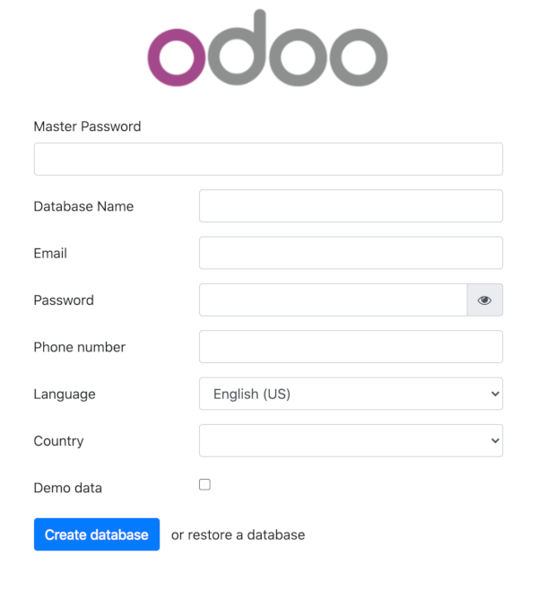
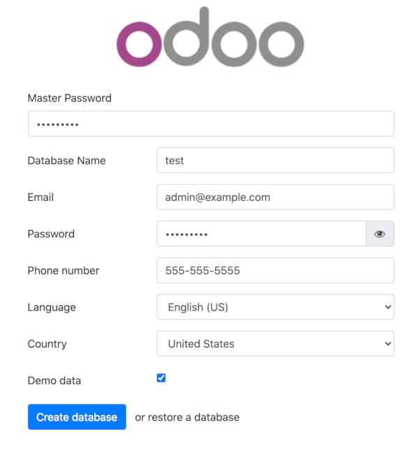
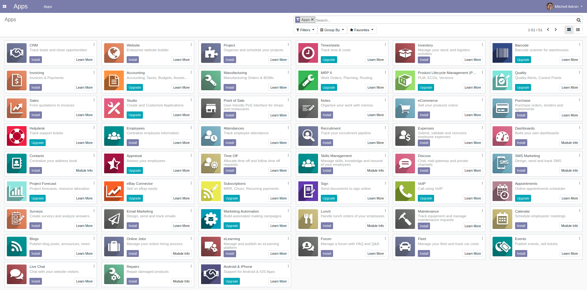

## What is Odoo?

[Odoo](https://www.odoo.com/) (formerly known as OpenERP) is a self-hosted suite of over 10,000 open source applications for a variety of business needs, including CRM, eCommerce, accounting, inventory, point of sale, and project management. These applications are all fully integrated and can be installed and accessed through a web interface, making it easy to automate and manage your company's processes.

For simple installations, Odoo and its dependencies can be installed on a single Linode (see our [Install Odoo 10 on Ubuntu 16.04](/docs/guides/install-odoo-10-on-ubuntu-16-04/) guide for an example of this). However, this single-server setup is not suited for production deployments. This guide covers how to configure a production Odoo 13 cluster where the Odoo server and PostgreSQL database are hosted on separate Linodes. This configuration gives you more flexibility and scalability while allowing you to use PostgreSQL database replication for added performance and reliability.

## System Requirements

The setup in this guide requires the following *minimal* Linode specifications:

* A Shared **2GB** Linode to install the PostgreSQL 10 database
* A Shared **1GB** Linode (Nanode) to install the Odoo 13 web application

Keep in mind that your implementation may need more nodes or higher-memory plans depending on the number of end-users you want to serve and the number of modules you plan to incorporate.

All examples in this guide are for Ubuntu 18.04. If you plan to use a different operating system, adapt the commands as necessary.

## Before You Begin

1.  Familiarize yourself with our [Getting Started](/docs/getting-started) guide and complete the steps for setting your Linode's hostname and timezone.

1.  This guide uses `sudo` wherever possible. Complete the sections of our [Securing Your Server](/docs/security/securing-your-server) to create a standard user account, harden SSH access, and remove unnecessary network services.

1.  Update your systems:

        sudo apt-get update && sudo apt-get upgrade

## Configure Firewall Rules for Odoo

If you want to configure a firewall for your Linodes, open the following ports:

| Node | Open TCP Ports |
| ------------ |:--------:|
| Odoo 13 application | `22, 6010, 5432, 8069` |
| PostgreSQL database | `22, 6010, 5432` |

Ports `22`, `80`, and `5432` are the defaults for SSH, HTTP, and PostgreSQL communications, respectively. Port `6010` is used for Odoo communications and port `8069` is used by Odoo's webserver. To open a particular port, use a command similar to the following:

    sudo ufw allow 22/tcp

For more detailed information about firewall setup please read our guide [How to Configure a Firewall with UFW](/docs/guides/configure-firewall-with-ufw/).

## Hostname Assignment

In order to simplify communication between Linodes, set hostnames for each server. You can use private IPs if the Linodes are all in the same data center, or Fully Qualified Domain Names (FQDNs) if available. This guide uses the following FQDN and hostname conventions:

| Node | Hostname | FQDN |
| ------------ |:--------:| :-----------:|
| Odoo 13  | odoo | odoo.yourdomain.com |
| PostgreSQL | postgresql | postgresql.yourdomain.com |

- PostgreSQL server:

    
127.0.0.1       localhost
127.0.1.1       postgresql.yourdomain.com   postgresql

10.1.3.10       odoo.yourdomain.com       odoo



- Odoo 13 server:

    
127.0.0.1       localhost
127.0.1.1       odoo.yourdomain.com       odoo

10.1.1.10       postgresql.yourdomain.com   postgresql


FQDNs are used throughout this guide whenever possible to avoid confusion.

## Set up PostgreSQL Database

Configure Odoo's `postgresql` database backend Linode. The Ubuntu 18.04 official repository includes PostgreSQL version 10 which offers significant performance improvements as well as database replication compatibility.

Install the PostgreSQL database and developer libraries with the following command:

    sudo apt install postgresql-10 postgresql-server-dev-10 -y

### Create PostgreSQL User

Odoo requires a separate PostgreSQL user for communications between the web application Linode and the database Linode. Create the database user `odoo`. This user is in charge of all operations. Use a strong password and save it in a secure location to use later:

    sudo -u postgres createuser odoo -U postgres -dP

The options used are described below:

* `-u`: Executes the command as the `postgres` user.
* `-U`: Indicates the user name to connect as.
* `-d`: Grants the user permission to create databases.
* `-P`: Prompts you for the new user's password.

### Configure Host Based Authentication

1. Stop the PostgreSQL service:

        sudo systemctl stop postgresql

1. Edit the `pg_hba.conf` file to allow PostgreSQL Linode to communicate with the Odoo Linode server. Add the following line to the file:

    
host    all             odoo             odoo.yourdomain.com            md5


This line grants the `odoo` user the rights connect to `all` databases within this server.

The settings in the `pg_hba.conf` file are:

* `host`: Enables connections using Unix-domain sockets.
* `all`: Match all databases on the server. You can provide a comma separated list of specific Odoo database names if you know them beforehand.
* `odoo`: The Odoo user responsible for application/database communications.
* `odoo.yourdomain.com`: The address of your Odoo server. You should replace this with your FQDN or Ip address.
* `md5`: Make use of client-supplied MD5-encrypted passwords for authentication.

### Configure PostgreSQL listening address

Edit `postgresql.conf` to allow the database server listening to remote connections:


#From CONNECTIONS AND AUTHENTICATION Section
listen_addresses = '*'


These settings are:

* `listen_addresses`: What IP addresses to listen on. The `'*'` means that the server listens to all IP addresses. You can limit this to only include the IP addresses that you consider safe.

### Enable PostgreSQL on Startup

Now that you finished PostgreSQL configuration you can start the `postgresql` service and enable it on startup:

    sudo systemctl start postgresql && sudo systemctl enable postgresql

## Odoo 13 Setup

Configure your Odoo 13 web application to work with the PostgreSQL database backend.


Odoo 13 uses Python 3.6+ instead of Python 3.5. If your server is running an older Ubuntu release, for instance 16.04, you will need to compile a newer Python version to meet this requirement.


### Prepare Linode for Odoo 13 Installation

1. In order to separate Odoo from other services, create a new Odoo system user to run its processes:

        sudo adduser --system --home=/opt/odoo --group odoo

1. Install system dependencies that are needed during Odoo 13 set up:

        sudo apt-get install python3 python3-pip python3-suds python3-all-dev python3-venv \
        python3-dev python3-setuptools python3-tk libxml2-dev libxslt1-dev libevent-dev \
        libsasl2-dev libldap2-dev pkg-config libtiff5-dev libjpeg8-dev libjpeg-dev \
        zlib1g-dev libfreetype6-dev liblcms2-dev liblcms2-utils libwebp-dev tcl8.6-dev \
        tk8.6-dev libyaml-dev fontconfig xfonts-75dpi xfonts-base xfonts-encodings xfonts-utils -y

1. Use Git to clone the Odoo files onto your server:

        sudo git clone https://www.github.com/odoo/odoo.git --depth 1 \
        --branch 13.0 --single-branch /opt/odoo

1. Enforce the use of POSIX locale to prevent possible errors during installation (this has nothing to do with the Odoo language):

        export LC_ALL=C

1. Install Less CSS via Node.js and npm:

        sudo curl -sL https://deb.nodesource.com/setup_12.x | sudo -E bash - \
        && sudo apt install -y nodejs \
        && sudo npm install -g less less-plugin-clean-css

1. Download `wkhtmltopdf` version `0.12.5` which is the recommended version for Odoo 13. For more information regarding `wkhtmltopdf` recommended versions, visit [Odoo wiki](https://github.com/odoo/odoo/wiki/Wkhtmltopdf)

        cd /tmp
        wget https://github.com/wkhtmltopdf/wkhtmltopdf/releases/download/0.12.5/wkhtmltox_0.12.5-1.bionic_amd64.deb

1. Install the package:

        sudo dpkg -i wkhtmltox_0.12.5-1.bionic_amd64.deb

1. To ensure that `wkhtmltopdf` functions properly, copy the binaries to a location in your executable path and give them the necessary permission for execution:

        sudo cp /usr/local/bin/wkhtmlto* /usr/bin/ \
        && sudo chmod a+x /usr/bin/wk*

### Set Up Virtualenv

It's considered a best practice to isolate Odoo's Python modules from the modules included as part of the operating system to prevent unforeseen conflicts in the long run, especially after periodic OS updates. For that reason using `virtualenv` is highly recommended.

1. Create a new `virtualenv` environment for Odoo 13 application:

        python3 -m venv /home/<user>/odoo-env

2. Activate the `odoo-env` virtual environment you created in the previous step:

        source /home/<user>/odoo-env/bin/activate

3. Update `pip3` using the following command:

        pip3 install --upgrade pip

4. Install Python's wheel in the virtual environment:

        pip3 install wheel

Let's review the virtual environment creation:

* `python3 -m venv`: Runs `venv` module using Python 3, this module is in charge of creating the virtual environment.
* `/home/<user>/odoo-env`: Indicates the path used for the virtual Python environment. For the purpose of this guide, `home` directory of the current user was used but you can change it to any location that suits your needs as long as you remember to grant the `odoo` user with proper permissions afterward.

### Install Odoo's Python modules

1. Install the dependencies required by Odoo in the Python 3 environment:

        pip3 install -r /opt/odoo/doc/requirements.txt
        pip3 install -r /opt/odoo/requirements.txt

1. Check that all requirements are properly installed in your virtual environment:

        pip3 list

1. Exit from the Python virtual environment by issuing the command:

        deactivate

### Configure the Odoo Server

1. Copy the included configuration file to `/etc/` and change its name to `odoo-server.conf`

        sudo cp /opt/odoo/debian/odoo.conf /etc/odoo-server.conf

2. Modify the configuration file. The complete file should look similar to the following, depending on your deployment needs:

    
[options]
admin_passwd = admin
db_host = postgresql.yourdomain.com
db_port = False
db_user = odoo
db_password = odoo_password
addons_path = /opt/odoo/addons
xmlrpc_port = 8069


* `admin_passwd`: The password that allows administrative operations within Odoo GUI. Be sure to change `admin` to something more secure.
* `db_host`: The **postgresql** FQDN.
* `db_port`: Odoo uses PostgreSQL's default port `5432`, change this only if you're using custom PostgreSQL settings.
* `db_user`: Name of the PostgreSQL database user.
* `db_password`: Use the PostgreSQL `odoo` user password you created previously.
* `addons_path`: Default addons path. You can add custom paths separating them with commas: `</path/to/custom/modules>`
* `xmlrpc_port`: Port that Odoo listens on.

### Create an Odoo Service

Create a systemd unit called `odoo-server` to allow your application to behave as a service. Create a new file at `/lib/systemd/system/odoo-server.service` and add the following, replace `/home/<user>` with the directory where you setup your virtual Python environment:


[Unit]
Description=Odoo Open Source ERP and CRM

[Service]
Type=simple
PermissionsStartOnly=true
SyslogIdentifier=odoo-server
User=odoo
Group=odoo
ExecStart=/home/<user>/odoo-env/bin/python3 /opt/odoo/odoo-bin --config=/etc/odoo-server.conf --addons-path=/opt/odoo/addons/
WorkingDirectory=/opt/odoo/
StandardOutput=journal+console

[Install]
WantedBy=multi-user.target


### Change File Ownership and Permissions

1.  Change the `odoo-server` service permissions and ownership so only root can write to it, while the `odoo` user can only read and execute on it:

        sudo chmod 755 /lib/systemd/system/odoo-server.service \
        && sudo chown root: /lib/systemd/system/odoo-server.service

2.  Since the `odoo` user runs the application, change its ownership accordingly. Replace `/home/<user>` with the directory where you setup your virtual Python environment:

        sudo chown -R odoo: /opt/odoo/ && sudo chown -R odoo: /home/<user>/odoo-env

3.  Protect the server configuration file. Change its ownership and permissions so no other non-root user can access it:

        sudo chown odoo: /etc/odoo-server.conf \
        && sudo chmod 640 /etc/odoo-server.conf

### Test your Odoo Stack

Confirm that everything is working as expected.

1.  Start the Odoo server:

        sudo systemctl start odoo-server

1.  Confirm that `odoo-server` is running:

        sudo systemctl status odoo-server

1.  In a browser, navigate to `odoo.yourdomain.com:8069` or `http://<your_Linode_IP_address>:8069`. If your proxy and your DNS configuration are working properly you are presented with Odoo's database creation screen:

    

1.  Fill in all the fields, check the **Demo data** box to populate your database with sample data, and then click on **Create database** button.

    

1. In the browser, you should see a list of available apps, indicating that database creation was successful:

    

    The first time you create a database, Odoo may take several minutes to load all of its add-ons. Do not reload the page during this process.

### Enable the Odoo Service

1.  Enable the `odoo-server` service to start automatically on reboot:

        sudo systemctl enable odoo-server

1.  Reboot your Linode from the Linode Manager.

1.  Check the Odoo logs to verify that the Odoo server is running without errors:

        sudo journalctl -u odoo-server

## Back Up Odoo Databases

If all components of the Odoo stack are running on a single server, it is simple to back up your databases using the Odoo web interface. However, this does not work with the configuration in this guide, since PostgreSQL was not installed on the **Odoo** Linode server.

You have two options to backup your production database:

1. You can install PostgreSQL 10 on the **Odoo** server using the procedure described on this guide. This installs `pg_dump` and other utilities, allowing you to use the Odoo GUI as before. Since Odoo configuration is explicit about database connection you do not have to worry about anything else. This method restores the database to the **PostgreSQL** server rather than **Odoo**.

2. You can also use a procedure similar to the one described in our guide [How to Back Up Your PostgreSQL Database](/docs/guides/how-to-back-up-your-postgresql-database/) from the backend **PostgreSQL** server.

### Update Odoo Modules

Once you have backed up your production database you can update Odoo modules.

From your **Odoo** server restart the Odoo service using the following flags to instruct the system to search for updates and apply any changes to modules:

    sudo service odoo-server restart -u all -d <production_database_name>


From Odoo version 12 forward it is suggested that you update modules using Odoo's web interface whatever possible.


### Update your System

If all your tests pass, you can safely update your installation.

1.  From your Linode, download the new code from source:

        cd /opt/odoo \
        && sudo git fetch origin 13.0

2.  Apply the changes to your repository:

        sudo git reset --hard origin/13.0


Do not confuse the Odoo system update with an Odoo **version** upgrade. With the method explained above, you are updating your Odoo application within the same version rather than **upgrading** to a newer Odoo version. Migrating from one version to another often requires several tests and manual modifications on the PostgreSQL database which are highly dependent on the version of Odoo you are upgrading from.

