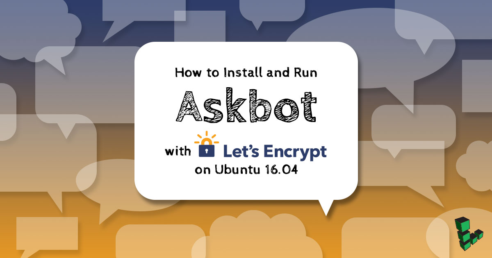
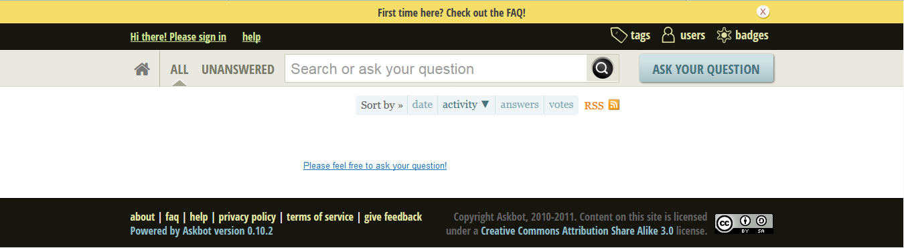
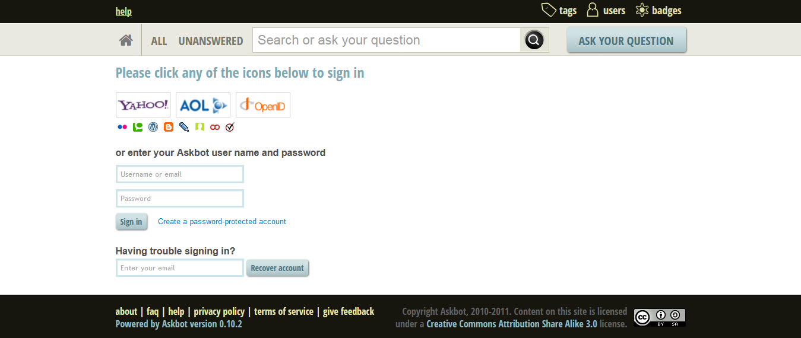
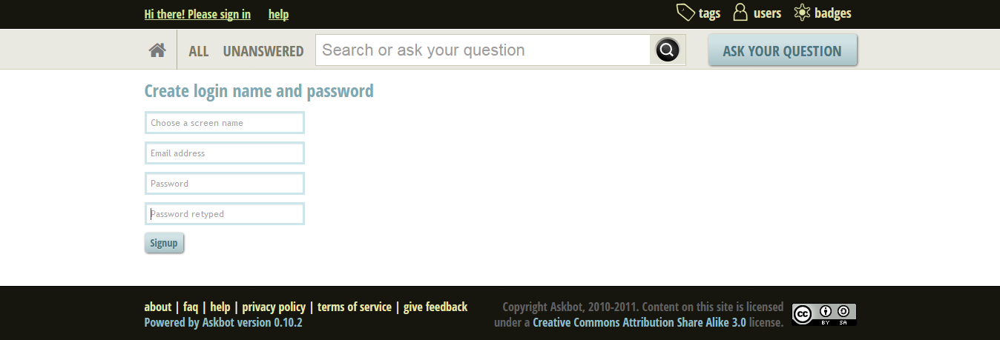
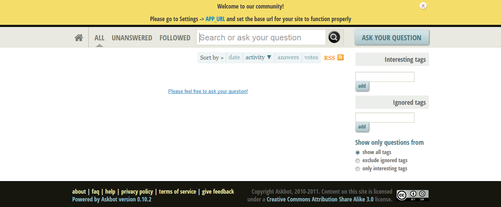
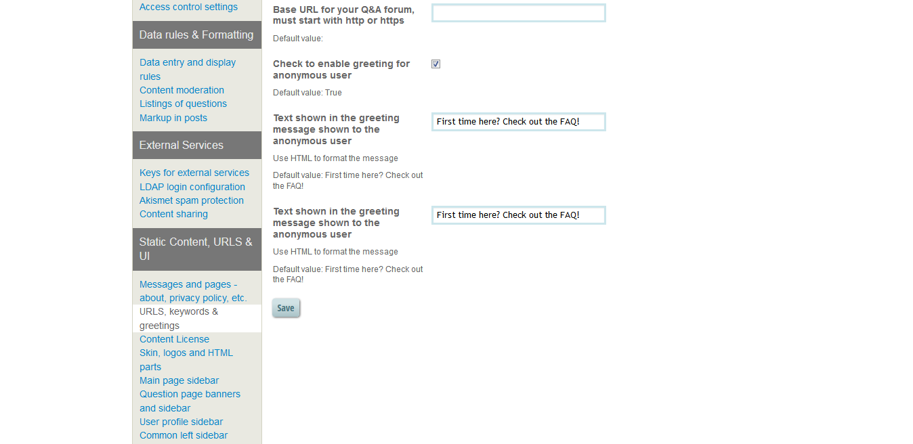
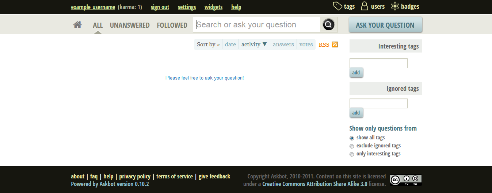

## What is AskBot?

[AskBot](https://askbot.com) is an open-source question-and-answer forum written in Django and Python. It provides features similar to StackOverflow, including a karma-based system, voting, and content moderation. It is used by many popular open source communities such as Ask-FedoraProject and Ask-OpenStack.

In this guide, you'll install AskBot and deploy with **NGINX** as a web server, **MySQL** as a database server, **Gunicorn** as a Python WSGI HTTP Server and **LetsEncrypt** as a free SSL certificates provider on your Ubuntu 16.04 Linode.

## Before You Begin

1.  If you have not already done so, create a Linode account and Compute Instance. See our [Getting Started with Linode](/docs/guides/getting-started/) and [Creating a Compute Instance](/docs/guides/creating-a-compute-instance/) guides.

1.  Follow our [Setting Up and Securing a Compute Instance](/docs/guides/set-up-and-secure/) guide to update your system. You may also wish to set the timezone, configure your hostname, create a limited user account, and harden SSH access.

4.  A Fully-Qualified Domain Name configured to point to your Linode. You can learn how to point domain names to Linode by following the [DNS Manager Overview](/docs/networking/dns/dns-manager-overview/#add-records) guide.


Throughout this guide, replace `example_user` with a non-root user with `sudo` access. If you’re not familiar with Linux user permissions and the `sudo` command, see the [Users and Groups](/docs/guides/linux-users-and-groups/) guide.


## Install Dependencies and Create a Database

1.  Install the required packages, including NGINX, MySQL, Python PIP, and LetsEncrypt:

        sudo apt-get install -y python-pip python-dev nginx mysql-server libmysqlclient-dev letsencrypt

2.  Log in to MySQL as the root user:

        sudo mysql -u root -p

3.  When prompted, enter the root password.

4.  Create a new MySQL user and database. In the example below, `askbotdb` is the database name, `dbuser` is the database user, and `dbpassword` is the database user’s password.

        CREATE DATABASE askbotdb CHARACTER SET UTF8;
        CREATE USER dbuser@localhost IDENTIFIED BY 'dbpassword';
        GRANT ALL PRIVILEGES ON askbotdb.* TO dbuser@localhost;
        FLUSH PRIVILEGES;

5.  Exit MySQL:

        exit

## Install AskBot

1.  Create a directory to install AskBot. Remember to replace `example_user` with the name of a non-root user on your Linode:

        mkdir -p /home/example_user/askbot

2.  Ensure that `pip` is the latest version:

        sudo pip install --upgrade pip

3.  Use `pip` to install `virtualenv`:

        sudo pip install virtualenv

4.  Create a Python virtual environment using `virtualenv`:

        virtualenv /home/example_user/askbot/askbotenv

5.  Activate the Python virtual environment:

        source /home/example_user/askbot/askbotenv/bin/activate

6.  Install AskBot and its dependencies:

        pip install askbot mysqlclient mysql-python gunicorn

## Configure AskBot

1.  Initialize the AskBot setup files. Use the database name, user, and password that you created earlier:

        askbot-setup -n /home/example_user/askbot/ -e 3 -d askbotdb -u dbuser -p dbpassword

    
For more detailed information about the arguments to `askbot-setup`, user the `-h` flag: `askbot-setup –h`.


2.  Use `collectstatic` to place all of the static files (css, javascript, and images) into the AskBot installation directory:

         python /home/example_user/askbot/manage.py collectstatic --noinput

3.  When you install or upgrade AskBot, you should run `makemigrations` and `migrate`:

        python /home/example_user/askbot/manage.py makemigrations
        python /home/example_user/askbot/manage.py migrate

4.  Turn off the Debug mode in `settings.py` to run AskBot in the production environment:

         sed -i "s|DEBUG = True|DEBUG = False|" /home/example_user/askbot/settings.py

5.  Change the URL of the static files from `/m/` to `/static/`:

         sed -i "s|STATIC_URL = '/m/'|STATIC_URL = '/static/'|" /home/example_user/askbot/settings.py

## Deploy AskBot with Let's Encrypt SSL


This section requires that you have a Fully Qualified Domain Name (FQDN) that is configured to point to your Linode. In the examples below, replace `example.com` with your FQDN.


1.  Edit `/home/example_user/askbot/wsgi.py`:

    
import os
os.environ.setdefault("DJANGO_SETTINGS_MODULE", "settings")
from django.core.wsgi import get_wsgi_application
application = get_wsgi_application()



2.  Create a `systemd` service for Gunicorn so that it can run as a service. Create the following `gunicorn.service` file:

    
[Unit]
Description=gunicorn daemon
After=network.target

[Service]
User=example_user
Group=www-data
WorkingDirectory=/home/example_user/askbot
Environment="PATH=/home/example_user/askbot/askbotenv/bin"
ExecStart=/home/example_user/askbot/askbotenv/bin/gunicorn --workers 3 --bind unix:askbot.sock wsgi:application

[Install]
WantedBy=multi-user.target



3.  Enable and start the Gunicorn service:

        sudo systemctl start gunicorn
        sudo systemctl enable gunicorn

4.  Restart NGINX and reload the daemon:

        sudo systemctl daemon-reload
        sudo systemctl restart nginx

5.  Use [Let's Encrypt](/docs/security/ssl/install-lets-encrypt-to-create-ssl-certificates) to obtain an SSL certificate for your domain:

        sudo letsencrypt certonly -a webroot --agree-tos --email admin@example.com --webroot-path=/var/www/html -d example.com -d www.example.com

6.  Remove the default NGINX Server Blocks (Virtual Host) and the default NGINX index file to add new AskBot server blocks:

        sudo rm -rf /etc/nginx/sites-available/default /etc/nginx/sites-enabled/default /var/www/html/index.nginx-debian.html

7.  Add new `askbot` NGINX Server Blocks (Virtual Host) to run AskBot in the production environment:

    
server {
        listen 80;
        server_name example.com www.example.com;
        return    301 https://$server_name$request_uri;
}

server {
        listen 443;
        server_name example.com www.example.com;

    ssl on;
        ssl_certificate /etc/letsencrypt/live/example.com/fullchain.pem;
        ssl_certificate_key /etc/letsencrypt/live/example.com/privkey.pem;
        ssl_protocols TLSv1 TLSv1.1 TLSv1.2;

    location ~ /.well-known {
        allow all;
        root /var/www/html;
        }

        location = /favicon.ico { access_log off; log_not_found off; }
        location /static/ {
        root /home/example_user/askbot;
        }

        location /upfiles/ {
        root /home/example_user/askbot/askbot;
        }

        location / {
        include proxy_params;
        proxy_pass http://unix:/home/example_user/askbot/askbot.sock;
        }
}



8.  Add a symbolic link between NGINX server blocks:

        sudo ln -s /etc/nginx/sites-available/askbot /etc/nginx/sites-enabled

9.  The **www-data** group must have access to AskBot installation directory so that NGINX can serve static files, media files, and access the socket files. Add the `example_user` to **www-data** group so that it has the necessary permissions:

        sudo usermod -aG www-data example_user

10.  Restart NGINX so that the changes take effect:

        sudo systemctl restart nginx

## Set Up an AskBot Admin Account

1.  Open a web browser and navigate to your Linode's domain name:

    

2.  Click on **create a password-protected account** to create an Admin Account:

    

    
The first account created using the above method will be treated as an admin account. Any subsequent accounts will be normal accounts.


3.  Choose an admin username and password:

    

4.  Set your domain name with AskBot using base url settings by clicking **APP_URL**:

    

5.  Add your domain name in the place of Base URL box and click **Save**:

    

6.  AskBot is now ready to run. Access the AskBot admin interface and customize it according to your needs:

    

## Next Steps

At this point you are ready to begin posting on your forum. For more information about AskBot's configuration options, check out the [AskBot Documentation](https://askbot.org/doc/index.html).
