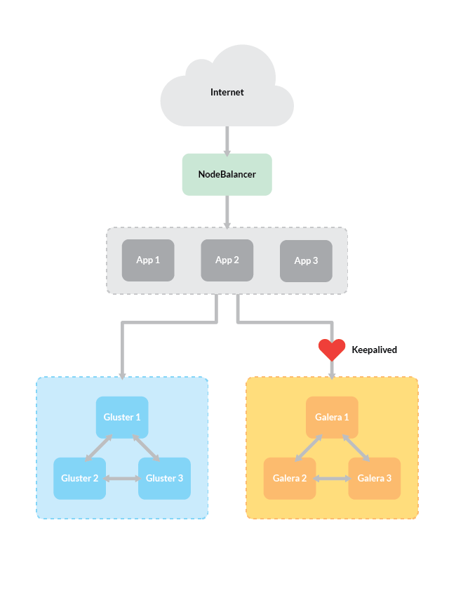
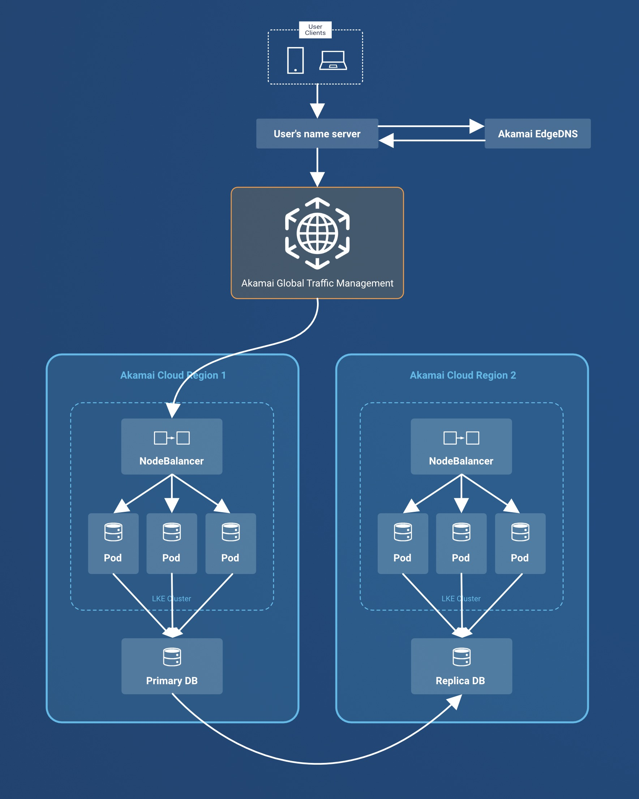

Designing applications with *high availability (HA)* and *disaster recovery* strategies in mind is essential for minimizing downtime and maintaining business continuity during infrastructure maintenance, upgrades, or temporary outages. This guide provides **Akamai Cloud Computing customers** with actionable strategies and architectural guidance to build resilient and highly available systems using Akamai.

## What is High Availability?

High availability (HA) is a term that describes a website or application with maximum potential uptime and accessibility for the content stored on it. While a more basic system will be adequate to serve content to a low or medium number of users, it may include a single point of failure. This means that if one server goes down (because of traffic overload, application failures, etc) the entire site or application could become unavailable. Systems with high availability avoid this problem by eliminating single points of failure, which prevents the site or application from going down when one component fails.

High availability does **not** mean your site or application will never experience downtime. The safeguards in a highly available system can offer protection in a number of scenarios, but no system is perfect. The uptime provided by an HA architecture is often measured in percentages, like 99.99%, 99.999%, and so on. These tiers of uptime depend on variables in your architecture, like the number of redundant components, their configuration settings, and the resources allocated to each component. Some of these variables, like the compute resources for a given server, can be [scaled](#scaling) to accomodate spikes in traffic.

Some scenarios, like natural disasters or cyber attacks, may disrupt a highly-available system entirely. In these situations, [disaster recovery](#disaster-recovery) strategies should be implemented.

### How High Availability Works

To create a highly available system, three characteristics should be present:

1.  [Redundancy](#redundancy)
1.  [Monitoring](#monitoring-and-failover)
1.  [Failover](#monitoring-and-failover)

In general, a high availability system works by having more components than it needs, performing regular checks to make sure each component is working properly, and if one fails, switching it out for one that is working.

## What is Disaster Recovery?

Disaster recovery is a process that is employed in the event of a wider-ranging outage of an organization's systems. These might occur because of cyber attacks, natural disasters, human error, and other reasons. An organization follows a disaster recovery plan to restore service and data for the systems that have experienced downtime and/or data loss.

A disaster recovery plan documents key information and procedures that should be adhered to in these scenarios. This can include lists of staff that are responsible for the plan, inventories of systems and software, activation of backup sites and systems, criteria that should be met during the recovery operation (including [RTO and RPO](#rtorpo)), and other considerations.

Our [Creating a Disaster Recovery Plan: A Definitive Guide](/docs/guides/disaster-recovery/) contains further guidance for creating a disaster recovery plan.

## High Availability Architecture

This section describes an example of a high availability architecture that features a WordPress website running in a single data center. There are redundant copies of each component in the architecture, and the health of each set of components is continually monitored. If any component fails, automatic failover is triggered and other healthy components are promoted.


This specific architecture is implemented in the [host a website with high availability](/docs/guides/host-a-website-with-high-availability/) guide. While some of the technologies used are specific to this example, the concepts can be more broadly applied to other HA systems.


1. A user requests a page from the WordPress website. The user's DNS servers return the address of a NodeBalancer in an Akamai Cloud compute region.

1. The NodeBalancer routes traffic to a cluster of application servers running the Apache web server and WordPress.

1. Apache serves a file from the document root (e.g. `/srv/www/`). These files are not stored on the application server, but are instead retrieved from the networked GlusterFS filesystem cluster.

1. When a WordPress plugin is installed, or when an image or other asset is uploaded to WordPress, it is added to the document root. When this happens in this architecture, the application server actually adds these files to one (and only one) of the servers in the GlusterFS cluster. GlusterFS then replicates these changes across the GlusterFS cluster.

1. WordPress PHP files from the document root are executed by the application server. These PHP files make requests on a database to retrieve website data. These database requests are fulfilled by a cluster of database servers running Percona XtraDB. One database server within the cluster is the primary, and requests are routed to this server.

1. The database servers use the Galera software to replicate data across the database cluster.

1. The Keepalived service runs on each database server and monitors for database failures. If the primary database server fails, the Keepalived service reassigns its private IP address to one of the other databases in the cluster, and that database starts responding to requests from WordPress.

### Systems and Components

- **NodeBalancer**: An [Akamai load balancer service](https://techdocs.akamai.com/cloud-computing/docs/nodebalancer). NodeBalancers can evenly distribute incoming traffic to a set of backend application servers.

    The NodeBalancer in this architecture continually monitors the health of the application servers. If one of the application servers experiences downtime, the NodeBalancer stops sending traffic to it. The NodeBalancer service has an internal high-availability mechanism that reduces downtime for the service itself.

- **Application server cluster**: A set of three servers running Apache and WordPress. WordPress relies on a database to dynamically render posts and pages.

    Apache's `/srv/www/` document root folder on each application server is *mounted* to a *volume* from the GlusterFS cluster. This means that the files in the document root folder are not stored on the application server itself, but are instead stored on a separate cluster of servers running a networked filesystem called GlusterFS. When such a file is requested, it is retrieved from the GlusterFS cluster.

- **GlusterFS cluster**: A set of three servers running GlusterFS, a networked filesystem. The servers store a GlusterFS *volume*, the contents of which are replicated across the cluster. GlusterFS handles monitoring and failover by default.

    GlusterFS continually monitors the contents of the volume across the GlusterFS cluster. If any files are added/removed/modified files to the volume on one of the servers, those changes are automatically replicated to the other GlusterFS servers.

- **Database cluster**: A set of servers running the Percona XtraDB database cluster software, Galera, Xtrabackup, and Keepalived.

    Galera is used for replication, and it offers *synchronous replication*, meaning data is written to secondary database nodes at the same time as it's being written to the primary. This method of replication provides excellent redundancy to the database cluster because it avoids periods of time where the database nodes are not in matching states. Galera also provides *multi-master replication*, meaning any one of the database nodes can respond to client queries.

    [XtraBackup](https://www.percona.com/software/mysql-database/percona-xtrabackup) is used for *state snapshot transfer*. This means that when a new node joins the cluster, the node from which it's syncing data (the donor) is still available to handle queries. This not only helps with efficiency in the initial setup, it also allows nearly seamless horizontal scaling as your needs grow.

    Keepalived uses *virtual router redundancy protocol*, or VRRP, to automatically assign the failover IP address to any of the database nodes. The keepalived service uses user-defined rules to monitor for a certain number of failures by a database node. When that failure threshold is met, keepalived assigns the failover IP address to a different node so that there is no interruption to the fulfillment of requests while the first node waits to be fixed.

## Disaster Recovery Architecture

1. EdgeDNS resolves client request's domain to CNAME in Akamai GTM
1. Client DNS requests route/addresses from Akamai GTM
1. Traffic to Kubernetes cluster in one of two regions
1. NodeBalancer acts as Kubernetes ingest
1. Directs traffic to a pod within the cluster
1. Pod makes DB requests on DB
1. DB contents are replicated to DB in second region

### Systems and Components

## High Availability and Disaster Recovery Concepts

### Redundancy

In computing, *redundancy* means that there are multiple components that can perform the same task. This eliminates the single point of failure problem by allowing a second server to take over a task if the first one goes down or becomes disabled. Some redundant components, like databases, need to also maintain equivalent sets of data in order to fulfill requests. To maintain equivalent data, [*replication*](#replication) is continually performed between those components.

Redundant components can work together through mechanisms like [load balancing](#load-balancing) and [monitoring and failover](#monitoring-and-failover).

Different kinds of redundancy can be considered:

- **Application redundancy**:

    Multiple instances of application servers that fulfill the same function can be run in parallel. These servers can collectively share the traffic service receives, which reduces the probability that a given server fails from being overburdened. If a server fails, the other servers can continue operating and maintain operation of the service.

    Multiple application server clusters can exist in a single HA system, including web server clusters, database clusters, and networked filesystems.

    **Kubernetes** offers a number of tools that make it simpler to maintain redundant components:

    - **Containerized applications**: Applications are packaged as *containers* that run in *pods*, and Kubernetes can quickly scale up and down the number of running pods.

    - **StatefulSets** maintain state consistency during restarts. [More on StatefulSets](https://kubernetes.io/docs/concepts/workloads/controllers/statefulset/).

    - **Deployments** provide a way to configure stateless applications. [More on Deployments](https://kubernetes.io/docs/concepts/workloads/controllers/deployment/).

- **Data center infrastructure redundancy**:

    Each Akamai Cloud region corresponds to a single physical data center and does not provide built-in multi-site high availability. This means that in the rare event of a full data center outage, such as a total network failure, Linodes within that Cloud region may become temporarily inaccessible.

    Having said that, Akamai Cloud data centers are built with internal redundancy for critical infrastructure. For example:

    - **Power**: Facilities are equipped with backup generators and UPS systems to ensure power continuity during outages.

    - **Networking**: Core network components such as routers, switches, and BOLTs are designed with redundancy, allowing traffic to reroute automatically if a component fails.

- **Geography/region redundancy**:

    Highly available applications can be architected with redundancy *across multiple regions/data centers*. This can be useful for a number of reasons:

    - Running your application in multiple regions can distribute the load for your service across those regions.

    - If your system's user base is located across different regions, you can run your application in data centers closer to your users, reducing latency.

    - Maintaining backups in multiple regions protects against localized outages, data loss, and corruption.

### Monitoring and Failover

In a highly available architecture, the system needs to be able to *monitor* itself for failure. This means that there are regular *health checks* to ensure that all components are working properly. *Failover* is the process by which a secondary component becomes primary when monitoring reveals that a primary component has failed.

There are different kinds of health checks that can be performed, including:

- **ICMP (Ping) checks**: Monitors basic network connectivity.
- **TCP checks**: Ensures responsiveness for most application-layer protocols.
- **HTTP(S) checks**: Used for web applications, and can verify that specific strings are present in the response body from a web server.

Akamai offers multiple tools to assist with monitoring and failover, including:

- **[NodeBalancers](https://techdocs.akamai.com/cloud-computing/docs/nodebalancer)** perform health checks on a set of backend application servers within a data center, and can route traffic around backend servers that experience downtime.

- **[Global Traffic Management (GTM)](https://techdocs.akamai.com/gtm/docs/welcome-to-global-traffic-management)** continuously monitors the health of application clusters running in multiple regions. If a cluster fails health checks, GTM updates DNS routes for users in real-time and redirects traffic to healthy clusters.

- **[Linode Kubernetes Engine (LKE)](https://techdocs.akamai.com/cloud-computing/docs/linode-kubernetes-engine)**, Akamai's managed Kubernetes service: the Kubernetes control plane natively performs monitoring of Pods and other resources in your cluster. For [LKE Enterprise](https://techdocs.akamai.com/cloud-computing/docs/linode-kubernetes-engine#lke-enterprise), the control plane itself has built-in monitoring and failover that is managed by Akamai.

- **[IP Sharing and BGP-based failover](https://techdocs.akamai.com/cloud-computing/docs/configure-failover-on-a-compute-instance)**: features that support failover of a service between Linodes.

Open source software and tools can support monitoring and failover, including:

- [Keepalived](https://www.keepalived.org/): a software package that can run periodic health checks and run notification scripts that are triggered by different health check changes over time. These notification scripts can then interact with features of your cloud platform (like [IP Sharing and BGP-based failover](https://techdocs.akamai.com/cloud-computing/docs/use-keepalived-health-checks-with-bgp-based-failover) on Akamai Cloud) to support failover of infrastructure. In the [high availability architecture](#high-availability-architecture) example in this guide, the database cluster runs keepalived to monitor failures of the primary database server and then promote a backup DB to be the new primary.

- [HAProxy](/docs/guides/how-to-configure-haproxy-http-load-balancing-and-health-checks/): a dedicated reverse proxy software solution. HAProxy can perform health checks of backend servers and stop routing traffic to backends that experience failures.

### Load Balancing

Load balancing distributes traffic among multiple backend servers or compute regions, which reduces the chance that any given server fails from being overburdened. Different algorithms can be used by different kinds of load balancers to route traffic, including:

- **Round-Robin**: Traffic is routed evenly between clusters or servers.

- **Weighted Traffic**: Traffic is routed to preferred clusters or servers.

- **Geo-Location Routing**: With DNS load balancing tools like Akamai GTM, traffic can be routed to the nearest cluster for reduced latency.

Akamai offers multiple tools to assist with load balancing, including:

- **[NodeBalancers](https://techdocs.akamai.com/cloud-computing/docs/nodebalancer)**: A cloud load balancer service that distributes traffic between servers within a data center.

- **[Global Traffic Management (GTM)](https://techdocs.akamai.com/gtm/docs/welcome-to-global-traffic-management)**: GTM provides DNS load balancing, which allows traffic to be dynamically routed across multiple regions, including Akamai Cloud regions.

- **[Linode Kubernetes Engine (LKE)](https://techdocs.akamai.com/cloud-computing/docs/linode-kubernetes-engine)**, Akamai's managed Kubernetes service: Kubernetes clusters created with LKE have the [Linode Cloud Controller Manager (CCM)](https://github.com/linode/linode-cloud-controller-manager/) preinstalled, which provides an interface for your cluster to interact with Linode resources. In particular, any Kubernetes [LoadBalancer service](https://kubernetes.io/docs/concepts/services-networking/service/#loadbalancer) that you declare is created as a NodeBalancer.

Open source software and tools can support load balancing, including:

- Web servers, like NGINX and Apache: these can be configured as [reverse proxies](/docs/guides/use-nginx-reverse-proxy/#what-is-a-reverse-proxy) for backend servers.

- [HAProxy](/docs/guides/how-to-configure-haproxy-http-load-balancing-and-health-checks/): a dedicated reverse proxy software solution.

- [Kubernetes](/docs/guides/beginners-guide-to-kubernetes-part-1-introduction/): [a range of load balancing functionality](https://kubernetes.io/docs/concepts/services-networking/) is offered by Kubernetes. [Services](https://kubernetes.io/docs/concepts/services-networking/service/) are an abstraction layer for a set of Pods that run your application code, and traffic is collectively routed across them. [LoadBalancer-type Services](https://kubernetes.io/docs/concepts/services-networking/service/#loadbalancer) are available

### Replication

*Replication* is the process of copying data between redundant servers and systems. Data replication can be synchronous or asynchronous:

- Synchronous replication prioritizes immediate data consistency across components.
- Asynchronous replication prioritizes performance of a primary component, and data is eventually copied to a secondary component.

Replication supports high availability strategies and disaster recovery strategies:

- In a high availability architecture, synchronous data replication across redundant components allows each component to serve user requests. These components can be load balanced and run in parallel, or they can be run in a primary-backup configuration with immediate failover to the backup component.

- For disaster recovery scenarios, data should be replicated to regions and systems that are separated (by geography and/or by system architecture) from primary systems. This copied data can be used in the recovery process.

Multiple Akamai services provide data replication, or can be used to support data replication workflows:

- [Object Storage](https://techdocs.akamai.com/cloud-computing/docs/object-storage): Akamai's object storage has [an internal replication system](https://www.linode.com/products/object-storage/#accordion-7252094bf6-item-97b2f59293) to ensure that data is highly-available.

    Users can enhance redundancy of their object storage data by [synchronizing bucket data across regions using rclone](/docs/guides/replicate-bucket-contents-with-rclone/), which can support high availability, disaster recovery, and load balancing strategies.

    Users can also [backup files from a Linode to Object Storage](/docs/guides/rclone-object-storage-file-sync/), which can play a role in backup and recovery.

- [Managed Databases](https://techdocs.akamai.com/cloud-computing/docs/aiven-database-clusters): All database clusters created with Akamai's Managed Databases receive daily backups. For 3-node clusters, built-in data replication, redundancy, and automatic failover are provided.

- [Block Storage](https://techdocs.akamai.com/cloud-computing/docs/block-storage): Users can choose to attach multiple Block Storage volumes to a Linode instance, and they can replicate data from one volume to another. If a Linode that a volume is destroyed, the volume persists, so it can be attached and used with another Linode.

- [Net Storage](https://techdocs.akamai.com/netstorage/docs/welcome-to-netstorage): Net Storage provides [controls for replication across geographic zones](https://techdocs.akamai.com/netstorage/docs/create-a-storage-group#geo-replication-settings).

Open source software that supports replication includes:

- Database replication tools: Some tools are built into the database system, like MySQL's [source-replica replication mechanism](/docs/guides/configure-source-replica-replication-in-mysql/). Other tools, like [Galera](https://galeracluster.com/), can be additionally installed to support replication.

- Networked filesystems, like [GlusterFS](https://www.gluster.org/): these are used to create distributed storage systems across multiple block storage devices, like a Linode's built-in storage disk, or a Block Storage volume.

- [Command-line data transfer utilities](/docs/guides/comparing-data-transfer-utilities/) like [rsync](/docs/guides/introduction-to-rsync/) and [rclone](https://www.linode.com/docs/guides/rclone-object-storage-file-sync/).

### RTO/RPO

**Recovery Time Objective** (RTO) and **Recovery Point Objective** (RPO) are requirements that should be met in disaster recovery scenarios. RTO refers to the maximum time it should take for your organization to recover from an outage, and RPO refers to the maximum amount of data that may be lost when recovering from an outage. RTO and RPO are influenced by your architecture and by your disaster recovery plan. General categories for your RTO and RPO approach could include:

- **Backup and restore**: placeholder, will add detail

- **Light/warm standby**: placeholder, will add detail

- **Multi-site Active-Active**: placeholder, will add detail

|  | Backup & Restore | Light | Warm Standby | Multi-Site |
| ----- | :---: | :---: | :---: | :---: |
| **RTO** | Minutes to Hours | Tens of minutes | Minutes | **Zero downtime** |
| **RPO** | Minutes to Hours | Seconds to Tens of minute | Seconds to Tens of Minute(s) | Near zero loss |
| **Cost** | **$** | **$$** | **$$$** | **$$$$** |
| **Architecture Complexity** | \* | \*\* | \*\*\* | \*\*\*\* |
| **Use Case** | Non-critical apps with tolerable downtime and data loss | Apps require faster recovery with minimal data loss | Critical apps require quick recovery with minimal data loss | Mission-critical apps requiring continuous availability and real-time data sync |
| **Auto-scaling** | None, manual provision | None, manual resizing | Yes, post-disaster | Yes |
| **Failover** | Manual restoration | Automated failover | Automated failover | Active-active  |
| **Data Replication** | Periodic backups | Log shipping or block-level replication | Async replication or block-level replication | Real-time multi-master replication |
| **Linodes Solutions** | Linode Backup Service (VM), Linode Object Storage for data backups | Linode Backup Service (VM) with scheduled automated backup, data replication at DB level | Warm standby VMs or standby LKE clusters. VM with cross-region data replication | Multi-region LKE clusters, Akamai GTM for traffic management |

### Placement Groups

[*Placement groups*](https://techdocs.akamai.com/cloud-computing/docs/work-with-placement-groups) specify where your compute instances should be created within a data center. An *anti-affinity rule* is used to spread workloads across multiple devices within the same data center, reducing the risk of correlated failures. Akamai Cloud [supports placement groups](https://techdocs.akamai.com/cloud-computing/docs/work-with-placement-groups#create-a-placement-group).

### Distributed Application Design

* Use microservices and distributed architectures to minimize the impact of individual component failures.
* Design for **graceful degradation** so unaffected services remain available even if one component fails.

### Live Migrations

Akamai Cloud supports [**Linode live migrations**](https://techdocs.akamai.com/cloud-computing/docs/compute-migrations) to minimize downtime during maintenance.

### Scaling

Scaling ensures performance and availability during increased demand:

* **Horizontal Scaling**: Add more instances of an application to handle load.
* **Vertical Scaling**: Increase resource limits per instance.
* **Auto-Scaling**: Configure LKE/Kubernetes to adjust resources based on load.

## Best Practices for Linode Maintenance

* Configure Akamai GTM for automated failover and geo-routing.
* Use Kubernetes StatefulSets and Deployments for resilience.
* Set up health checks and real-time monitoring.
* Implement multi-region storage- and database replication.
* Regularly test failover and disaster recovery plans

**References & further reading:**

* [https://www.linode.com/docs/guides/introduction-to-high-availability/](https://www.linode.com/docs/guides/introduction-to-high-availability/)
* [https://www.linode.com/docs/guides/host-a-website-with-high-availability/](https://www.linode.com/docs/guides/host-a-website-with-high-availability/)
* [https://www.linode.com/docs/guides/high-availability-wordpress/](https://www.linode.com/docs/guides/high-availability-wordpress/)
* [https://techdocs.akamai.com/cloud-computing/docs/configure-failover-on-a-compute-instance](https://techdocs.akamai.com/cloud-computing/docs/configure-failover-on-a-compute-instance)
* https://techdocs.akamai.com/cloud-computing/docs/high-availability-ha-control-plane-on-lke
* [https://techdocs.akamai.com/cloud-computing/docs/monitor-and-maintain-a-compute-instance](https://techdocs.akamai.com/cloud-computing/docs/monitor-and-maintain-a-compute-instance)