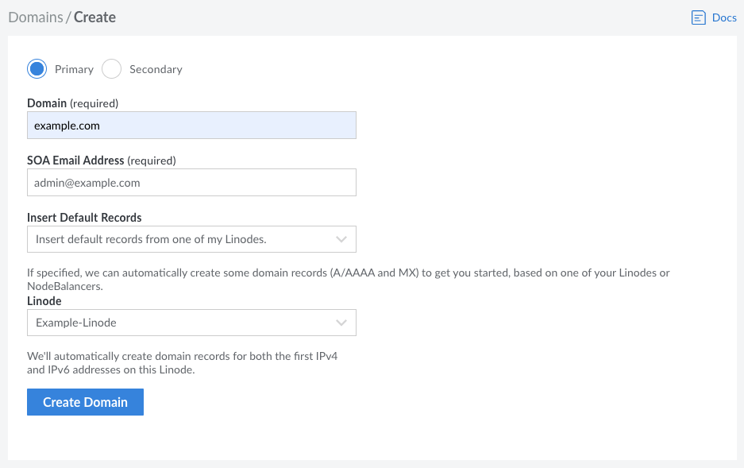
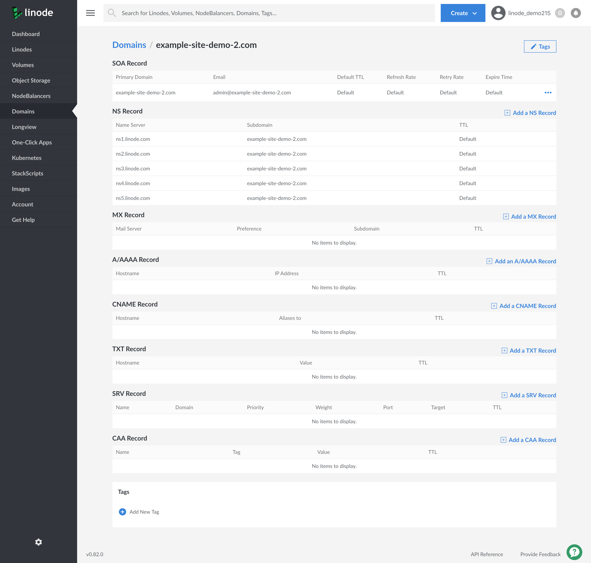
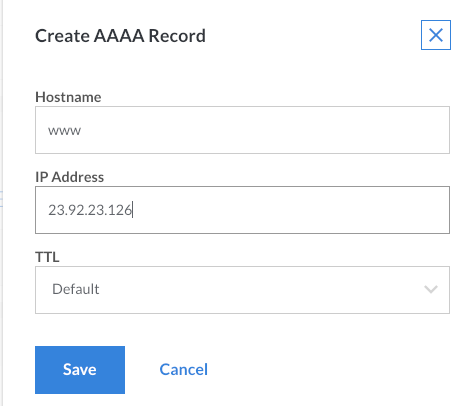

## Host a Website on Your Linode

Hosting a website is one of the most common uses for a Linode. A website can be anything from a single HTML file to an interactive application with multiple components, and the hosting process varies greatly depending on the type of website being served. This guide walks you through the process of setting up some of the most common simple website types.

Complete the steps in our [Creating a Compute Instance](/docs/guides/creating-a-compute-instance/) and [Setting Up and Securing a Compute Instance](/docs/guides/set-up-and-secure/) guide before you begin. The steps in this guide take you from a configured Linode to a fully functioning website.

This guide is written for Debian 9 and Ubuntu 18.04. If you are using a different distribution, adapt the commands (e.g. using `yum` instead of `apt`).

## Set Up a Web Server

The application you use to serve your website depends on the type of site. Find the section below that matches your situation.

### Static Sites

If your website consists entirely of static files like HTML, CSS, JavaScript, and images, then you only need to set up a simple web server to serve the files. Static sites include everything from bare-bones HTML pages to much more complicated [React.js](/docs/guides/how-to-deploy-a-react-app-on-ubuntu-18-04/) apps. NGINX is a good choice for hosting this type of website.

If you plan to host a simple site such as a blog or photo gallery, another option is to use a [static site generator](/docs/guides/how-to-choose-static-site-generator/).

1.  Install NGINX:

        sudo apt install nginx

2.  Create an NGINX configuration file called `/etc/nginx/conf.d/example.com.conf` (replace this and each instance of `example.com` with your site's name) and add the following content:

    
server {
    listen         80;
    listen         [::]:80;
    server_name    example.com www.example.com;
    root           /var/www/example.com;
    index          index.html;

    gzip             on;
    gzip_comp_level  3;
    gzip_types       text/plain text/css application/javascript image/*;
}


3.  The configuration above tells NGINX to look for your site's files in `/var/www/example.com`. Create this directory now, substituting your domain name for `example.com`:

        sudo mkdir -p /var/www/example.com

4.  Give ownership of this directory to your limited user account:

        sudo chown username:username /var/www/example.com

5.  Disable the default NGINX welcome page:

        sudo rm /etc/nginx/sites-enabled/default

6.  Test the NGINX configuration for errors:

        sudo nginx -t

7.  If there are no errors, reload the configuration:

        sudo nginx -s reload

8.  Copy the static files from your local computer to the target directory on your Linode. There are many ways to accomplish this. For example, if your site files are stored in a directory called `my-website` on your computer, you can use `scp` from your local computer:

        scp -r my-website/* username@<linode-ip-address>:/var/www/example.com/

9.  Activate the firewall using the built-in NGINX plugin for UFW:

        sudo ufw allow 'NGINX Full'
        sudo ufw allow ssh
        sudo ufw enable

10. Check that NGINX loaded successfully:

        sudo systemctl status nginx

    If NGINX loads successfully, continue to the [Test your Website](#test-your-website) section below.

This configuration is sufficient to get you started. For more advanced options and optimizations, see our [series on NGINX configuration](/docs/guides/getting-started-with-nginx-part-1-installation-and-basic-setup/).

### LAMP Stack

Other sites, such as [WordPress](/docs/guides/install-wordpress-ubuntu-18-04/), need a database in addition to a web server. This combination is known as a **stack**. WordPress is often used with the extremely popular LAMP stack (Linux, Apache, MariaDB and PHP). To install a LAMP stack manually, find the guide for your distribution in our [LAMP](/docs/web-servers/lamp/) section.

If you are using WordPress, another option is to use Docker. All of the components needed to run WordPress, along with WordPress itself, are bundled into a container that can be deployed with single command. See our [WordPress with Docker Compose](/docs/guides/wordpress-with-docker-compose/) guide for details. Official Docker images are also available for other CMS platforms including [Ghost](https://hub.docker.com/_/ghost/) and [Joomla](https://hub.docker.com/_/joomla/).

### Other Site Types

If none of these application stacks fit your situation, review our [Websites](/docs/websites/) and [Development](/docs/development/) sections to find a solution that works for your project.

## Test your Website

Test your website(s) before you add DNS records and make the site available publicly on your domain. Enter your Linode's public IP address in the address bar of a web browser. You should see your website displayed. When you are confident that the site is functioning correctly, proceed to the next section.

### Add a Domain

If you're new to Linode, or if you've just purchased a new domain name, the first step is to add a new domain in the **Domains** section of the Cloud Manager. If you don't know what DNS records to add, the DNS Manager can insert some basic records when you create the new domain.


Creating a domain also creates its corresponding domain zone. For a deep dive into the Linode DNS Manager, see our [DNS Manager](/docs/guides/dns-manager/) guide.


1.  From the **Domains** section, click on **Create Domain**. The domain creation page is displayed.

    

1. If you want to add a *secondary zone* instead of a primary zone, click the **Secondary** radio button.

    
In order for your domain to function as a secondary zone within Linode's DNS servers, your primary DNS server must notify and allow AXFR requests from the following IP addresses:

    104.237.137.10
    65.19.178.10
    74.207.225.10
    207.192.70.10
    109.74.194.10
    2600:3c00::a
    2600:3c01::a
    2600:3c02::a
    2600:3c03::a
    2a01:7e00::a


1.  Enter your domain name in the **Domain** field. An example is shown above.
1.  Enter an administrator's email address in the **SOA Email Address** field.
1.  If you are unfamiliar with DNS, the DNS Manager can automatically create some basic DNS records to get you started. To have it insert these records, select **Yes, insert a few records to get me started**, then select from the drop-down menu the Linode with which you want this domain zone associated.

     Alternatively, to keep the domain zone empty and prevent the DNS Manager from creating DNS records, select **No, I want the zone empty**.

1.  Click **Create Domain**. If you selected the option to have the DNS Manager insert basic DNS records, those records will be visible on the Domains detail page. The created records should include SOA, NS, MX, and A/AAA.

    If you elected to keep the zone empty, you can start adding DNS records now. The Domain detail page will contain an SOA and NS record for the domain. Skip to the [Add DNS Records](#add-dns-records) section for instructions.

### Add DNS Records

When you first create a domain, you'll need to add some DNS records. <!-- The DNS Manager can create some basic records to get you started when you create your domain zone, --> This section explains how to add your own records.

1.  Select a domain from within the **Domains** section of the Cloud Manager. The domain's detail page appears:

    

1.  The page is divided into different sections for each type of DNS record. Locate the section for the type of DNS record you want to add, then click **Add a Record**. The example below shows how to add an A/AAAA record.

    

    
The exact form fields will vary depending on the type of DNS record you select.


1.  Enter a hostname in the **Hostname** field.

1.  Enter the IP address of your server in the **IP Address** field. See [this quick answer page](/docs/guides/find-your-linodes-ip-address/) to find your Linode's IP address.

1.  Select a time interval from the **TTL** menu. *TTL* stands for *time to live*, and affects how long DNS records are cached by DNS resolvers. When the designated time to live is reached, the resolver must query the authoritative name servers for new records.

1.  Click **Save**. It can take up to 30 minutes for new DNS records to become active.

## Set Reverse DNS

Computers use DNS to determine the IP address associated with a domain name. Reverse DNS lookup does the opposite by resolving an IP address to a designated domain name. You should always set the reverse DNS, even if your Linode hosts more than one domain.

For more information about how to configure a reverse DNS, see [Configure Your Linode for Reverse DNS (rDNS)](/docs/networking/dns/configure-your-linode-for-reverse-dns/)
