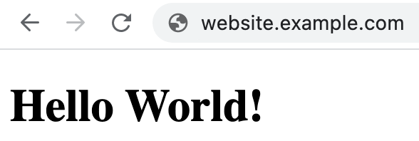
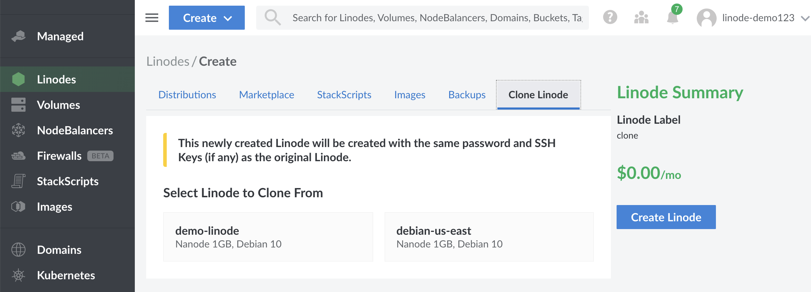
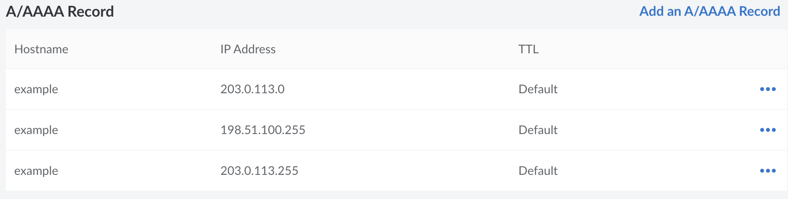

## What is Round-Robin DNS

**Round-Robin DNS** is a method of distributing traffic for a domain between two or more servers. This works by adding multiple DNS records to the same domain, each with the same record type but pointing to a different IP address. For each DNS query, all associated IP addresses can be returned, though the order in which these addresses appear will shift by one after each query. Since most clients will use the first IP address, this has the effect of routing each new request to the next server.

Round-robin DNS is commonly used *on top of other load balancing solutions* to offer geographic load distribution and redundancy, so your website remains accessible (fully or partially) even if an entire data center becomes unavailable. While round-robin DNS can *distribute* the load across multiple servers, it does not provide the level of redundancy and fault tolerance that can be achieved through proper load *balancing* solutions. For instance, it's not able to pre-emptively detect if a server is active. If one of the primary backends goes down, users will still be directed to it. This effect can be worsened if the DNS response is cached, which could continue to force users to connect to a failed or failing server repeatedly instead of redirecting them to one that works. While using a low TTL in your DNS configuration can reduce the impact of caching issues, it can not guarantee high availability.

This guide will explain how to configure round-robin DNS in it's most basic configuration, as well as apply it to a NodeBalancer configuration for additional fault tolerance and redundancy. After completing this guide, your website will be served and balanced across different data centers.

## Before You Begin

To continue following this guide, you will need a website that's hosted on a Linode and accessible through a domain name. If you already have a Linode configured this way, you can skip this section.

- [Create a Linode](/docs/products/platform/get-started/) on any plan that will host your website or web application. While a round-robin DNS configuration is possible with all major distros, the steps in this guide were specifically created using Debian 10.

- [Add a domain and configure an A record](/docs/products/networking/dns-manager/get-started/) to point to your new Linode. When using round-robin DNS, a low TTL is recommended.

- [Install and configure a web server](/docs/guides/how-to-install-nginx-debian-10/), adding a site that uses your domain name. While any major web server will be able to accommodate round-robin DNS, this guide was specifically created using NGINX.

After creating your Linode, configuring DNS, and setting up your web server, you should be able to freely access a webpage using your domain name:



### Cloning Your Web Server

Once your Linode is fully configured, the next step is to copy your configuration to additional Linodes in different data centers. The following steps can be repeated for as many additional Linodes as needed:

1. **Recommended**: Power off the Linode you would like to clone. This is recommended to prevent data corruption.

1. Click **Create** at the top of the Cloud Manager and select **Linode**.

1. In the **Create Linode** form, click on the **Clone Linode** tab:

    

1. Under **Select Linode to Clone From**, click on the Linode you wish to clone.

1. Select the region and plan for the new Linode. A different region for each backend Linode is recommended when using round-robin DNS.

    
    You will not be able to choose a plan for your new Linode that is smaller than the plan of the Linode you are cloning. For example, a 2GB Linode can not be cloned into a 1GB Linode (Nanode).
    

1. Provide a label for your new Linode.

1. Click **Create**.

1. The cloning process will begin. Depending on the size of your Linode, it may take some time. You will see a status bar above the Linode you cloned with the percentage of completion.

1. Your new Linode will appear on the Linodes page in a powered off state. Once the cloning process is complete, you will need to manually power on your new Linode.

### Configuring Your Clone

1. Create an [A record](/docs/products/networking/dns-manager/get-started/) for each new Linode. Use the same domain name as before and point the new record to the IP address of the new Linode. You should now have two or more A records pointing to two or more different Linodes in different data centers, all using the same domain name.



1. Power on the cloned Linodes.

1. To ensure that the DNS is correctly configured for all new Linodes, use the following command from your local machine, replacing `example.com` with your domain name:

    ```command
    dig +short example.com
    ```

The output should list the IP address of every Linode currently configured to resolve your domain name.

```output
203.0.113.0
198.51.100.255
203.0.113.255
```

## Putting NodeBalancers in Charge

While the above configuration is a functional round-robin DNS configuration, it does not provide the complex level of redundancy and fault tolerance that can be achieved through other means. Due to this, its common to combine round-robin DNS with high availability solutions, like NodeBalancers.

### Creating NodeBalancers

In this example, round-robin DNS will be used to alternate between two NodeBalancers on two different data centers, hosting a total of four Linodes.

1. Follow the [Cloning Your Web Server](##cloning-your-web-server) steps until you have 4 Linodes fully configured. You should have two Linodes available for each data center you will be creating a NodeBalancer in.

    
    If using NodeBalancers, DNS records should not be configured for the individual Linodes since they will instead be created for the NodeBalancers themselves. You should delete any A records for the individual Linodes now.
    

1. [Add a Private IP Address](/docs/products/compute/compute-instances/guides/manage-ip-addresses/#adding-an-ip-address) for each Linode that has been pre-configured for round-robin DNS.

1. Boot or Reboot all Linodes once they have been given a private IP address to ensure that the network configuration will be applied.

1.  Visit the NodeBalancers page in the [Cloud Manager](http://cloud.linode.com) and select **Create NodeBalancer**.

1.  For the purpose of this guide, you can keep the default settings for the new NodeBalancer's port configuration and health checks. Specifically, the port should be set to *80* and the protocol should be *HTTP*. If your website is already configured to use HTTPS, additional configuration will be required. See both [Getting Started with NodeBalancers](/docs/products/networking/nodebalancers/get-started/) and [NodeBalancer SSL Configuration](/docs/products/networking/nodebalancers/guides/ssl-termination/).

1.  Under the **Backend Nodes** section, add two backend nodes - one for each Linode within the same data center as the NodeBalancer. For each backend, select the private IP address of the corresponding Linode.

1.  Click the **Create NodeBalancer** button under the **NodeBalancer Summary** section. It may take a few moments for the NodeBalancer to be fully created. If everything is configured on your backend correctly, the **Node Status** column should update to **2 up / 0 down**. If any of the backends are reporting as down, check to make sure that your website is configured to respond on the Linode's private IP address.

1. Repeat the steps to create and configure a NodeBalancer in the data center where your other two Linodes are located. To continue, you should have two NodeBalancers fully configured across two different data centers.

1.  Now that the NodeBalancers are up, go directly to your NodeBalancer's IP addresses in a browser. You should see your web application freely available as the NodeBalancer proxies the traffic through.

1. After confirming that the NodeBalancer is working, [Add a domain and configure two A records](/docs/products/networking/dns-manager/get-started/) pointing towards the NodeBalancers you have created. Each A record should be using the same DNS name, and pointing towards the public IP address of your NodeBalancers.

After completing these steps, round-robin DNS is now successfully configured for your NodeBalancers. Additional Linodes and NodeBalancers can be added to suit your application's specific needs.