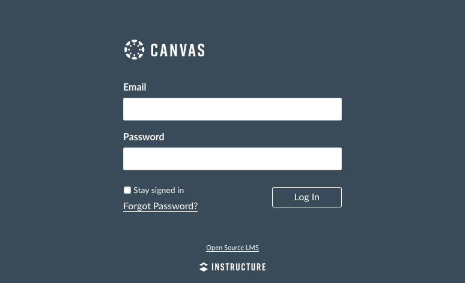
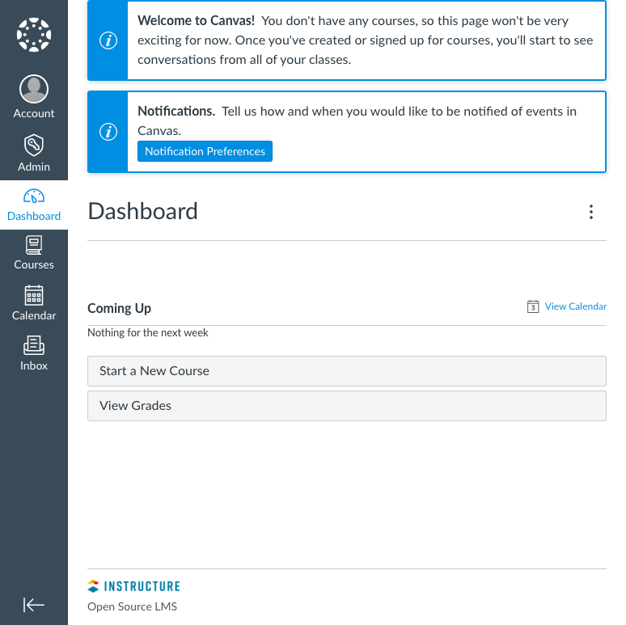

[Canvas](https://www.instructure.com/canvas) is a popular Learning Management System (LMS) noteworthy for its modern design and ease of use. A Canvas website gives you a comprehensive portal for education and training courses. It can manage both in-person and online courses, as well as hybrid courses that mix the two. Moreover, Canvas is [open source](https://github.com/instructure/canvas-lms). You can freely download and install an instance on your server.

This guide shows you how to get a Canvas website up and running on a Debian 10 server.

## Before You Begin

1.  If you have not already done so, create a Linode account and Compute Instance. See our [Getting Started with Linode](/docs/guides/getting-started/) and [Creating a Compute Instance](/docs/guides/creating-a-compute-instance/) guides.

1.  Follow our [Setting Up and Securing a Compute Instance](/docs/guides/set-up-and-secure/) guide to update your system. You may also wish to set the timezone, configure your hostname, create a limited user account, and harden SSH access.

1. Install and configure UFW for managing your machine's firewall rules. Refer to the [How to Configure a Firewall with UFW](/docs/guides/configure-firewall-with-ufw/) guide.

1. Prepare an SMTP server that Canvas can use to send email notifications to users. You can use a third-party SMTP service for this purpose. This guide uses [Mailgun](https://www.mailgun.com/) as the third-party SMTP provider in its example configurations.

1. Canvas recommends a minimum of 8 GB of RAM. The website may operate with fewer, but doing so may result in installation and/or runtime issues. This is especially the case when all of the Canvas components are running on a single machine.

    
You can run some of the components of your Canvas installation on separate machines to free up memory. Refer to Canvas's [Production Start](https://github.com/instructure/canvas-lms/wiki/Production-Start) guide for more information on what components can be installed independently. This approach requires that each machine is configured to enable communications between the components, and it is considered an advanced setup.


1. Replace `example.com` in this guide with your server's domain name. You can complete the steps mentioned in the [Add DNS Records](/docs/websites/set-up-web-server-host-website/#add-dns-records) section to register a domain name for your Linode server.


This guide is written for a non-root user. Commands that require elevated privileges are prefixed with `sudo`. If you’re not familiar with the `sudo` command, see the [Linux Users and Groups](/docs/guides/linux-users-and-groups/) guide.


## Install Apache

Canvas uses *Apache* and [*Phusion's Passenger*](https://www.phusionpassenger.com/) to serve its web pages. Phusion has its own package repository which this guide uses to install both Passenger and the Passenger module for Apache.

1. **Add the key** for the Phusion repository and HTTPS support for the package manager.

        sudo apt install dirmngr gnupg
        sudo apt-key adv --keyserver hkp://keyserver.ubuntu.com:80 --recv-keys 561F9B9CAC40B2F7
        sudo apt install apt-transport-https ca-certificates

1. **Add the Phusion repository** and update the package manager. The `buster` in the first of these commands corresponds to the code name for Debian 10.

        sudo sh -c 'echo deb https://oss-binaries.phusionpassenger.com/apt/passenger buster main > /etc/apt/sources.list.d/passenger.list'

        sudo apt update

1. Install Apache, the Apache development headers, Passenger, and the Passenger module for Apache.

        sudo apt install apache2 apache2-dev passenger libapache2-mod-passenger

1. Enable the Passenger, Rewrite, and SSL modules for Apache.

        sudo a2enmod passenger rewrite ssl

## Install PostgreSQL

1. Install PostgreSQL.

        sudo apt install postgresql

1. Make the current user a PostgreSQL superuser.

        sudo -u postgres createuser $USER
        sudo -u postgres psql -c "alter user $USER with superuser" postgres

1. Create a Canvas user in PostgreSQL.

        sudo -u postgres createuser canvas --no-createdb --no-superuser --no-createrole --pwprompt

1. Create a Canvas database making the Canvas user its owner.

        sudo -u postgres createdb canvas_production --owner=canvas

## Install Ruby

Canvas specifically requires version **2.6** of Ruby, which the default package repositories on Debian do not have. This guide uses the *Ruby Version Manager (RVM)* to install the necessary version.

1. Add the **GPG key** for installing RVM.

        gpg --keyserver hkp://pool.sks-keyservers.net --recv-keys 409B6B1796C275462A1703113804BB82D39DC0E3 7D2BAF1CF37B13E2069D6956105BD0E739499BDB

1. Run the RVM installation script.

        \curl -sSL https://get.rvm.io | bash

1. Source RVM's scripts.

        source ~/.rvm/scripts/rvm

1. Install the required version of Ruby.

        rvm install 2.6.6

    You can verify that the correct version was installed with the following command:

        ruby -v

1. **Install Bundler** which Canvas uses for managing its Ruby libraries ("Gems"). Canvas specifically calls for version **2.1.4** of Bundler.

        sudo gem install bundler --version 2.1.4

## Install Node.js and Yarn

1. Install Node.js.

        curl -sL https://deb.nodesource.com/setup_14.x | sudo -E bash -
        sudo apt install nodejs

1. Install Yarn, a package manager used in the Canvas installation process.

        curl -sS https://dl.yarnpkg.com/debian/pubkey.gpg | sudo apt-key add -
        echo "deb https://dl.yarnpkg.com/debian/ stable main" | sudo tee /etc/apt/sources.list.d/yarn.list
        sudo apt update && sudo apt install yarn=1.19.1-1

## Install Canvas

1. Install additional packages required by Canvas.

        sudo apt install python zlib1g-dev libxml2-dev libsqlite3-dev libpq-dev libxmlsec1-dev make g++

1. Install Git which is used to download the Canvas files from their repository. Using Git also makes it easier to update your Canvas installation in the future.

        sudo apt install git-core

1. Use Git to download the Canvas repository.

        git clone https://github.com/instructure/canvas-lms.git ~/canvas

1. Change into the repository directory and check out the latest stable branch of the repository.

        cd ~/canvas
        git checkout stable

1. Create a new directory for Canvas, copy the repository there, and change its ownership to the current user.

        sudo mkdir -p /var/canvas
        sudo cp -R ~/canvas /var
        sudo chown -R $USER /var/canvas

1. Change into the new Canvas root directory.

        cd /var/canvas

    All subsequent steps in this guide assume that you are operating out of this directory unless stated otherwise.

1. Use **Bundle** to install Canvas's Ruby dependencies.

        bundle config set path 'vendor/bundle'
        bundle config set --local without 'pulsar'
        bundle install

1. Use **Yarn** to install the necessary Node.js modules.

        yarn install

## Set Up the Canvas Configuration Files

1. Copy the example configuration files. Generally, the default configurations do not need to be modified, and the steps that follow walk you through the minor changes that are needed.

        for config in amazon_s3 database delayed_jobs domain file_store outgoing_mail security external_migration; do cp config/$config.yml.example config/$config.yml; done

1. Using your preferred text editor, open the database configuration file, `/var/canvas/config/database.yml`. Modify the `username` and `password` fields in the `production` section to match the `canvas` PostgreSQL user you created.

    
production:
  adapter: postgresql
  encoding: utf8
  database: canvas_production
  host: localhost
  username: canvas
  password: password
  timeout: 5000
    

1. Open the domain configuration file, `/var/canvas/config/domain.yml`. Modify the `domain` field in the `production` section to match your server's domain name.

    
production:
  domain: "example.com"
  ssl: true
    

1. Open the outgoing mail configuration file, `/var/canvas/config/outgoing_mail.yml`. Locate the production section, and complete it as follows:

   - Enter the information for your SMTP service in the `address`, `port`, `user_name`, `password`, and `authentication` fields.

   - Enter your Canvas server's domain name in the `domain` field.

   - For `outgoing_address`, create the email address from which Canvas is to deliver emails. Use your server's domain name as the base of the address.

   - In the `default_name` field, enter a name to be used by default on emails sent from Canvas.

    
production:
  address: "http://smtp.mailgun.org/"
  port: "587"
  user_name: "example-user"
  password: "password"
  authentication: "plain"
  domain: "example.com"
  outgoing_address: "canvas@example.com"
  default_name: "Example Canvas"
    

1. Open the security configuration file, `/var/canvas/config/security.yml`. Enter a random string of 20 or more characters into the `encryption_key` field.

    You can use a command like the following to generate a random string, which you can then copy and paste into the configuration file. This example outputs a random string of 24 alphanumeric characters.

        cat /dev/urandom | tr -dc 'A-Za-z0-9' | head -c 24; echo ''

## Generate the Canvas Assets and Data

1. Create the required asset-related directories and files as shown in the following commands:

        mkdir -p log tmp/pids public/assets app/stylesheets/brandable_css_brands
        touch app/stylesheets/_brandable_variables_defaults_autogenerated.scss
        touch Gemfile.lock
        touch log/production.log

1. Assign ownership of key Canvas files to the current user.

        sudo chown -R $USER config/environment.rb log tmp public/assets app/stylesheets/_brandable_variables_defaults_autogenerated.scss app/stylesheets/brandable_css_brands Gemfile.lock config.ru

1. Run the Yarn installer again.

        yarn install

1. Use the Bundle to rehash the encryption key and compile Canvas's assets.

        RAILS_ENV=production bundle exec rake db:reset_encryption_key_hash
        RAILS_ENV=production bundle exec rake canvas:compile_assets

    Observe the commands' output for any errors that stop the processes. If you encounter any, run the command again. The asset compilation can consume a lot of memory, so it may be helpful to stop any major processes running in the background. For instance, you can restart Apache before running the following commands:

        sudo systemctl restart apache2

1. Assign ownership of the `brandable_css` directory to the current user.

        sudo chown -R $USER public/dist/brandable_css

1. Use the Bundle to generate the initial data for Canvas.

        RAILS_ENV=production bundle exec rake db:initial_setup

    You are prompted to enter an email address and password which are used to create the Canvas administrator login. You are also prompted to enter a name for your Canvas site and to select your preference for sending usage data to Canvas.

1. Assign ownership of the configuration files to the current user, and limit them to read access.

        sudo chown $USER config/*.yml
        sudo chmod 400 config/*.yml

1. Use the following commands to set up and start the automated jobs the Canvas application relies on.

        sudo ln -s /var/canvas/script/canvas_init /etc/init.d/canvas_init
        sudo update-rc.d canvas_init defaults
        /etc/init.d/canvas_init start

## Configure Apache for Canvas

1. Remove the default Apache site configuration.

        sudo unlink /etc/apache2/sites-enabled/000-default.conf

1. Using your preferred text editor, create and open a new configuration file, `/etc/apache2/sites-available/canvas.conf`. Enter the following as the file's content. Replace `example@example-email.com` with the email address for the system administrator.

    
<VirtualHost *:80>
  ServerName example.com
  ServerAlias example.com
  ServerAdmin example@example-email.com
  DocumentRoot /var/canvas/public
  RewriteEngine On
  RewriteCond %{HTTP:X-Forwarded-Proto} !=https
  RewriteCond %{REQUEST_URI} !^/health_check
  RewriteRule (.*) <https://%{HTTP_HOST}%{REQUEST_URI>} [L]
  ErrorLog /var/log/apache2/canvas_errors.log
  LogLevel warn
  CustomLog /var/log/apache2/canvas_access.log combined
  SetEnv RAILS_ENV production
  <Directory /var/canvas/public>
    Allow from all
    Options -MultiViews
  </Directory>
</VirtualHost>
<VirtualHost *:443>
  ServerName example.com
  ServerAlias example.com
  ServerAdmin example@example-email.com
  DocumentRoot /var/canvas/public
  ErrorLog /var/log/apache2/canvas_errors.log
  LogLevel warn
  CustomLog /var/log/apache2/canvas_ssl_access.log combined
  SSLEngine on
  BrowserMatch "MSIE [17-9]" ssl-unclean-shutdown
  SSLCertificateFile /etc/ssl/certs/ssl-cert-snakeoil.pem
  SSLCertificateKeyFile /etc/ssl/private/ssl-cert-snakeoil.key
  SetEnv RAILS_ENV production
  <Directory /var/canvas/public>
    Options All
    AllowOverride All
    Require all granted
  </Directory>
</VirtualHost>
    

1. Open the Passenger configuration file, `/etc/apache2/mods-available/passenger.conf`. Add a `PassengerDefaultUser` line, and make its value the username of the user you used to set up Canvas. This is `example-user` in the following example:

    
<IfModule mod_passenger.c>
  PassengerRoot /usr/lib/ruby/vendor_ruby/phusion_passenger/locations.ini
  PassengerDefaultRuby /usr/bin/passenger_free_ruby
  PassengerDefaultUser example-user
</IfModule>
    

    
Canvas has a relatively long startup time, which can sometimes lead to timeout issues. You can add a version of the following line to the **`passenger.conf`** file to increase the time before Canvas times out at startup. This example increases the amount of time before the Passenger times out from the default 60 seconds up to 180 seconds.

    PassengerStartTimeout 180
    

1. Allow HTTP and HTTPS connections on the system's firewall.

        sudo ufw allow http
        sudo ufw allow https
        sudo ufw reload

1. Enable the Apache site configuration.

        sudo a2ensite canvas

1. Restart Apache for the changes to take effect.

        sudo systemctl restart apache2

## Set Up an SSL Certificate

By default, your Canvas site uses self-signed SSL certificates. The following steps show you how to use [*Certbot*](https://certbot.eff.org) to request and download a free certificate from [*Let's Encrypt*](https://letsencrypt.org).

1. Install [Snap](https://snapcraft.io/docs/getting-started). Snap provides application bundles that work across major Linux distributions.

        sudo apt install snapd

1. Update and refresh Snap.

        sudo snap install core && sudo snap refresh core

1. Remove any existing Certbot installation.

        sudo apt remove certbot

1. Install Certbot.

        sudo snap install --classic certbot

1. Create a symbolic link for the Certbot command.

        sudo ln -s /snap/bin/certbot /usr/bin/certbot

1. Download a certificate for your site. When prompted, select your site's domain name from the list of configured Apache domains.

        sudo certbot certonly --apache

1. Certbot includes a cron job that automatically renews your certificate before it expires. You can test the automatic renewal with the following command:

        sudo certbot renew --dry-run

1. Open the `/etc/apache2/sites-available/canvas.conf` file again, and modify the `SSL` lines as follows:

    
SSLCertificateFile /etc/letsencrypt/live/example.com/fullchain.pem
SSLCertificateKeyFile /etc/letsencrypt/live/example.com/privkey.pem
    

1. Restart the Apache server.

        sudo systemctl restart apache2

## Install Redis

Canvas has caching disabled by default, but you can optionally configure it to use Redis for caching. The following steps show you how to install Redis and configure Canvas to use it.

1. Install Redis.

        sudo apt install redis-server

1. Copy the example cache configuration file. This and the following commands assume you are again in the Canvas root directory (`/var/canvas`).

        cp config/cache_store.yml.example config/cache_store.yml

1. Using your preferred text editor, open the `cache_store.yml` file, and set `redis_store` as the `cache_store` for `development`, `test`, and `production`. The configuration file should resemble the following:

    
development:
  cache_store: redis_store
test:
  cache_store: redis_store
production:
  cache_store: redis_store
    

1. Copy the example Redis configuration file.

        cp config/redis.yml.example config/redis.yml

1. Open the `redis.yml` file. Add a `production` section like the following by entering the server location for Redis. If you are running Redis on the same machine as Canvas, this should be `redis://localhost`, as in the following example:

    
production:
  servers:
    - redis://localhost
    

1. Once again assign ownership of the configuration files to the current user and limit them to read access.

        sudo chown $USER config/*.yml
        sudo chmod 400 config/*.yml

1. Restart Apache for the changes to take effect.

        sudo systemctl restart apache2

## Next Steps

Your Canvas website is now up and running. Visit the website by navigating to your server's domain name in a web browser. When you are prompted to log in, you can do using the Canvas administrator credentials you created earlier.

Once you log in, you are taken to your Canvas dashboard from which you can view, create, and manage your Canvas website's content.

- You can learn more about how to get started using your Canvas website and all the features it has to offer on the [Canvas Community](https://community.canvaslms.com/) website.

- Be sure to check out the [Canvas guides](https://community.canvaslms.com/t5/Canvas/ct-p/canvas) from the Canvas Community which covers everything from basic, day-to-day usage to advanced features.
