With an increasing trend towards online learning, learning management software is in high demand. [Moodle](https://moodle.org/) is a free and open source Learning Management System (LMS) that is easy for both teachers and students to use. It allows administrators to create a powerful website for education and training courses. This guide explains how to download and install Moodle on Ubuntu 22.04. It also demonstrates how to configure and administer Moodle using the Moodle Dashboard.

## What is Moodle?

Moodle is one of the more popular open source LMS applications. It is used to implement a portal for online educational and training courses. Moodle can be used for remote and hybrid learning, or as an adjunct resource for in-person courses. Moodle is available for most platforms, including Ubuntu and other Linux distributions.

Some of Moodle's advantages are as follows:

-   The Moodle platform is highly customizable and can provide students with a personalized education portal. The Moodle Dashboard allows administrators to manage the site and quickly add new courses and content.
-   Features are implemented in a modular manner, so the site can be as simple or complex as the user wants.
-   Moodle is stable and allows for enhanced security.
-   Moodle's intuitive user tools facilitate quick platform onboarding.
-   Moodle maximizes the amount of on-screen content to improve concentration, reduce distraction, and enhance course retention.
-   It provides educator features to help teachers manage and organize their courses and deadlines.
-   Moodle includes a built-in video conferencing feature, complete with breakout rooms, chats, and a whiteboard.
-   It includes analytics for both courses and individual students.
-   Moodle features enhanced accessibility, including screen readers and keyboard navigation.

## Before You Begin

1.  If you have not already done so, create a Linode account and Compute Instance. See our [Getting Started with Linode](/docs/products/platform/get-started/) and [Creating a Compute Instance](/docs/products/compute/compute-instances/guides/create/) guides.

1.  Follow our [Setting Up and Securing a Compute Instance](/docs/products/compute/compute-instances/guides/set-up-and-secure/) guide to update your system. You may also wish to set the timezone, configure your hostname, create a limited user account, and harden SSH access.

1.  Configure a LAMP Stack, including the Apache web server, the MySQL RDBMS, and PHP. For more information on configuring a LAMP stack, consult the Linode guide on [Installing a LAMP Stack on Ubuntu 22.04](/docs/guides/how-to-install-a-lamp-stack-on-ubuntu-22-04/).

1.  To properly use Moodle, configure a domain name for the server. For information on domain names and pointing the domain name to a Linode, see the [Linode DNS Manager guide](/docs/products/networking/dns-manager/).

1.  **(Optional)** A virtual host for the domain is not strictly required, but is recommended.


This guide is written for a non-root user. Commands that require elevated privileges are prefixed with `sudo`. If you are not familiar with the `sudo` command, see the [Users and Groups](/docs/guides/linux-users-and-groups/) guide.


## Installing the Moodle Prerequisites

In addition to a fully-configured LAMP stack, Moodle requires a few extra PHP modules and other packages. To install the additional components, follow these instructions.


Ubuntu 22.04 supports PHP 8.1 by default. However, Moodle is not compatible with PHP 8.1, so release 7.4 must be used instead. If PHP 8.1 is already installed on the Linode, you must install PHP 7.4 and configure it as the active release of PHP. PHP 7.3 is also supported, but 7.4 is highly recommended. See the [Moodle and PHP page](https://docs.moodle.org/dev/Moodle_and_PHP) for compatibility information.

Downgrading PHP can potentially affect other applications that use PHP. Use caution before attempting any downgrade. In some cases, it might be better to wait for Moodle to support PHP 8.1 before installing it.


1.  Ensure the Ubuntu system packages are up to date.

    ```command
    sudo apt update && sudo apt upgrade
    ```

1.  Confirm the active release of PHP. If this is 7.4, skip the steps marked "For Linode systems using PHP 8.1". For systems running PHP 8.1, follow all instructions.

    ```command
    php -v
    ```

    
PHP 7.4.29 (cli) (built: Apr 28 2022 11:47:05) ( NTS )
    

1.  **(For Linode systems using PHP 8.1)** Moodle requires PHP release 7.4 to function properly. If PHP 8.x is the active release, PHP 7.4 must be installed. To install PHP 7.4, add the `ondrej` repository, then use `apt install`.

    ```command
    sudo add-apt-repository ppa:ondrej/php
    sudo apt-get update
    sudo apt install php7.4 libapache2-mod-php7.4
    ```

1.  **(For Linode systems using PHP 8.1)**  Use the `update-alternatives` tool to set the active release of PHP to 7.4. Review the list of available releases and enter the number corresponding to release 7.4.

    ```command
    sudo update-alternatives --config php
    ```

1.  **(For Linode systems using PHP 8.1)** Disable the Apache module associated with PHP 8.1 and enable the module for PHP 7.4 using the following commands.

    ```command
    sudo a2dismod php8.1
    sudo a2enmod php7.4
    ```

1.  Install the remaining PHP 7.4 packages using `apt`. The name of each PHP component follows the pattern `php7.4-component_name`.

    ```command
    sudo apt install graphviz aspell ghostscript clamav php7.4-pspell php7.4-curl php7.4-gd php7.4-intl php7.4-mysql php7.4-xml php7.4-xmlrpc php7.4-ldap php7.4-zip php7.4-soap php7.4-mbstring git
    ```

1.  Reload Apache to apply the changes.

    ```command
    sudo systemctl restart apache2
    ```

## Downloading Moodle for Ubuntu 22.04

The Moodle documentation recommends cloning the application from Git. These instructions are designed for Ubuntu 22.04 users, but are very similar for Ubuntu 20.04. To download Moodle, follow these steps.

1.  Move to the `/opt` directory, and clone the Moodle Git repository.

    ```command
    cd /opt
    sudo git clone git://git.moodle.org/moodle.git
    ```

1.  Change to the `moodle` directory.

    ```command
    cd moodle
    ```

1.  Determine the latest stable Moodle release from the [Moodle Releases page](https://docs.moodle.org/dev/Releases). This page also lists the latest LTS release, along with a release roadmap. The newest stable release from Moodle is currently branch 4.0.

1.  Use the `git branch` command to list the branches in the Moodle repository. Review the list and determine the branch matching the latest stable release. Currently, the best match is `MOODLE_400_STABLE`.

    ```command
    sudo git branch -a
    ```

    
remotes/origin/HEAD -> origin/master
...
remotes/origin/MOODLE_39_STABLE
remotes/origin/MOODLE_400_STABLE
remotes/origin/master
    

1.  Track and check out the appropriate branch. This example demonstrates how to check out `MOODLE_400_STABLE`.

    ```command
    sudo git branch --track MOODLE_400_STABLE origin/MOODLE_400_STABLE
    sudo git checkout MOODLE_400_STABLE
    ```

    
Switched to branch 'MOODLE_400_STABLE'
Your branch is up to date with 'origin/MOODLE_400_STABLE'.
    

1.  Copy the contents of the Moodle repository to the root directory for the domain. If a virtual host has not been configured, this is `/var/www/html`. If there is a virtual host for the domain, the directory is likely `/var/www/html/your_domain_name/public_html`. The instructions in this guide assume a virtual host has not been configured. Modify the permissions for the `moodle` directory to grant read, write, and execute rights to all users.

    
These rights are only temporary. After installation is complete, write access should be locked down to the directory owner.
    

    ```command
    sudo cp -R /opt/moodle /var/www/html/
    sudo chmod -R 0777 /var/www/html/moodle
    ```

1.  Create the `/var/moodledata` directory and change the directory owner and permissions.

    ```command
    sudo mkdir /var/moodledata
    sudo chown -R www-data /var/moodledata
    sudo chmod -R 0777 /var/moodledata
    ```

## Configuring the MySQL Server for Moodle

1.  Log in to MySQL as the `root` user. The SQL prompt should appear.

    ```command
    sudo mysql -u root -p
    ```

1.  Create a database for Moodle to use. MySQL should respond with `Query OK`.

    ```command
    CREATE DATABASE moodle DEFAULT CHARACTER SET utf8mb4 COLLATE utf8mb4_unicode_ci;
    ```

1.  Create a Moodle MySQL user. Grant them permissions for the database. Provide a better user name and a more secure password in place of `moodle-user` and `password` in the following example. MySQL should reply with `Query OK` in each case.

    ```command
    CREATE USER 'moodle-user'@'localhost' IDENTIFIED BY 'password';
    GRANT SELECT,INSERT,UPDATE,DELETE,CREATE,CREATE TEMPORARY TABLES,DROP,INDEX,ALTER ON moodle.* TO 'moodle-user'@'localhost';
    ```

1.  Exit the MySQL database.

    ```command
    quit
    ```

## Installing the Moodle Application

Most of the Moodle configuration is done using the web interface. Moodle must know the location of the Moodle and data directories. You must also provide information about the Moodle database and database user.

### Configuring Moodle Using the Web Interface

Finish setting up and configuring Moodle using the web interface. Ensure you have the information about the Moodle database user readily available. To configure Moodle, follow these steps.

1.  Visit the Moodle web interface at `http://www.example.com/moodle`. Substitute the name of your domain in place of `example.com`.

    ```command
    http://example.com/moodle
    ```

1.  Moodle first displays a page for selecting the default language. Choose the operational language for the site and select **Next >>**.

    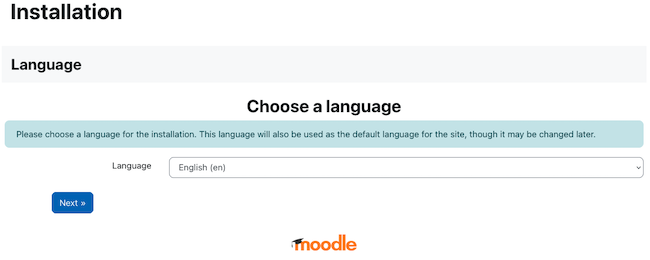

1.  The Moodle web interface now displays a form for entering path information. Enter `var/moodledata` for the **Data directory**. The other fields cannot be changed. Select **Next >>** when the form is complete.

    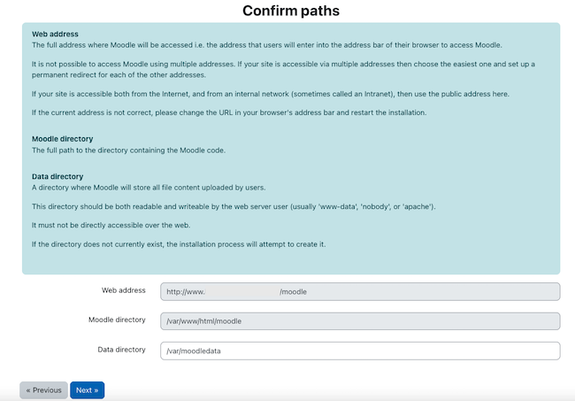

1.  On the next page, select the **Improved MySQL database driver**. Then enter **Next >>**.

    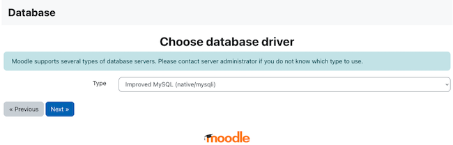

1.  Moodle displays a form for the MySQL database settings. Enter the name of the `moodle` database user along with the account password. This is the MySQL user account created earlier in the tutorial. Leave the remaining settings the same. Select **Next >>** to proceed.

    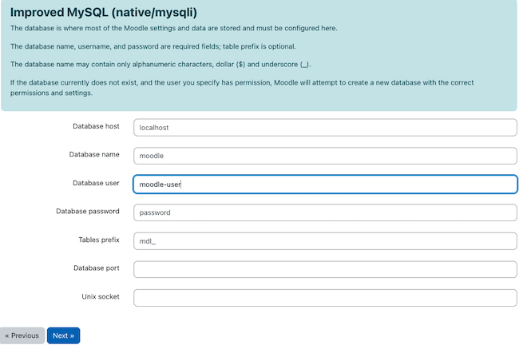

1.  On the next page, Moodle displays the licensing agreement. Review the conditions and select **Continue** to proceed.

1.  Moodle now verifies the installation. Ensure all `Server Checks` indicate `OK`. If the installation is successful, Moodle displays the message `Your server environment meets all minimum requirements` at the bottom. Select **Continue** to move to the next step.

    
Moodle performs some additional tests and displays the results in the `Other checks` section. This section presents some opportunities to improve performance and security. If HTTPS is not configured on the server, the `site not https` warning is displayed. This warning and any performance suggestions can be ignored for now. It is still possible to proceed with the installation.
    

    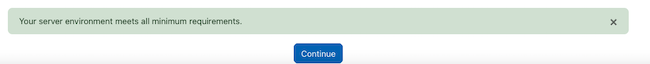

1.  Moodle completes the installation process. Scroll down through the page and ensure all tasks indicate a `Success` status. Click **Continue** to proceed.

1.  At the next page, enter details about the Moodle administrator. Select **Update profile** when finished.

    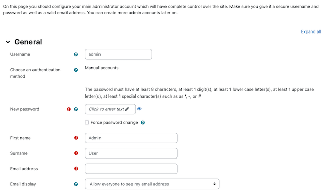

1.  The following page asks for more information about the site, such as the site name. Enter the requested information, then click **Save changes**.

1. Click **Register your site** to complete the registration. The browser now displays the Moodle dashboard. This dashboard allows users to add content and administer the site.

    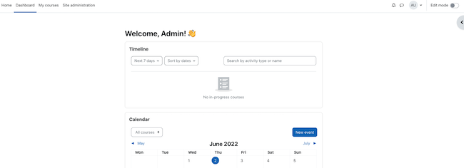

1. Return to the system console and change permissions for the Moodle site. For better security, restrict write permission to the root user.

    ```command
    sudo chmod -R 0755 /var/www/html/moodle
    ```

### Configuring System Paths for Moodle (Optional)

For better Moodle performance, configure some system paths using the Moodle dashboard. This step is optional, but highly recommended. It is also possible to complete this section at another time.

1.  Visit the Moodle dashboard at `example.com/moodle`. Choose the **Site Administration** tab in the upper left.

    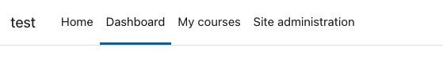

1.  On the site administration page, select the **Server** tab.

    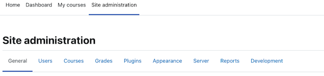

1.  From the Server page, select **System Paths**.

    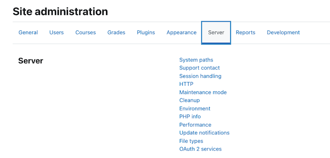

1.  At the System Paths form, enter the following information.

    -   **Path to du**: Set this to `/usr/bin/du`.
    -   **Path to aspell**: Set this to `/usr/bin/aspell`.
    -   **Path to dot**: Set this to `/usr/bin/dot`.

    Leave the remaining fields unchanged. After all changes have been made, click **Save changes**. Moodle confirms the new settings. The completed form should resemble the following example.

    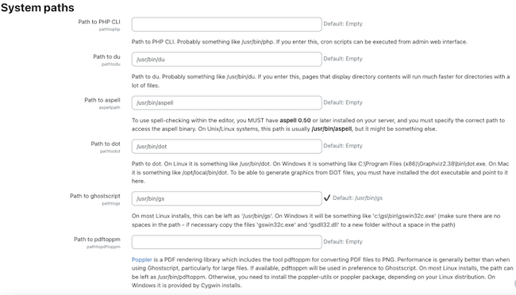

### Setting up a SSL Certificate for Moodle (Optional)

Although Moodle does not require the *Hypertext Transfer Protocol Secure* (HTTPS) protocol, it is highly recommended. HTTPS encrypts information using *Secure Sockets Layer* (SSL) technology, resulting in better security. Failure to configure HTTPS can expose the site data to various cyber attacks.

Before the Linode can accept HTTPS requests, it must possess a signed public-key certificate from a trusted certificate authority. [Certbot](https://certbot.eff.org/) is used to install and renew SSL certificates for the Apache web server. Certbot is a free and open source tool that automates the process of requesting [Let's Encrypt](https://letsencrypt.org/) certificates for a website.

To install a SSL certificate for Moodle and the domain, follow these steps.

1.  Update the Snap application, which is used to download application bundles. Snap comes pre-installed on Ubuntu 22.04.

    ```command
    sudo snap install core && sudo snap refresh core
    ```

1.  Remove the default Ubuntu Certbot installation.

    ```command
    sudo apt remove certbot
    ```

1.  Use `snap` to install Certbot.

    ```command
    sudo snap install --classic certbot
    ```

    
certbot 1.27.0 from Certbot Project (certbot-eff✓) installed
    

1.  Download a certificate for the domain using `certbot`.

    ```command
    sudo certbot --apache
    ```

1.  Certbot guides users through the installation process. The following information is required:

    -   A contact email for the domain owner.
    -   An acknowledgment of the terms of service. Enter `Y` to proceed.
    -   Whether to share the email address with the Electronic Frontier Foundation.
    -   The domain name to be registered. Enter the domain both with and without the `www` prefix.

    After granting the certificate, Certbot displays some information about the granting process and the certificate.

    
Congratulations! You have successfully enabled HTTPS on https://example.com and https://www.example.com
    

1.  Certbot automatically schedules a renewal and update for the certificate. To test out the renewal procedure, launch a dry run using the `renew` command.

    ```command
    sudo certbot renew --dry-run
    ```

1.  Edit the Moodle configuration file at `/var/www/html/moodle/config.php`. Change the value of `$CFG->wwwroot` to use the `https` variant of the domain name. For the following command, replace `example.com` with the actual domain name. This automatically redirects HTTP traffic to HTTPS.

    ```file {title="/var/www/html/moodle/config.php" lang="php"}
    ...
        $CFG->wwwroot = 'https://example.com/moodle';
    ...
    ```

1.  Restart the Apache server.

    ```command
    sudo systemctl restart apache2
    ```

1.  Reload the Moodle dashboard. The URL should now resolve to the HTTPS version of the page.

## How to Use Moodle

Before proceeding, spend some time exploring the Moodle Dashboard to become more aware of the different configuration options. Read through the [Moodle Administration Guide](https://docs.moodle.org/400/en/Admin_quick_guide) to find out how to customize the site, add users, and configure course information. The [Moodle Teacher Quick Guide](https://docs.moodle.org/400/en/Teacher_quick_guide) demonstrates how to add and manage a course. More detailed information, including troubleshooting information, can be found in the [Moodle Documentation library](https://docs.moodle.org/400/en/Main_page).

## A Summary of How to Install Moodle on Ubuntu 22.04

Moodle is a powerful and flexible online learning management system. Moodle is a free and open source application that is available for Ubuntu 22.04 and other operating systems. Administrators can manage and configure the application using the Moodle dashboard.

Moodle is installed using Git and is configurable using a web-based interface. Moodle requires PHP release 7.4, which might require a downgrade for some systems. For more information on Moodle, see the [Moodle website](https://moodle.org/).