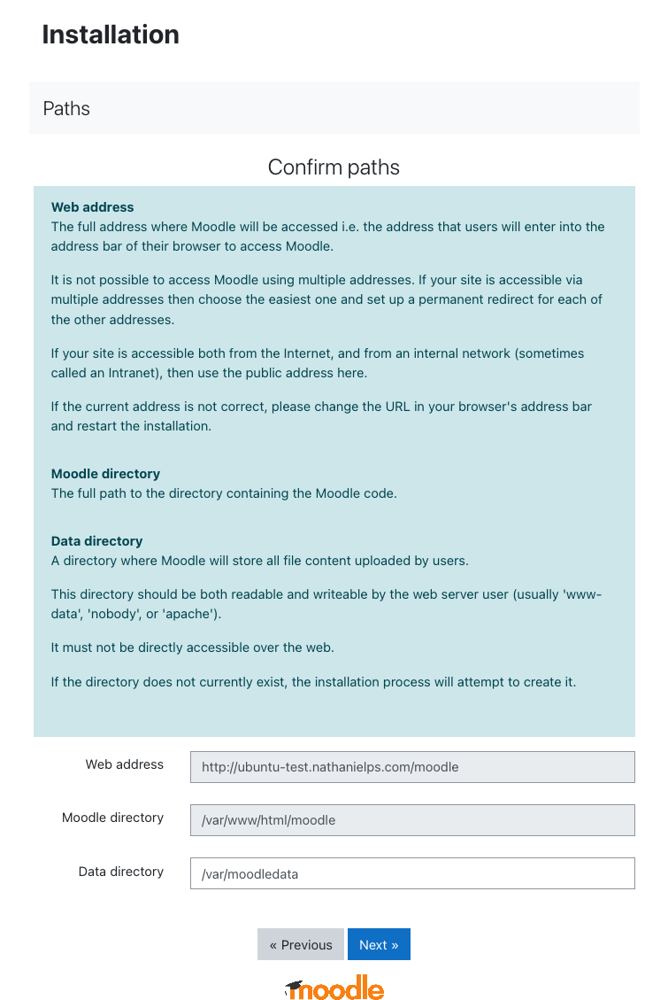
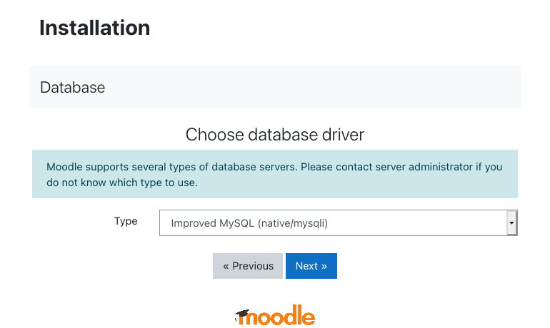
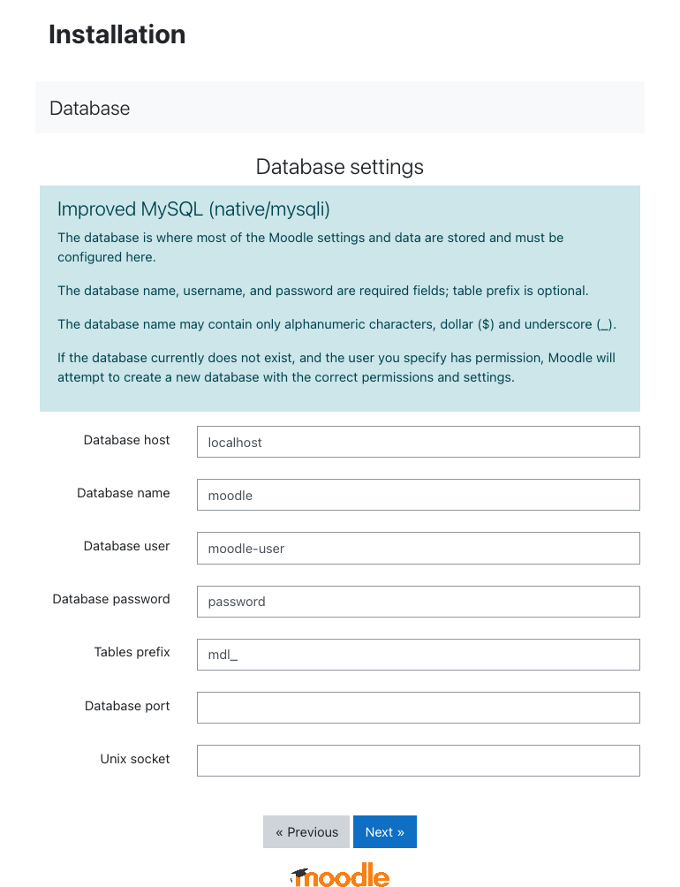
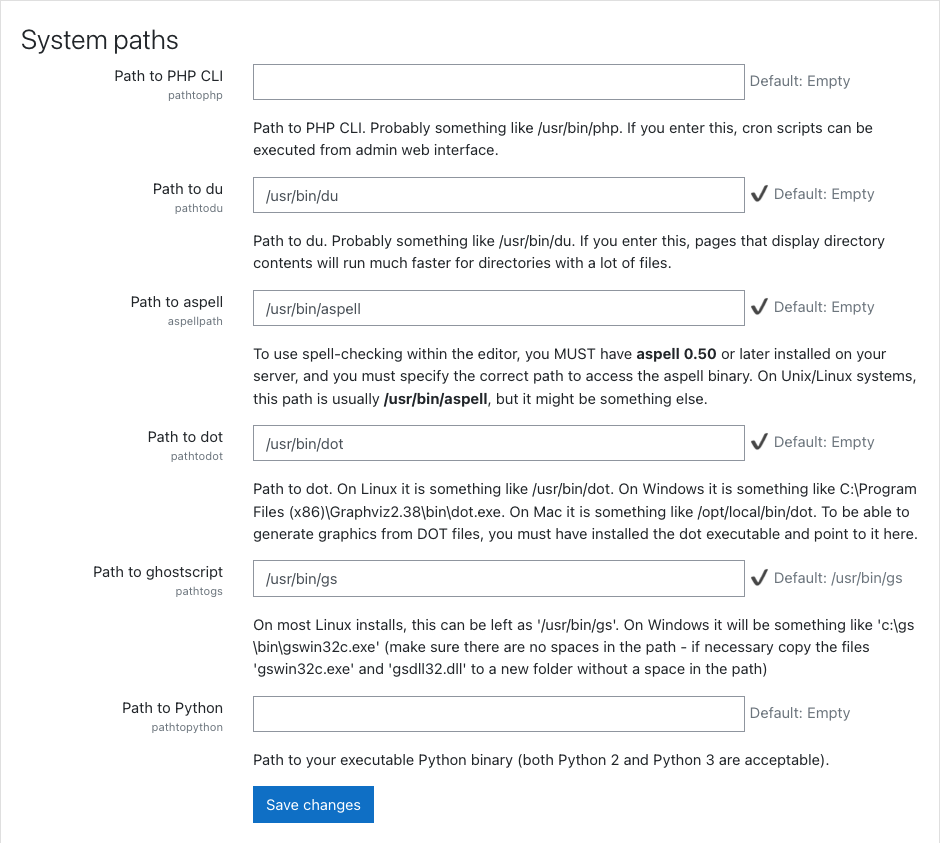

[Moodle](https://moodle.org/) is a popular, free, and open-source Learning Management System (LMS). With Moodle, you can create a fully-featured website for education and training courses, suitable for fully online, hybrid, and in-person classroom experiences. The Moodle platform is highly customizable and takes a modular approach to features, so it is extensible and adaptable to your needs. This guide shows you how to get a Moodle website up and running on an Ubuntu 20.04 server.

## Before You Begin

1.  If you have not already done so, create a Linode account and Compute Instance. See our [Getting Started with Linode](/docs/guides/getting-started/) and [Creating a Compute Instance](/docs/guides/creating-a-compute-instance/) guides.

1.  Follow our [Setting Up and Securing a Compute Instance](/docs/guides/set-up-and-secure/) guide to update your system. You may also wish to set the timezone, configure your hostname, create a limited user account, and harden SSH access.

1. Install and configure a LAMP (Linux, Apache, MySQL, and PHP) stack. Follow the [How to Install a LAMP Stack on Ubuntu 20.04](/docs/guides/how-to-install-a-lamp-stack-on-ubuntu-20-04/) guide for instructions.

    For this guide, you do not need to configure a virtual host for Apache. However, you should follow all other non-optional sections in the guide linked above.


This guide is written for non-root users. Commands that require elevated privileges are prefixed with `sudo`. If you are not familiar with the `sudo` command, see the [Linux Users and Groups](/docs/guides/linux-users-and-groups/) guide.


## Install the Prerequisites

1. Install the prerequisites for Moodle. This includes software and PHP modules that support Moodle's features and Git for installing Moodle and keeping it up to date.

        sudo apt install graphviz aspell ghostscript clamav php7.4-pspell php7.4-curl php7.4-gd php7.4-intl php7.4-mysql php7.4-xml php7.4-xmlrpc php7.4-ldap php7.4-zip php7.4-soap php7.4-mbstring git

1. Restart Apache to load the modules.

        sudo systemctl restart apache2

## Download Moodle

1. Change into the `/opt` directory, clone the Moodle Git repository and change into the resulting `moodle` subdirectory.

        cd /opt
        sudo git clone git://git.moodle.org/moodle.git
        cd moodle

1. Determine the latest stable Moodle release from Moodle's official [list of releases](https://docs.moodle.org/dev/Releases). At the time of writing, the latest stable release is 3.10.

1. The following command lists the branches in the Git repository. From that list, identify the branch associated with the latest stable release. For release 3.10, this is `MOODLE_310_STABLE`.

        sudo git branch -a

1. Track and then check out the branch you identified.

        sudo git branch --track MOODLE_310_STABLE origin/MOODLE_310_STABLE
        sudo git checkout MOODLE_310_STABLE

1. Copy the directory with the Moodle repository into the `/var/www/html` directory. Then, modify the new Moodle directory's permissions to grant read, execute, and write access to any user.

        sudo cp -R /opt/moodle /var/www/html/
        sudo chmod -R 0777 /var/www/html/moodle

    
Write access to this directory is only meant to be granted temporarily. Once the Moodle installation is completed in the steps below, the permissions are modified to restrict write access to the directory owner (the `root` user).
    

1. Create a `/var/moodledata` directory, make `www-data` its owner, and modify its permissions to grant all users read, execute, and write access.

        sudo mkdir /var/moodledata
        sudo chown -R www-data /var/moodledata
        sudo chmod -R 0777 /var/moodledata

## Set Up the MySQL Server

1. Open the MySQL interface as the root user.

        sudo mysql -u root -p

1. Use the following MySQL command to create a database for Moodle.

        CREATE DATABASE moodle DEFAULT CHARACTER SET utf8mb4 COLLATE utf8mb4_unicode_ci;

1. Create a Moodle MySQL user, and give it the required permissions on the Moodle database. In the following example, replace `moodle-user` and `password` with the username and password, respectively, you would like to use for the Moodle MySQL user.

        CREATE USER 'moodle-user'@'localhost' IDENTIFIED BY 'password';
        GRANT SELECT,INSERT,UPDATE,DELETE,CREATE,CREATE TEMPORARY TABLES,DROP,INDEX,ALTER ON moodle.* TO 'moodle-user'@'localhost';

1. Exit the MySQL interface using the `quit` command.

## Complete the Moodle Installation

1. In a web browser, navigate to the Moodle URL, which is your server's domain name followed by `/moodle`. So, if your server's domain name is `example.com`, then the Moodle URL would be `example.com/moodle`.

1. Follow the prompts to complete the Moodle setup. Enter the default options or your preferences for all settings except the following:

    - Enter `/var/moodledata` for **Data directory** when prompted to confirm paths.

      

    - Choose the **Improved MySQL** option when prompted to select a database driver.

      

    - Follow the example in the image below when you are asked to enter database settings. Replace `moodle-user` and `password` with the username and password, respectively, that you used when creating the Moodle MySQL user above:

      

1. Review the release information, ensure that no issues are indicated, and continue. Allow the next page to load fully — it may take some time — and ensure that all of the components listed indicate "Success". Then, continue.

1. Complete the form for creating a Moodle site administrator and, on the next page, complete the form with information about your Moodle site.

1. Return to your server's command line, and modify the Moodle directory's permissions to prevent writing except by the directory owner (the root user):

        sudo chmod -R 0755 /var/www/html/moodle

## Configure the Moodle's System Paths

Configuring the system paths for Moodle, while optional, enhances your Moodle site's performance. The configuration can be done from the Moodle administration interface, using the following steps:

1. Navigate again to your Moodle website (`example.com/moodle`) and select **Site Administration** from the left menu.

1. Click the **Server** tab and select **System paths**.

1. On the form presented, complete the fields as follows:

    - **Path to du**, enter `/usr/bin/du`.

    - **Path to aspell**, enter `/usr/bin/aspell`.

    - **Path to dot**, enter `/usr/bin/dot`.

    

1. Click the **Save changes** button.

## Set Up an SSL Certificate

Although not required, it is recommended that you secure your Moodle site using an SSL certificate. This guide uses [Certbot](https://certbot.eff.org) to create a free certificate from [Let's Encrypt](https://letsencrypt.org).

1. Update the [Snap](https://snapcraft.io/docs/getting-started) app store. Snap provides application bundles that work across major Linux distributions and is installed by default with all Ubuntu releases since 16.04.

        sudo snap install core && sudo snap refresh core

1. Remove any existing Certbot installation.

        sudo apt remove certbot

1. Install Certbot.

        sudo snap install --classic certbot

1. Download a certificate for your site.

        sudo certbot --apache

    Certbot prompts you to enter your site's domain name. Do so to complete the installation of the SSL certificate.

1. Certbot includes a chron job that automatically renews your certificate before it expires. You can test the automatic renewal with the following command:

        sudo certbot renew --dry-run

1. Using your preferred text editor, open the Moodle configuration file, `/var/www/html/moodle/config.php`. Change the `$CFG->wwwroot` value to use `https` instead of `http`. Replace `example.com` in the following example with your site's domain name.

        $CFG->wwwroot = 'https://example.com/moodle';

1. Restart the Apache server.

        sudo systemctl restart apache2

## Next Steps

You are now ready to start using Moodle. To get started, take a look at [Moodle's Admin quick guide](https://docs.moodle.org/310/en/Admin_quick_guide), which shows you how to start customizing the look of your site and how to add users and courses. Then, review the [Teacher quick guide](https://docs.moodle.org/310/en/Teacher_quick_guide) for a walkthrough on how you can manage a course. From there, check out the rest of Moodle's [documentation library](https://docs.moodle.org/310/en/Main_page) for guides on the many ways you can customize your site and for instructions on getting the most out of it.
