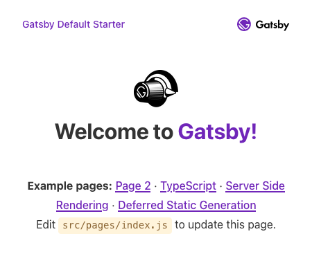
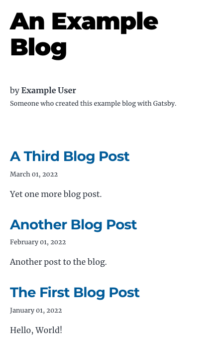

Gatsby is a static-site generator built on React. It has all the performance benefits of static sites, backed by the feature-rich React library. Gatsby additionally supports an array of plugins and templates to further help you develop compelling static sites.

Through this tutorial, learn what Gatsby is and what it has to offer. Follow along to create your first Gatsby website from a template, and then see how you can start customizing that to your needs.

## Before You Begin

1. Familiarize yourself with our [Getting Started with Linode](/docs/getting-started/) guide, and complete the steps for setting your Linode's hostname and timezone.

1. This guide uses `sudo` wherever possible. Complete the sections of our [How to Secure Your Server](/docs/security/securing-your-server/) guide to create a standard user account, harden SSH access, and remove unnecessary network services.

1. Update your system.

    - On Debian and Ubuntu, you can do this with:

            sudo apt update && sudo apt upgrade

    - On AlmaLinux, CentOS (8 or later), or Fedora, use:

            sudo dnf upgrade


This guide is written for a non-root user. Commands that require elevated privileges are prefixed with `sudo`. If you’re not familiar with the `sudo` command, see the [Users and Groups](/docs/tools-reference/linux-users-and-groups/) guide.


## What is Gatsby?

Gatsby is a framework for creating efficient websites. An open-source project built on React, Gatsby puts together static sites with an eye toward performance.

Gatsby can accomplish this in part because it generates static sites. A static site consists only of a frontend, with no server-side computations or database. One of the benefits of generating static sites is that everything is rendered at build time. By avoiding runtime rendering, your website can load quicker and more responsively, while also demanding fewer resources.

Gatsby brings a number of features in particular to static-site generation that set it apart.

Foremost is the fact that Gatsby is built on React, giving developers all of the benefits of working with React. That also makes Gatsby an exceptional choice for developers already familiar with React.

Gatsby also offers compelling options when it comes to developing site content for static sites. Using plugins, developers can enable content management systems (CMSs) like WordPress and Contentful as content sources. Alternatively, Gatsby can process Markdown files for site content.

### Gatsby vs Next.js

Next.js also offers static-site generation options, and it has been considered a comparable tool to Gatsby. So how do the two compare, and why would you choose one over the other?

Gatsby specializes in static sites, and it does not offer much for supporting dynamic content. Gatsby thus offers a simple performance and optimization based around generating static content at build time. This makes Gatsby an excellent framework for working with the kinds of websites that favor static generation. These include blogs, profiles, and other websites that do not require dynamic data fetching.

Gatsby, because of its build-time generation, does not require any server-side code. Everything runs on the client side once the static site has been generated.

Next.js, on the other hand, operates a more flexible model. Next is designed to offer a combination of static generation and server-side rendering. The latter occurs at request time, rather than build time. With this, Next.js offers some of the performance benefits of pre-rendering while accommodating application that need to fetch content dynamically.

Applications built with Next.js, therefore, run at least partially on the server side. Next has to be running on the server side to provide server-side rendering at request time.

Finally, another remarkable difference between the two frameworks is Gatsby's ecosystem of templates and themes. With these, it is typically quicker to put together a working website with Gatsby than with Next.js.

## How to Install Gatsby

1. Follow our tutorial on how to [Install and Use the Node Package Manager (NPM) on Linux](/docs/guides/install-and-use-npm-on-linux/). Gatsby requires Node.js, and this comes along with NPM. Additionally, NPM can be used later for installing Gatsby plugins.

1. Install the Gatsby command-line tool (CLI) as a global NPM package:

        npm install -g gatsby-cli

1. Verify your installation by checking the version of the Gatsby tool installed:

        gatsby --version

    
Gatsby CLI version: 4.24.0
    

1. Ensure that your system has Git installed. Gatsby requires Git to pull starters, even for the default Gatsby template.

    Follow our tutorial on [How to Install Git on Linux](/docs/guides/how-to-install-git-on-linux-mac-and-windows/#how-to-install-git-on-linux) to see how you can check if Git is installed and, if it is not, how you can install it.

## How to Use Gatsby

With the Gatsby CLI installed, the process for setting up a new Gatsby project is straightforward. These next few sections cover doing just that, including applying a starter template. These give you a basis to start your Gatsby project off of, including a wide array of themes and layouts.

Afterward you can find explanations framing each of the main parts of a Gatsby project. Then keep reading to see how to build a customized website out of a template and, finally, how to deploy your website.

### Creating a Gatsby Project

Execute the following command to create a new Gatsby project. This and following examples use `example-app` as the project title. The command creates the project in a subdirectory of that name within your current directory:

    gatsby new example-app

But typically when starting a new Gatsby project, you want to use a starter template. These templates, maintained either officially or by the Gatsby community, have all of the boilerplate for a pre-designed Gatsby website.

Check out Gatsby's [library of starters](https://www.gatsbyjs.com/starters/) to see a collection of starter templates to get started.

This tutorial uses the `gatsby-starter-default`, which is the default starter. Because this is the default starter, you do not need to specify it in your command for creating the Gatsby project.

However, to demonstrate how you can utilize starters when creating a new project, here is what the command would look like. It follows the basic command for creating a new Gatsby project, but adds the address for the starter at the end. These addresses can be found with the starers listed in the library:

    gatsby new example-app https://github.com/gatsbyjs/gatsby-starter-default

#### Running a Development Server

Now you can view the default website that comes with the starter template. Gatsby includes a development server, and while the server is not fit for production, it provides an convenient way preview the static site.

To run the development server, change into the project directory and execute the `gatsby develop` command:

    cd example-app
    gatsby develop

Then, navigate to `localhost` port `8000` in a web browser. To visit the application remotely, you can use an SSH tunnel:

- On Windows, you can use the PuTTY tool to set up your SSH tunnel. Follow our tutorial on [Connecting to a Remote Server Over SSH using PuTTY](/docs/guides/connect-to-server-over-ssh-using-putty/), and use `8000` as the port number.

- On macOS or Linux, use the following command to set up the SSH tunnel. Replace `example-user` with your username on the remote server and `192.0.2.0` with the remote server's IP address:

        ssh -L8000:localhost:8000 example-user@192.0.2.0

You are greeted with the default Gatsby website. Learn more about the structure of a Gatsby static site and about how to make your own in the upcoming sections.

### Understanding the Parts of a Gatsby Project

Within the Gatsby project directory, the primary place for building your website is within the `src` subdirectory. There, the parts of a Gatsby website are laid out much as you might find with a React application.

There are three main parts of a Gatsby website, each of which with its own subdirectory here in the `src` subdirectory.

- **Pages**. JSX files stored here automatically get converted into pages with their own paths, based on the file names. In the default starter, the `page-2.js` file in this subdirectory results in a `/page-2` path. The `index.js` results in the homepage, with a path of `/`.

- **Components**. These render to HTML elements, but each component represents a reusable portion of a page. A navigation bar is an example. Rather than maintaining the code for that piece on every distinct page, you can build the navigation menu as a component. Then it is easily reusable on any page on your website and can be maintained from a central location.

- **Templates**. Page components can be programmatically rendered using templates. These can, for instance, fetch data from other sources and render content programmatically from that data. An example is a page component that reads Markdown content from GraphQL and renders that content as blog posts.

In the default starter, there is also an `images` directory here, which can be used for storing image assets to be used on your static site.

### Developing a Site with Gatsby

To help you understand how to get started working with Gatsby for your own website, this section walks you through customizing a Gatsby project. By the end, you can have a basic blog with your own information, ready for content to be added.

1. Create a new Gatsby project. This one uses the `gatsby-starter-blog` starter template, which includes an excellent set of features for getting started designing a blog.

    For this tutorial, the project is named `example-blog`. Change into the project directory after; the rest of the tutorial assumes you are in this directory:

        gatsby new example-blog https://github.com/gatsbyjs/gatsby-starter-blog
        cd example-blog

1. Open the `gatsby-config.json` file, and modify the metadata to match your needs. Here is an example:

    
// [...]
  siteMetadata: {
    title: `An Example Blog`,
    author: {
      name: `Example User`,
      summary: `Someone who created this example blog with Gatsby.`,
    },
    description: `An example Gatsby blog.`,
    siteUrl: `https://example.com/gatsby-blog`,
  },
// [...]
    

1. Take a look at the `src/pages/index.js` file. This gets rendered into the blog's homepage, so modify it as you need. But keep in mind that much of the information about yourself and your website are source from the metadata adjusted above. For this example, none of the features actually needed to be altered.

    The file is worth a deeper look, along side the `gatsby-node.js` file. Both of these use GraphQL to query for Markdown content stored in the `content/blog` subdirectory. They use the `allMarkdownRemark` plugin, which is capable of pulling frontmatter and other data from these files, as well as parsing the Markdown to HTML.

    
// [...]

export const pageQuery = graphql`
  query {
    site {
      siteMetadata {
        title
      }
    }
    allMarkdownRemark(sort: { fields: [frontmatter___date], order: DESC }) {
      nodes {
        excerpt
        fields {
          slug
        }
        frontmatter {
          date(formatString: "MMMM DD, YYYY")
          title
          description
        }
      }
    }
  }
`
    

1. Similarly look at the `src/components/bio.js`. This tutorial's example has made some modifications to simplify the display:

    
// [...]
  return (
    

      {author?.name && (
        

          by <strong>{author.name}</strong>
        

      )}
      {author?.summary && (
        <small>
          {author.summary}
        </small>
      )}
    

  )
// [...]
    

    To support this, the tutorial also removes the `display: flex` line from the `.bio` section of the CSS file, `style.css`.

1. Finally, create some blog posts. You can see the default posts stored in subdirectories of `content/blog`. Replace these subdirectories with your own, adding an `index.md` file within each for the Markdown content.

    Be sure to add frontmatter for these. The starter supports `title`, `date`, and `description` fields for the front matter by default. You can also adjust this by adjusting the GraphQL queries in the `src/pages/index.js` and `src/templates/blog-post.js` files and in the `graph-node.js` file.

    This starter comes configured to support images from these directories as well, so feel free to add some there to use in your Markdown files.

    For this tutorial, simple blog post files have been added with the following subdirectories. Follow the links to see the file contents used for this example:
    - `first-post`/[index.md](example-blog-content/blog/first-post/index.txt)
    - `second-post`/[index.md](example-blog-content/blog/second-post/index.txt)
    - `third-post`/[index.md](example-blog-content/blog/third-post/index.txt)

Now your custom Gatsby blog is ready to try out. Run the development server using the command below, and access it from your web browser as covered earlier in this tutorial:

    gatsby develop

### Deploying a Gatsby Static Site

When you are ready to deploy your Gatsby website, you can use the `build` command, as in:

    gatsby build

Gatsby renders your website and stores the static files for it in the `public` subdirectory. These are the files you need to copy to the host you plan to use to serve your static site.

You can learn more about that process through our guide on how to [Deploy a Static Site Using Hugo and Object Storage](/docs/guides/host-static-site-object-storage/#upload-your-static-site-to-linode-object-storage), following the section on uploading a static site to Linode Object Storage. Object storage provides an excellent solution for hosting static websites.

Alternatively, take a look at our guides on how to [Set up a Web Server and Host a Website on Linode](/docs/guides/set-up-web-server-host-website/) or, for something more advanced, on how to [Host a Website with High Availability](/docs/guides/host-a-website-with-high-availability/).

## Conclusion

This has covered an introduction to Gatsby for creating static sites. Everything you need to get started is here, from installing Gatsby to creating a project from a starter to customizing the website code.

To keep going, be sure to peruse the [official Gatsby documentation](https://www.gatsbyjs.com/docs/). You may also be interested in our guide on setting up a [CI/CD Pipeline with Gatsby, Netlify, and Travis CI](/docs/guides/install-gatsbyjs/). Doing so can give you an efficient process for managing your Gatsby website.

Have more questions or want some help getting started? Feel free to reach out to our [Support](https://www.linode.com/support/) team.
