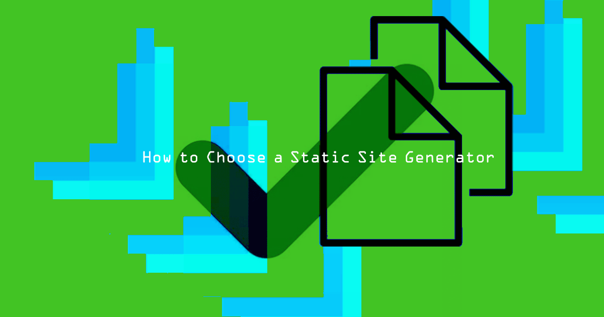

## What is a Static Site?

A static website is made of pre-built pages with content that doesn't change between user visits. Because each page is delivered to the browser the same way every time, static pages are often much faster than pages with dynamic content that rely on the server to process each request for each page load.

A static site generator is an application that converts files (usually stored locally) into webpages. This allows content creators to focus on content, without needing to learn code or stylesheets, and without needing to manage many of the complexities of a backend server.

## Why Choose a Static Site Generator Over a CMS

Content Management Systems (CMS) make it easy to create and manage content through an interactive front-end. They rely on the server to retrieve data from a database with each visit. This allows pages to show dynamic content, but slows the delivery to the end-user, since each page is built as it's requested. Because each page request is sent to the server, and because some major CMS features rely on plugins, system security may be compromised if precautions aren't taken.

A static site generator lets you create content offline in a text editor and preview what the final web page will look like before it is published. When it's time to build the pages, a short command compiles all new and changed pages within seconds.

While a static site generator doesn't need a complex backend and database, it does generally require that the compiled files be moved to a server. This step can be automated, but might require using the command line to set up.

## When to Use a Static Site Generator

Many static site generators have pre-built themes for easy blogging. This allows bloggers to write in a distraction-free environment, while still having the option to format text using Markdown.

Static sites can also be used for documentation. For example, Linode's documentation library is built using [Hugo](https://gohugo.io). Check out the source Markdown file for this guide [on GitHub](https://github.com/linode/docs/blob/master/docs/websites/static-sites/how-to-choose-static-site-generator/index.md) to see what it looks like before Hugo applies our custom theme.

Personal or event websites (portfolios, wedding sites, and campaign pages) are also easy to set up using a static site generator.

Many websites are built using static site generators, including this [list of Jekyll sites](https://github.com/jekyll/jekyll/wiki/Sites), these [Hugo examples](https://gohugo.io/showcase/), and the [Gatsby site showcase](https://www.gatsbyjs.org/showcase/).

## Compare Features

[StaticGen](https://www.staticgen.com/) has an updated list of static site generators. To find the right one for you, consider the following:

* **Tools you build with** - Node / Ruby / Python / Git / Markdown / etc.
* **Themes** - have you found a theme you've fallen in love with?
* **Plugins** - will you be able to connect it to that thing you need?
* **Language** - is the generator available in your language?
* **Project activity** - is the generator still in active development?

Since static site generators are easy to set up, it's worth installing a few and creating test pages to see which works best for your workflow.

## Static Site Generator Comparison

* [**Jekyll**](https://jekyllrb.com/): Touts itself as "blog aware," meaning it was made to make blogging easy. Jekyll was built by GitHub and is consistently one of the most popular static site generators. The larger community means a great library of available themes, plugins, and available answers. [GitHub pages](https://help.github.com/articles/using-jekyll-as-a-static-site-generator-with-github-pages/) can be configured to automatically build and host a GitHub repository using Jekyll. Jekyll [installs via RubyGems](https://jekyllrb.com/docs/installation/) and uses [Liquid](https://shopify.github.io/liquid/) for templating.
* [**Hugo**](https://gohugo.io/): Builds pages quickly. Hugo has a built-in [LiveReload](https://gohugo.io/getting-started/usage/#livereload), so you can see your changes in a browser as soon as changes to a tracked file are saved. Hugo is written in [Go](https://golang.org/) and uses Go templating. It also uses [shortcodes](https://gohugo.io/content-management/shortcodes/) to easily extend the types of content that can be included in a page. [Hugo can be installed](https://gohugo.io/getting-started/installing/) through a package manager or by downloading a binary.
* [**Hexo**](https://hexo.io/): Focuses on speed and simplicity, and is still flexible enough to use both Jekyll and [Octopress](http://octopress.org/) plugins. One command can deploy a site to your Linode using [Dokku](/docs/guides/deploy-a-flask-application-with-dokku/) or [SFTP](https://hexo.io/docs/deployment.html). Hexo uses Node.js under the hood, and can be installed with [NPM](https://www.npmjs.com/).
* [**Gatsby**](https://www.gatsbyjs.org/): Gatsby is quickly moving up the list of popular static site generators. Pages are built quickly using React.js, and are created in a way that speeds loads times as well. Gatsby includes hot reloading, and changes are shown in the browser instantly. Because it uses React heavily, some familiarity with JavaScript and React components is helpful when creating a site with Gatsby. [Install Gatsby](https://www.gatsbyjs.org/docs/) using NPM.
* [**GitBook**](https://www.gitbook.com): Built around Git, GitBook aims to make many of the features that make Git useful (branches, pull requests, version tracking) accessible to users more familiar with traditional desktop publishing. GitBook is commonly used for technical/API documentation, user manuals, or knowledge bases, and has built-in templates for these and other types of content.

## How to Use a Static Site Generator

1.  Choose a static site generator and follow the installation instructions on its site.
2.  Install a theme with features that most closely resemble your needs. Remember that you can customize almost any aspect.
3.  Edit and save a few sample pages in a text editor like [Atom](https://atom.io), [Sublime](https://www.sublimetext.com/), or [Neovim](https://neovim.io/).
    * Note that each generator requires different meta information. Refer to the official documentation to learn more about available features.
4.  Preview your pages if available.
5.  Instruct your static site generator to build the site.
6.  Move the newly built or updated pages to your [web server](/docs/web-servers/).

## Use a CMS Front-End

To make static site content management even easier, check out [HeadlessCMS](https://headlesscms.org/) for a selection of CMS systems for your static site generator. A front-end serves as an intermediary between your content and the site. It allows you to create and edit in a familiar and easy to use environment, and then automates the command line functions.

While convenient, using a front-end gives up some control and adds more moving parts (and potential points of failure) to what should be a simple system.

## Add Interactive Elements

A static site doesn't have to mean a read-only user experience. There are limits to what a static site can incorporate, and if your site relies heavily on user interaction you may want to consider a different solution. However, most of the interactive features commonly used in blogs and personal websites can be easily included through the use of third-party extensions.

You can add:

* [Disqus](https://help.disqus.com/customer/portal/articles/472097-universal-embed-code) comments,
* [Snipcart](https://snipcart.com/blog/static-site-e-commerce-part-2-integrating-snipcart-with-jekyll) or [GoCommerce](https://github.com/netlify/gocommerce) for eCommerce,
* [MailChimp](https://kb.mailchimp.com/lists/signup-forms/add-a-signup-form-to-your-website) for email lists, or even
* Your own email form using [Zapier](https://www.harrycresswell.com/articles/form-data-with-zapier/).
