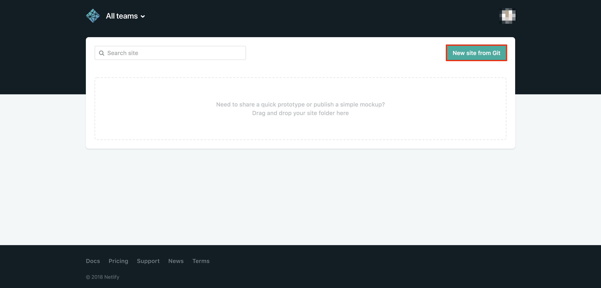
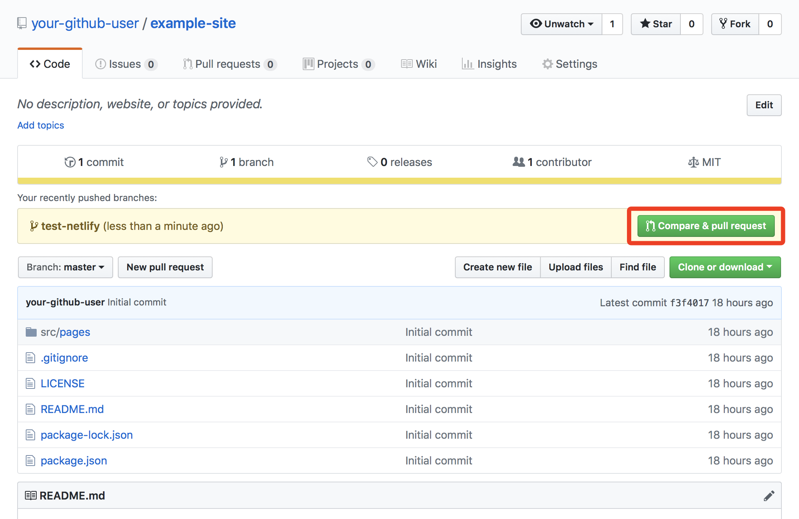
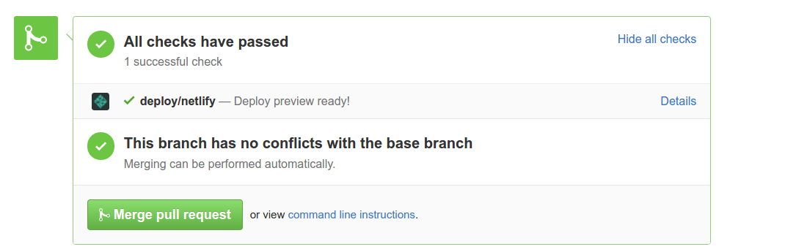
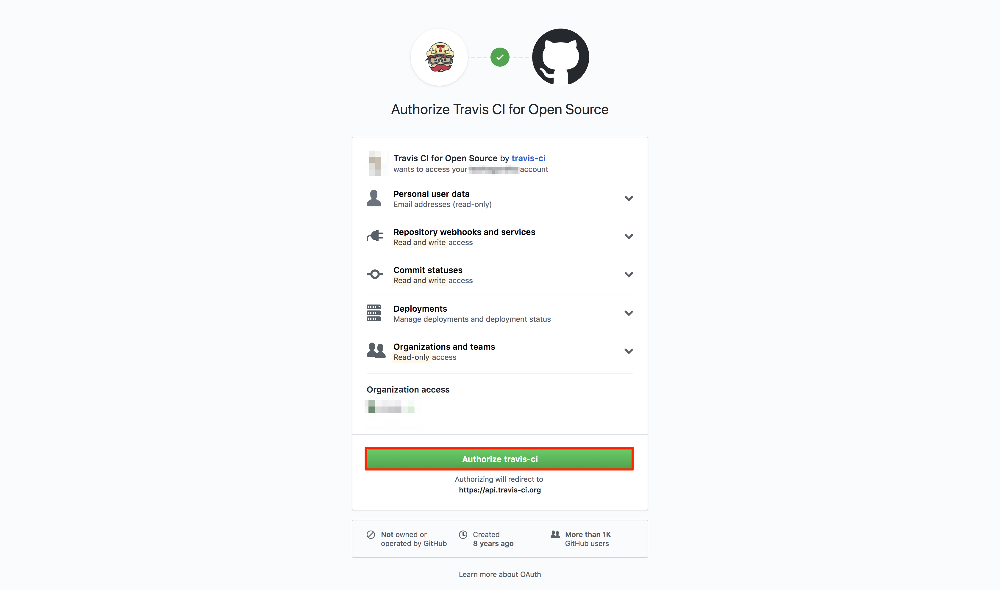
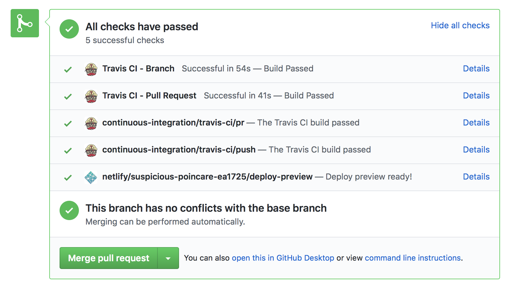
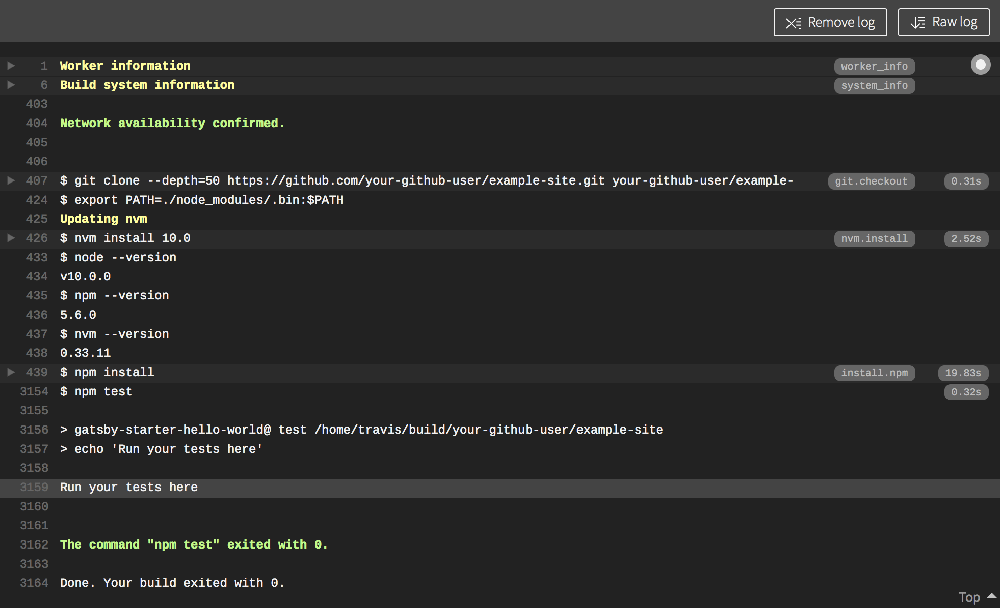
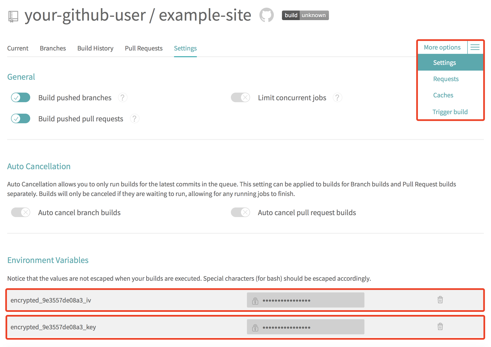

## What is Gatsby?

Gatsby is a [Static Site Generator](/docs/websites/static-sites/how-to-choose-static-site-generator/#what-is-a-static-site) for React built on Node.js. Gatsby uses a modern web technology stack based on client-side Javascript, reusable APIs, and prebuilt Markdown, otherwise known as the [*JAMstack*](https://jamstack.org/). This method of building a site is fast, secure, and scalable. All production site pages are prebuilt and static, so Gatsby does not have to build HTML for each page request.

## What is the CI/CD Pipeline?

The CI/CD (continuous integration/continuous delivery) pipeline created in this guide is an automated sequence of events that is initiated after you update the code for your website on your local computer. These events take care of the work that you would otherwise need to perform manually: previewing your in-development site, testing your new code, and deploying it to your production server. These actions are powered by GitHub, Netlify, and Travis CI.


This guide uses GitHub as your central Git repository, but you can use any service that is compatible with Netlify and Travis.


### Netlify

[Netlify](https://www.netlify.com/) is a PaaS (Platform as a Service) provider that allows you to quickly deploy static sites on the Netlify platform. In this guide Netlify will be used to provide a preview of your Gatsby site while it is in development. This preview can be shared with different stakeholders for site change approvals, or with anyone that is interested in your project. The production version of your website will ultimately be deployed to a Linode, so Netlify will only be used to preview development of the site.

### Travis CI

[Travis CI](https://travis-ci.com/) is a continuous integration tool that tests and deploys the code you upload to your GitHub repository. Travis will be used in this guide to deploy your Gatsby site to a Linode running Ubuntu 18.04. Testing your website code will not be explored in depth, but the method for integrating unit tests will be introduced.

### The CI/CD Pipeline Sequence

This guide sets up the following flow of events:

1.  You create a new branch in your local Git repository and make code changes to your Gatsby project.

1.  You push your branch to your GitHub repository and create a [pull request](https://help.github.com/articles/about-pull-requests/).

1.  Netlify automatically creates a preview of the site with a unique URL that can be shared.

1.  Travis CI automatically builds the site in an isolated container and runs any declared tests.

1.  When all tests pass, you merge the PR into the repository's *master* branch, which automatically triggers a deployment to your production Linode.

## Before You Begin

1.  Follow the [Creating a Compute Instance](/docs/guides/creating-a-compute-instance/) guide and deploy a Linode running Ubuntu 18.04.

1.  Complete the [Setting Up and Securing a Compute Instance](/docs/guides/set-up-and-secure/) guide to create a limited Linux user account with `sudo` privileges, harden SSH access, and remove unnecessary network services.

    

1.  Configure DNS for your site by adding a [domain zone](/docs/guides/dns-manager/#add-a-domain) and setting up [reverse DNS](/docs/guides/configure-your-linode-for-reverse-dns/) on your Linode's IP.

1.  Create a [GitHub](https://github.com/) account if you don't already have one. GitHub is free for open source projects.

1.  [Install Git](/docs/guides/how-to-install-git-on-linux-mac-and-windows/) on your local computer. Later in this guide, [Homebrew](/docs/guides/how-to-install-git-on-linux-mac-and-windows/#install-git-via-homebrew) will be used to install Gatsby on a Mac, so it's recommended that you also use Homebrew to install Git if you're using a Mac.

## Prepare Your Production Linode

### Install NGINX

1.  Install NGINX from Ubuntu's repository **on your Linode:**

        sudo apt install nginx

### Configure NGINX

1.   Delete the default welcome page:

        sudo rm /etc/nginx/sites-enabled/default

1.   Create a site configuration file for Gatsby. Replace `example.com` in the file name and in the file's contents with your domain name:

    
server {
    listen       80;
    server_name  example.com;
    #charset koi8-r;
    #access_log  /var/log/nginx/host.access.log  main;

    location / {
        root   /usr/share/nginx/html/example.com/public;
        index  index.html index.htm;
    }
}


    
Replace all future instances of `example.com` in this guide with your domain name.


1.  The `root` directive in your NGINX configuration points to a directory named `public` within `/usr/share/nginx/html/example.com/`. Later in this guide, Gatsby will be responsible for creating the `public` directory and building its static content within it (specifically, via the `gatsby build` command).

    The `/usr/share/nginx/html/example.com/` directory does not exist on your server yet, so create it:

        sudo mkdir -p /usr/share/nginx/html/example.com/

1.  The Gatsby deployment script that will be introduced later in this guide will run under your limited Linux user. Set your limited user to be the owner of the new document root directory. This ensures the deployment script will be able write your site's files to it:

        sudo chown $(whoami):$(id -gn) -R /usr/share/nginx/html/example.com/

1.  Test your NGINX configuration for errors:

        sudo nginx -t

1.  Reload the configuration:

        sudo nginx -s reload

1.  Navigate to your Linode’s domain or IP address in a browser. Your Gatsby site files aren't deployed yet, so you should only see a *404 Not Found* error. Still, this error indicates that your NGINX process is running as expected.

## Develop with Gatsby on Your Local Computer

You will develop with Gatsby on your local computer. This guide walks through creating a simple sample Gatsby website, but more extensive website development is not explored, so review Gatsby's [official documentation](https://www.gatsbyjs.org/docs/) afterwards for more information on the subject.

### Install Gatsby

This section provides instructions for installing Gatsby via Node.js and the Node Package Manager (npm) on Mac and Linux computers. If you are using a Windows PC, read Gatsby's [official documentation](https://www.gatsbyjs.org/docs/gatsby-on-windows/) for installation instructions.

1.  Install npm **on your local computer.** If you are running Ubuntu or Debian on your computer, use `apt`:

        sudo apt install nodejs npm

    If you have a Mac, use Homebrew:

        brew install nodejs npm

1.  Ensure Node.js was installed by checking its version:

        node --version

1.  Install the Gatsby command line:

        sudo npm install --global gatsby-cli

### Create a Gatsby Site

1.  Gatsby uses [*starters*](https://www.gatsbyjs.org/docs/gatsby-starters/#gatsby-starters) to provide a pre-configured base Gatsby site that you can customize and build on top of. This guide uses the *Hello World* starter. On your local computer, install the Hello World starter in your home directory (using the name `example-site` for your new project) and navigate into it:

        gatsby new example-site https://github.com/gatsbyjs/gatsby-starter-hello-world
        cd ~/example-site

1.  Inspect the contents of the directory:

        ls

    You should see output similar to:

    
LICENSE  node_modules  package.json  package-lock.json  README.md  src


    The `src` directory contains your project's source files. This starter will include the [React](https://reactjs.org/) Javascript component file `src/pages/index.js`, which will be mapped to our example site's homepage.

    Gatsby uses *React components* to build your site's static pages. Components are small and isolated pieces of code, and Gatsby stores them in the `src/pages` directory. When your Gatsby site is built, these will automatically become your site's pages, with paths based on each file's name.

1.  Gatsby offers a built-in development server which builds and serves your Gatsby site. This server will also monitor any changes made to your `src` directory's React components and will rebuild Gatsby after every change, which helps you see your local changes as you make them.

    Open a new shell session (in addition the one you already have open) and run the Gatsby development server:

        cd ~/example-site
        gatsby develop

1.  The `gatsby develop` command will display messages from the build process, including a section similar to the following:

    
You can now view gatsby-starter-hello-world in the browser.

    http://localhost:8000/


    Copy and paste the `http://localhost:8000/` URL (or the specific string displayed in your terminal) into your web browser to view your Gatsby site. You should see a page that displays "Hello World".

1.  In your original shell session, view the contents of your `example-site` directory again:

        ls

    
    LICENSE  node_modules  package.json  package-lock.json  README.md  src  public
    

    You should now see a `public` directory which was not present before. This directory holds the static files built by Gatsby. Your NGINX server will serve the static files located in the `public` directory.

1.  Open the `src/pages/index.js` file in your text editor, add new text between the `
` tags, and save your change:

    
import React from "react"

export default () => 
Hello world and universe!



1.   Navigate back to your browser window, where the updated text should automatically appear on the page.

### Version Control Your Gatsby Project

In the workflow explored by this guide, Git and GitHub are used to:

-   Track changes you make during your site's development.
-   Trigger the preview, test, and deployment functions offered by Netlify and Travis.

The following steps present how to initialize a new local Git repository for your Gatsby project, and how to connect it to a central GitHub repository.

1.  Open a shell session on your local computer and navigate to the `example-site` directory. Initialize a Git repository to begin tracking your project files:

        git init

    Stage all the files you've created so far for your first commit:

        git add -A

    The Hello World starter includes a [`.gitignore` file](https://git-scm.com/docs/gitignore). Your `.gitignore` designates which files and directories to ignore in your Git commits. By default, it is set to ignore any files in the `public` directory. The `public` directory's files will not be tracked in this repository, as they can be quickly rebuilt by anyone who clones your repository.

1.  Commit all the Hello World starter files:

        git commit -m "Initial commit"

1.  Navigate to your GitHub account and create a new repository named `example-site`. After the repository is created, copy its URL, which will have the form `https://github.com/your-github-username/example-site.git`.

1.  In your local computer's shell session, [add the GitHub repository](https://help.github.com/articles/about-remote-repositories/) as your local repository's `origin`:

        git remote add origin https://github.com/your-github-username/example-site.git

1.  Verify the `origin` remote's location:

        git remote -v

    
origin	https://github.com/your-github-username/example-site.git (fetch)
origin	https://github.com/your-github-username/example-site.git (push)


1.  Push the *master* branch of your local repository to the origin repository:

        git push origin master

1.  View your GitHub account in your browser, navigate to the `example-site` repository, and verify that all the files have been pushed to it successfully:

    

## Preview Your Site with Netlify

In the course of developing a website (or any other software project), a common practice when you've finished a new feature and would like to share it with your collaborators is to create a [pull request](https://help.github.com/articles/about-pull-requests/) (also referred to as a *PR*). A pull request is an intermediate step between uploading your work to GitHub (by pushing the changes to a new branch) and later merging it into the *master* branch (or another release or development branch, according to your specific Git workflow).

Once connected to your GitHub account, the Netlify service can build a site preview from your PR's code every time you create a PR. Netlify will also regenerate your site preview if you commit and push new updates to your PR's branch while the PR is still open. A random, unique URL is assigned to every preview, and you can share these URLs with your collaborators.

### Connect Your GitHub Repository to Netlify

1.  Navigate to the [Netlify](https://www.netlify.com/) site and click on the **Sign Up** link:

    

1.  Click on the **GitHub** button to connect your GitHub account with Netlify. If you used a different version control service, select that option instead:

    

1.  You will be taken to the GitHub site and asked to authorize Netlify to access your account. Click on the **Authorize Netlify** button:

    

1.  Add your new site to Netlify and continue along with the prompts to finish connecting your repository to Netlify. Be sure to select the GitHub repository created in the previous steps:

    

1.  Provide the desired deploy settings for your repository. Unless you are sure you need to change these settings, keep the Netlify defaults:

    

    
You can add a `netlify.toml` [configuration file](https://www.netlify.com/docs/netlify-toml-reference/) to your Git repository to define more deployment settings.


### Create a Pull Request

1.  In your local Git repository, create a new branch to test Netlify:

        git checkout -b test-netlify

1.  On your computer, edit your `src/pages/index.js` and update the message displayed:

    
import React from "react"

export default () => 
Hello world, universe, and multiverse!



1.  Commit those changes:

        git add .
        git commit -m "Testing Netlify"

1.  Push the new branch to the origin repository:

        git push origin test-netlify

1.  Navigate to the `example-site` repository in your GitHub account and create a [pull request](https://help.github.com/articles/creating-a-pull-request/) with the `test-netlify` branch:

    

1.  After you create the pull request, you will see a **deploy/netlify** row with a **Details** link. The accent color for this row will initially be yellow while the Netlify preview is being built. When the preview's build process is finished, this row will turn green. At that point, you can click on the **Details** link to view your Gatsby site's preview.

    

    Every time you push changes to your branch, Netlify will provide a new preview link.

## Test and Deploy Your Site with Travis CI

Travis CI manages testing your Gatsby site and deploying it to the Linode production server. Travis does this by monitoring updates to your GitHub repository:

-   Travis's tests will run when a pull request is created, whenever new commits are pushed to that pull request's branch, and whenever a branch is updated on your GitHub repository in general (including outside the context of a pull request).

-   Travis's deployment function will trigger whenever a pull request has been merged into the *master* branch (and optionally when merging into other branches, depending on your configuration).

### Connect Your GitHub Repository to Travis CI

1.  Navigate to the [Travis CI](https://travis-ci.com/) site and click on the *Sign up with GitHub* button.

    
Be sure to visit [travis-ci.com](https://travis-ci.com/), not [travis-ci.org](https://travis-ci.org/). Travis originally operated travis-ci.com for paid/private repositories, and travis-ci.org was run separately for free/open source projects. [As of May 2018](https://blog.travis-ci.com/2018-05-02-open-source-projects-on-travis-ci-com-with-github-apps), travis-ci.com supports open source projects and should be used for all new projects. Projects on travis-ci.org will eventually be migrated to travis-ci.com.


1.  You will be redirected to your GitHub account. Authorize Travis CI to access your GitHub account:

    

1.  You will be redirected to your Travis CI account's page where you will be able to see a listing of all your public repositories. Click on the toggle button next to your Gatsby repository to activate Travis CI for it.

### Configure Travis CI to Run Tests

Travis's functions are all configured by adding and editing a [`.travis.yml` file](https://docs.travis-ci.com/user/customizing-the-build/) in the root of your project. When `.travis.yml` is present in your project and you push a commit to your central GitHub respository, Travis performs one or more *builds*.

Travis builds are run in new virtualized environments created for each build. The build lifecycle is primarily composed of an `install` step and a `script` step. [The `install` step](https://docs.travis-ci.com/user/customizing-the-build/#customizing-the-installation-step) is responsible for installing your project's dependencies in the new virtual environment. [The `script` step](https://docs.travis-ci.com/user/customizing-the-build/#customizing-the-build-step) invokes one or more bash scripts that you specify, usually test scripts of some kind.

1.  Navigate to your local Gatsby project and create a new Git branch to keep track of your Travis configurations:

        git checkout -b travis-configs

1.  Create your `.travis.yml` file at the root of the project:

        touch .travis.yml

    
Make sure you commit changes at logical intervals as you modify the files in your Git repository.


1.  Open your `.travis.yml` file in a text editor and add the following lines:

    
language: node_js
node_js:
  - '10.0'

dist: trusty
sudo: false


    This configuration specifies that the build's virtual environment should be Ubuntu 14.04 ([also known as *trusty*](https://wiki.ubuntu.com/Releases)). `sudo: false` indicates that the virtual environment should be a container, and not a full virtual machine. [Other environments](https://docs.travis-ci.com/user/reference/overview/) are available.

    Gatsby is built with Node.js, so the Travis configuration is set to use `node_js` as the build language, and to use the latest version of Node (`10.0` at the time of this guide's publication). When Node is specified as the build language, Travis automatically sets default values for the `install` and `script` steps: `install` will run `npm install`, and `script` will run `npm test`. [Other languages](https://docs.travis-ci.com/user/languages/), like Python, are also available.

1.  The Gatsby Hello World starter provides a [`package.json` file](https://docs.npmjs.com/files/package.json), which is a collection of metadata that describes your project. It is used by npm to install, run, and test your project. In particular, it includes a `dependencies` section used by `npm install`, and a `scripts` section where you can declare the tests run by `npm test`.

    No tests are listed by default in your starter's `package.json`, so open the file with your editor and add a `test` line to the `scripts` section:

    
{
  "name": "gatsby-starter-hello-world",
  "description": "Gatsby hello world starter",
  "license": "MIT",
  "scripts": {
    "develop": "gatsby develop",
    "build": "gatsby build",
    "serve": "gatsby serve",
    "test": "echo 'Run your tests here'"
  },
  "dependencies": {
    "gatsby": "^1.9.277",
    "gatsby-link": "^1.6.46"
  }
}


    This entry is just a stub to illustrate where tests are declared. For more information on how to test your Gatsby project, review the [unit testing documentation](https://gatsbyjs.org/docs/unit-testing/) on Gatsby's website. [Jest](https://jestjs.io) is the testing framework recommended by Gatsby.

### View Output from Your Travis Build

1.  Commit the changes you've made and push your `travis-configs` branch to your origin repository:

        git add .
        git commit -m "Travis testing configuration"
        git push origin travis-configs

1.  View your GitHub repository in your browser and create a pull request for the `travis-configs` branch.

1.  Several rows that link to your Travis builds will appear in your new pull request. When a build finishes running without error, the build's accent color will turn green:

    

    
Four rows for your Travis builds will appear, which is more than you may expect. This is because Travis runs your builds whenever your branch is updated, and whenever your pull request is updated, and [Travis considers these to be separate events](https://docs.travis-ci.com/user/pull-requests/#double-builds-on-pull-requests).

In addition, the rows prefixed by `Travis CI - ` are links to GitHub's preview of those builds, while rows prefixed with `continuous-integration/travis-ci/` are direct links to the builds on [travis-ci.com](https://travis-ci.com/).

For now, these builds will produce identical output. After the deployment functions of Travis have been configured, the pull request builds will [skip the deployment step](https://docs.travis-ci.com/user/deployment#pull-requests), while the branch builds will implement your deployment configuration.


1.  Click the **Details** link in the `continuous-integration/travis-ci/push` row to visit the logs for that build. A page with similar output will appear:

    

    Towards the end of your output, you should see the "Run your tests here" message from the test stub that you entered in your `package.json`. If you implement testing of your code with Jest or another library, the output from those tests will appear at this location in your build logs.

    If any of the commands that Travis CI runs in the `script` step (or in any preceding steps, like `install`) returns with a [non-zero exit code](https://www.gnu.org/software/bash/manual/html_node/Exit-Status.html), then [the build will fail](https://docs.travis-ci.com/user/customizing-the-build/#breaking-the-build), and you will not be able to merge your pull request on GitHub.

1.  For now, do not merge your pull request, even if the builds were successful.

### Give Travis Permission to Deploy to Your Linode

In order to let Travis push your code to your production Linode, you first need to give the Travis build environment access to the Linode. This will be accomplished by generating a [public-private key pair](/docs/guides/use-public-key-authentication-with-ssh/) for your build environment and then uploading the public key to your Linode. Your code will be deployed over SSH, and the SSH agent in the build environment will be configured to use your new private key.

The private key will also need to be encrypted, as the key file will live in your Gatsby project's Git repository, and you should **never** check a plain-text version of it into version control.

1.  Install the Travis CLI, which you will need to generate an encrypted version of your private key. The Travis CLI is distributed as a [Ruby gem](https://rubygems.org/gems/travis):

    **On Linux:**

        sudo apt install ruby ruby-dev
        sudo gem install travis

    **On macOS:**

        sudo gem install travis

    **On Windows:** Use [RubyInstaller](https://rubyinstaller.org) to install Ruby and the Travis CLI gem.

1.  [Log in to Travis CI](https://github.com/travis-ci/travis.rb#login) with the CLI:

        travis login --com

    Follow the prompts to provide your GitHub login credentials. These credentials are passed directly to GitHub and are not recorded by Travis. In exchange, GitHub returns a GitHub access token to Travis, after which Travis will provide your CLI with a Travis access token.

    
[The `--com` argument](https://github.com/travis-ci/travis.rb#general-api-commands) tells your CLI to log in to [travis-ci.com](https://travis-ci.com/) (instead of [travis-ci.org](https://travis-ci.org/)).


1.  Inside the root of your local `example-site` Git repository, create a `scripts` directory. This will hold files related to deploying your Gatsby site:

        mkdir scripts

1.  Generate a pair of SSH keys inside the `scripts` directory. The key pair will be named *gatsby-deploy* so that you don't accidentally overwrite any preexisting key pairs. Replace `your_email@example.com` with your email address. When prompted for the key pair's passphrase, enter no passphrase/leave the field empty:

        ssh-keygen -t rsa -b 4096 -C "your_email@example.com" -f scripts/gatsby-deploy

    Two files will be created: `gatsby-deploy` (your private key) and `gatsby-deploy.pub` (your public key).

1.  Add the location of the `gatsby-deploy` file to your project's `.gitignore` file. **This will ensure that you do not accidentally commit the secret key to your central repository:**

    
# Other .gitignore instructions
# [...]
scripts/gatsby-deploy


1.  Encrypt your private key using the Travis CLI:

        cd scripts && travis encrypt-file gatsby-deploy --add --com

1.  You should now see a `gatsby-deploy.enc` file in your scripts directory:

        ls

    
    gatsby-deploy		gatsby-deploy.enc	gatsby-deploy.pub


1.  The `--add` flag from the previous command also told the Travis CLI to add a few new lines to your `.travis.yml` file. These lines decrypt your private key and should look similar to the following snippet:

    
before_install:
- openssl aes-256-cbc -K $encrypted_9e3557de08a3_key -iv $encrypted_9e3557de08a3_iv
  -in gatsby-deploy.enc -out gatsby-deploy -d


    
The second line (starting with `-in gatsby-deploy.enc`) is a continuation of the first line, and `-in` is an option passed to the `openssl` command. This line is not its own item in the `before_install` list.

The `openssl` command accepts the encrypted `gatsby-deploy.enc` file and uses two environment variables to decrypt it, resulting in your original `gatsby-deploy` private key. These two variables are stored in the Settings page for your repository on travis-ci.com. [Any variables stored there](https://docs.travis-ci.com/user/environment-variables/#defining-variables-in-repository-settings) will be accessible to your build environment:



1.  Edit the lines previously added by the `travis encrypt-file` command so that `gatsby-deploy.enc` and `gatsby-deploy` are prefixed with your `scripts/` directory:

    
before_install:
- openssl aes-256-cbc -K $encrypted_9e3557de08a3_key -iv $encrypted_9e3557de08a3_iv
  -in scripts/gatsby-deploy.enc -out scripts/gatsby-deploy -d


1.  Continue preparing the SSH agent in your build environment by adding the following lines to the `before_install` step, after the `openssl` command. Be sure to replace `192.0.2.2` with your Linode's IP address:

    
before_install:
- openssl aes-256-cbc -K $encrypted_9e3557de08a3_key -iv $encrypted_9e3557de08a3_iv
  -in scripts/gatsby-deploy.enc -out scripts/gatsby-deploy -d
- eval "$(ssh-agent -s)"
- cp scripts/gatsby-deploy ~/.ssh/gatsby-deploy
- chmod 600 ~/.ssh/gatsby-deploy
- ssh-add ~/.ssh/gatsby-deploy
- echo -e "Host 192.0.2.2\n\tStrictHostKeyChecking no\n" >> ~/.ssh/config


1.  Travis CI can add entries to the build environment's `~/.ssh/known_hosts` prior to deploying your site. Insert the following `addons` step prior to the `before_install` step in your `.travis.yml`. Replace `192.0.2.2` with your Linode's IP address:

    
# [...]
dist: trusty
sudo: false

addons:
  ssh_known_hosts:
    - 192.0.2.2

before_install:
# [...]


1.  From your local computer, upload your Travis environment's public key to the home directory of your limited Linux user on your Linode. Replace `example_user` with your Linode's user and `192.0.2.2` with your Linode's IP address:

        scp ~/example-site/scripts/gatsby-deploy.pub example_user@192.0.2.2:~/gatsby-deploy.pub

1.  Log in to your Linode (using the same user that the key was uploaded to) and copy the key into your `authorized_keys` file:

        mkdir -p .ssh
        cat gatsby-deploy.pub | tee -a .ssh/authorized_keys

### Create a Deployment Script

1.  Update your `.travis.yml` to include a `deploy` step. This section will be executed when a pull request is merged into the *master* branch. Add the following lines below the `before_install` step, at the end of the file:

    
deploy:
- provider: script
  skip_cleanup: true
  script: bash scripts/deploy.sh
  on:
    branch: master


    The instructions for pushing your site to your Linode will be defined in a `deploy.sh` script that you will create.

    

The complete and final version of your `.travis.yml` file should resemble the following:


language: node_js
node_js:
- "10.0"

dist: trusty
sudo: false

addons:
  ssh_known_hosts:
  - 192.0.2.2

before_install:
- openssl aes-256-cbc -K $encrypted_07d52615a665_key -iv $encrypted_07d52615a665_iv
  -in scripts/gatsby-deploy.enc -out scripts/gatsby-deploy -d
- eval "$(ssh-agent -s)"
- cp scripts/gatsby-deploy ~/.ssh/gatsby-deploy
- chmod 600 ~/.ssh/gatsby-deploy
- ssh-add ~/.ssh/gatsby-deploy
- echo -e "Host 192.0.2.2\n\tStrictHostKeyChecking no\n" >> ~/.ssh/config

deploy:
- provider: script
  skip_cleanup: true
  script: bash scripts/deploy.sh
  on:
    branch: master




1.  From your local `example-site` Git repository, create a `deploy.sh` file in the `scripts` directory and make it executable:

        touch scripts/deploy.sh
        chmod +x scripts/deploy.sh

1.  Open your `deploy.sh` file in your text editor and add the following lines. Replace all instances of `example_user` with your Linode's user, and replace `192.0.2.2` with your Linode's IP:

    
#!/bin/bash
set -x

gatsby build

# Configure Git to only push the current branch
git config --global push.default simple

# Remove .gitignore and replace with the production version
rm -f .gitignore
cp scripts/prodignore .gitignore
cat .gitignore

# Add the Linode production server as a remote repository
git remote add production ssh://example_user@192.0.2.2:/home/example_user/gatsbybare.git

# Add and commit all the static files generated by the Gatsby build
git add . && git commit -m "Gatsby build"

# Push all changes to the Linode production server
git push -f production HEAD:refs/heads/master


    The deploy script builds the Gatsby static files (which are placed inside the `public` directory inside your repository) and pushes them to your Linode. Specifically, this script:

    -   Commits the newly-built `public` directory to the Travis build environment's copy of your Git repository.
    -   Pushes that commit (over the SSH protocol) to a remote repository on your Linode, which you will create in the next section of this guide.

    
Remember that because these instructions are executed in an isolated virtual environment, the `git commit` that is run here does not affect the repository on your local computer or on GitHub.


1.  You may recall that you previously updated your `.gitignore` file to exclude the `public` directory. To allow this directory to be committed in your build environment's repository (and therefore pushed to your Linode), you will need to override that rule at deploy time.

    From the root of your local Gatsby project, copy your `.gitignore` to a new `scripts/prodignore` file:

        cp .gitignore scripts/prodignore

    Open your new `prodignore` file, remove the `public` line, and save the change:

    
.cache/
public # Remove this line
yarn-error.log


    The `deploy.sh` script you created includes a line that will copy this `scripts/prodignore` file into your repository's root `.gitgnore`, which will then allow the script to commit the `public` directory.

### Prepare the Remote Git Repository on Your Linode

In the previous section you completed the configuration for the Travis deployment step. In this section, you will prepare the Linode to receive Git pushes from your deployment script. The pushed website files will then be served by your NGINX web server.

1.  SSH into your Linode (under the same the user that holds your Travis build environment's public key). Create a new directory inside your home folder named `gatsbybare.git`:

        mkdir ~/gatsbybare.git

1.  Navigate to the new directory and initialize it as a *bare* Git repository:

        cd ~/gatsbybare.git
        git init --bare

    [A bare Git repository](https://git-scm.com/book/en/v2/Git-on-the-Server-Getting-Git-on-a-Server) stores Git objects and does not maintain working copies (i.e. file changes that haven't been committed) in the directory. Bare repositories provide a centralized place where users can push their changes. GitHub is an example of a bare Git repository. The common practice for naming a bare Git repository is to end the name with the `.git` extension.

1.  Configure the Git directory to allow linking two repositories together:

        git config receive.denyCurrentBranch updateInstead

1.  Your Travis build environment will now be able to push files into your Linode's Git repository, but the files will not be located in your NGINX document root. To fix this, you will use the [*hooks* feature](https://git-scm.com/book/en/v2/Customizing-Git-Git-Hooks) of Git to copy your website files to the document root folder. Specifically, you can implement a `post-receive` hook that will run after every push to your Linode's repository.

    In your Linode's Git repository, create the `post-receive` file and make it executable:

        touch hooks/post-receive
        chmod +x hooks/post-receive

1.  Add the following lines to the `post-receive` file. Replace `example.com` with your domain name, and replace `example_user` with your Linode's user:

    
#!/bin/sh
git --work-tree=/usr/share/nginx/html/example.com --git-dir=/home/example_user/gatsbybare.git checkout -f


    This script will check out the files from your Linode repository's *master* branch into your document root folder.

    
While a bare Git repository does not keep working copies of files within the repository's directory, you can still use the `--work-tree` option to check out files into another directory.


### Deploy with Travis CI

All of the test and deployment configuration work has been completed and can now be executed:

1.  Commit all remaining changes to your `travis-configs` branch and push them up to your central GitHub repository:

        git add .
        git commit -m "Travis deployment configuration"
        git push origin travis-configs

1.  Visit the pull request you previously created on GitHub for your `travis-configs` branch. If you visit this page shortly after the `git push` command is issued, the new Travis builds may still be in progress.

1.  After the linked `continuous-integration/travis-ci/pr` pull request Travis build completes, click on the corresponding **Details** link. If the build was successful, you should see the following message:

    
Skipping a deployment with the script provider because the current build is a pull request.


    This message appears because pull request builds [skip the deployment step](https://docs.travis-ci.com/user/deployment#pull-requests).

1.  Back on the GitHub pull request page, after the linked `continuous-integration/travis-ci/push` branch build completes, click on the corresponding **Details** link. If the build was successful, you should see the following message:

    
Skipping a deployment with the script provider because this branch is not permitted: travis-configs


    This message appears because your `.travis.yml` restricts the deployment script to updates on the *master* branch.

1.  If your Travis builds failed, review the build logs for the reason for the failure.

1.  If the builds succeeded, [merge your pull request](https://help.github.com/articles/merging-a-pull-request/).

1.  After merging the pull request, visit [travis-ci.com](https://travis-ci.com/) directly and view the `example-site` repository. A new Travis build corresponding to your `Merge pull request` commit will be in progress. When this build completes, a `Deploying application` message will appear at the end of the build logs. This message can be expanded to view the complete logs for the `deploy` step.

1.  If your `deploy` step succeeded, you can now visit your domain name in your browser. You should see the message from your Gatsby project's `index.js`.

## Troubleshooting

If your Travis builds are failing, here are some places to look when troubleshooting:

- View the build logs for the failed Travis build.
- Ensure all your `.sh` scripts are executable, including the Git hook on the Linode.
- Test the Git hook on your Linode by running `bash ~/gatsbybare.git/hooks/post-receive`.
- If you encounter permissions issues, make sure your Linode user can write files to your document root directory.
- To view the contents of the bare Git repository, run `git ls-tree --full-tree -r HEAD`.

## Next Steps

Read the [Gatsby.js Tutorial](https://www.gatsbyjs.org/tutorial/) to learn how to build a website with Gatsby.
