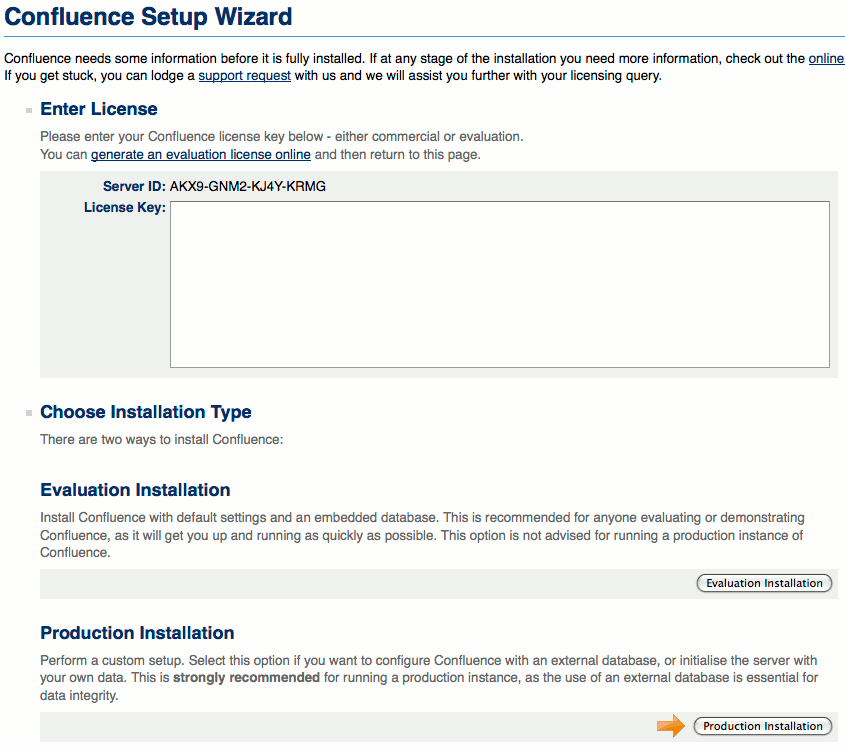
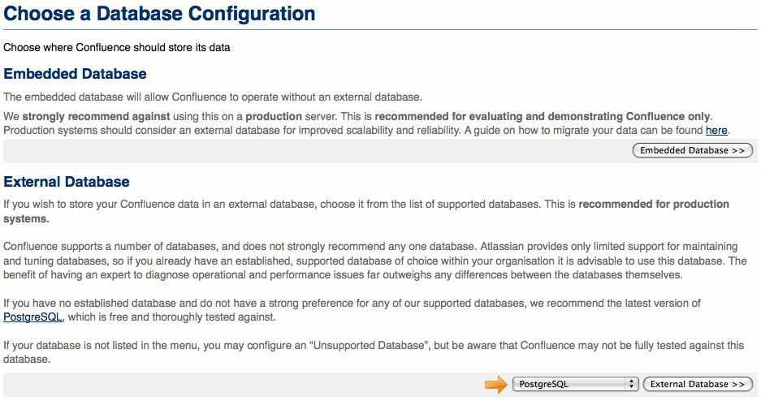
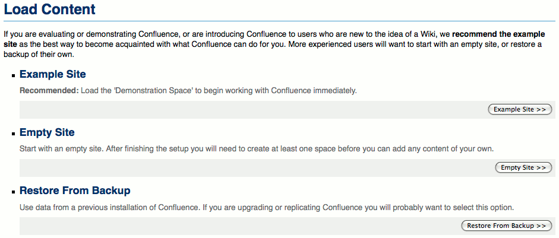
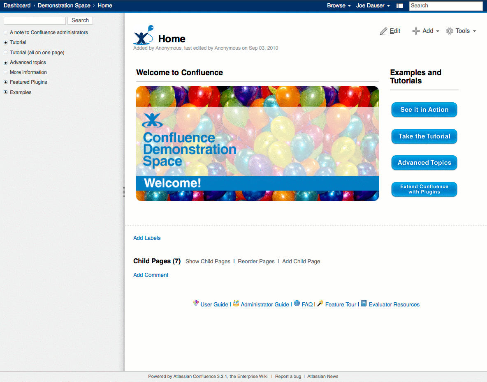

[Confluence](http://www.atlassian.com/software/confluence/) is a popular wiki system that features easy editing and publishing, Microsoft Office and SharePoint integration, the ability to add custom features via plugins, and more. It is [free for use](http://www.atlassian.com/software/jira/licensing.jsp#nonprofit) by official non-profit organizations, charities, educational institutions, and established open source projects. These guides will help you get started with Confluence on your CentOS 5 Linode. It is assumed that you're starting with a freshly deployed system. If you've already deployed applications to your Linode, you may need to make some adjustments to these instructions to accommodate your existing setup. It is also assumed that you've already obtained a license key for Confluence; if not, please do so before proceeding. These steps should be performed as the "root" user via an SSH session.

## Set the Hostname

Before you begin installing and configuring the components described in this guide, please make sure you've followed our instructions for [setting your hostname](/docs/products/platform/get-started/#setting-the-hostname). Issue the following commands to make sure it is set properly:

    hostname
    hostname -f

The first command should show your short hostname, and the second should show your fully qualified domain name (FQDN).

## Install the Java 6 JDK

Issue the following command to update your package repositories and install all available application updates.

    yum update

Visit the [Oracle Java download center](http://www.oracle.com/technetwork/java/javase/downloads/index.html) to obtain a link to the latest version of the Java 6 JDK for Linux, selecting the non-RPM version. Copy the download link to your clickboard and issue the following commands to download the package to your Linode.

    wget [download link]
    mv jdk* jdk-6.bin
    chmod +x jdk-6.bin
    ./jdk-6.bin
    mkdir /usr/lib/java
    mv jdk1.6*/ /usr/lib/java/

Java is now installed. Next, you'll install Confluence.

## Install Confluence

Issue the following command to install prerequisite packages.

    yum install libICE-devel libSM-devel libX11-devel libXp-devel libXt-devel libXtst-devel libXext-devel

Create a user account and directories for Confluence by issuing the following commands. Be sure to set a strong password to the `confluence` user.

    groupadd confluence
    useradd confluence -g confluence -d /var/lib/confluence
    passwd confluence
    mkdir /usr/local/confluence
    chown confluence:confluence /usr/local/confluence

Visit the [Confluence download page](http://www.atlassian.com/software/confluence/ConfluenceDownloadCenter.jspa) to obtain a link to the latest version to the software for Linux. Issue the following commands to download and unpack the software archive, adjusting the `wget` command as necessary to reflect the correct link.

    su - confluence
    cd /usr/local/confluence
    wget http://www.atlassian.com/software/confluence/downloads/binary/confluence-3.3.1-std.tar.gz
    tar -xvf confluence*gz

Edit the `confluence-init.properties` file, adding the following line to it. Adjust the full path to the file as necessary to reflect the current version number.


confluence.home=/var/lib/confluence



Edit the `setenv.sh` file, adding the following lines. Adjust the full path to the file and the "JAVA\_HOME" line as necessary to reflect current version numbers.


JAVA_HOME="/usr/lib/java/jdk1.6.0_21"
export JAVA_HOME



Issue the following command to return to a root shell.

    exit

Issue the following commands to create an init script to control the Confluence application, mark this file executable, and configure Confluence to start automatically when the system boots:

    cd /opt/
    wget -O init-rpm.sh http://www.linode.com/docs/assets/614-init-rpm.sh
    mv init-rpm.sh /etc/init.d/confluence
    chmod +x /etc/init.d/confluence
    chkconfig --add confluence
    chkconfig confluence on

Confluence should now be installed. Next, you'll create a database to store information related to your Confluence installation.

## Create the Confluence Database

Issue the following commands to install PostgreSQL and some useful "contrib" components.

    yum install postgresql84 postgresql84-server postgresql84-contrib
    service postgresql initdb
    chkconfig --levels 34 postgresql on
    service postgresql start

Issue the following command to set a password for the `postgres` system user. While not strictly required, it can be useful for cases where you want to do things like establish an SSH tunnel to the `postgres` account for remote administration.

    passwd postgres

Issue the following commands to set a password for the `postgres` administrative user. Be sure to replace "changeme" with a strong password. This password will be used to connect to the database via the network; ident authentication will be used for local connections made with psql while logged into a shell as the postgres user.

    su - postgres
    psql -d template1 -c "ALTER USER postgres WITH PASSWORD 'changeme';"

Edit the file `/var/lib/pgsql/data/pg_hba.conf`. Locate the following line.


host all all 127.0.0.1/32 ident



Change it the match the following excerpt and save the file.


host all all 127.0.0.1/32 md5



Issue the following command to create a `confluence` PostgreSQL role, making sure to assign a strong password.

    createuser confluence --pwprompt

Use the following values when asked about various settings.

    Shall the new role be a superuser? (y/n) n
    Shall the new role be allowed to create databases? (y/n) y
    Shall the new role be allowed to create more new roles? (y/n) n

Create the Confluence database by issuing the following commands.

    exit
    su - confluence
    createdb confluence
    exit

Issue the following command to restart PostgreSQL.

    service postgresql restart

PostgreSQL should now be properly configured. Next, you'll create a virtual host for your Confluence site.

## Create a Virtual Host for Confluence

By default, the web interface for Confluence runs on port 8080. If you're comfortable with instructing your users to use this port, you may skip this section. Otherwise, follow these instructions to use the Apache web server to host a traditional virtual host for your Confluence installation. Issue the following command to install Apache:

    yum install httpd
    chkconfig --levels 36 httpd on

Edit the `/etc/httpd/conf/httpd.conf` file, adding the following excerpt at the end.


<IfModule mod_proxy.c>
        #turning ProxyRequests on and allowing proxying from all may allow
        #spammers to use your proxy to send email.

        ProxyRequests Off

        <Proxy *>
                AddDefaultCharset off
                Order deny,allow
                Allow from all
        </Proxy>

        # Enable/disable the handling of HTTP/1.1 "Via:" headers.
        # ("Full" adds the server version; "Block" removes all outgoing Via: headers)
        # Set to one of: Off | On | Full | Block

        ProxyVia On
</IfModule>



Create a file named `/etc/httpd/conf.d/vhost.conf` with the following contents, replacing "confluence.example.com" with the your actual domain name. Please note that you will need to add an "A" record to your DNS configuration to point the site to your Linode's public IP address. This example assumes that Confluence will be running on its default port (8080).


NameVirtualHost *:80

<VirtualHost *:80>
     ServerAdmin support@example.com
     ServerName confluence.example.com
     ProxyPass / http://localhost:8080/
     ProxyPassReverse / http://localhost:8080/
</VirtualHost>



Issue the following commands to start Apache and Confluence.

    service httpd start
    service confluence start

Apache should now be properly configured. Next, you'll configure Confluence.

## Configure Confluence

If you created a virtual host for your Confluence installation, direct your browser to `http://confluence.example.com`, replacing "confluence.example.com" with the site you set up with Apache. Otherwise, visit the URL `http://12.34.56.78:8080`, replacing "12.34.56.78" with your Linode's public IP address. Enter your license key on the first screen and click the "Production Installation" button to continue.

Select "PostgreSQL" under the "External Database" section and click the "External Database" button to continue.

Click the "Direct JDBC" button to continue.

Enter the following database connection details, along with your password. Click "Next" to continue.

You may choose to start with an example site or an empty configuration. If you're new to Confluence, we recommend you install the example site to gain more familiarity with the system.

Select an appropriate username for the administrative user, and be sure to enter a strong password. Click "Next" to continue.

If you elected to install the example site, you'll be greeted with a screen resembling the following screenshot.

Congratulations! You've successfully installed Confluence on your CentOS 5 Linode.
