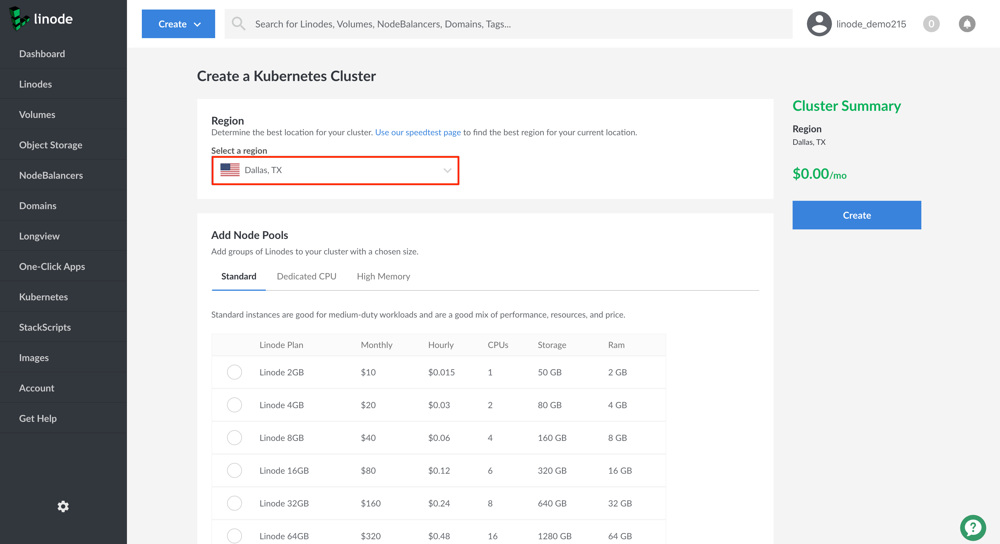
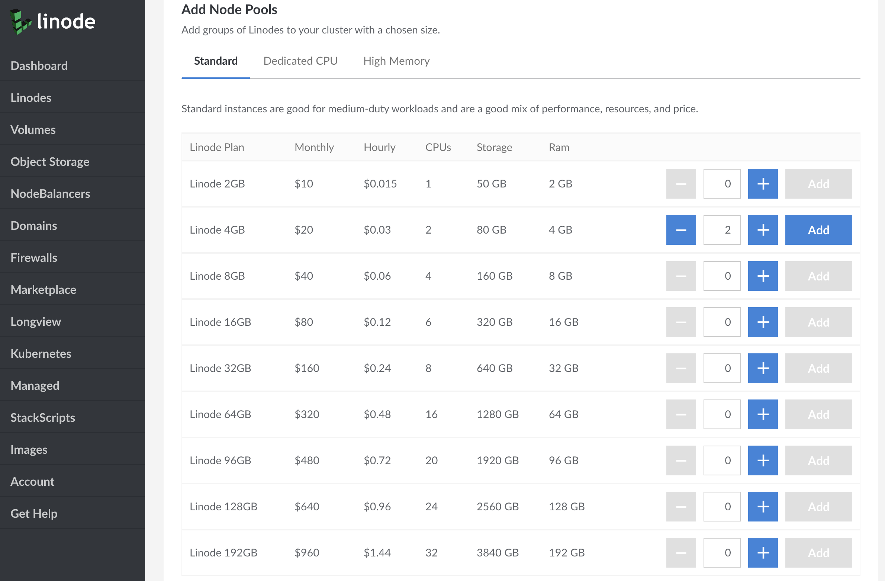
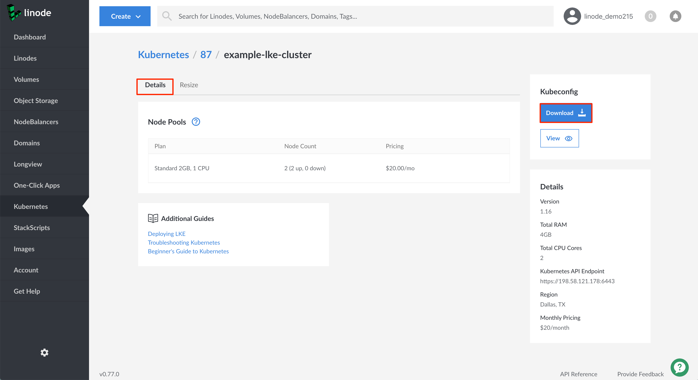
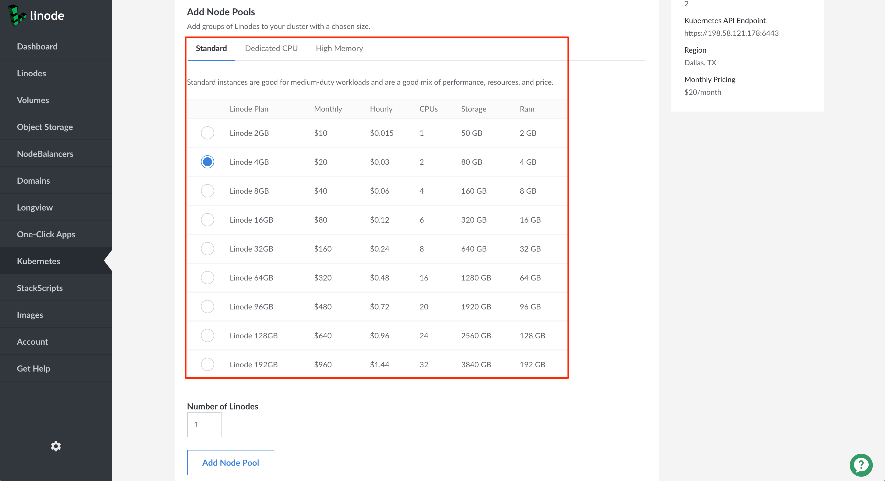

---
author:
  name: Linode
  email: docs@linode.com
contributor:
  name: Linode
  link: https://linode.com
description: "Learn how to deploy a cluster on Linode Kubernetes Engine (LKE) through the Linode Cloud Manager. The Cloud Manager provides interfaces for selecting hardware resources for your cluster's node pools, and you can modify these after cluster creation."
og_description: "Learn how to deploy a cluster on Linode Kubernetes Engine (LKE) through the Linode Cloud Manager. The Cloud Manager provides interfaces for selecting hardware resources for your cluster's node pools, and you can modify these after cluster creation."
keywords: ["kubernetes", "linode kubernetes engine", "managed kubernetes", "lke", "kubernetes cluster"]
license: '[CC BY-ND 4.0](https://creativecommons.org/licenses/by-nd/4.0)'
published: 2019-11-11
modified_by:
  name: Linode
title: 'Deploy and Manage a Cluster with Linode Kubernetes Engine - A Tutorial'
h1_title: A Tutorial for Deploying and Managing a Cluster with Linode Kubernetes Engine
external_resources:
 - '[Overview of kubectl](https://kubernetes.io/docs/reference/kubectl/overview/)'
aliases: ['applications/containers/kubernetes/how-to-deploy-a-cluster-with-lke/','applications/containers/kubernetes/deploy-and-manage-a-cluster-with-linode-kubernetes-engine-a-tutorial/']
---

Linode Kubernetes Engine (LKE) is currently in Private Beta, and you may not have access to LKE through the Cloud Manager or other tools. To request access to the Private Beta, [sign up here](https://welcome.linode.com/lkebeta/). Beta access awards you $100/month in free credits for the duration of the beta, which is automatically applied to your account when an LKE cluster is in use. Additionally, you will have access to the `Linode Green Light` community, a new program connecting beta users with our product and engineering teams.

Additionally, because LKE is in Beta, there may be breaking changes to how you access and manage LKE. This guide will be updated to reflect these changes if and when they occur.


## What is the Linode Kubernetes Engine (LKE)
The Linode Kubernetes Engine (LKE) is a fully-managed container orchestration engine for deploying and managing containerized applications and workloads. LKE combines Linode’s ease of use and [simple pricing](https://www.linode.com/pricing/) with the infrastructure efficiency of Kubernetes. When you deploy an LKE cluster, you receive a Kubernetes Master at no additional cost; you only pay for the Linodes (worker nodes), [NodeBalancers](/docs/platform/nodebalancer/getting-started-with-nodebalancers/) (load balancers), and [Block Storage Volumes](/docs/platform/block-storage/how-to-use-block-storage-with-your-linode/). Your LKE cluster’s Master node runs the Kubernetes control plane processes – including the API, scheduler, and resource controllers.


* **etcd Backups** : A snapshot of your cluster's metadata is backed up continuously, so your cluster is automatically restored in the event of a failure.
* **High Availability** : All of your control plane components are monitored and will automatically recover if they fail.


### In this Guide

In this guide you will learn:

 - [How to create a Kubernetes cluster using the Linode Kubernetes Engine.](#create-an-lke-cluster)

 - [How to modify your cluster.](#modify-a-cluster-s-node-pools)

 - [How to delete your cluster.](#delete-a-cluster)

 - [Next Steps after deploying your cluster.](#next-steps)


This guide's example instructions will create several billable resources on your Linode account. If you do not want to keep using the example cluster that you create, be sure to [remove it](#delete-a-cluster) when you have finished the guide.

If you remove the resources afterward, you will only be billed for the hour(s) that the resources were present on your account.


## Before You Begin

### Enable Network Helper

In order to use the Linode Kubernetes Engine, you will need to have *Network Helper* enabled globally on your account. Network Helper is a Linode-provided service that automatically sets a static network configuration for your Linode when it boots. To enable this global account setting, follow [these instructions](/docs/platform/network-helper/#global).

If you don't want to use Network Helper on some Linodes that are not part of your LKE clusters, the service can also be disabled on a per-Linode basis; see instructions [here](/docs/platform/network-helper/#single-per-linode).


If you have already deployed an LKE cluster and did not enable Network Helper, you can [add a new node pool](#add-node-pools) with the same type, size, and count as your initial node pool. Once your new node pool is ready, you can then [delete the original node pool](#delete-a-cluster).


### Install kubectl

You will need to install the kubectl client to your computer before proceeding. Follow the steps corresponding to your computer's operating system.



## Create an LKE Cluster

1.  Log into your [Linode Cloud Manager](https://cloud.linode.com/) account.

    
LKE is not available in the Linode Classic Manager


1.  From the Linode dashboard, click the **Create** button in the top left-hand side of the screen and select **Kubernetes** from the dropdown menu.

    

1. The **Create a Kubernetes Cluster** page will appear. Select the region where you would like your cluster to reside.

    

1. In the **Add Node Pools** section, select the [hardware resources](/docs/platform/how-to-choose-a-linode-plan/#hardware-resource-definitions) for the Linode worker node(s) that make up your LKE cluster. If you decide that you need more or fewer hardware resources after you deploy your cluster, you can always [edit your Node Pool](#edit-or-remove-existing-node-pools).

    

    
While in Private Beta, LKE is only available in the Dallas data center, and worker nodes can be created for all [Standard](/docs/platform/how-to-choose-a-linode-plan/#2-standard), [Dedicated CPU](/docs/platform/how-to-choose-a-linode-plan/#4-dedicated-cpu), and [High Memory Plans](/docs/platform/how-to-choose-a-linode-plan/#3-high-memory). This will expand in the future.


1. Under **Number of Linodes**, input the number of Linode worker nodes you would like to add to your Node Pool. These worker nodes will have the hardware resources selected from the **Add Node Pools** section.

    

1. Click on the **Add Node Pool** button to add the pool to your cluster's configuration. You will see a **Cluster Summary** appear on the right-hand side of the Cloud Manager detailing your cluster's hardware resources and monthly cost.

    A list of pools also appears below the **Add Node Pool** button with quick edit **Node Count** fields. You can easily change the number of nodes by typing a new number in the field, or use the up and down arrows to increment or decrement the number in the field. Each row in this table also has a **Remove** link if you want to remove the node pool.

    

1. In the **Cluster Label** field, provide a name for your cluster. The name must be unique between all of the clusters on your account. This name will be how you identify your cluster in the Cloud Manager’s Dashboard.

    

1. From the **Version** dropdown menu, select a Kubernetes version to deploy to your cluster.

    

1. When you are satisfied with the configuration of your cluster, click the **Create** button on the right hand side of the screen. Your cluster's detail page will appear where you will see your Node Pools listed. From this page, you can [edit your existing Node Pools](#edit-or-remove-existing-node-pools), [add new Node Pools](#add-node-pools) to your cluster, [access your Kubeconfig file](#access-and-download-your-kubeconfig), and view an overview of your cluster's resource details.

## Connect to your LKE Cluster with kubectl

After you've created your LKE cluster using the Cloud Manager, you can begin interacting with and managing your cluster. You connect to it using the kubectl client on your computer. To configure kubectl, you'll download your cluster's *kubeconfig* file.

### Access and Download your kubeconfig

Anytime after your cluster is created you can download its *kubeconfig*. The kubeconfig is a YAML file that will allow you to use kubectl to communicate with your cluster. Here is an example kubeconfig file:


apiVersion: v1
clusters:
- cluster:
    certificate-authority-data: LS0tLS1CRUd...
    server: https://192.0.2.0:6443
  name: kubernetes
contexts:
- context:
    cluster: kubernetes
    user: kubernetes-admin
  name: kubernetes-admin@kubernetes
current-context: kubernetes-admin@kubernetes
kind: Config
preferences: {}
users:
- name: kubernetes-admin
  user:
    client-certificate-data: LS0tLS1CRUd...
    client-key-data: LS0tLS1CRUd...



This configuration file defines your cluster, users, and contexts.

1. To access your cluster's kubeconfig, log into your Cloud Manager account and navigate to the **Kubernetes** section.

1. From the Kubernetes listing page, click on your cluster's **more options ellipsis** and select **Download kubeconfig**. The file will be saved to your computer's `Downloads` folder.

    

    
You can also download the kubeconfig from the Kubernetes cluster's details page.

1. When viewing the Kubernetes listing page, click on the cluster for which you'd like to download a kubeconfig file.

1. On the cluster's details page, under the **kubeconfig** section, click the **Download** button. The file will be saved to your `Downloads` folder.

    

1. To view the contents of your kubeconfig file, click on the **View** button. A pane will appear with the contents of your cluster's kubeconfig file.

    


1. Open a terminal shell and save your kubeconfig file's path to the `$KUBECONFIG` environment variable. In the example command, the kubeconfig file is located in the `Downloads` folder, but you should alter this line with this folder's location on your computer:

        export KUBECONFIG=~/Downloads/kubeconfig.yaml

    
It is common practice to store your kubeconfig files in `~/.kube` directory. By default, kubectl will search for a kubeconfig file named `config` that is located in the  `~/.kube` directory. You can specify other kubeconfig files by setting the `$KUBECONFIG` environment variable, as done in the step above.


1. View your cluster's nodes using kubectl.

        kubectl get nodes

    
If your kubectl commands are not returning the resources and information you expect, then your client may be assigned to the wrong cluster context. Visit our [Troubleshooting Kubernetes](/docs/kubernetes/troubleshooting-kubernetes/#troubleshooting-examples) guide to learn how to switch cluster contexts.


      You are now ready to manage your cluster using kubectl. For more information about using kubectl, see Kubernetes' [Overview of kubectl](https://kubernetes.io/docs/reference/kubectl/overview/) guide.

### Persist the Kubeconfig Context

If you create a new terminal window, it will not have access to the context that you specified using the previous instructions. This context information can be made persistent between new terminals by setting the [`KUBECONFIG` environment variable](https://kubernetes.io/docs/tasks/access-application-cluster/configure-access-multiple-clusters/#set-the-kubeconfig-environment-variable) in your shell's configuration file.


If you are using Windows, review the [official Kubernetes documentation](https://kubernetes.io/docs/tasks/access-application-cluster/configure-access-multiple-clusters/#set-the-kubeconfig-environment-variable) for how to persist your context.


These instructions will persist the context for users of the Bash terminal. They will be similar for users of other terminals:

1.  Navigate to the `$HOME/.kube` directory:

        cd $HOME/.kube

1.  Create a directory called `configs` within `$HOME/.kube`. You can use this directory to store your kubeconfig files.

        mkdir configs

1. Copy your `kubeconfig.yaml` file to the `$HOME/.kube/configs` directory.

        cp ~/Downloads/kubeconfig.yaml $HOME/.kube/configs/kubeconfig.yaml

    
Alter the above line with the location of the Downloads folder on your computer.

Optionally, you can give the copied file a different name to help distinguish it from other files in the `configs` directory.


1.  Open up your Bash profile (e.g. `~/.bash_profile`) in the text editor of your choice and add your configuration file to the `$KUBECONFIG` PATH variable.

    If an `export KUBECONFIG` line is already present in the file, append to the end of this line as follows; if it is not present, add this line to the end of your file:

        export KUBECONFIG=$KUBECONFIG:$HOME/.kube/config:$HOME/.kube/configs/kubeconfig.yaml

1.  Close your terminal window and open a new window to receive the changes to the `$KUBECONFIG` variable.

1.  Use the `config get-contexts` command for `kubectl` to view the available cluster contexts:

        kubectl config get-contexts

    You should see output similar to the following:

    
CURRENT&nbsp;&nbsp;NAME&nbsp;&nbsp;&nbsp;&nbsp;&nbsp;&nbsp;&nbsp;&nbsp;&nbsp;&nbsp;&nbsp;&nbsp;&nbsp;&nbsp;&nbsp;&nbsp;&nbsp;&nbsp;&nbsp;&nbsp;&nbsp;&nbsp;&nbsp;&nbsp;&nbsp;CLUSTER&nbsp;&nbsp;&nbsp;&nbsp;&nbsp;AUTHINFO&nbsp;&nbsp;&nbsp;&nbsp;&nbsp;&nbsp;&nbsp;&nbsp;&nbsp;&nbsp;NAMESPACE
*&nbsp;&nbsp;&nbsp;&nbsp;&nbsp;&nbsp;&nbsp;&nbsp;kubernetes-admin@kubernetes&nbsp;&nbsp;kubernetes&nbsp;&nbsp;kubernetes-admin


1.  If your context is not already selected, (denoted by an asterisk in the `current` column), switch to this context using the `config use-context` command. Supply the full name of the cluster (including the authorized user and the cluster):

        kubectl config use-context kubernetes-admin@kubernetes

    You should see output like the following:

    
Switched to context "kubernetes-admin@kubernetes".


1.  You are now ready to interact with your cluster using `kubectl`. You can test the ability to interact with the cluster by retrieving a list of Pods in the `kube-system` namespace:

        kubectl get pods -n kube-system

## Modify a Cluster's Node Pools

You can use the Linode Cloud Manager to modify a cluster's existing node pools by adding or removing nodes. You can also add or remove entire node pools from your cluster. This section will cover completing those tasks. For any other changes to your LKE cluster, you should use kubectl.

### Access your Cluster's Details Page

1.  Click the **Kubernetes** link in the sidebar. The Kubernetes listing page will appear and you will see all your clusters listed.

    

1.  Click the cluster that you wish to modify. The Kubernetes cluster's details page will appear.

    

### Edit or Remove Existing Node Pools

1. On your [cluster's details page](#access-your-cluster-s-details-page), click the **Resize** tab at the top of the page.

    

1.  Under the cluster's **Resize** tab, you can now edit your existing node pool or remove it entirely:

 - The **Node Count** fields are now editable text boxes.

 - To remove a node pool, click the **Remove** link to the right.

 - As you make changes you will see an **Updated Monthly Estimate**; contrast this to the current **Monthly Pricing** under the **Details** panel on the right.

        

1.  Click the **Save** button to save your changes; click the **Clear Changes** button to revert back to the cluster state before you started editing; or click the **Cancel** button to cancel editing.

### Add Node Pools

1. On your [cluster's details page](#access-your-cluster-s-details-page), click the **Resize** tab at the top of the page.

    

1.  Under the cluster's **Resize** tab, navigate to the **Add Node Pools** panel. Select the type and size of Linode(s) you want to add to your new pool.

    

1. Under **Number of Linodes**, input the number of Linode worker nodes you'd like to add to the pool in the text box; you can also use the arrow keys to increment or decrement this number. Click the **Add Node Pool** button.

    

1.  The new node pool appears in the **Node Pools** list which you can now edit, if desired.

    

## Delete a Cluster

 You can delete an entire cluster using the Linode Cloud Manager. These changes cannot be reverted once completed.

1. On your [cluster's details page](#access-your-cluster-s-details-page), click the **Resize** tab at the top of the page.

    

1.  Under the cluster's **Resize** tab, scroll to the bottom and click on the **Delete Cluster** button.

    

1.  A confirmation pop-up will appear. Enter in your cluster's name and click the **Delete** button to confirm.

    

1.  The Kubernetes listing page will appear and you will no longer see your deleted cluster.

## Next Steps

Now that you have a running LKE cluster, you can start deploying workloads to it. Refer to our other guides to learn more:

 - [How to Deploy a Static Site on Linode Kubernetes Engine](/docs/kubernetes/how-to-deploy-a-static-site-on-linode-kubernetes-engine/)
 - [Create and Deploy a Docker Container Image to a Kubernetes Cluster](/docs/kubernetes/deploy-container-image-to-kubernetes/)
 - [Troubleshooting Kubernetes Guide](/docs/kubernetes/troubleshooting-kubernetes/)
 - [See all our Kubernetes guides](/docs/kubernetes/)
