---
author:
  name: Linode
  email: docs@linode.com
contributor:
  name: Linode
  link: https://linode.com
description: "Learn how to deploy a cluster on Linode Kubernetes Engine (LKE) through the Linode Cloud Manager. The Cloud Manager provides interfaces for selecting hardware resources for your cluster's node pools, and you can modify these after cluster creation."
og_description: "Learn how to deploy a cluster on Linode Kubernetes Engine (LKE) through the Linode Cloud Manager. The Cloud Manager provides interfaces for selecting hardware resources for your cluster's node pools, and you can modify these after cluster creation."
keywords: ["kubernetes", "linode kubernetes engine", "managed kubernetes", "lke", "kubernetes cluster"]
license: '[CC BY-ND 4.0](https://creativecommons.org/licenses/by-nd/4.0)'
published: 2019-11-11
modified_by:
  name: Linode
title: 'Deploy and Manage a Cluster with Linode Kubernetes Engine - A Tutorial'
h1_title: A Tutorial for Deploying and Managing a Cluster with Linode Kubernetes Engine
image: deploy-and-manage-cluster.png
external_resources:
 - '[Overview of kubectl](https://kubernetes.io/docs/reference/kubectl/overview/)'
aliases: ['applications/containers/kubernetes/how-to-deploy-a-cluster-with-lke/','applications/containers/kubernetes/deploy-and-manage-a-cluster-with-linode-kubernetes-engine-a-tutorial/']
---

## What is the Linode Kubernetes Engine (LKE)


This guide uses Linode Kubernetes Engine (LKE) to deploy a managed Kubernetes cluster. For more information on Kubernetes key concepts, see our [Beginner's Guide to Kubernetes](https://www.linode.com/docs/kubernetes/beginners-guide-to-kubernetes/)


The Linode Kubernetes Engine (LKE) is a fully-managed container orchestration engine for deploying and managing containerized applications and workloads. LKE combines Linode’s ease of use and [simple pricing](https://www.linode.com/pricing/) with the infrastructure efficiency of Kubernetes. When you deploy an LKE cluster, you receive a Kubernetes Master at no additional cost; you only pay for the Linodes (worker nodes), [NodeBalancers](/docs/platform/nodebalancer/getting-started-with-nodebalancers/) (load balancers), and [Block Storage Volumes](/docs/platform/block-storage/how-to-use-block-storage-with-your-linode/). Your LKE cluster’s Master node runs the Kubernetes control plane processes – including the API, scheduler, and resource controllers.


* **etcd Backups** : A snapshot of your cluster's metadata is backed up continuously, so your cluster is automatically restored in the event of a failure.
* **High Availability** : All of your control plane components are monitored and will automatically recover if they fail.


### In this Guide

In this guide you will learn:

 - [How to create a Kubernetes cluster using the Linode Kubernetes Engine.](#create-an-lke-cluster)

 - [How to modify your cluster.](#modify-a-cluster-s-node-pools)

 - [How to delete your cluster.](#delete-a-cluster)

 - [Next Steps after deploying your cluster.](#next-steps)


This guide's example instructions will create several billable resources on your Linode account. If you do not want to keep using the example cluster that you create, be sure to [remove it](#delete-a-cluster) when you have finished the guide.

If you remove the resources afterward, you will only be billed for the hour(s) that the resources were present on your account.


## Before You Begin

### Install kubectl

You will need to install the kubectl client to your computer before proceeding. Follow the steps corresponding to your computer's operating system.



## Create an LKE Cluster

1.  Log into your [Linode Cloud Manager](https://cloud.linode.com/) account.

1.  From the Linode dashboard, click the **Create** button in the top right-hand side of the screen and select **Kubernetes** from the dropdown menu.

    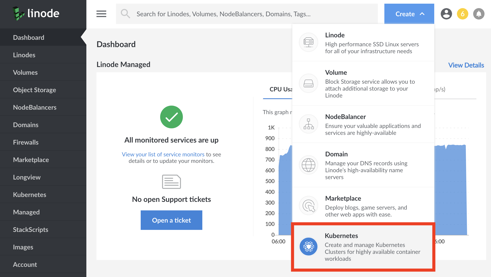

1. The **Create a Kubernetes Cluster** page will appear. At the top of the page, you'll be required to select the following options:

    - In the **Cluster Label** field, provide a name for your cluster. The name must be unique between all of the clusters on your account. This name will be how you identify your cluster in the Cloud Manager’s Dashboard.

    - From the **Region** dropdown menu, select the **Region** where you would like your cluster to reside.

    - From the **Version** dropdown menu, select a Kubernetes version to deploy to your cluster.

    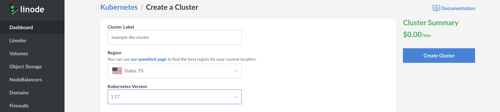

1. In the **Add Node Pools** section, select the [hardware resources](/docs/platform/how-to-choose-a-linode-plan/#hardware-resource-definitions) for the Linode worker node(s) that make up your LKE cluster. To the right of each plan, select the plus `+` and minus `-` to add or remove a Linode to a node pool one at time. Once you're satisfied with the number of nodes in a node pool, select **Add** to include it in your configuration. If you decide that you need more or fewer hardware resources after you deploy your cluster, you can always [edit your Node Pool](#edit-or-remove-existing-node-pools).

    
Currently, the available plan types for LKE worker nodes are [Shared](/docs/platform/how-to-choose-a-linode-plan/#1-shared), [Dedicated CPU](/docs/platform/how-to-choose-a-linode-plan/#4-dedicated-cpu), and [High Memory](/docs/platform/how-to-choose-a-linode-plan/#3-high-memory) plans.
    

    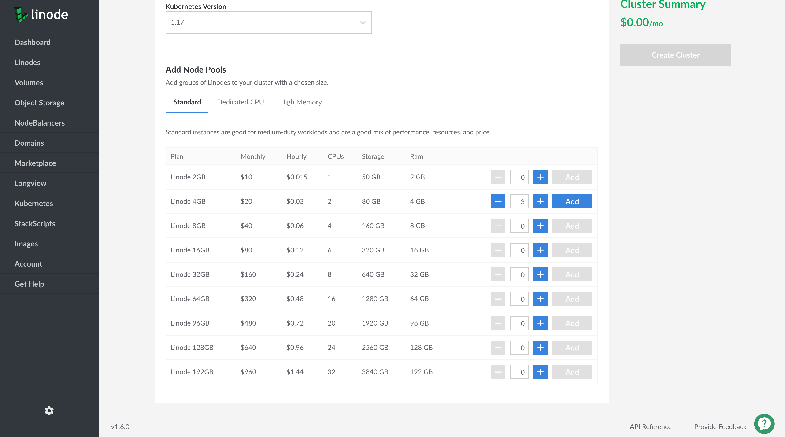

1. Once a pool has been added to your configuration, you will see it listed in the **Cluster Summary** on the right-hand side of the Cloud Manager detailing your cluster's hardware resources and monthly cost. Additional pools can be added before finalizing the cluster creation process by repeating the previous step for each additional pool.

    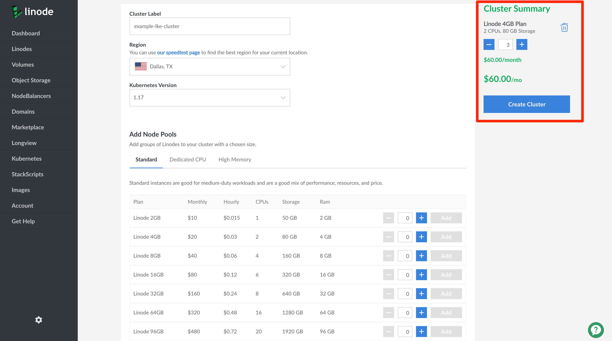

1. When you are satisfied with the configuration of your cluster, click the **Create Cluster** button on the right hand side of the screen. Your cluster's detail page will appear on the following page where you will see your Node Pools listed. From this page, you can [edit your existing Node Pools](#edit-or-remove-existing-node-pools), [access your Kubeconfig file](#access-and-download-your-kubeconfig), and view an overview of your cluster's resource details.

## Connect to your LKE Cluster with kubectl

After you've created your LKE cluster using the Cloud Manager, you can begin interacting with and managing your cluster. You connect to it using the kubectl client on your computer. To configure kubectl, you'll download your cluster's *kubeconfig* file.

### Access and Download your kubeconfig

Anytime after your cluster is created you can download its *kubeconfig*. The kubeconfig is a YAML file that will allow you to use kubectl to communicate with your cluster. Here is an example kubeconfig file:


apiVersion: v1
kind: Config
preferences: {}

clusters:
- cluster:
    certificate-authority-data: LS0tLS1CRUd...
    server: https://example.us-central.linodelke.net:443
  name: lke1234

users:
- name: lke1234-admin
  user:
    as-user-extra: {}
    token: LS0tLS1CRUd...

contexts:
- context:
    cluster: lke1234
    namespace: default
    user: lke1234-admin
  name: lke1234-ctx

current-context: lke1234-ctx


This configuration file defines your cluster, users, and contexts.

1. To access your cluster's kubeconfig, log into your Cloud Manager account and navigate to the **Kubernetes** section.

1. From the Kubernetes listing page, click on your cluster's **more options ellipsis** and select **Download kubeconfig**. The file will be saved to your computer's `Downloads` folder.

    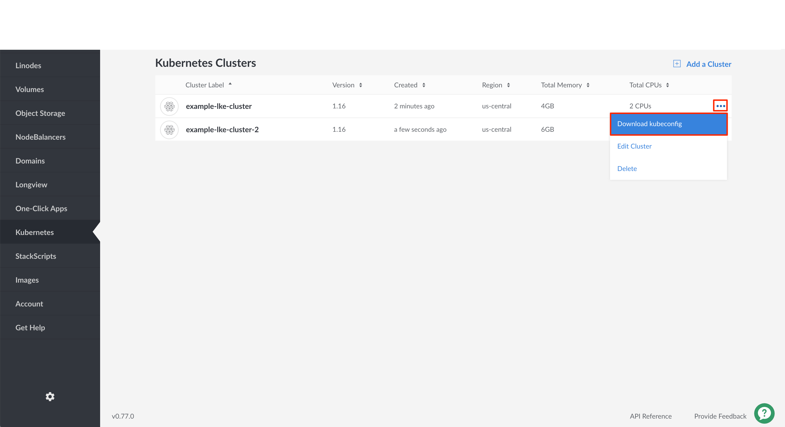

    
You can also download the kubeconfig from the Kubernetes cluster's details page.

1. When viewing the Kubernetes listing page, click on the cluster for which you'd like to download a kubeconfig file.

1. On the cluster's details page, under the **kubeconfig** section, click the **Download icon**. The file will be saved to your `Downloads` folder.

    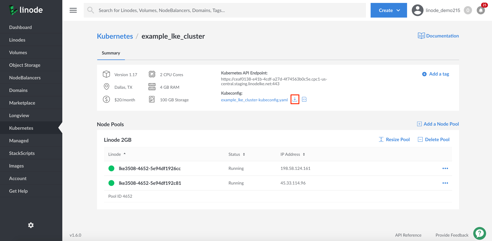

1. To view the contents of your kubeconfig file, click on the **View icon**. A pane will appear with the contents of your cluster's kubeconfig file.

    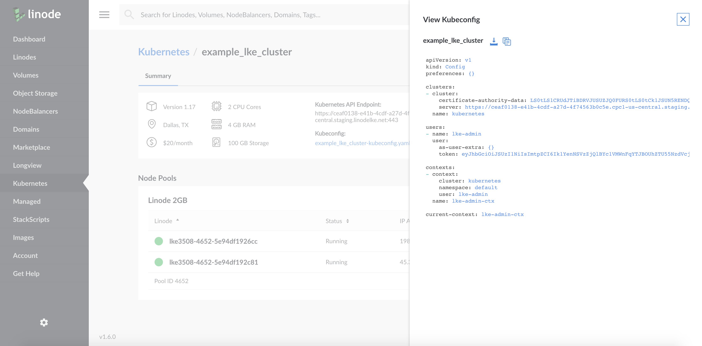


1. Open a terminal shell and save your kubeconfig file's path to the `$KUBECONFIG` environment variable. In the example command, the kubeconfig file is located in the `Downloads` folder, but you should alter this line with this folder's location on your computer:

        export KUBECONFIG=~/Downloads/kubeconfig.yaml

    
It is common practice to store your kubeconfig files in `~/.kube` directory. By default, kubectl will search for a kubeconfig file named `config` that is located in the  `~/.kube` directory. You can specify other kubeconfig files by setting the `$KUBECONFIG` environment variable, as done in the step above.


1. View your cluster's nodes using kubectl.

        kubectl get nodes

    
If your kubectl commands are not returning the resources and information you expect, then your client may be assigned to the wrong cluster context. Visit our [Troubleshooting Kubernetes](/docs/kubernetes/troubleshooting-kubernetes/#troubleshooting-examples) guide to learn how to switch cluster contexts.


      You are now ready to manage your cluster using kubectl. For more information about using kubectl, see Kubernetes' [Overview of kubectl](https://kubernetes.io/docs/reference/kubectl/overview/) guide.

### Persist the Kubeconfig Context

If you create a new terminal window, it will not have access to the context that you specified using the previous instructions. This context information can be made persistent between new terminals by setting the [`KUBECONFIG` environment variable](https://kubernetes.io/docs/tasks/access-application-cluster/configure-access-multiple-clusters/#set-the-kubeconfig-environment-variable) in your shell's configuration file.


If you are using Windows, review the [official Kubernetes documentation](https://kubernetes.io/docs/tasks/access-application-cluster/configure-access-multiple-clusters/#set-the-kubeconfig-environment-variable) for how to persist your context.


These instructions will persist the context for users of the Bash terminal. They will be similar for users of other terminals:

1.  Navigate to the `$HOME/.kube` directory:

        cd $HOME/.kube

1.  Create a directory called `configs` within `$HOME/.kube`. You can use this directory to store your kubeconfig files.

        mkdir configs

1. Copy your `kubeconfig.yaml` file to the `$HOME/.kube/configs` directory.

        cp ~/Downloads/kubeconfig.yaml $HOME/.kube/configs/kubeconfig.yaml

    
Alter the above line with the location of the Downloads folder on your computer.

Optionally, you can give the copied file a different name to help distinguish it from other files in the `configs` directory.


1.  Open up your Bash profile (e.g. `~/.bash_profile`) in the text editor of your choice and add your configuration file to the `$KUBECONFIG` PATH variable.

    If an `export KUBECONFIG` line is already present in the file, append to the end of this line as follows; if it is not present, add this line to the end of your file:

        export KUBECONFIG=$KUBECONFIG:$HOME/.kube/config:$HOME/.kube/configs/kubeconfig.yaml

1.  Close your terminal window and open a new window to receive the changes to the `$KUBECONFIG` variable.

1.  Use the `config get-contexts` command for `kubectl` to view the available cluster contexts:

        kubectl config get-contexts

    You should see output similar to the following:

    
CURRENT   NAME          CLUSTER   AUTHINFO        NAMESPACE
*         lke1234-ctx   lke1234   lke1234-admin   default


1.  If your context is not already selected, (denoted by an asterisk in the `current` column), switch to this context using the `config use-context` command. Supply the full name of the cluster (including the authorized user and the cluster):

        kubectl config use-context lke1234-ctx

    You should see output like the following:

    
Switched to context "lke1234-ctx".


1.  You are now ready to interact with your cluster using `kubectl`. You can test the ability to interact with the cluster by retrieving a list of Pods. Use the `get pods` command with the `-A` flag to see all pods running across all namespaces:

        kubectl get pods -A

    You should see output like the following:

    
NAMESPACE     NAME                                      READY   STATUS    RESTARTS   AGE
kube-system   calico-kube-controllers-dc6cb64cb-4gqf4   1/1     Running   0          11d
kube-system   calico-node-bx2bj                         1/1     Running   0          11d
kube-system   calico-node-fg29m                         1/1     Running   0          11d
kube-system   calico-node-qvvxj                         1/1     Running   0          11d
kube-system   calico-node-xzvpr                         1/1     Running   0          11d
kube-system   coredns-6955765f44-r8b79                  1/1     Running   0          11d
kube-system   coredns-6955765f44-xr5wb                  1/1     Running   0          11d
kube-system   csi-linode-controller-0                   3/3     Running   0          11d
kube-system   csi-linode-node-75lts                     2/2     Running   0          11d
kube-system   csi-linode-node-9qbbh                     2/2     Running   0          11d
kube-system   csi-linode-node-d7bvc                     2/2     Running   0          11d
kube-system   csi-linode-node-h4r6b                     2/2     Running   0          11d
kube-system   kube-proxy-7nk8t                          1/1     Running   0          11d
kube-system   kube-proxy-cq6jk                          1/1     Running   0          11d
kube-system   kube-proxy-gz4dc                          1/1     Running   0          11d
kube-system   kube-proxy-qcjg9                          1/1     Running   0          11d


## Modify a Cluster's Node Pools

You can use the Linode Cloud Manager to modify a cluster's existing node pools by adding or removing nodes. You can also recycle your node pools to replace all of their nodes with new ones that are upgraded to the most recent patch of your cluster's Kubernetes version, or remove entire node pools from your cluster. This section will cover completing those tasks. For any other changes to your LKE cluster, you should use kubectl.

### Access your Cluster's Details Page

1.  Click the **Kubernetes** link in the sidebar. The Kubernetes listing page will appear and you will see all your clusters listed.

    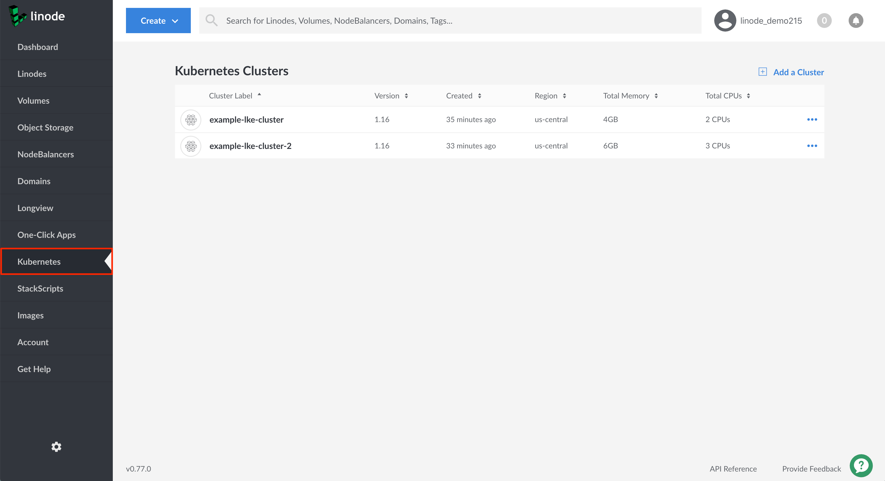

1.  Click the cluster that you wish to modify. The Kubernetes cluster's details page will appear.

    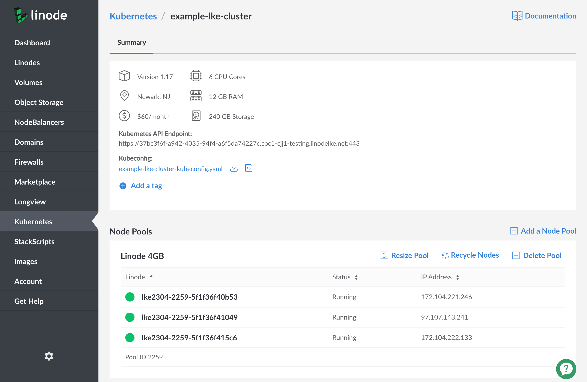

### Adding a Node Pool

1. To add a new Node Pool to your cluster, navigate to the [cluster's details page](#access-your-cluster-s-details-page) and select the add a node pool option to the right of the node pools section.

    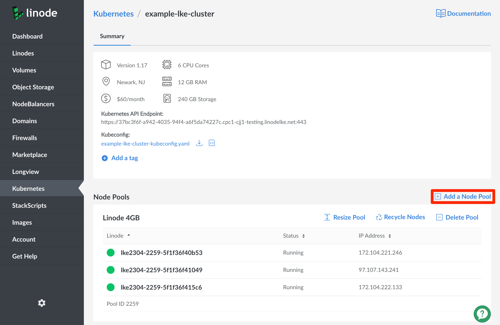

1. In the new window that appears, select the [hardware resources](/docs/platform/how-to-choose-a-linode-plan/#hardware-resource-definitions) that you'd like to add to your new Node Pool. To the right of each plan, select the plus `+` and minus `-` to add or remove a Linode to a node pool one at time. Once you're satisfied with the number of nodes in a node pool, select **Add Pool** to include it in your configuration. If you decide that you need more or fewer hardware resources after you deploy your cluster, you can always [edit your Node Pool](#edit-or-remove-existing-node-pools).

    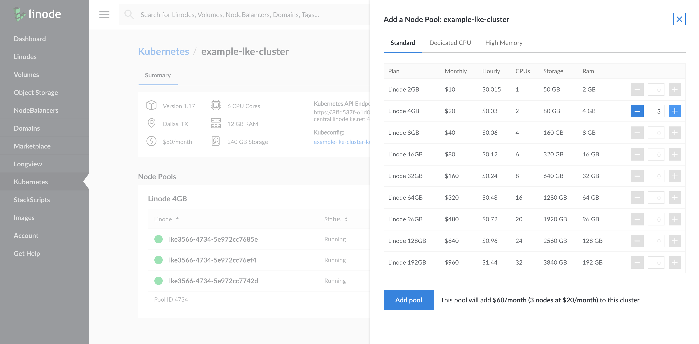

### Edit, Recycle, or Remove Existing Node Pools

1. On your [cluster's details page](#access-your-cluster-s-details-page), click the **Resize Pool** option at the top-right of each entry in the **Node Pools** section.

    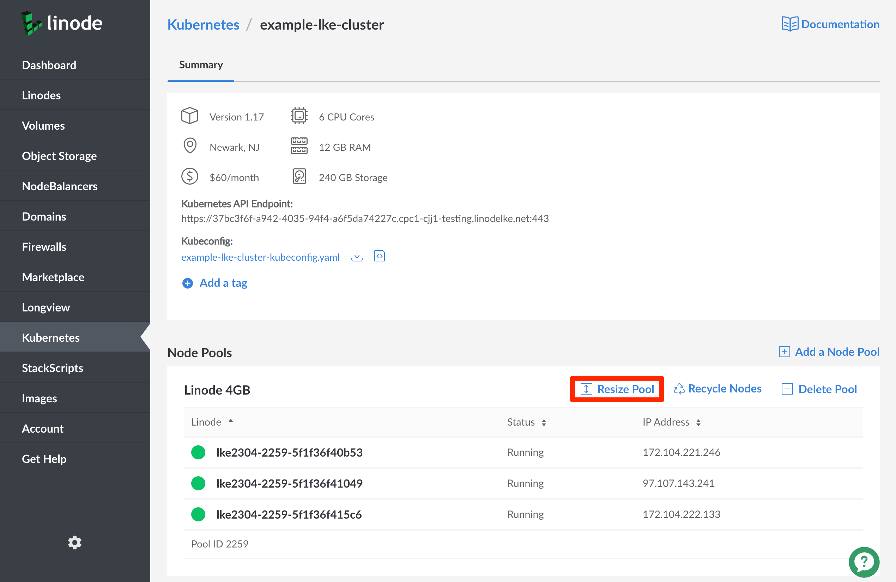

    Using the sidebar that appears to the right of the page, you can now remove `-` or add `+` Linodes to the pool, and the total cost of your new resources will be displayed. To accept these changes, select the `Save Changes` button to continue.

    
Shrinking a node pool will result in deletion of Linodes. Any local storage on deleted Linodes (such as "hostPath" and "emptyDir" volumes, or "local" PersistentVolumes) will be erased.


    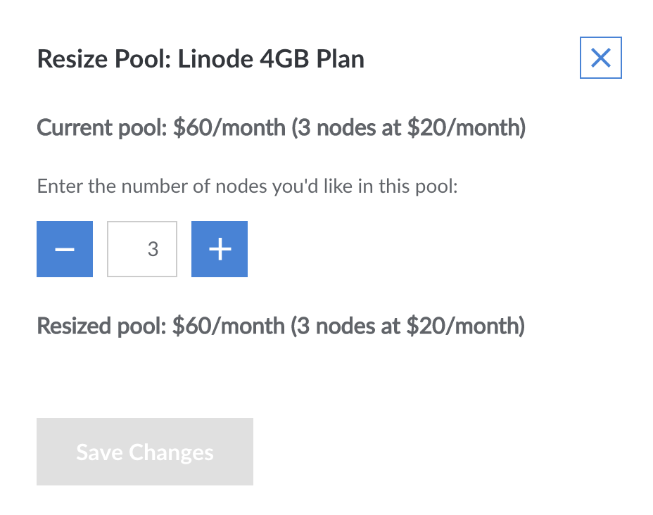

1. To recycle a node pool from the [cluster's details page](#access-your-cluster-s-details-page), click the **Recycle Nodes** option at the top-right of each entry in the **Node Pools** section. Recycling a node pool will update its nodes to the most recent patch of the cluster's Kubernetes version. A pop-up message will appear confirming that you're sure you'd like to proceed with recycling. Select the `Recycle all Nodes` option, and your Node Pool will proceed to recycle its nodes on a rolling basis so that only one node will be down at a time throughout the recycling process.

    
Recycling your node pool involves deleting each of the Linodes in the node pool and replacing them with new Linodes. Any local storage on deleted Linodes (such as "hostPath" and "emptyDir" volumes, or "local" PersistentVolumes) will be erased.


    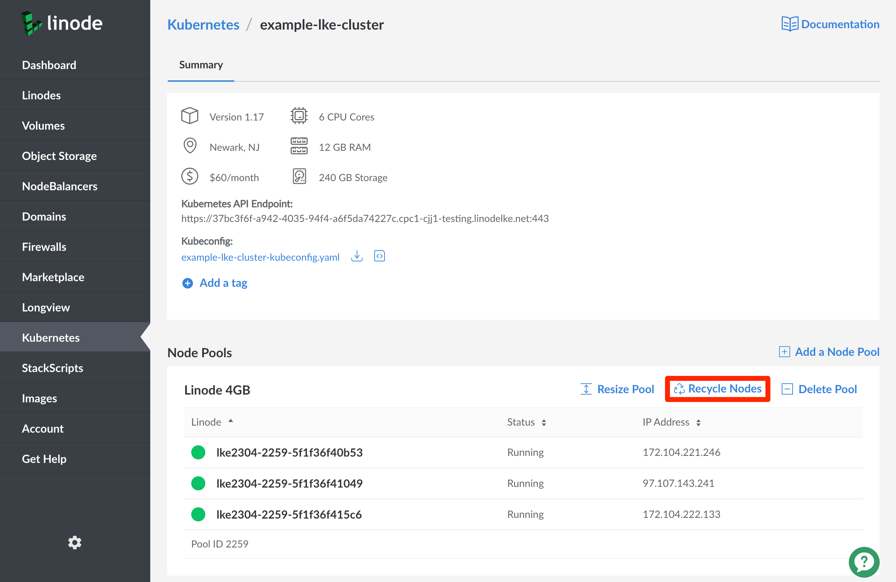

1. To remove a node pool from the [cluster's details page](#access-your-cluster-s-details-page), click the **Delete Pool** option at the top-right of each entry in the **Node Pools** section. A pop-up message will then appear confirming that you're sure you'd like to proceed with deletion. Select the `Delete` option, and your Node Pool will proceed to be deleted.

    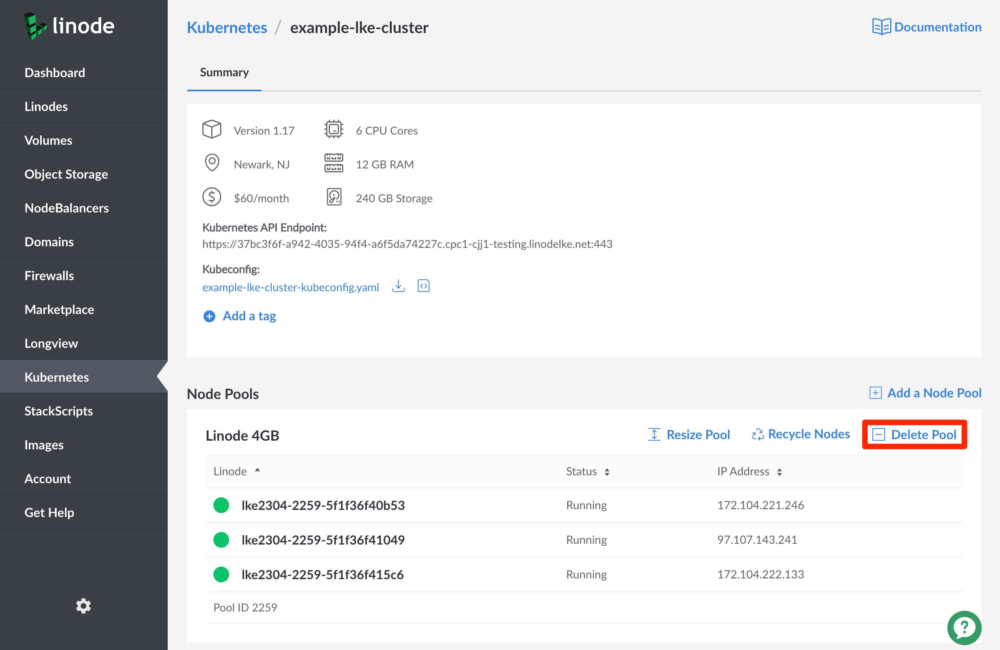

    
Your cluster must always have at least one active node pool.
    

## Delete a Cluster

 You can delete an entire cluster using the Linode Cloud Manager. These changes cannot be reverted once completed.

1.  Click the **Kubernetes** link in the sidebar. The Kubernetes listing page will appear and you will see all your clusters listed.

    

1. Select the **More Options Ellipsis** to the right of the cluster you'd like to delete, and select the `Delete` option:

    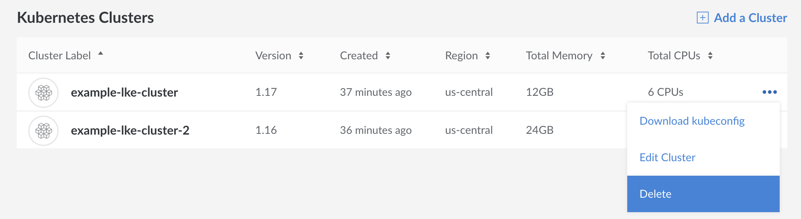

1.  A confirmation pop-up will appear. Enter in your cluster's name and click the **Delete** button to confirm.

    

1.  The Kubernetes listing page will appear and you will no longer see your deleted cluster.

## General Network and Firewall Information



## Next Steps

Now that you have a running LKE cluster, you can start deploying workloads to it. Refer to our other guides to learn more:

 - [How to Deploy a Static Site on Linode Kubernetes Engine](/docs/kubernetes/how-to-deploy-a-static-site-on-linode-kubernetes-engine/)
 - [Create and Deploy a Docker Container Image to a Kubernetes Cluster](/docs/kubernetes/deploy-container-image-to-kubernetes/)
 - [Troubleshooting Kubernetes Guide](/docs/kubernetes/troubleshooting-kubernetes/)
 - [See all our Kubernetes guides](/docs/kubernetes/)
