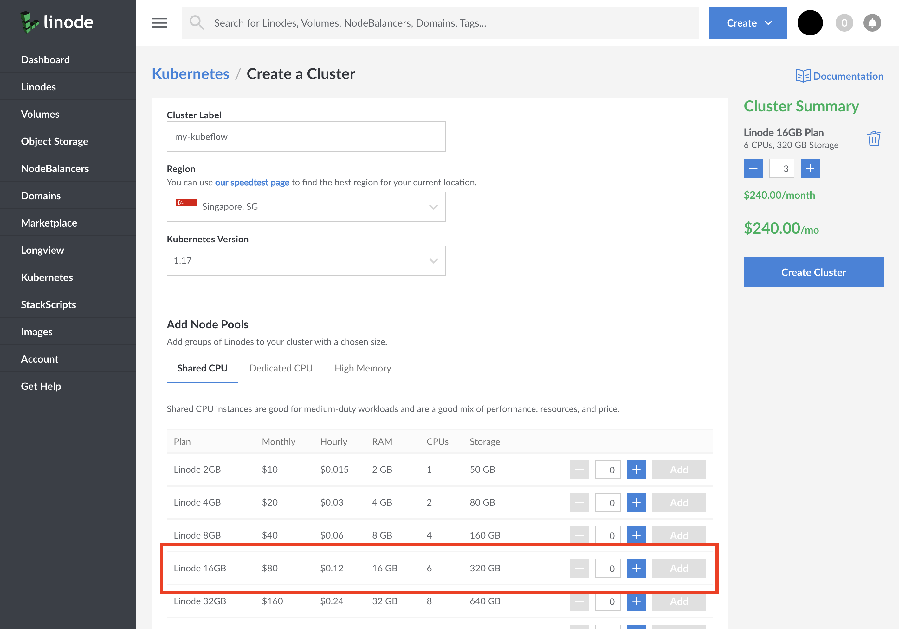
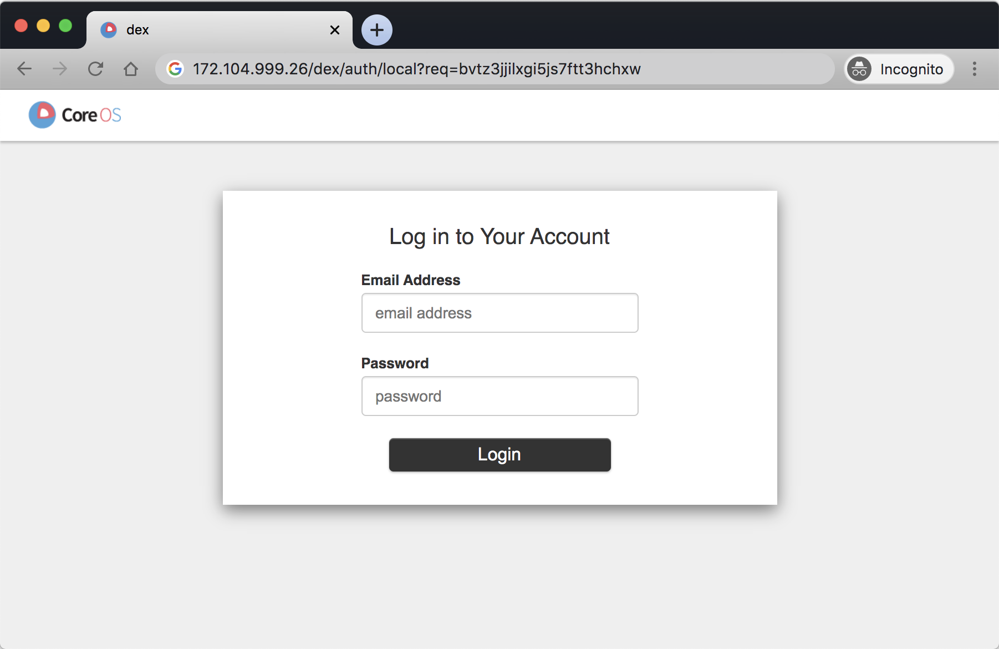
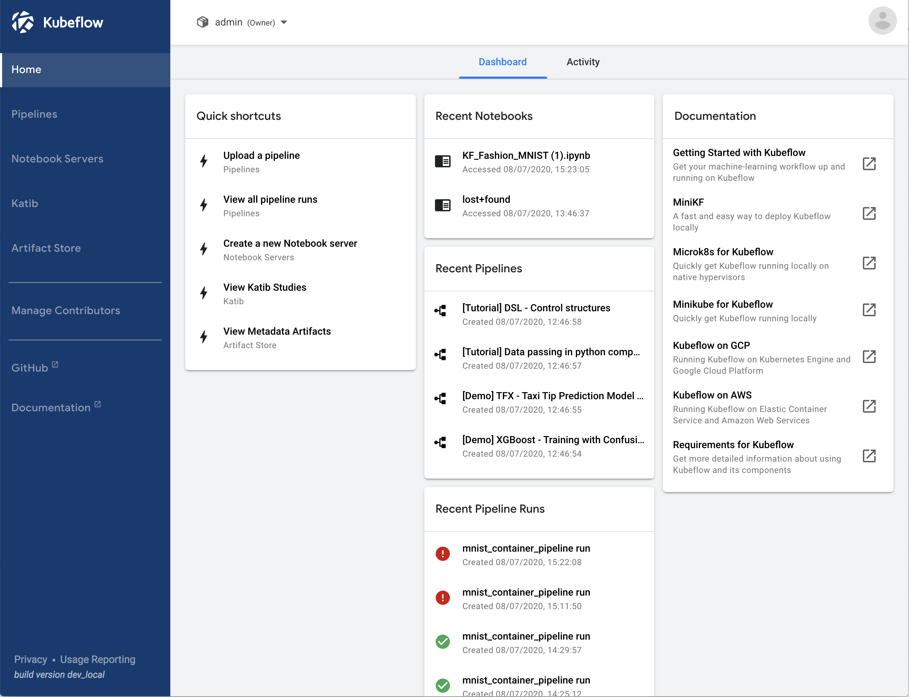
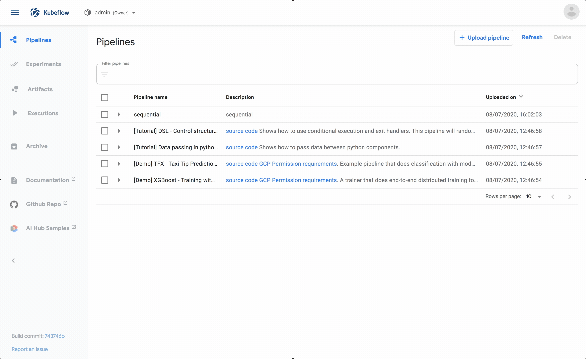

---
author:
  name: Daniele Polencic
  email: daniele@learnk8s.io
description: 'How to deploy Kubeflow and train a model using Kubeflow pipelines on Linode Kubernetes Engine.'
og_description: 'Learn how to deploy Kubeflow and train a model using Kubeflow pipelines on Linode Kubernetes Engine.'
keywords: ['kubernetes','kubeflow','machine learning','containers','tensorflow']
license: '[CC BY-ND 4.0](https://creativecommons.org/licenses/by-nd/4.0)'
published: 2020-07-08
modified_by:
  name: Linode
title: "How to deploy Kubeflow on Linode Kubernetes Engine"
h1_title: "How to deploy Kubeflow on Linode Kubernetes Engine"
contributor:
  name: Daniele Polencic
  link: https://github.com/danielepolencic
external_resources:
- '[Multi-user, auth-enabled Kubeflow installation](https://www.kubeflow.org/docs/started/k8s/kfctl-istio-dex/)'
- '[Kubeflow Jupyter notebooks](https://www.kubeflow.org/docs/notebooks/)'
- '[Kubeflow pipelines](https://www.kubeflow.org/docs/pipelines/)'
---

## What is Kubeflow?

[Kubeflow](https://www.kubeflow.org/) is an excellent alternative for training and evaluating machine learning models in public and private clouds.

Kubeflow is designed to make your machine learning experiments portable and scalable.

You start by creating [Jupyter notebooks](https://jupyter.org/) in the cloud.

When you sense that you have hit a breakthrough, you can scale your model to run on thousands of machines.

Kubeflow optimises your model and breaks it down into smaller tasks that can be processed in parallel.

Then, it distributes the tasks to several computers and waits until the results are ready.

_Are you ready to train your model at scale?_

## Before You Begin

1.  Please notice that you can run this tutorial locally using [minikf](https://www.kubeflow.org/docs/started/workstation/getting-started-minikf/). However, you should have at least 12GB of RAM, 2CPUs and 50GB of disk space available.

2.  The `kfctl` CLI used to deploy Kubeflow currently only works on Linux and Mac. If you're on Windows, you can use WSL2 or a Docker container to work around this limitation.

3.  Most Kubeflow pipelines require [Kubernetes Volumes](https://kubernetes.io/docs/concepts/storage/persistent-volumes/#access-modes) that can be attached to several nodes at once (ReadWriteMany). Currently, the only mode supported by the Linode Block Storage CSI driver is ReadWriteOnce, meaning that it can only be connected to one Kubernetes node at a time.

## Create an LKE Cluster

Follow the instructions in [Deploying and Managing a Cluster with Linode Kubernetes Engine Tutorial](https://www.linode.com/docs/kubernetes/deploy-and-manage-a-cluster-with-linode-kubernetes-engine-a-tutorial/) to create and connect to an LKE cluster.

The [official Kubeflow documentation](https://www.kubeflow.org/docs/started/k8s/overview/) recommends provisioning a cluster with at least 4 CPU, 12GB of memory and 50GB of space available.

We recommend running three "Linode 16GB" nodes — that should give you enough resources to scale your models.



You can verify that the installation is successful with:

```bash
kubectl get nodes
```

The output should similar to:


NAME                        STATUS   ROLES    AGE   VERSION
lke7189-9006-5f05145fc9a3   Ready    <none>   8h    v1.17.3
lke7189-9006-5f051460a1e2   Ready    <none>   8h    v1.17.3
lke7189-9006-5f0514617a87   Ready    <none>   8h    v1.17.3


## Install Kubeflow

To install Kubeflow, you need three parts:

1. A Kubernetes cluster, which you already provisioned in the previous step.
1. `kfctl` — a command-line tool that configures and deploy Kubeflow.
1. A `KfDef` file — a recipe of components that should be included in your Kubeflow installation.

You can [download and install `kfctl` from the official repository](https://github.com/kubeflow/kfctl/releases/).

> Please notice that there is no Windows release available at the moment.

You can verify that the binary is installed correctly with:

```bash
kfctl version
```

The last piece of the puzzle is the `KfDef` file.

You can think of the `KfDef` file as a list of components that should be installed with Kubeflow.

As an example, Kubeflow can be configured to use the [Spark operator](https://github.com/GoogleCloudPlatform/spark-on-k8s-operator), [Katib (Hyperparameter Tuning)](https://www.kubeflow.org/docs/components/hyperparameter-tuning/hyperparameter/), [Seldon serving](https://www.kubeflow.org/docs/components/serving/seldon/), etc.

You can download the following `KfDef` that includes a lighter version of Kubeflow as well as [Dex — an identity provider](https://github.com/dexidp/dex) useful for managing user access.

```bash
wget https://raw.githubusercontent.com/learnk8s/kubeflow-pipelines-demo/master/kfctl_istio_dex.v1.0.2-pipelines.yaml
```

If you open the file, you can see the various components that are about to be installed.

If you pay attention to line 116 and 118, you might also notice a username and password.

Those are the default username and password that you will use to log in into Kubeflow.

You can change the values if you wish to have a different username and password other than `admin@kubeflow.org` and `12341234`.

Once you're ready, you can generate the configuration with:

```bash
kfctl build -f kfctl_istio_dex.v1.0.2-pipelines.yaml
```

You should notice that a new folder named `kustomize` was created.

If you inspect the folder, you should find a collection of components and configurations.

You can apply the configuration with:

```bash
kfctl apply -f kfctl_istio_dex.v1.0.2-pipelines.yaml
```

The command reads the `KfDef` definition, the kustomize folder and submits all resources to the cluster.

The process could easily take 15 to 20 minutes, depending on your cluster specs.

You can monitor the progress of the installation from another terminal with:

```bash
kubectl get pods --all-namespaces
```

As soon as `kfctl` completes the installation, it might take a little longer for all Pods to be in a _Running_ state.

Once the installation is completed, you can decide how you will use Kubeflow.

You have two options:

1. You can temporarily create a tunnel to your Kubeflow cluster. The cluster is private, and only you can access it.
1. You can expose the cluster to the internet with a NodeBalancer.

If you prefer creating a tunnel, you should execute the following command:

```bash
kubectl port-forward --namespace istio-system service/istio-ingressgateway 8080:80
```

If you can visit <http://localhost:8080> in your browser, you should see a login page.

If you prefer a more permanent solution, you can expose the login page with a NodeBalancer.

Execute the following command:

```bash
kubectl patch service --namespace istio-system istio-ingressgateway -p '{"spec": {"type": "LoadBalancer"}}'
```

The command exposes the [Istio Ingress Gateway](https://www.kubeflow.org/docs/started/k8s/kfctl-k8s-istio/#access-the-kubeflow-user-interface-ui) to external traffic.

You can obtain the IP address for the load balancer with:

```bash
kubectl get service --namespace istio-system istio-ingressgateway
```

The output should look like:


NAME                   TYPE           CLUSTER-IP     EXTERNAL-IP      PORT(S)                                                                                                                                      AGE
istio-ingressgateway   LoadBalancer   10.128.29.15   139.999.26.160   15020:31944/TCP,80:31380/TCP,443:31390/TCP,31400:31400/TCP,15029:32622/TCP,15030:31175/TCP,15031:31917/TCP,15032:31997/TCP,15443:30575/TCP   8m2s


Make a note of the `EXTERNAL-IP` IP address.

You can visit that IP address in your browser.



If you haven't changed the credential _(you should!)_ the default username and password are:

- username `admin@kubeflow.org`
- password `12341234`

Once logged in, you should see Kubeflow's dashboard.



Congratulations!

You just installed Kubeflow!

_But does it work?_

Let's find out.

Kubeflow has two frequently used features: pipelines and Jupyter notebooks.

In this part, you will create a Jupyter notebook.

## Jupyter notebooks

A Jupyter notebook is a convenient environment to explore and create machine learning models.

The notebook runs in Kubeflow, so you can create environments that are as big as your Linodes (if you selected the 16GB memory Linode, you might be able to create notebook servers with up to 14GB of memory and 3 CPUs).

Creating a notebook is straightforward:


Please notice that you can't create notebook servers that have specs higher than a single Linode.

The notebook server is not distributed and runs as a single Pod in the Kubernetes cluster.

If you wish to run your model at scale, you might want to use Kubeflow's Pipelines.

## Kubeflow pipelines

Kubeflow pipelines are similar to CI/CD pipelines.

You define sequential (or parallel) tasks and connect them.

In CI/CD pipelines, the tasks are usually a sequence of build, test and deploy.

In Kubeflow pipelines you have something similar: train, predict and serve.

There are a few examples in the "Pipelines" section that you can test.

As an example, you can select the "Data passing in Python components" pipeline.



The pipeline has three independent tasks that are meant to demonstrate how to:

- Generate data (i.e. writing to a file).
- Consume data (i.e. reading from a file).
- Transform data (i.e. reading, processing and writing to a file).

You can [explore the Python code using a Jupyter notebook](https://github.com/kubeflow/pipelines/blob/master/samples/tutorials/Data%20passing%20in%20python%20components.ipynb).

[The same code is used to generate a pipeline in Kubeflow](https://github.com/kubeflow/pipelines/blob/master/samples/tutorials/DSL%20-%20Control%20structures/DSL%20-%20Control%20structures.py).

_How do you build a pipeline?_

Pipelines are written using Python and a Kubeflow specific DSL.

While you can leverage your existing Python models, there's a small amount of changes necessary to teach Kubeflow how to break your model into smaller parts for distributed processing.

The best resource to [continue learning Kubeflow pipelines](https://www.kubeflow.org/docs/pipelines/sdk/sdk-overview/) is the official documentation.

