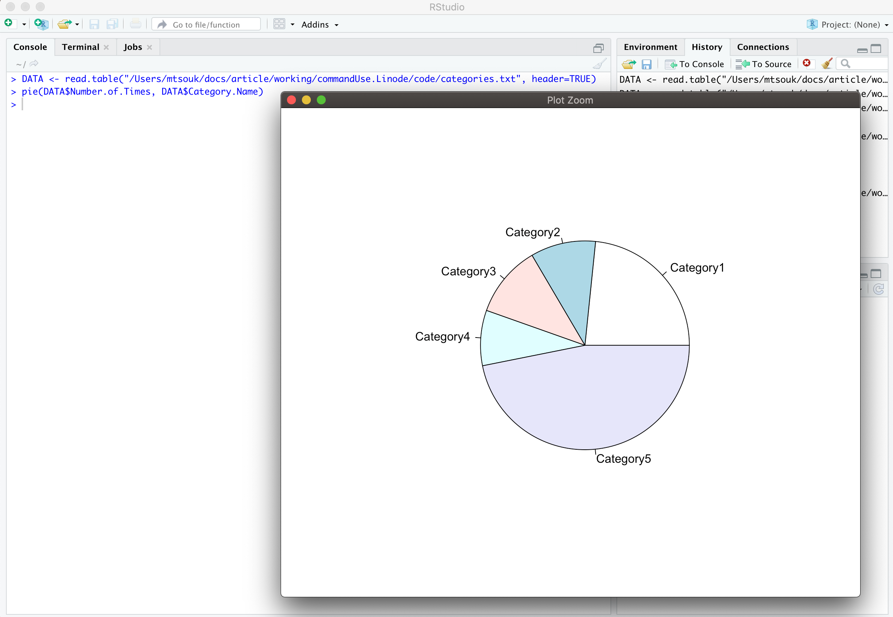
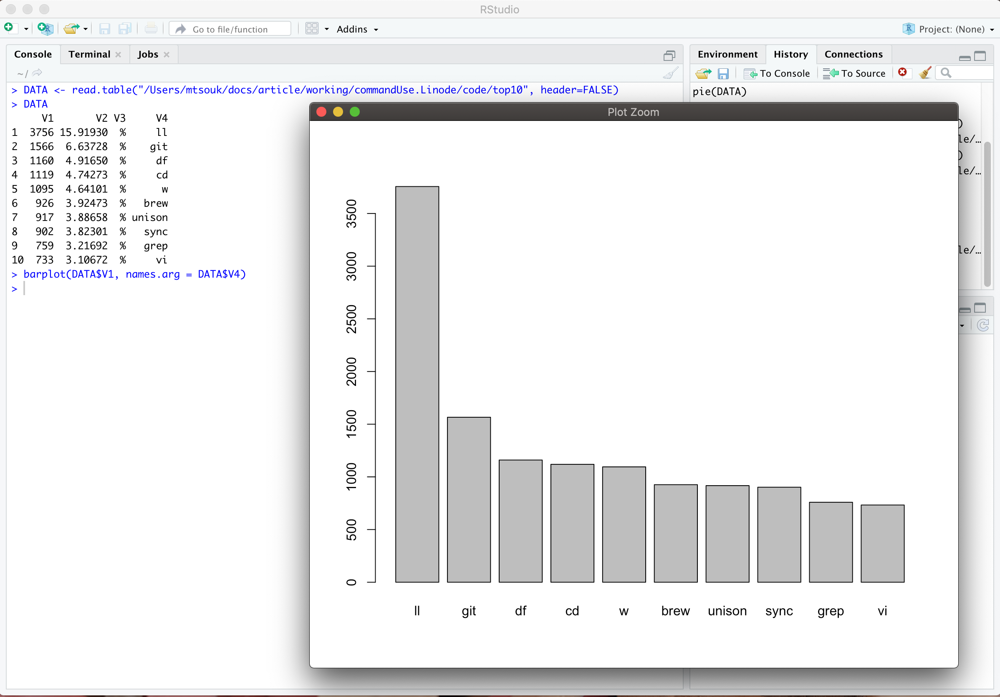
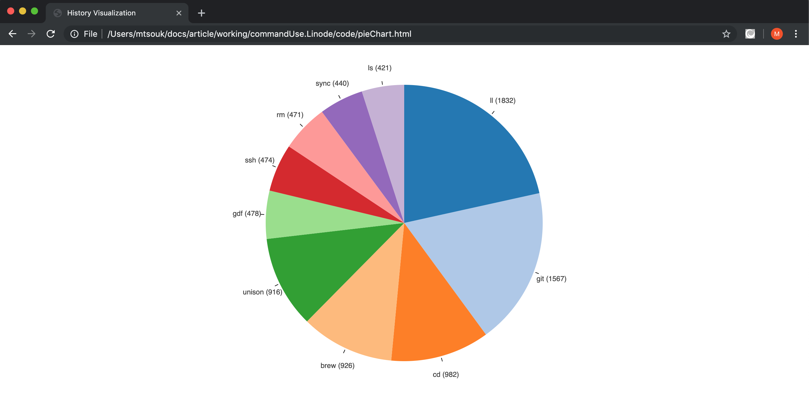

---
author:
  name: Mihalis Tsoukalos
  email: mihalistsoukalos@gmail.com
description: 'An Overview of Popular Data Visualization Tools'
keywords: ["UNIX", "shell", "bash", "Visualization", "R", "Python", "Perl"]
license: '[CC BY-ND 4.0](https://creativecommons.org/licenses/by-nd/4.0)'
published: 2019-09-07
modified_by:
  name: Linode
title: 'An Overview of Popular Data Visualization Tools'
contributor:
  name: Mihalis Tsoukalos
  link: https://www.mtsoukalos.eu/
external_resources:
  - '[GNU Bash](https://www.gnu.org/software/bash/)'
  - '[Z Shell](https://www.zsh.org/)'
---

## Introduction

In this guide we are going to learn how to analyze user commands taken from one or more bash shell history files or from history files of other shells converted to the bash history file format. Moreover, this guide will show how to visualize the generated results and the history files.


This guide is written for a non-root user. Depending on your configuration, some commands might require the help of `sudo` in order to get property executed. If you are not familiar with the `sudo` command, see the [Users and Groups](/docs/tools-reference/linux-users-and-groups/) guide.


## Create Your Data Set

## About the data

### Bash history file format

The format of the history file of bash shell is as follows:

    head ~/.bash_history

git commit -a -m "Fixed Constants links"
git push
git diff
docker images
brew update; brew upgrade; brew cleanup
git commit -a -m "Cleanup v2 and v3"
git push
git commit -a -m "Added examples section"
git push
cat ~/.lenses/lenses-cli.yml


As you can see, bash history files just contain the entire shell command and do not keep information about the time or the date a command was executed – this is not a problem, just an observation.

### The Zsh history file format

The format of the history file of Z shell is as follows:

    head ~/.zsh_history

: 1532951196:0;git commit -a -m "Changed .gitignore"
: 1532951224:0;git diff mt/pipeline-ref
: 1532951326:0;g co -
: 1532951341:0;g checkout -
: 1532951732:0;vi pipeline-yaml_5b5744d40428631d7a8940a9.md
: 1532951755:0;git diff master
: 1532951848:0;git commit -a -m "Deleted a line"
: 1532952856:0;git checkout -b mt/glossary-fix
: 1532952932:0;git commit -a -m "Deleted the secret entry"
: 1532952945:0;git commit -a -m "Deleted the repository entry"


As this is not the same to the format of the history file that we will be using in this guide, we will need to clean it up using the following command:

    awk -F ";" '{$1=""; print $0}' ~/.zsh_history | sed "s/^[ \t]*//" | head

git commit -a -m "Changed .gitignore"
git diff mt/pipeline-ref
g co -
g checkout -
vi pipeline-yaml_5b5744d40428631d7a8940a9.md
git diff master
git commit -a -m "Deleted a line"
git checkout -b mt/glossary-fix
git commit -a -m "Deleted the secret entry"
git commit -a -m "Deleted the repository entry"


The `sed` command removes any spaces or tab characters from the beginning of a line.

You should save the output of the previous command in order to use it in the rest of the guide. This can be done as follows:

    awk -F ";" '{$1=""; print $0}' ~/.zsh_history | sed "s/^[ \t]*//" > h4

The previous command saves the output in a file named `h4` – you can use any filename you want.

## Analyzing History Files

The files that are going to be examined and analyzed are the following:

    wc history-files/*

     504    1760   14169 history-files/h1
   10000   28863  193034 history-files/h2
    1947    3641   26381 history-files/h3
   11143   39945  298548 history-files/h4
   23594   74209  532132 total


### Finding the most popular commands

This part of the guide will present an AWK program that shows the 10 most popular commands with the help of some traditional UNIX command line utilities:

    cat history-files/* | awk '{CMD[$1]++;count++;} END {for (a in CMD)print CMD[a] " "CMD[a]/count*100 " % " a;} ' | grep -v "./" | column -c3 -s " " -t | sort -rn | head -10

3756  15.9193     %  ll
1566  6.63728     %  git
1160  4.9165      %  df
1119  4.74273     %  cd
1095  4.64101     %  w
926   3.92473     %  brew
917   3.88658     %  unison
902   3.82301     %  sync
759   3.21692     %  grep
733   3.10672     %  vi


Apart from the number of history entries that contain a command, you can also see the percentage of any command. The previous output will be processed later on by R so you can save it as `top10`.

### Categorizing by Command Length

In this section we are going to use a script written in Perl. The Perl script expects a single argument, which must be the directory that holds all history files that you want to process.


#!/usr/bin/perl -w

use strict;

my $directory = "";
my $filename = "";

my $CAT1 = 0;
my $CAT2 = 0;
my $CAT3 = 0;
my $CAT4 = 0;
my $CAT5 = 0;

if ( @ARGV != 1 ) {
   die <<Thanatos
      usage info:
         Please use exactly 1 argument!
Thanatos
}

($directory) = @ARGV;
print "The following text files found in directory $directory:\n";
opendir(BIN, $directory)
    || die "Error opening directory $directory: $!\n";

while (defined ($filename = readdir BIN) ) {
    # The following command does not process . and ..
    next if( $filename =~ /^\.\.?$/ );
    print $filename."\n";
    process_file($directory."/".$filename);
}

print "Category1\t\t$CAT1\n";
print "Category2\t\t$CAT2\n";
print "Category3\t\t$CAT3\n";
print "Category4\t\t$CAT4\n";
print "Category5\t\t$CAT5\n";
exit 0;

sub process_file {
    my $file = shift;
    my $line = "";

    open (HISTORYFILE, "< $file")
        || die "Cannot open $file: $!\n";

    while (defined($line = <HISTORYFILE>)) {
        chomp $line;
        next if ( ! defined($line) );
        check_category($line);
    }
}

sub check_category {
    my $command = shift;
    chomp $command;
    my $length = length($command);

    if ( $length <= 2 ) { $CAT1 ++; }
    elsif ( $length <= 5 ) { $CAT2 ++; }
    elsif ( $length <= 10 ) { $CAT3 ++; }
    elsif ( $length <= 15 ) { $CAT4 ++; }
    else { $CAT5 ++; }
}


The output of `length.pl` will resemble the following:

    ./length.pl history-files

The following text files found in directory history-files:
h2
h4
h3
h1
Category1       5514
Category2       2381
Category3       2624
Category4       2021
Category5       11055


The last 5 lines of the previous output will be saved as `categories.txt` and will be used in a while by R. Additionally, a header line was added to `categories.txt` – you can easily modify the Perl script to print just the desired output. So, the final version of `categories.txt` will be as follows:

    cat categories.txt

"Category Name" "Number of Times"
Category1       5514
Category2       2381
Category3       2624
Category4       2021
Category5       11055



You can create your own categories, according to your own specific needs by modifying the presented Perl script.


## Visualizing History Files

In the second part of this guide, you are going to learn how to visualize the history files or their summaries.

### Using R

[R](https://www.r-project.org/) comes with a very capable programming language as far as visualization and statistical analysis are concerned. In this section we are going to analyze the contents of `categories.txt` using R and visualize the most popular commands (`top10`).

This is a screenshoot from [R Studio](https://www.rstudio.com/products/rstudio/download/), which is a GUI for R, that shows a graphical representation of `categories.txt` as a *pie chart* as well as the R commands used for creating it. Generally speaking R is excellent at visualizing data!

Similarly, this is a screenshoot from R Studio that shows a graphical representation of `top10` as a *bar plot* as well as the R commands used for creating it.

### Creating a Word Cloud

In this section we are going to create a Word Cloud for the commands. The Word Cloud is going to be created using Python 3 and some handy Python 3 packages.


#!/usr/bin/env python3

import pandas as pd
import matplotlib.pyplot as plt
from wordcloud import WordCloud, STOPWORDS

data = pd.read_table('./history-files/h1', header = None, names=["CMD"])

skipWords = []
skipWords.extend(STOPWORDS)

words = ''.join(data['CMD'])

w = WordCloud(
                       stopwords=set(skipWords),
                       background_color='gray',
                       width=4000,
                       height=2000
                      ).generate(words)

plt.imshow(w)
plt.axis("off")
plt.savefig('./word_cloud.png', dpi=1000)


The Python 3 script uses the `pandas`, `matplotlib` and `wordcloud` libraries, which should be installed for the script to run, processes the `h1` history file and generates no output on the terminal. However, it creates a PNG image named `word_cloud.png`. The generated image will look similar to the following.

### Using D3.js

[D3.js](https://d3js.org/) is a very popular visualization library written in JavaScript. This part of the guide will use D3.js to visualize history files - the output will also be a pie chart. The tricky point with D3.js is that for D3.js to process its data, the data should be in JSON format. The `cToJSON.go` command line utility will be used for creating a summary of one or more history files, finding out the 10 most popular commands and converting that output into the JSON format.


package main

import (
    "bufio"
    "flag"
    "fmt"
    "io"
    "os"
    "regexp"
    "sort"
)

var DATA = make(map[string]int)

func lineByLine(file string) error {
    var err error
    f, err := os.Open(file)
    if err != nil {
        return err
    }
    defer f.Close()

    r := bufio.NewReader(f)
    for {
        line, err := r.ReadString('\n')
        if err == io.EOF {
            break
        } else if err != nil {
            fmt.Printf("error reading file %s", err)
            break
        }

        r := regexp.MustCompile("[^\\s]+")
        words := r.FindAllString(line, -1)
        if len(words) == 0 {
            continue
        }

        if _, ok := DATA[words[0]]; ok {
            DATA[words[0]]++
        } else {
            DATA[words[0]] = 1
        }

    }
    return nil
}

func main() {
    flag.Parse()
    if len(flag.Args()) == 0 {
        fmt.Printf("usage: cToJSON <file1> [<file2> ...]\n")
        return
    }

    for _, file := range flag.Args() {
        err := lineByLine(file)
        if err != nil {
            fmt.Println(err)
        }
    }

    n := map[int][]string{}
    var a []int
    for k, v := range DATA {
        n[v] = append(n[v], k)
    }

    for k := range n {
        a = append(a, k)
    }

    fmt.Println("[")
    sort.Sort(sort.Reverse(sort.IntSlice(a)))

    counter := 0
    for _, k := range a {
        if counter >= 10 {
            break
        }

        for _, s := range n[k] {
            if counter >= 10 {
                break
            }
            counter++
            fmt.Printf("{\"command\":\"%s\",\"count\":%d},\n", s, k)
        }
    }
    fmt.Println("];")
}


Although we could have used the JSON capabilities of Go, `cToJSON.go` creates plain text output that is in JSON format, mainly because the JSON format that is used is pretty simple and you have no JSON parsing to do.

    go run cToJSON.go history-files/h3 history-files/h1 history-files/h4

[
{"command":"ll","count":1832},
{"command":"git","count":1567},
{"command":"cd","count":982},
{"command":"brew","count":926},
{"command":"unison","count":916},
{"command":"gdf","count":478},
{"command":"ssh","count":474},
{"command":"rm","count":471},
{"command":"sync","count":440},
{"command":"ls","count":421},
];


Now, we are ready to process the data using D3.js. The D3.js code is embedded into an HTML file named `pieChart.html`, which has the following contents:


<!DOCTYPE html>
<html lang="en">
  <head>
    <meta charset="utf-8">
    <title>History Visualization</title>

    
  </head>

  <body>
    

  </body>

  
  
</html>


Due to the security constraints that apply when trying to load files from the local machine on a web browser, the data is hardcoded in `pieChart.html` and kept in the `DATA` variable – if you are running your own web server, you can store your data there and load it using JavaScript, which means that you can have dynamic output. If you open `pieChart.html` on your favorite web browser, you will see the output of the presented image.

A good exercise for the reader would be to extract all `git` related commands from your history files, and analyze and visualize them.

## Summary

Once you have processed and visualized all your data, you can use the results in order to understand the behavior and the needs of your users and in some cases discover security threats. Additionally, as most techniques can be automated and executed as `cron(8)` jobs, you can get your reports on your machine automatically.

What matters is that even if in 10 or more years the available tools might be different and more advanced, the techniques and the principles will be the same. At the end of the day, experimentation is the key to better visualizations so start trying new and old visualization tools and techniques as soon as possible!
