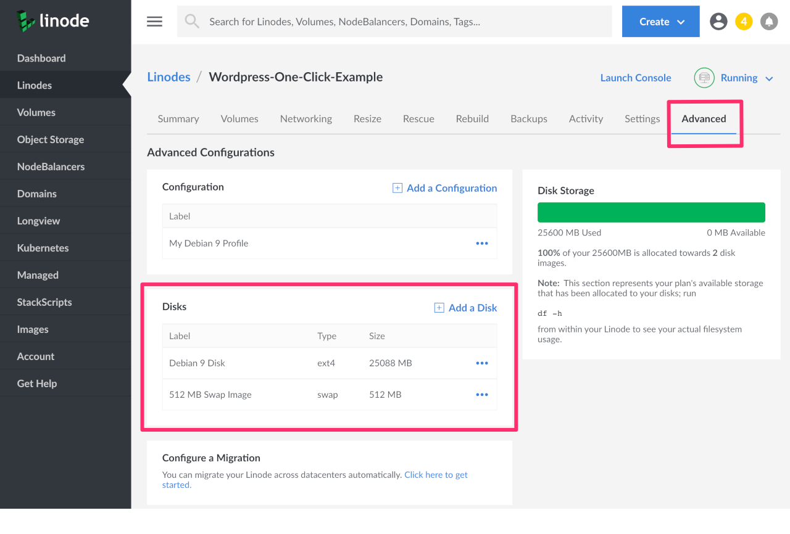

---
author:
  name: Linode
  email: docs@linode.com
description: 'Reference this guide when migrating from Linode&#39;s Classic to Cloud Manager. This guide will help ease that transition by pointing out some of the features that you may need help finding and highlighting some settings that might make your overall manager experience better.'
og_description: 'Reference this guide when migrating from Linode&#39;s Classic to Cloud Manager. This guide will help ease that transition by pointing out some of the features that you may need help finding and highlighting some settings that might make your overall manager experience better.'
keywords: ["classic manager","cloud manager","linode"]
license: '[CC BY-ND 4.0](https://creativecommons.org/licenses/by-nd/4.0)'
published: 2019-12-20
modified_by:
  name: Linode
title: 'A Classic to Cloud Manager Reference Guide'
h1_title: 'A Reference Guide for Classic to Cloud Manager'
contributor:
  name: Linode
---

## Introduction
Linode's Classic Manager is being retired at the end of Janury 2020. At that time all users will be migrated to the new [Cloud Manager](https://cloud.linode.com/). This guide will help ease that transition by pointing out some of the features that you may need help finding and highlighting some settings that might make your overall Cloud Manager experience better.

## Where Can I Find...?
When switching to a new platform, it can be frustrating learning how to find the tools you are used to using. Here are some common things that you might have trouble finding in the new Cloud Manager.

### Find Your Disks
In Classic Manager, Disks were located on the Linode Dashboard tab. In the Cloud Manager, Disks are now in the Advanced tab of the Linode.

1.  Click **Linodes** in the sidebar menu and select the one you wish to see your disks for.

1.  Then click the **Advanced** tab. The disks are located in the **Disks** panel. Here you can add a disk, or for each individual disk, you can click the **more options ellipses** to get a drop down menu which will allow you do choose options such as `Rename`, `Resize`, `Imagize`, `Clone`, and `Delete`.

    

### Find Volumes
In Classic Manager, Manage Volumes was found in the Linodes screen. In Cloud Manager, Volumes are their own top-level menu item in the sidebar.

### Find Images
In Classic Manager, Manage Images was found in the Linodes screen. In Cloud Manager, Images are their own top-level menu item in the sidebar.

### Find StackScripts
In Classic Manager, Manage StackScripts was found in the Linodes screen. In Cloud Manager, StackScripts are their own top-level menu item in the sidebar.

### Find Credit Remaining
You can see the amount you have in available credit through the Cloud Manager by clicking on **Account** from the main menu. On the right hand side of the screen you’ll see a section marked **Billing Information**. If you have credit stored on your account, it’ll appear in green under the **Current Balance** field.

### DNS Manager
In Classic Manager, DNS Manager is where you can control your domains. In Cloud Manager, this is now called Domains and it is located on the sidebar.

## Compact Mode
Cloud Manager by default uses more whitespace on the screen. However, there is a *Compact Mode* which compresses this extra space and allows more information to be displayed on the screen. This setting is located at the bottom lefthand corner of the screen in the gear icon. This is also where you can toggle on *Dark Mode*.

## Printing an Invoice
You can download and print an invoice in both Classic and Cloud Managers.

In Classic Manager this is found at the bottom of an invoice. You must open an invoice to see this link.

In Cloud Manager you can download a printable PDF of your invoice from the list of invoices or from within an invdividual invoice.

1.  Navigate to your Account by clicking on Account in the sidebar.

1.  Click on the Recent Invoices menu item in the Billing Panel. This will expand to show you a list of your recent invoices. Each invoice has a **Download PDF** link next to it.

    

1.  You can also click on any invoice to view it in the browser. At the top of the invoice there is a **Download PDF** button.

    

## Import Display Groups
If you have used the Display Groups feature in the Classic Manager, you can import your Display Groups to the Cloud Manager as tags:

1.  Navigate to the **Account** page in the sidebar links menu, then click on the **Settings** tab.

1.  Expand the panel labeled **Import Display Groups as Tags** and then click **Import Display Groups**:

    

1.  A form will appear that lists your Display Groups and asks you to confirm the import action. To proceed, click the **Import Display Groups Now** button in this form.

    
Importing your Display Groups is a **one-time** operation. If you don't have any Display Groups configured in the Classic Manager this feature will not appear in the Cloud Manager.


## Manage Email Event Notifications
You can manage your email event notifcations in both Classic and Cloud manager. These notifications will alert you when new events such as booting, shutting down, or updates to a Linode occur on your account.

In Classic Manager this was done in **Notifications** under **my profile**. In Cloud Manager this is done in **Settings** under **Profile**.

## Delete a Public IP Address
You can delete Public IP addressess in both Classic and Cloud managers. In Classic Manager, this was done under the **Remote Access** tab in the Linode you wished to modify. In Cloud Manager it is done in the **Networking** tab.

1.  Click **Linodes** from the sidebar menu.

1.  Choose the Linode you wish to modify to enter the Linode detail screen. Then click on the **Networking** tab. Your IPv4 and IPv6 addressess will be listed here.

1.  Next to the public IPv4 address you wish to delete, click **more options ellipses**. Select the option to **Delete IP** from the drop down menu.

    

1.  A confirmation popup will appear asking if you are sure. Confirm.

    
You must have at least one public IP on a Linode. If you attempt to delete the last public IP on a Linode you will recieve an error message *after* you confirm the deletion.


## API Keys/Personal Access Tokens
API Keys from Classic Manager do not transfer. Therefore, if you have keys generated in Classic, you will not see them in Cloud Manager. Additionally, keys are called Personal Access Tokens and can be used for a variety of different uses.

1.  To generate a new Personal Access Token, navigate to your profile by clicking on your username and select **My Profile** from the drop down menu. Then click on the **API Tokens** tab.

    

1.  Click **Add a Personal Access Token**. A panel will display allowing you to give this token a label and choose the access rights you want users authenticated with the new token to have.

    

1.  When you have finished, click **Submit** to generate a new Personal Access Token. Copy the token and save it to a secure location before closing the popup. **You will not be able to view this token through the Cloud Manager after closing the popup.**

## Next Steps

See the following guides for more features of Cloud Manager:

 - [What are the Cloud Manager Events and Activity Feeds](/linode/cloud-manager/what-are-the-cloud-manager-events-and-activity-feeds/)
 - [Longview in Cloud Manager](/platform/longview/what-is-longview/)

 If you still need help finding features in or using Cloud Manager, please contact [Linode Support](/platform/billing-and-support/support/).