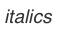
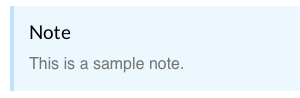
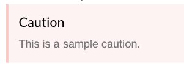

At Linode, we use Markdown. We even created a few custom tags of our own. Use the tables below to get started with your first Linode guide. Feel free to copy and paste from the left hand columns into a text editor.

To start writing, find a Markdown interpreter. Try [Nottingham](http://clickontyler.com/nottingham/), a simple, free notepad for Mac; command, shift, and p to preview Markdown. For more advanced text editors, try [textmate](http://macromates.com) or [Sublime Text](http://www.sublimetext.com/).

##Markdown

<table style="width:100%">
  <tr>
    <td>
     
    #Main Title 
    </td>     
    <td>
     
     
    </td>
  </tr>
  <tr>
    <td>
     
    ##Primary Section 
    </td>     
    <td>
     
     
    </td>
  </tr>
  <tr>
    <td>
     
    ###Sub-section 
    </td>     
    <td>
     
     
    </td>
  </tr>
  <tr>
    <td>
     
    *italics* 
    </td>     
    <td>
     
     
    </td>
  </tr>
  <tr>
    <td>
     
    **bold** 
    </td>     
    <td>
     
     
    </td>
  </tr>    
</table>

##Custom Linode Markdown

<table style="width:100%">
  <tr>
    <td>
    &nbsp;{: .note}
     >
     > This is a sample note.
     
    </td>
    <td></td>      
  </tr>
  <tr>
    <td>
     
    &nbsp;{: .caution}
     >
     > This is a sample caution.
         
    </td>
    <td>
    
    </td>        
  </tr>    
</table>

     

|Left-Aligned Col  |Center-Aligned Col  | Right-Aligned Col  |
|:-----------------|:------------------:|-------------------:|
| Item1            | Entry1             | Date1              |           
| Item2            | Entry2             | Date2              |
| Item3            | Entry3             | Date3              |

 

| Note > >    | Picture |   |   |   |
|-------------|---------|---|---|---|
| Caution > > |         |   |   |   |
|             |         |   |   |   |
|             |         |   |   |   |

 
 
 
*italics*

 
 

**bold**

#Main Title

##Primary Section

###Sub-section

 {: .caution} 
> 
> This is a sample caution. 
