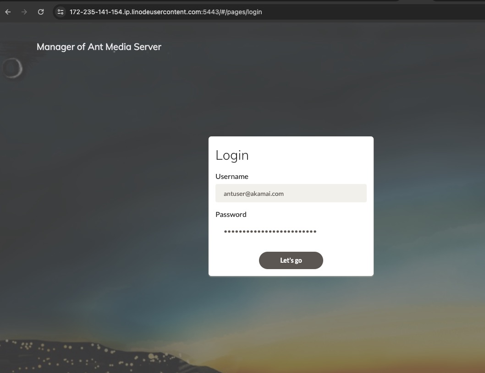

[Ant Media Server](https://antmedia.io/) is an [open source](https://github.com/ant-media/Ant-Media-Server) video streaming platform known for its scalability and low latency. It supports WebRTC live streaming, as well as CMAF and HLS streaming, and can be ingested through RTMP, WebRTC, or HLS. There are two editions of Ant Media Server: Community Edition and Enterprise Edition. This Marketplace App installs the Enterprise Edition, which is equipped with more features and enhanced performance. See this [Comparison Chart](https://github.com/ant-media/Ant-Media-Server/wiki#community-edition--enterprise-edition) for details.


The Enterprise Edition of Ant Media Server requires a valid license to use the software beyond the initial 14 day [free trial](https://antmedia.io/free-trial/) period. To purchase a license, visit [Ant Media's website](https://antmedia.io/#selfhosted) and select a plan that fits your needs. Licenses are not available directly through Linode. Alternatively, you can deploy the free [Ant Media Server Community Edition Marketplace App](/docs/marketplace-docs/guides/antmediaserver/).


## Deploying a Marketplace App

{}

{}


**Estimated deployment time:** Ant Media Enterprise Server should be fully installed within 5-10 minutes after the Compute Instance has finished provisioning.


## Configuration Options

- **Supported distributions:** Ubuntu 22.04 LTS
- **Recommended plan:** 16GB Dedicated CPU Instance

### Ant Media Server Options

- **Email address for the Ant Media Server Login & SSL Generation:** Enter the email address that should be used to log in to the Ant Media Dashboard, and generate free Let's Encrypt SSL certificates.

{}

{}

{}

## Getting Started after Deployment

### Access the Ant Media Server Dashboard


The Ant Media Server will deploy with an administrator account preconfigured using the email entered in the `email address` UDF on deployment. The generated password is in the `/home/$USERNAME/.credentials` along with the sudo user password.


1.  Using [LISH](/docs/products/compute/compute-instances/guides/lish/) or [SSH](/docs/guides/connect-to-server-over-ssh/) connect to the instance and access the Ant Media Server credentials in the `/home/$USERNAME/.credentials` file. You will find an example of the output below. Keep in mind that $USERNAME will be replaced with your chosen sudo username.

    ```command
    cat /home/$USERNAME/.credentials
    ```

    ```output
    Sudo Username: $USERNAME
    Sudo Password: Fs4WomBrHCI27M5fZg2PJfnW
    Ant Media Server Username: antuser@akamai.com
    Ant Media Server Password: 79KP106i3AxW8YOmaWA7FNVo
    ```

1.  Open your web browser and navigate to `https://[domain]:5443`, where *[domain]* can be replaced with the custom domain you entered during deployment or your Compute Instance's rDNS domain (such as `192-0-2-1.ip.linodeusercontent.com`). You can also use your IPv4 address. See the [Managing IP Addresses](/docs/products/compute/compute-instances/guides/manage-ip-addresses/) guide for information on viewing IP addresses and rDNS.

1.  Use the `Ant Media Server Username` and `Ant Media Server Password` from the `credentials` file to log in to the Ant Media Dashboard.

    

1.  Once logged in to the Ant Media Server Dashboard, you can manage your entire application.

    

1.  To start using the Enterprise Edition of Ant Media Server, you need to obtain a license. Visit the [Self-Hosted Solutions](https://antmedia.io/#selfhosted) page on Ant Media's website to order a license.

1.  Once you obtained the license key, navigate to the Settings tab within the Ant Media Dashboard, enter the License Key, and click **Save**.

    

For more on Ant Media Server, check out the following resources:

- [Ant Media Server wiki](https://github.com/ant-media/Ant-Media-Server/wiki)
- [Publishing a Live Stream](https://github.com/ant-media/Ant-Media-Server/wiki/Publishing-Live-Streams)

{}