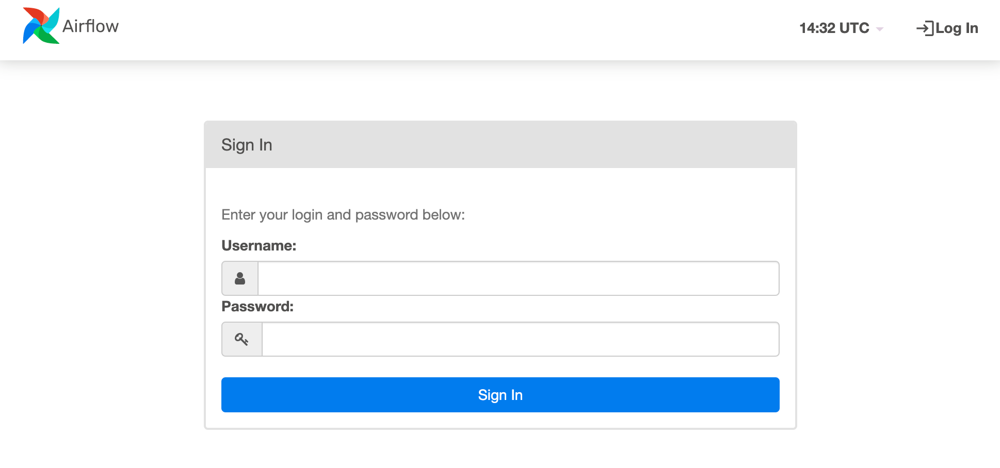
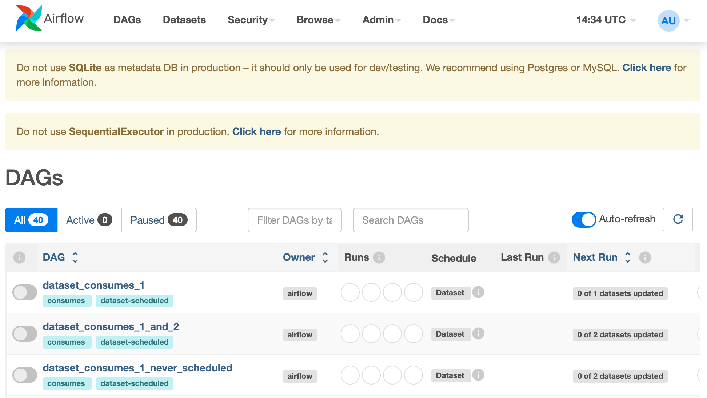

[Apache Airflow](https://airflow.apache.org) is an open source workflow management platform for data engineering pipelines. You can use it to automate, orchestrate, and monitor workflows and data pipelines. One of Airflow’s greatest features is that you can create and execute workflows with code. When you use workflows that are powered by code, you can version control, collaborate on, and debug your workflows.


To learn more about Airflow and determine if it's the right tool for you, read through the [What is Airflow](https://airflow.apache.org/docs/apache-airflow/stable/index.html) guide within the official Apache Airflow docs.


## Deploying a Quick Deploy App

{}

{}


**Estimated deployment time:** Apache Airflow should be fully installed within 10-15 minutes after the Compute Instance has finished provisioning.


## Configuration Options

- **Supported distributions:** Ubuntu 24.04 LTS
- **Recommended plan:** All plan types and sizes can be used.

### Apache Airflow Options

- **Email Address** *(required)*: The email address to use for generating SSL certificates.

{}

{}

{}

### Obtain the Credentials

Once the app is deployed, you need to obtain the credentials from the server:

1. Log in to your new Compute Instance using one of the methods below:

    - **Lish Console**: Log in to Cloud Manager, click the **Linodes** link in the left menu, and select the Compute Instance you just deployed. Click **Launch LISH Console**. Log in as the `root` user. To learn more, see [Access your system console using Lish](https://techdocs.akamai.com/cloud-computing/docs/access-your-system-console-using-lish).
    - **SSH**: Log in to your Compute Instance over SSH using the `root` user. To learn how, see [Connect to the Linode](https://techdocs.akamai.com/cloud-computing/docs/set-up-and-secure-a-compute-instance#connect-to-the-linode).

2. Run the following command to access the contents of the `.credentials` file:

    ```command
    cat /home/$USERNAME/.credentials
    ```

This returns the admin password and other details that were automatically generated when the instance was deployed. Save them securely. After your credentials are saved, you can safely delete the file.

## Getting Started After Deployment

Once you have the credentials, you can access your Apache Airflow instance. Open a browser, and navigate to your Linode domain entered during deployment or the rDNS domain `https://203-0-113-0.ip.linodeusercontent.com`.

Within the Airflow login prompt that appears, enter the credentials provided in the `.credentials` file, and sign in.



The Airflow dashboard appears once you're signed in. From here, you can view the DAGs (Directed Acyclic Graphs) and access all other areas of the dashboard.



You can now start using Apache Airflow. If you are unfamiliar with it, consider reading through the official documentation or our provided guide:

- [Airflow > Tutorials](https://airflow.apache.org/docs/apache-airflow/stable/tutorial/index.html)
- [Airflow > How-to Guides](https://airflow.apache.org/docs/apache-airflow/stable/howto/index.html)
- [Create Connections and Variables in Apache Airflow](/cloud/guides/apache-airflow-tutorial-creating-connections-and-variables/)


This Akamai Quick Deploy App deploys Apache Airflow in standalone mode, suitable for development, testing, and initial configurations. Standalone mode is not recommended for [production deployments](https://airflow.apache.org/docs/apache-airflow/stable/production-deployment.html).
