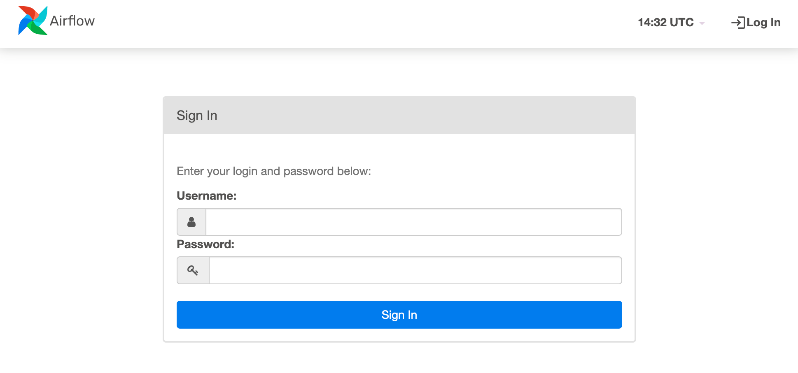
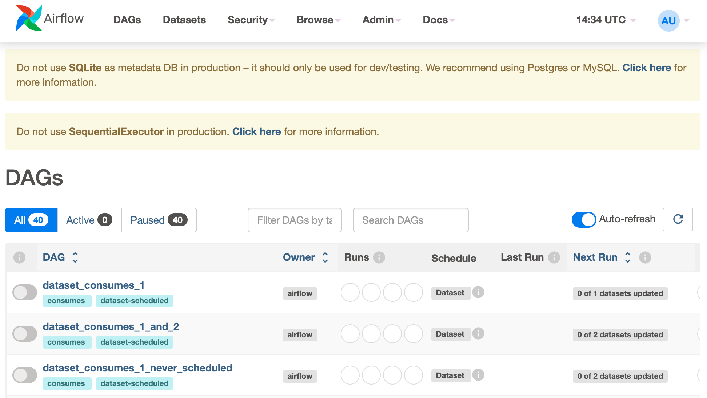

[Apache Airflow](https://airflow.apache.org) is an open source workflow management platform for data engineering pipelines. You can use it to automate, orchestrate, and monitor workflows and data pipelines. One of Airflow’s greatest features is that you can create and execute workflows with code. When you use workflows that are powered by code, you can version control, collaborate on, and debug your workflows.


To learn more about Airflow and determine if it's the right tool for you, read through the [What is Airflow](https://airflow.apache.org/docs/apache-airflow/stable/index.html) guide within the official Apache Airflow docs.


## Deploying a Marketplace App

{}

{}


**Estimated deployment time:** Apache Airflow should be fully installed within 10-15 minutes after the Compute Instance has finished provisioning.


## Configuration Options

- **Supported distributions:** Ubuntu 20.04 LTS
- **Recommended plan:** All plan types and sizes can be used.

### Apache Airflow Options

- **Email Address** *(required)*: The email address to use for generating SSL certificates.

{}

{}

{}

## Getting Started after Deployment

1. Log into your new Compute Instance through [LISH](/docs/products/compute/compute-instances/guides/lish/) or [SSH](/docs/products/compute/compute-instances/guides/set-up-and-secure/#connect-to-the-instance) using the root user and the password you entered when creating the instance.

1. If you log in on the same day you deployed the app, a message is displayed with a link to your Apache Airflow GUI and the username and password to use.

    ```output
    The installation of Apache Airflow is now complete, and the application is running in standalone mode.
    #
    You can log into the Airflow GUI at 192-0-2-170.ip.linodeusercontent.com
    With the credentials:
    Username: admin
    Password: pNbgWNDhYcRNvgRq
    #
    Standalone mode is not recommended for production.
    ```

    If you don't see this message, you can output it using the command below:

    ```command
    cat /etc/motd
    ```

1. Open your web browser and navigate to the Airflow URL provided in the last step. This should be the custom domain you entered during deployment or your Compute Instance's rDNS domain (such as `192-0-2-1.ip.linodeusercontent.com`). See the [Managing IP Addresses](/docs/products/compute/compute-instances/guides/manage-ip-addresses/) guide for information on viewing the rDNS.

1. Within the Airflow login prompt that appears, enter the credentials provided in a previous step and sign in.

    

1. Once you are signed in, the Airflow dashboard appears. From here, you can view the DAGs (Directed Acyclic Graphs) and access all other areas of the dashboard.

    

1. You can now start using Apache Airflow. If you are unfamiliar with it, consider reading through the official documentation or Linode's own guides:

    - [Airflow > Tutorials](https://airflow.apache.org/docs/apache-airflow/stable/tutorial/index.html)
    - [Airflow > How-to Guides](https://airflow.apache.org/docs/apache-airflow/stable/howto/index.html)
    - [Create Connections and Variables in Apache Airflow](/docs/guides/apache-airflow-tutorial-creating-connections-and-variables/)


The Linode Marketplace app deploys Apache Airflow in standalone mode, suitable for development, testing, and initial configurations. Standalone mode is not recommended for [production deployments](https://airflow.apache.org/docs/apache-airflow/stable/production-deployment.html).
