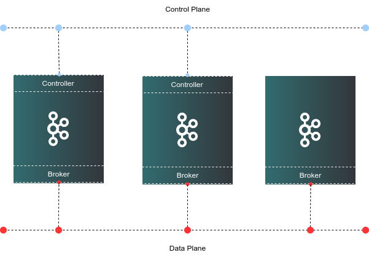

[Apache Kafka](https://kafka.apache.org/) is a robust, scalable, and high-performance system for managing real-time data streams. Its versatile architecture and feature set make it an essential component for modern data infrastructure, supporting a wide range of applications, from log aggregation to real-time analytics and more. Whether you are building data pipelines, event-driven architectures, or stream processing applications, Kafka provides a reliable foundation for your data needs.

Our marketplace application allows the deployment of a Kafka cluster using Kafka's native consensus protocol, [KRaft](https://kafka.apache.org/documentation/#kraft). There are a few things to highlight from our deployment:

- While provisioning, the cluster will be configured with mTLS for authentication. This means that inter-broker communication as well as client authentication is established via certificate identity.
- The minimum cluster size is 3. At all times, 3 controllers are configured in the cluster for fault-tolerance.
- Clients that connect to the cluster need their own valid certificate. All certificates are signed with a self-signed Certificate Authority (CA). Client keystores and truststore are found on the first Kafka node in `/etc/kafka/ssl/keystore` and `/etc/kafka/ssl/truststore` once the deployment is complete.
- The CA key and certificate pair are on the first Kafka node in `/etc/kafka/ssl/ca` once the deployment is complete.


## Cluster Deployment Architecture



## Deploying a Marketplace App

{}

{}


**Estimated deployment time:** Your Kafka cluster should be fully installed within 5-7 minutes after the Compute Instance has finished provisioning.


## Configuration Options

- **Supported distributions:** Ubuntu 22.04 LTS
- **Suggested minimum plan:** All plan types and sizes can be used depending on your storage needs.

### Kafka Options

- **[Linode API Token](/docs/products/platform/accounts/guides/manage-api-tokens/#create-an-api-token):** The provisioner node uses an authenticated API token to create the additional components to the cluster. This is required to fully create the Kafka cluster.

{}

- **Number of clients connecting to Kafka:** The number of clients that will be connecting to the cluster. The application will create SSL certificates for your client that need to connect to the cluster. This should be an integer equal or greater than 1.

- **Kafka cluster size:** The size of the Kafka cluster. One of 3, 5 or 7 instances.

- **Country or Region:** Enter the country or region for you or your organization.

- **State or Province:** Enter the state or province for you or your organization.

- **Locality:** Enter the town or other locality for you or your organization.

- **Organization:** Enter the name of your organization.

- **Email Address:** Enter the email address you wish to use for your certificate file.

{}

## Getting Started After Deployment

### Obtain Keystore and Truststore

Once the deployment is complete, obtain your client certificates from the first Kafka node. Authenticating clients requires a keystore and truststore. Access the first Kafka server and obtain your client keystores from `/etc/kafka/ssl/keystore` and `/etc/kafka/ssl/truststore`. Client certificates start with the word "client" and a number which depends on the number of clients you wanted, for example, **client1** and **client2**.

We suggest transferring the client certificates to the Kafka consumer/producers using a secure method such as SSH or an encrypted HTTPS web UI.

### Authentication

Once you've copied over your keystores and truststores to your client, your client applications(s) will need the password to the keystore and truststore. The credentials can be found in the home directory of the sudo user created on deployment: `/home/$SUDO_USER/.credentials`. For example, if you created a user called `admin`, the credentials file will be found in `/home/admin/.credentials`.

### Testing

You can run a quick test from any of the Kafka nodes using Kafka's utilities found in `/etc/kafka/bin`.

1.  Create a file called `client.properties` with the following content:

    ```file {title="client.properties"}
    security.protocol=SSL
    ssl.truststore.location=/etc/kafka/ssl/truststore/server.truststore.jks
    ssl.truststore.password=CHANGE-ME
    ssl.keystore.location=/etc/kafka/ssl/keystore/client1.keystore.jks
    ssl.keystore.password=CHANGE-ME
    ```

    Make sure that you update the values marked with **CHANGE-ME** with your own.

1.  Create a topic to test the connection and authentication:

    ```command
    /etc/kafka/bin/kafka-topics.sh --create --topic test-ssl --bootstrap-server kafka3:9092 --command-config client.properties
    ```

    This results in the following output:

    ```output
    Created topic test-ssl.
    ```

1.  Once the topic is created, you can publish a message to this topic as a producer:

    ```command
    echo "Kafka rocks!" | /etc/kafka/bin/kafka-console-producer.sh --topic test-ssl --bootstrap-server kafka3:9092 --producer.config client.properties
    ```

1.  You can read the message as a consumer by issuing the following:

    ```command
    /etc/kafka/bin/kafka-console-consumer.sh --topic test-ssl --from-beginning --bootstrap-server kafka3:9092 --consumer.config client.properties
    ```

    This results in the following output:

    ```output
    Kafka rocks!
    ```

## Software Included

The Apache Kafka Marketplace App installs the following software on your Linode:

| **Software**  | **Version**   | **Description**   |
| :---      | :----     | :---          |
| **Apache Kafka**    | 3.7.0    | Scalable, high-performance, fault-tolerant streaming processing application  |
| **KRaft** | | Kafka native consensus protocol |
| **UFW**      | 0.36.1    | Uncomplicated Firewall |
| **Fail2ban**   | 0.11.2    | Brute force protection utility |

{}