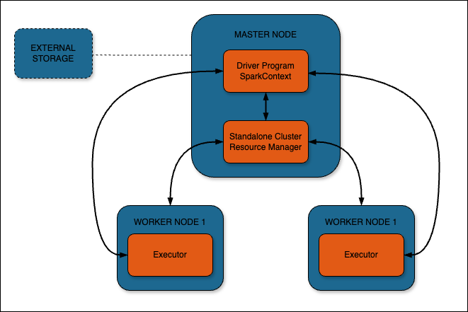

[Apache Spark](https://spark.apache.org/) is a powerful open-source unified analytics engine for large-scale data processing. It provides high-level APIs in Java, Scala, Python, and R, and an optimized engine that supports general execution graphs. Spark is designed for both batch and streaming data processing, and it's significantly faster than traditional big data processing frameworks.

This cluster is deployed with Apache Spark in standalone cluster mode and consists of a master node along with two worker nodes. The standalone cluster manager is a simple way to run Spark in a distributed environment, providing easy setup and management for Spark applications.

Scala, a multi-paradigm programming language, is integral to Apache Spark. It combines object-oriented and functional programming in a concise, high-level language that runs on the Java Virtual Machine (JVM). Spark itself is written in Scala, and while Spark supports multiple languages, Scala provides the most natural and performant interface to Spark's APIs.

NGINX is installed on the master node as a reverse proxy to the worker nodes. The user interface URL is the domain (or rDNS value if no domain was entered). The workers are available via this reverse proxy setup. To access the UI on the master, you will need to provide the username and password that are specified during the cluster deployment. These credentials are also available at `/home/$USER/.credentials` for reference.

A Let's Encrypt Certificate is installed in the NGINX configuration. Using NGINX as a reverse proxy allows for both authentication to the front-end UI and a simple means for renewing the Let's Encrypt certificates for HTTPS.

The minimum RAM requirement for the worker nodes is 4GB RAM to ensure that jobs can run on the workers without encountering memory constraints. This configuration allows for efficient processing of moderately sized datasets and complex analytics tasks.

## Cluster Deployment Architecture

## Deploying a Marketplace App

{}

{}


**Estimated deployment time:** Your Spark cluster should be fully installed within 5-7 minutes after the Compute Instance has finished provisioning.


## Configuration Options

- **Supported distributions:** Ubuntu 22.04 LTS
- **Suggested minimum plan:** 4GB RAM

### Spark Options

- **[Linode API Token](/docs/products/tools/api/guides/manage-api-tokens/#create-an-api-token):** The provisioner node uses an authenticated API token to create the additional components to the cluster. This is required to fully create the Spark cluster.

{}

- **Spark cluster size:** The size of the Spark cluster. This cluster is deployed with a master node and two worker nodes.

- **Spark user:** The username you wish to use to log in to the Spark UI.

- **Spark UI password:** The password you wish to use to log in to the Spark UI.

{}

## Getting Started After Deployment

### Spark UI

Once the deployment is complete, visit the Spark UI at the URL provided at `/etc/motd`. This is either the domain you entered when deploying the cluster or the reverse DNS value of the master node.

The Spark Cluster needs access to external storage such as Amazon S3 or S3-compatible storage, HDFS, Azure Blob Storage, Apache HBase, or your local filesystem. For more details on this, see [Integration With Cloud Infrastructures](https://spark.apache.org/docs/3.5.1/cloud-integration.html).

### Authentication

The credentials to log in to the Spark UI can be found in the home directory of the sudo user created on deployment: `/home/$SUDO_USER/.credentials`. For example, if you created a user called ``, the credentials file will be found in `/home//.credentials`.

### Spark Shell

The `spark-shell` is included with the installation. The `spark-shell` is an interactive command-line shell provided by Apache Spark that allows you to interact with and perform data queries on a Spark cluster in real-time.

## Software Included

The Apache Spark Marketplace App installs the following software on your Linode:

| **Software**  | **Version**   | **Description**   |
| :---      | :----     | :---          |
| **Apache Spark** | 3.4 | Unified analytics engine for large-scale data processing |
| **Java OpenJDK** | 11.0 | Runtime environment for Spark |
| **Scala** | 2.11 | Programming language that Spark is built with, providing a powerful interface to Spark's APIs |
| **NGINX** | 1.18 | High-performance HTTP server and reverse proxy |
| **UFW** | | Uncomplicated Firewall for managing firewall rules |
| **Fail2ban** | | Intrusion prevention software framework for protection against brute-force attacks |

{}