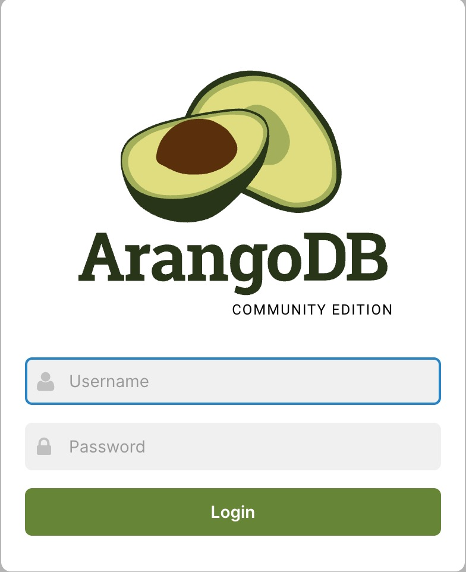

[ArangoDB](https://arangodb.com/community-server/) is a native multi-model database that combines graph, document, and search capabilities into a single platform. It provides a unified query language (AQL) to access all data models seamlessly. ArangoDB is designed for high performance and scalability, making it suitable for various applications including fraud detection, recommendation systems, knowledge graphs, and IoT data management. The Community Edition offers core functionality including native graph traversal, document storage, and ArangoSearch capabilities. With its flexible schema and powerful query capabilities, ArangoDB enables developers to build applications that can handle complex data relationships and perform sophisticated analytics.

## Deploying a Marketplace App

{}

{}


**Estimated deployment time:** ArangoDB should be fully installed within 5-10 minutes after the Compute Instance has finished provisioning.


## Configuration Options

- **Supported distributions:** Ubuntu 24.04 LTS
- **Recommended plan:** All plan types and sizes can be used. For production workloads, consider at least 2GB Shared Compute or higher for optimal performance. ArangoDB Community Edition is suitable for development and small-scale applications with data not exceeding 100GB.

### ArangoDB Options

- **Email address** *(required)*: Enter the email address to use for generating the SSL certificates.

{}

{}

{}

## Getting Started after Deployment

### Accessing the ArangoDB Web Interface

1.  Open your web browser and navigate to `https://[domain]`, where *[domain]* can be replaced with the custom domain you entered during deployment or your Compute Instance's rDNS domain (such as `192-0-2-1.ip.linodeusercontent.com`). You can also use your IPv4 address, though your connection will not be encrypted. See the [Managing IP Addresses](/docs/products/compute/compute-instances/guides/manage-ip-addresses/) guide for information on viewing IP addresses and rDNS.

1.  Use the following credentials to log in:
    - **Username:** *root*
    - **Password:** Enter the password stored in the credentials file on your server. To obtain it, log in to your Compute Instance via SSH or Lish and run:
        ```command
        cat /home/$USER/.credentials
        ```

    

You're now logged in to the ArangoDB Web Interface. In the Community Edition, you can create and manage databases, collections, and documents. You can execute AQL queries, manage indexes, and monitor database performance. The interface provides access to graph visualization tools, allows you to import/export data, and manage user permissions. You can also explore the built-in sample datasets to learn about ArangoDB's capabilities.

Check out [the official ArangoDB documentation](https://docs.arangodb.com/stable/about-arangodb/) to learn how to further use your ArangoDB instance.

{}