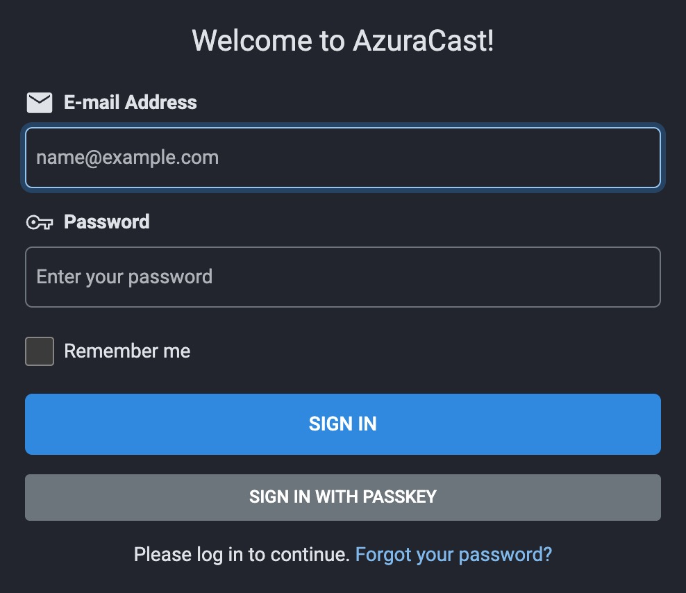
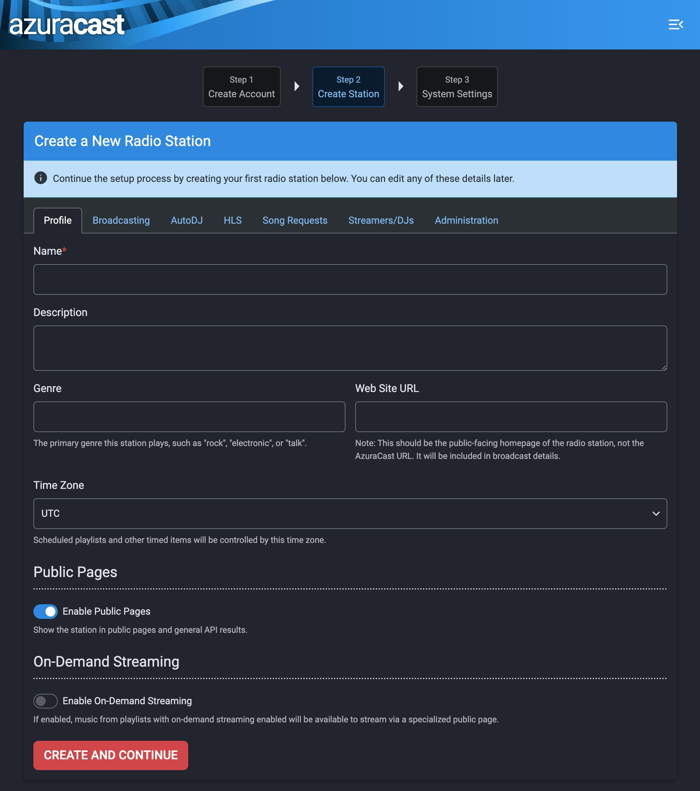
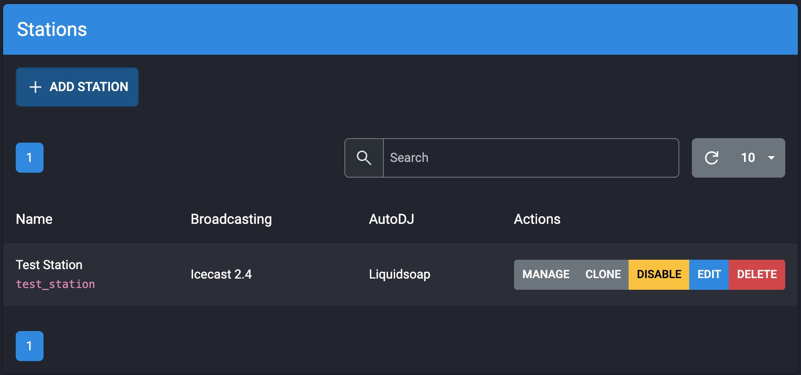

[AzuraCast](https://www.azuracast.com) is a free self-hosted web radio station and management suite. Installation is simple with Marketplace Apps, and the intuitive web interface makes running a web station easy. After installation, you can be broadcasting within in minutes.

## Deploying a Marketplace App

{}

{}


**Estimated deployment time:** AzuraCast should be fully installed within 5-10 minutes after the Compute Instance has finished provisioning.


## Configuration Options

- **Supported distributions:** Ubuntu 24.04 LTS
- **Recommended plan:** All plan types and sizes can be used.

## Azuracast Options

- **Email address** *(required)*: Enter the email address to use for generating the SSL certificates.

{}

{}

{}

## Getting Started After Deployment

### Accessing AzuraCast

AzuraCast is now installed and ready to use.

1.  Open your web browser and navigate to `http://[domain]/admin`, where *[domain]* can be replaced with the custom domain you entered during deployment or your Compute Instance's rDNS domain (such as `192-0-2-1.ip.linodeusercontent.com`). See the [Managing IP Addresses](/docs/products/compute/compute-instances/guides/manage-ip-addresses/) guide for information on viewing IP addresses and rDNS.

1.  The first thing you want to do is login with your *Super Administrator* account that has system-wide permissions. This account was set up during the installation when you entered your Administrator Email Address.

    

1.  Next, AzuraCast prompts you to create a new radio station. Fill out the required fields, then click the **Create and Continue** button at the bottom of the screen to continue.

    

1.  On the next page you can set other settings including using a custom URL if you have one set up. Learn more about using a custom URL with Linode DNS in our [DNS Manager](/docs/products/networking/dns-manager/) guide. When you are finished, click the **Save Changes** button at the bottom of the screen to continue.

1.  Your station is now ready. On the following page, you are taken to the control panel, and you are ready to start broadcasting your station.

1.  To manage the station you just created click the **Manage Stations** button in the **Dashboard** section. This will open the Station Dashboard for the station you created during setup.

    

1.  Here you can control your station, add songs, add DJs, take requests, and more.

## Software Included

The AzuraCast Marketplace App installs the following software on your Linode:

| **Software** | **Description** |
|:--------------|:------------|
| [**AzuraCast**](https://www.azuracast.com/) | All-in-one web radio management suite (includes Liquidsoap, Icecast, NGINX, PHP, and all radio streaming components) |
| [**MariaDB**](https://mariadb.org/) | Open-source relational database for data storage |
| [**Redis**](https://redis.io/) | In-memory data structure store for caching and session management |
| [**Docker**](https://www.docker.com/) | Container runtime for application deployment |
| [**Docker Compose**](https://docs.docker.com/compose/) | Tool for defining and running multi-container Docker applications |

{}
