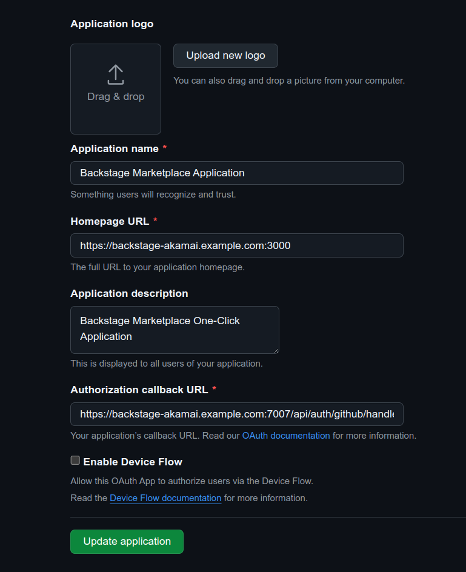
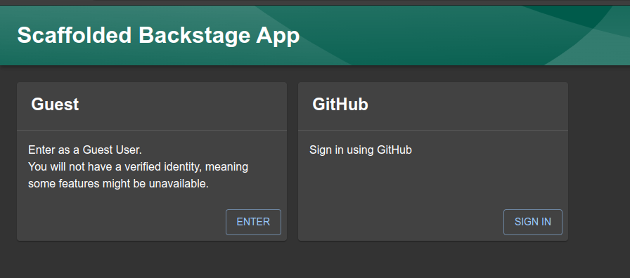
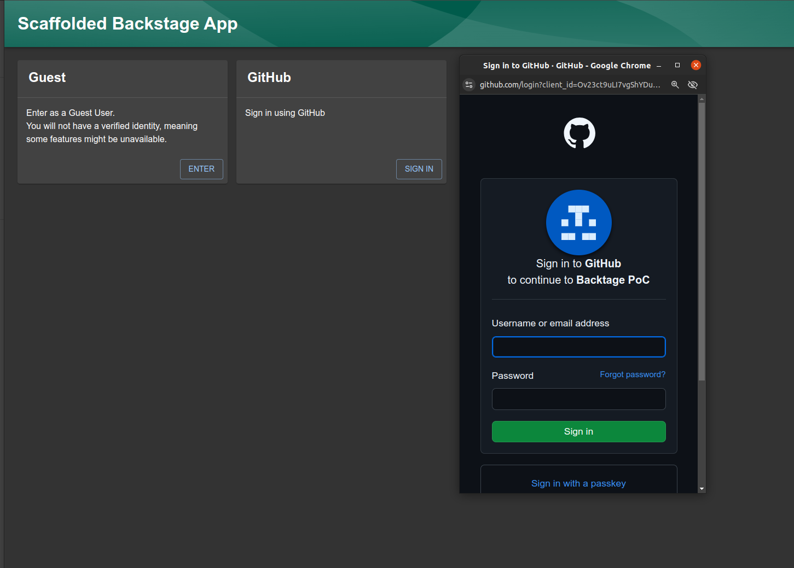
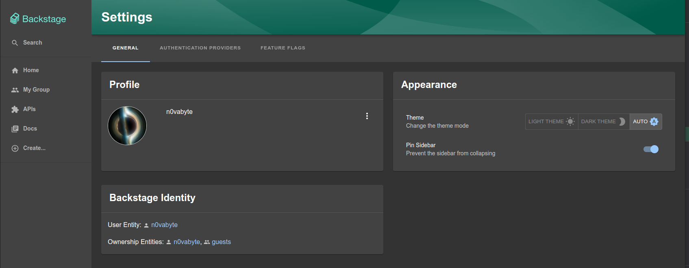

Backstage is an open-source platform for building developer portals, designed to simplify and unify software development processes. It provides a centralized hub for managing services, tools, and documentation, enabling teams to improve efficiency, collaboration, and scalability across projects.

## Deploying a Marketplace App

{}

{}


**Estimated deployment time:** Backstage should be fully installed within 3-5 minutes after the Compute Instance has finished provisioning.


## Configuration Options

- **Supported distributions:** Ubuntu 24.04 LTS
- **Recommended minimum plan:** All plan types and sizes can be used.

## Prerequisites Before Deploying Backstage

The Backstage application on Akamai's Connected Cloud is configured with Github authentication and allows you to integrate pulling catalog entities from Github directly. Before you can deploy the One-Click application, you will first need to create an Oauth application and authorize it to use your domain name.

Please refer to Backstage's documentation for configuring authentication to Github:
[Backstage Github Authentication](https://backstage.io/docs/getting-started/config/authentication/#setting-up-authentication)
[Backstage Github Integration](https://backstage.io/docs/getting-started/config/authentication/#setting-up-a-github-integration)


You can optionally configure the Github integration, but it's not completely required for the deployment of the Backstage One-Click app.


You will only need to perform the instructions on those sections alone. Once you are done, you should have the following information to proceed to the next step.

- Client ID
- Client Secret
- Personal Access Token (not required)

For reference, you can use the following image as a guideline to configure the Oauth application.

### Backstage Options

- **Your Linode API token** *(required)*: Linode API token to create DNS records for Backstage.
- **The subdomain for the DNS record** *(required)*: Subdomain that will be created for Backstage. Use the same information that was provided when the Oauth application was created in previous section.
- **The domain for the DNS record** *(required)*: The domain name for your Backstage instance. Use the same information that was provided when the Oauth application was created in previous section.
- **Email address** *(required)*: Email address to use for generating the SSL certificates and configuring the server and DNS records.
- **Allowed IPs**: IP addresses allowed to access the frontend. If no IP addresses are provided, the frontend will be accessible to the public. It's highly recommended you enter your IP address.
- **Backstage application name** *(required)*: The name for the Backstage application. The application will live under this name in backstage home directory.
- **Github Oauth Client ID** *(required)*: Oauth client ID created in Github.
- **Github Oauth Client Secret** *(required)*: Oauth client secret created in Github.
- **Github Username** *(required)*: Your Github username for you to authorize the Github backend authentication.
- **Backstage Organization Name** *(required)*: The organization name that will be used in the backstage configuration.
- **Github Personal Access Token**: The personal access token to integrate Backstage with Github. This will you to load catalog entities from Github. This is not a required field and you can figure this later if you need to.

{}

{}

{}

## Getting Started After Deployment

1. Open your web browser and navigate to your Backstage instance by using the domain name provided during the setup. Once there, you will notice that you can enter as guest user or with your Github user.

1. If you sign in using Github, a window will popup for you to log into your Github account for the authentication.

1. After you log into the backend you will notice your authentication from the Settings tab. 

You are now ready to start developing developer portals with Backstage! Please refer to Backstage's [documentation](https://backstage.io/docs/overview/what-is-backstage) for further configuration and usage of the software.

{}