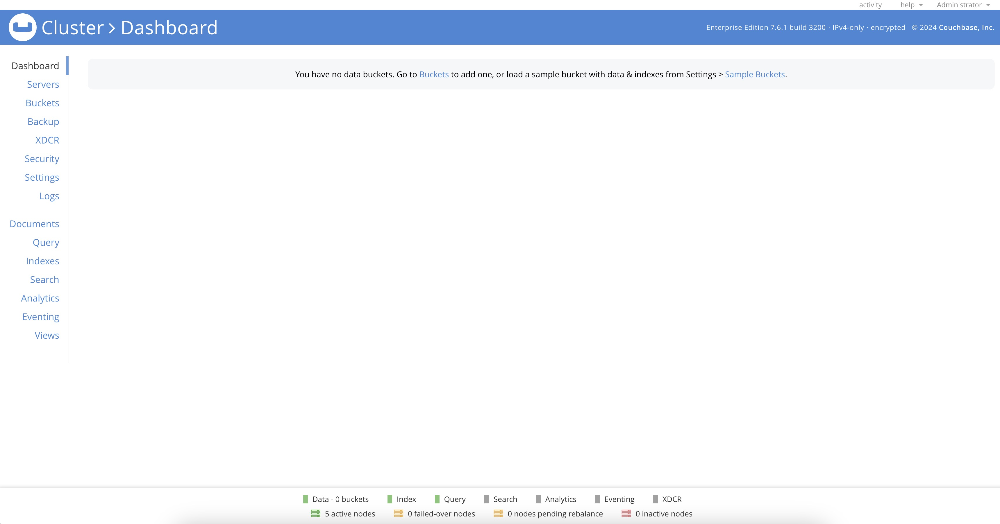

[Couchbase](https://www.couchbase.com/) is an enterprise class NoSQL database designed with memory-first architecture, built-in cache and workload isolation. The Couchbase One-Click cluster deploys three, five, or seven connected Couchbase Enterprise Server nodes split between Data, Index, and Query services. This initial configuration allows quick deployment and cluster expansion with Couchbase's multi-dimensional scaling.


Couchbase Enterprise Server is not free to use in production. Contact [Couchbase Support](https://www.couchbase.com/pricing/) to activate your license on Akamai Connected Cloud and enable [Couchbase application support](https://support.couchbase.com/hc/en-us/articles/360043247551-Accessing-Couchbase-Support).


## Deploying a Marketplace App

{}

{}


Couchbase should be fully installed within 10-20 minutes after the Linode has finished provisioning.


## Configuration Options

- **Supported distributions:** Ubuntu 22.04 LTS
- **Minimum plan:** Couchbase Enterprise Server requires 8GB of RAM
- **Suggested Plan:** 16GB of RAM is suggested for production deployments


Deploying the Couchbase Enterprise Server One-Click Cluster on a plan with less than 8GB of RAM will fail. Your account will be billed for any failed instances deployed with less than 8GB of RAM.


### Couchbase Options

{}

- **API Token** *(required)*: A valid API token with grants to deploy Linodes.

- **Email address** *(required)*: The email address to use for generating the SSL certificates.

- **Couchbase Server Count** *(required)*: The number of Couchbase Enterprise Servers deployed. Choose between 3, 5, or 7 instances.

{}

### Self Signed SSl Options

- **Country or Region:** The country or region for you or your organization

- **State or Province:** The state or province for you or your organization

- **Locality:** The town or other locality for you or your organization

- **Organization:** The name of your organization

## Getting Started after Deployment

### Accessing the Couchbase Server

Access Couchbase's web UI by launching your preferred web browser and navigating to either the reverse DNS address of the *cluster provisioner*. This is the instance labeled `couchbase-occ-1-$region-$uuid`. Refer to the [Managing IP Addresses](/docs/products/compute/compute-instances/guides/manage-ip-addresses/) guide for instructions on how to find your instance's IP addresses and rDNS information.

To access the Dashboard, use the username "Administrator" along with the generated password located in `/home/$sudo_username/.credentials`.

While there are no buckets yet configured on this new cluster, you can see all five nodes marked ready on the bottom status bar, and verify the status of the cluster members from the Servers tab.

### Managing Firewall and Security

The Couchbase Cluster deploys with preconfigured UFW firewall rules. These rules limit allowed traffic on node-to-node and cluster-to-cluster Couchbase ports to IP addresses within the cluster.

Only the *cluster provisioner* has firewall access configured for web and client ports.

The Couchbase Enterprise Server Cluster Marketplace App manages these UFW configurations with `application profile` files in the `/etc/ufw/appplications.d` directory. See [Configure a Firewall with UFW](/docs/guides/security/firewalls/configure-firewall-with-ufw/index.md) for more details on using UFW.

## Next Steps

Now that your Couchbase Enterprise Server One-Click Cluster has been deployed, contact [Couchbase Support](https://www.couchbase.com/pricing/) to activate your license on this newly deployed cluster before using the cluster for testing, quality assurance, or in production. An active Enterprise License is required for any use other than solely for internal development use or evaluation of the software.

### More Information

You may wish to consult the following resources for additional information on this topic. We cannot guarantee for the accuracy or timeliness of externally hosted materials.

- [Couchbase](https://www.couchbase.com/)
- [Couchbase Documentation](https://docs.couchbase.com/home/server.html)

{}