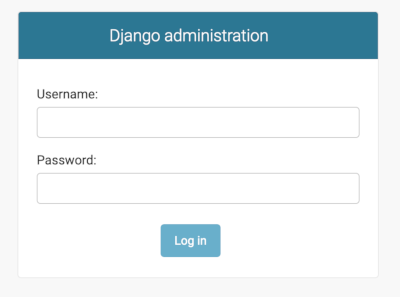
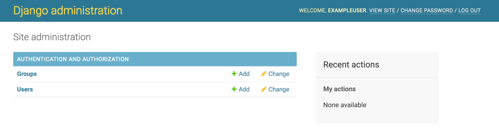

[Django](https://www.djangoproject.com/) is a web development framework for the Python programing language. It enables rapid development, while favoring pragmatic and clean design. Django was initially developed for use in a newspaper's website division, and as a result the Django framework is very well suited to developing content-centric applications. It's also very flexible in its ability to facilitate many complex content management operations.

## Deploying a Marketplace App

{}

{}


**Estimated deployment time:** Django should be fully installed within 2-5 minutes after the Compute Instance has finished provisioning.


## Configuration Options

- **Supported distributions:** Ubuntu 22.04 LTS
- **Recommended minimum plan:** All plan types and sizes can be used.

### Django Options

- **Django user** *(required)*: The username for your Django application.
- **Django user email** *(required)*: The email address you wish to use for your Django user and to generate the SSL certificates.

{}

{}

{}

## Getting Started after Deployment

### Access Django


The Django Marketplace App will assign `DjangoApp` as the [Django project name](https://docs.djangoproject.com/en/5.0/intro/tutorial01/#creating-a-project).


1. Open your web browser and navigate to `https://[domain]`, where *[domain]* can be replaced with the custom domain you entered during deployment or your Compute Instance's rDNS domain (such as `192-0-2-1.ip.linodeusercontent.com`). You can also use your IPv4 address. See the [Managing IP Addresses](/docs/products/compute/compute-instances/guides/manage-ip-addresses/) guide for information on viewing IP addresses and rDNS.

1.  Once you have verified that you can access your Django site via the browser, you can log in using the admin credentials generated during the deployment. The credentials can be found in `/home/$USERNAME/.credentials`. Update the address in the browser to: `https://[domain]/admin`.

    

1.  Once logged in, you will have access to the Admin console. Now you can begin configuring your site.

    

{}
