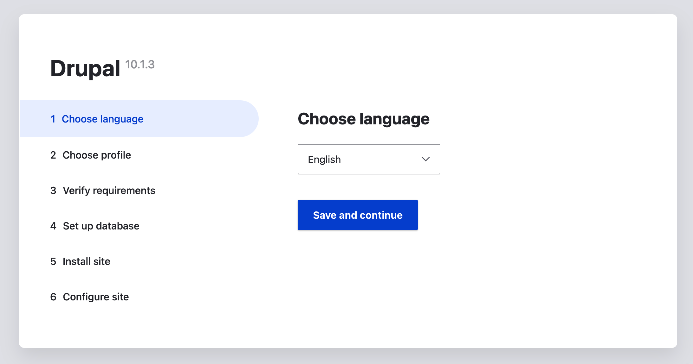
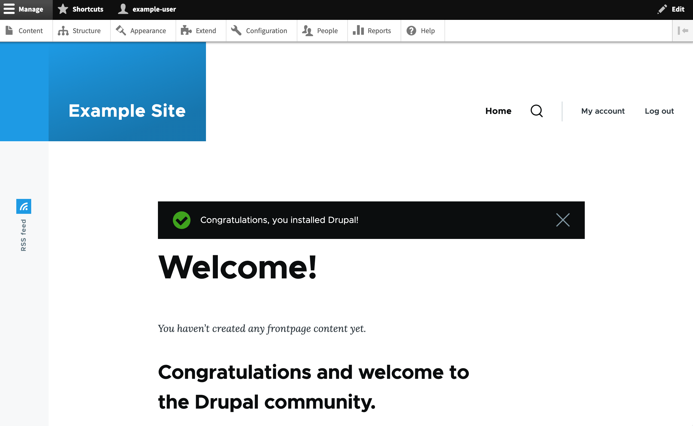

[Drupal](https://www.drupal.org/) is a content management system (CMS) designed for building custom websites for personal and business use. Built for high performance and scalability, Drupal provides the necessary tools to create rich, interactive "community" websites with forums, user blogs, and private messaging. Drupal also has support for personal publishing projects and can power podcasts, blogs, and knowledge-based systems, all within a single, unified platform.

In addition to the core infrastructure, there are a number of freely available Drupal modules that allow administrators of Drupal sites to provide additional functionality, and a robust API makes it easy to enable these features. Furthermore, Drupal has an advanced theming engine that allows for a great amount of flexibility for displaying content.

## Deploying a Marketplace App

{}

{}


**Estimated deployment time:** Drupal should be fully installed within 2-5 minutes after the Compute Instance has finished provisioning.


## Configuration Options

- **Supported distributions:** Ubuntu 22.04 LTS
- **Recommended minimum plan:** All plan types and sizes can be used.

### Drupal Options

- **Database Root Password** *(required)*: Password for your Drupal site's MariaDB database `root` user.
- **Database User Password** *(required)*: Password for your Drupal site's MariaDB database `drupal` user.

{}

## Getting Started after Deployment

### Access your Drupal Site

1.  Open a web browser and navigate to the domain you entered when creating the instance: `https://domain.tld`. If you did not enter a domain, use your Compute Instance's default rDNS domain (`192-0-2-1.ip.linodeusercontent.com`). See the [Managing IP Addresses](/docs/products/compute/compute-instances/guides/manage-ip-addresses/) guide for information on viewing the rDNS value. Ensure that you are securely accessing the website by prefixing `https` to the URL.

1.  The initial configuration and installation screen for your Drupal site should be displayed. Follow the prompts for the **Choose language**, **Choose profile**, and **Verify requirements** screens, selecting the appropriate configuration values for your Drupal site.

    

1.  In the **Database configuration** screen, fill in the form with the values listed below. Click on **Save and Continue** when you are done.

    - **Database name:** `drupaldb`
    - **Database username:** `drupal`
    - **Database password:** Enter the database user password you created when deploying the instance.

1. Continue to follow the prompts for the **Configure site** screen and select the appropriate configuration values for your Drupal site. When complete, you are brought to your Drupal site's admin panel where you can begin [building your Drupal site](https://www.drupal.org/documentation/build).

    

## Software Included

The Drupal Marketplace App installs the following required software on your Linode:

| **Software** | **Description** |
|:--------------|:------------|
| [**MariaDB Server**](https://mariadb.org/) | Relational database. |
| [**PHP 8**](https://www.php.net) | Drupal is written in PHP and requires PHP to operate. |
| [**Apache HTTP Server**](https://httpd.apache.org) | Web Server used to serve the Drupal site. |
| [**Drupal 10**](https://www.drupal.org/about/10) | Content management system. |

{}

## Next Steps

- Register a domain name and [create a DNS record](/docs/products/networking/dns-manager/) for it using the Linode Cloud Manager.
- [Configure your Apache HTTP Server](/docs/guides/how-to-install-a-lamp-stack-on-debian-10/#configure-name-based-virtual-hosts) to point to your domain name.
