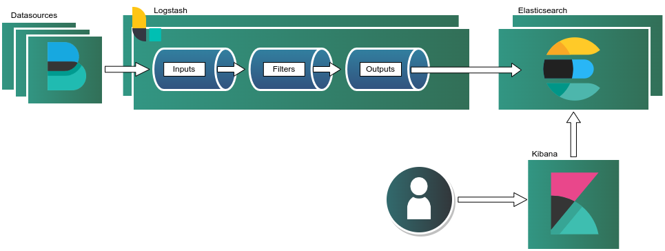
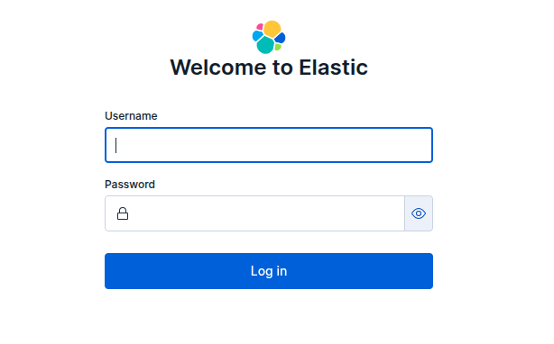
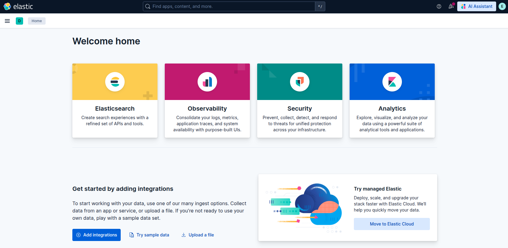

## Cluster Deployment Architecture



An Elastic Stack is a unified observability platform that brings together search, data processing, and visualization through Elasticsearch, Logstash, and Kibana. It provides an end-to-end pipeline for ingesting, transforming, indexing, and exploring operational data at scale. Elasticsearch delivers distributed search and analytics with near real-time indexing, while Logstash enables flexible data collection and enrichment from diverse sources. Kibana offers an interactive interface for visualizing log streams, building dashboards, and performing advanced analysis.

This solution is well-suited for log aggregation, application monitoring, infrastructure observability, and security analytics. Its open architecture and extensive ecosystem make it adaptable to a wide range of use cases—including distributed system debugging, SIEM workflows, API performance monitoring, and centralized logging. 

This Marketplace application stands up a multi-cluster Elastic Stack with the ease of a few clicks!

## Deploying a Marketplace App

{}

{}


**Estimated deployment time:** Your cluster should be fully installed within 5-10 minutes with a cluster of 5 nodes. Larger clusters will take longer to provision but we can use the formula, 8 minutes per 5 nodes, to estimate completion.


## Configuration Options

### Elastic Stack Options

- **Linode API Token** *(required)*: Your API token is used to deploy additional Compute Instances as part of this cluster. At a minimum, this token must have Read/Write access to *Linodes*. If you do not yet have an API token, see [Get an API Access Token](/docs/products/platform/accounts/guides/manage-api-tokens/) to create one.

- **Email address (for the Let's Encrypt SSL certificate)** *(required)*: Your email will be used for Let's Encrypt renewal notices. A valid SSL certificate is validated through certbot and installed on the Kibana instance in the cluster. This will allow you to visit Kibana securely through a browser.

{}

{}

#### TLS/SSL Certificate Options

The following fields are used when creating the self-signed TLS/SSL certificates for the cluster.

- **Country or region** *(required)*: Enter the country or region for you or your organization.
- **State or province** *(required)*: Enter the state or province for you or your organization.
- **Locality** *(required)*: Enter the town or other locality for you or your organization.
- **Organization** *(required)*: Enter the name of your organization.
- **Email address** *(required)*: Enter the email address you wish to use for your certificate file.
- **CA Common name:** This is the common name for the self-signed Certificate Authority.

#### Picking The Correct Instance Plan and Size

In the **Cluster Settings** section you will find a way to designate the size for each component in your Elastic deployment. The size of the cluster will depend on your needs. If you are looking for a quick deployment, stick with the defaults provided.

- **Kibana Size**: This deployment will only create a single Kibina instance will Let's Encrypt certificates. This option cannot be changed.
- **Elasticsearch Cluster Size**: The total number of nodes your Elasticsearch cluster will have.
- **Logstash Cluster Size**: The total number of nodes your Logstash cluster will have.

In this next part, you will be able to associate your Elasticsearch and Logstash clusters with their corresponding instance plans.

- **Elasticsearch Instance Type**: This is plan type that will be used for your Elasticsearch cluster.
- **Logstash Instance Type**: This is plan type that will be used for your Logstash cluster.


**Kibana Instance Type:** To choose the Kibana instance type you will first need to click the region that you want to deploy and then picking the plan from the **[Linode Plan](https://techdocs.akamai.com/cloud-computing/docs/create-a-compute-instance#choose-a-linode-type-and-plan)** section. 


#### Additional Configuration

- **Filebeat IP addresses allowed to access Logstash**: If you have existing filebeat agents already installed, you can provide their IP addresses for whitelisting. The IP addresses must be comma separated.

- **Logstash username to be created for index**: This is the username that is created and can access index below. We create this so that you can start ingesting logs after deployment.

- **Elasticsearch index to be created for log ingestion**: We are creating this index so that you can start ingesting logs quickly. For example, if you have wordpress application you want perform log aggregation for the index name `wordpress-logs` would make sense. You can change this for your specific use-case.

## Getting Started After Deployment

### Accessing Elastic Frontend

Once you cluster has finished deploying, you will be able to log into your Elastic cluster via the browser. The first thing you need to do is log into the provisioner node and open the the credentials file. You use the following command:

```command
cat /home/$user/.credentials
```

Where `$user` is the sudo user you created. In the credentials file you will notice the Kibana URL. Paste that into your browser of choice and you should be able to see the login page.





To access the console enter `elastic` as the username and the password posted in the credentials file. A successful login will redirect you to the welcome page. From there you are able to add integrations, visualization and other config changes.



#### Configure Filebeat (Optional)

If you already have Filebeat configured on a system follow the next steps.

- Create a backup of your `/etc/filebeat/filebeat.yml` configuration:

```command
cp /etc/filebeat/filebeat.yml{,.bak}
```

- Update your filebeat inputs:


`/etc/filebeat/filebeat.yml`:
```yaml
filebeat.inputs:

# Each - is an input. Most options can be set at the input level, so
# you can use different inputs for various configurations.
# Below are the input-specific configurations.

# filestream is an input for collecting log messages from files.
- type: filestream
 
  # Unique ID among all inputs, an ID is required.
  id: web-01 
 
  # Change to true to enable this input configuration.
  #enabled: false
  enabled: true
 
  # Paths that should be crawled and fetched. Glob based paths.
  paths:
    - /var/log/apache2/access.log
```

In this example, the `id` must be unique to the instance that way you know the source of the log. Ideally this should be the hostname of the instance, in this example we are calling it **web-01**. Update `paths` to the log that you want to send to Logstash.

Next, while in the `/etc/filebeat/filebeat.yml`, update the Filbeat output directive:

```yaml
output.logstash:
  # Logstash hosts
  hosts: ["logstash-1.example.com:5044", "logstash-2.example.com:5044"]
  loadbalance: true

  # List of root certificates for HTTPS server verifications
  ssl.certificate_authorities: ["/etc/filebeat/certs/ca.pem"]
```
The `hosts` param can be the IP addresses of your Logstash host or a FQDN if wanted. In this example, we added **logstash-1.example.com** and **logstash-2.example.com** to our `/etc/hosts` file.

- Add CA certificate. 

The last thing that you want to do is add the `ca.pem` to `/etc/filebeat/certs/ca.pem`. You can grab the `ca.crt` from any node in the cluster. Once that's in place, just restart the filebeat service:

```bash 
systemctl start filebeat
systemctl enable filebeat
```

At this point you should be able to start ingesting logs into your cluster using the index you created!