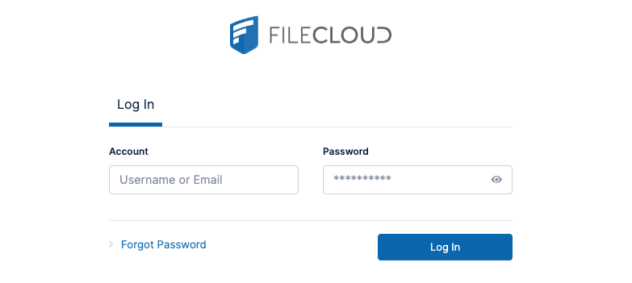

[FileCloud](https://www.filecloud.com/) is a cloud-based file-sharing application, similar to tools like Dropbox, that allows users to remotely access, upload, and sync hosted files.

## Deploying a Marketplace App

{}

{}


**Estimated deployment time:** FileCloud should be fully installed within 2-5 minutes after the Compute Instance has finished provisioning.


## Configuration Options

- **Supported distributions:** Ubuntu 22.04 LTS
- **Recommended minimum plan:** All plan types and sizes can be used. The Linode plan that you select should be appropriate for the amount of data transfer, users, storage, and other stress that may affect the performance of server.

### FileCloud Options

- **SOA email address:** Enter the email address that should be used for the SSL generation.

{}

{}

{}

## Getting Started after Deployment

1.  Open your web browser and navigate to `https://[domain]/admin`, where *[domain]* can be replaced with the custom domain you entered during deployment or your Compute Instance's rDNS domain (such as `192-0-2-1.ip.linodeusercontent.com`). You can also use your IPv4 address. See the [Managing IP Addresses](/docs/products/compute/compute-instances/guides/manage-ip-addresses/) guide for information on viewing IP addresses and rDNS.

1.  In the login fields that appear,the default username is *admin*, and the password can be found in the credentials file located in /home/$USERNAME/.credentials.

    

### Obtain a new License Key

FileCloud by default is inaccessible without either a trial or paid license key provided by FileCloud.

1. To obtain a trial license key, sign on or create an account at [FileCloud's customer portal](https://portal.getfilecloud.com/ui/user/index.html). After logging in to your new account, click on the **Begin Trial** button and follow the prompts to obtain a new trial license key file.See [FileCloud - License Purchase And Renewal](https://www.getfilecloud.com/supportdocs/display/cloud/FileCloud+-+License+Purchase+And+Renewal) for full instructions on obtaining a license.

1. Once you have a valid license key, log in to the FileCloud administrator page. After a new successful login, a message should be displayed notifying you that the license is invalid. If this message is not visible, navigate to **Settings** > **License**.

1. Click the **Choose File** button to upload your `license.xlm` file and register your license key with this FileCloud installation.

{}