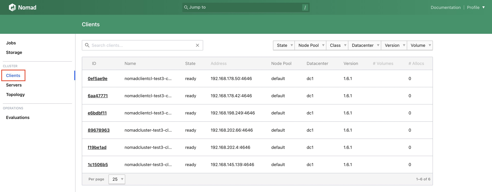

The [HashiCorp Nomad](https://www.nomadproject.io/) Clients Cluster deploys 3, 5 or 7 Compute Instances as clients to horizontally scale an *existing HashiCorp Nomad Cluster*. The plan type and size you select is applied to each individual instance.

See our guide on deploying a [HashiCorp Nomad Cluster](/docs/marketplace-docs/guides/hashicorp-nomad-cluster/) if you have not already deployed a cluster.


Please be aware that each Compute Instance will appear on your invoice as a separate item. If you would rather deploy HashiCorp Nomad on a single Compute Instance, see [Deploy Hashicorp Nomad through the Linode Marketplace](/docs/marketplace-docs/guides/hashicorp-nomad/).


## Deploying a Marketplace App

{}

{}


**Estimated deployment time:** Nomad Clients Cluster should be fully installed within 15-20 minutes after the Compute Instances have finished provisioning.


## Configuration Options

- **Supported distributions**: Ubuntu 22.04 LTS
- **Recommended plan**: Nomad clients can be of any size.
- **Region**: The region you select should be the same as your existing Nomad Cluster.

{}

### Nomad Client Options

- **Linode API Token** *(required)*: Your API token is used to deploy additional Compute Instances as part of this cluster. At a minimum, this token must have Read/Write access to *Linodes*. If you do not yet have an API token, see [Get an API Access Token](/docs/products/platform/accounts/guides/manage-api-tokens/) to create one.

- **Limited sudo user** *(required)*: A limited user account with sudo access is created as part of this cluster deployment. Enter your preferred username for this limited user. The password is automatically created.

- **consul_nomad_autojoin_token generated by Nomad Server OCC** *(required)*: This token is generated by the [HashiCorp Nomad Cluster](/docs/marketplace-docs/guides/hashicorp-nomad-cluster/) deployment and can be found in the `~/.deployment_secrets.txt` file created in your original cluster.

- **cluster_uuid** *(required)*: This is the tag applied to the [HashiCorp Nomad Cluster](/docs/marketplace-docs/guides/hashicorp-nomad-cluster/) deployment and can be found in the `~/.deployment_secrets.txt` file created in your original cluster or in Cloud Manager.

- **Add Account SSH Keys to All Nodes?** If you select *yes*, any SSH Keys that are added to the root user account (in the **SSH Keys** section), are also added to your limited user account on all deployed Compute Instances.

- **Nomad Client Count:** Select the preferred number of additional cluster clients from the available options (3, 5 or 7).

## Getting Started after Deployment

### Accessing the Nomad Web UI

After deployment, you can confirm your clients have been successfully added to your cluster by logging in to the Nomad Web UI and selecting **Clients** on the left sidebar. *Nomad clients are not interacted with directly*.

Please see [HashiCorp Nomad Cluster](/docs/marketplace-docs/guides/hashicorp-nomad-cluster/) for information on accessing the Nomad Web UI and managing your cluster.

{}