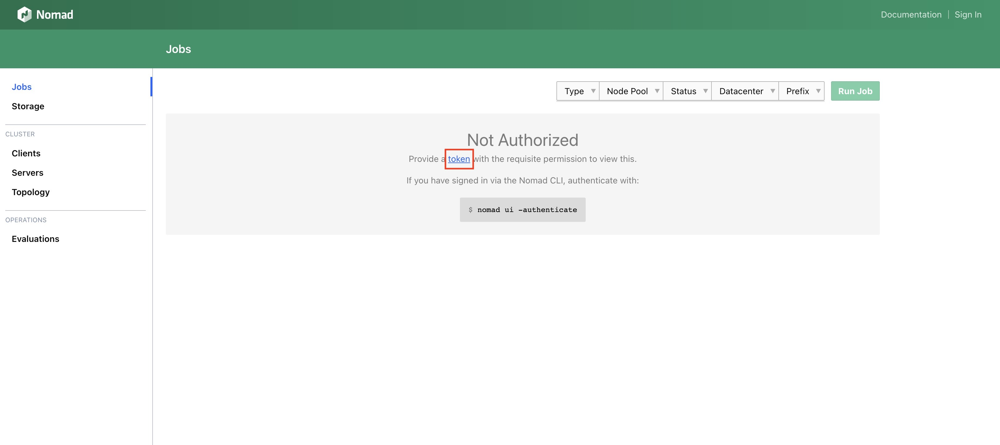
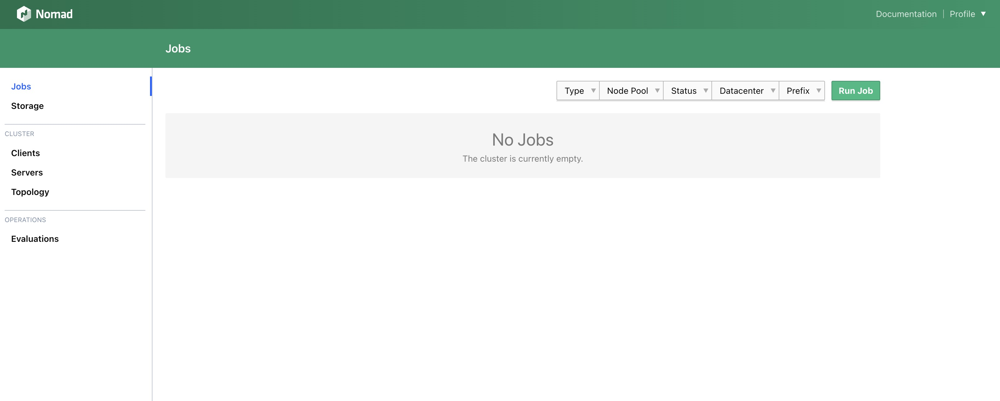

[HashiCorp Nomad](https://www.nomadproject.io/) is a workload scheduler and orchestrator that lets you deploy and manage containerized or non-containerized, legacy applications using a single, unified workflow. Nomad uses bin packaging for efficient job scheduling and resource optimization, as well as enables developers to use declarative infrastructure-as-code for their deployments.


This Marketplace App deploys 6 Compute Instances to create a highly available, redundant Hashicorp Nomad Cluster. The plan type and size you select is applied to each individual instance.

Please be aware that each Compute Instance will appear on your invoice as a separate item. If you would rather deploy Hashicorp Nomad on a single Compute Instance, see [Deploy Hashicorp Nomad through the Linode Marketplace](/docs/marketplace-docs/guides/hashicorp-nomad/).


## Deploying a Marketplace App

{}

{}


**Estimated deployment time:** Nomad Cluster should be fully installed within 15-20 minutes after the Compute Instances have finished provisioning.


## Configuration Options

- **Supported distributions:** Ubuntu 22.04 LTS
- **Recommended plan:** We recommend 8GB Dedicated CPU or 8GB Shared CPU instances for the Nomad Cluster.

{}

### Nomad Cluster Options

- **Linode API Token** *(required)*: Your API token is used to deploy additional Compute Instances as part of this cluster. At a minimum, this token must have Read/Write access to *Linodes*. If you do not yet have an API token, see [Get an API Access Token](/docs/products/platform/accounts/guides/manage-api-tokens/) to create one.

- **Limited sudo user** *(required)*: A limited user account with sudo access is created as part of this cluster deployment. Enter your preferred username for this limited user. The sudo password is automatically created and stored in the `~/.deployment_secrets.txt` file. See [Accessing the Nomad Web UI](#accessing-the-nomad-web-ui) below.

- **Email Address** *(required)*: A valid SOA email address for auto-generated Let's Encrypt SSL.

- **Add SSH Keys to all nodes?** If you select *yes*, any SSH Keys that are added to the root user account (in the **SSH Keys** section), are also added to your limited user account on all deployed Compute Instances.

- **Total Instance Count:** The Nomad Cluster will deploy 6 Compute Instances.

  |  Servers |  Clients | Total Instances |
  | :--: | :--: | :--: |
  | 3  | 3  | 6 |

- **Nomad Server Count**: The Nomad Cluster will deploy 3 Nomad servers.

- **Nomad Client Count**: The Nomad Cluster will deploy 3 Nomad clients.

  
  See [Hashicorp's Nomad Architecture documentation](https://developer.hashicorp.com/nomad/docs/concepts/architecture) for more about how clients and servers function within the Nomad Cluster.
  

## Getting Started after Deployment

### Accessing the Nomad Web UI

1.  Use [SSH]() to connect as the created sudo user of the initially deployed instance, labeled `occ-server-1`.

1.  Once logged in as your sudo user, view the contents of the file `~/.deployment-secrets.txt`.

    ```command
    cat ~/.deployment-secrets.txt`
    ```
    In this file, there are multiple generated tokens, as well as your limited sudo user password. These tokens are used for authenticating to the Nomad Web UI, adding Nomad clients to the cluster, managing jobs, and managing the Consul service mesh. Save the contents of this file somewhere secure as you will need the tokens later.

1.  Open your web browser and navigate to `http://[rDNS]`, where `[rDNS]` is the reverse DNS address of your Compute Instance labeled `server-1`. See our [How to Configure rDNS](/docs/products/compute/compute-instances/guides/configure-rdns/) guide for more information about viewing and editing rDNS.

1.  The [Nomad Web UI](https://learn.hashicorp.com/collections/nomad/web-ui) should be displayed with a link to enter a token. Click the token link, and enter the `nomad_user_token` from the `~/.deployment-secrets.txt` file (see above) to authenticate to the UI.

    

1. Once your token is authenticated, you can manage your cluster, jobs, integrations, and ACL tokens.

    

    
    HashiCorp recommends using mutual TLS (mTLS) with a private CA to secure cluster communications and the web UI. Please see the following HashiCorp documentation for more details:

    - [Enable TLS Encryption for Nomad](https://learn.hashicorp.com/tutorials/nomad/security-enable-tls)
    - [Nomad Configuration: tls Block](https://www.nomadproject.io/docs/configuration/tls#http)
    

## Next Steps

The HashiCorp Nomad Cluster provides default configurations to get you started. We recommend reviewing HashiCorp's [Configuration](https://www.nomadproject.io/docs/configuration) and [Job Spec](https://www.nomadproject.io/docs/job-specification) documentation to customize your Nomad Cluster for your specific workload.

If you find that you need additional Clients for your Nomad Cluster, the [Nomad Clients Cluster](/docs/marketplace-docs/guides/hashicorp-nomad-clients-cluster/) deployment lets you scale horizontally by deploying 3, 5, or 7 additional Compute Instances as Clients.

{}
