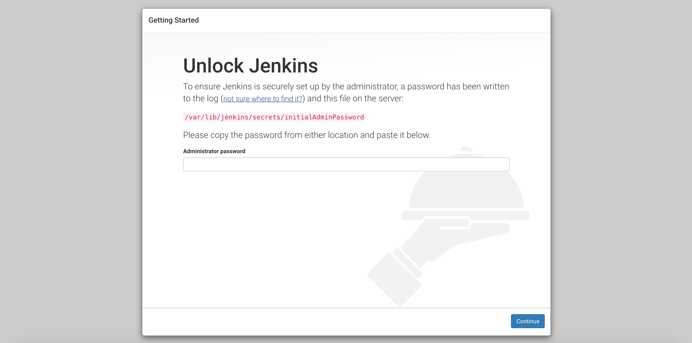
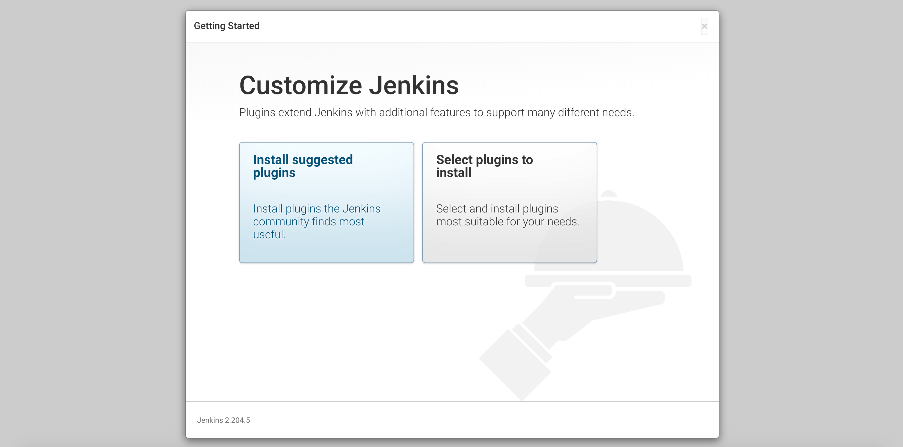

[Jenkins](https://jenkins.io/) is an open source automation tool which can build, test, and deploy your infrastructure. It gives you access to a massive library of plugins to support automation in your project's lifecycle. You can create a [continuous delivery pipeline](https://jenkins.io/doc/pipeline/tour/hello-world/#what-is-a-jenkins-pipeline) which automates the process for getting your software from version control to your users.

## Deploying a Marketplace App

{}

{}


**Estimated deployment time:** Jenkins should be fully installed within 2-5 minutes after the Compute Instance has finished provisioning.


## Configuration Options

- **Supported distributions:** Ubuntu 22.04 LTS
- **Suggested minimum plan:** All plan types and sizes can be used.

### Jenkins Options

{}
{}

{}

- **Let's Encrypt SOA Email:** *(required)* Email address for free Let's Encrypt SSL certificate.
- **Jenkins Version:** *(required)* Version of Jenkins to deploy.

## Getting Started after Deployment

After deploying your Jenkins instance, log in and continue the configuration.

### Access Your Jenkins Instance

1. [Connect to your Linode via SSH](/docs/products/compute/compute-instances/guides/set-up-and-secure/#connect-to-the-instance) using `root` or the `sudo user` created during deployment if you added Account SSH Keys.

1. Retrieve your Jenkins admin password from the `/home/$SUDO_USER/.credentials` file.

    ```command
    cat /home/$SUDO_USER/.credentials
    ```

    You should see a similar output:

    ```output
      Sudo Username: $SUDO_USER
      Sudo Password: ifdQUa3mD2UJSJ2NA9ddSDVl5NCWfKl
      Jenkins Admin password: BeVrZwVkn1mUO0Gl38lRabp
    ```

1. Open a web browser and navigate to `https://192-0-2-17.ip.linodeusercontent.com`. Replace `192-0-2-17.ip.linodeusercontent.com` with the reverse DNS for your Compute Instance. This will open the *Unlock Jenkins* page. Enter the password you retrieved in the previous step and click **Continue**.

    

1. Install the community-suggested plugins or select the plugins to install manually.

    

1. After you install the desired plugins, create your first admin user. The Jenkins admin password you used earlier is temporary.

    

{}