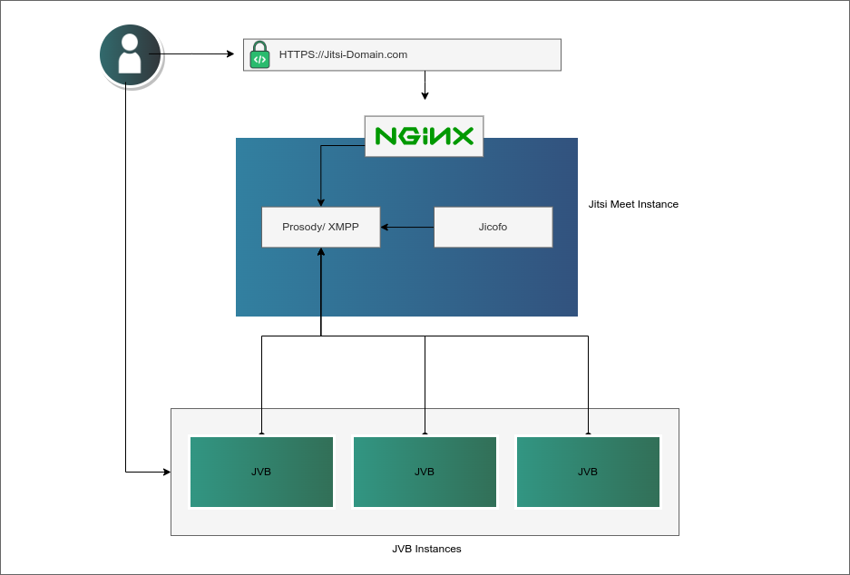

## Cluster Deployment Architecture

[Jitsi](https://jitsi.org) is a suite of open source projects that lets you host your own virtual video conferences.

## Deploying a Marketplace App

{}

{}


**Estimated deployment time:** Jitsi cluster should be fully installed within 5-10 minutes after the Compute Instance has finished provisioning.


## Configuration Options

- **Supported distributions:** Ubuntu 22.04 LTS
- **Suggested minimum plan:** All plan types and sizes can be used. For best results, use a 8GB Dedicated CPU or Shared Compute Instance when hosting large meetings or multiple simultaneous meetings.

### Jitsi Options

{}
- **Admin Email for the Jitsi server**

{}

{}

## Getting Started After Deployment

Jitsi is now installed and ready to use.

1.  Before you go to your app, if you filled out the optional Jitsi configuration fields:

    - In Cloud Manager's [DNS Manager](/docs/products/networking/dns-manager/guides/create-domain/) there is now an entry for your domain with two `A/AAAA` records pointing to your new server. One for the domain name and one for the hostname.
    - [Configure the rDNS](/docs/products/compute/compute-instances/guides/configure-rdns/) on your Linode.

1.  If you didn't setup a domain, navigate to the rDNS address of the Linode in your browser. You can find the rDNS address in the **Networking** tab for your Linode in [Cloud Manager](https://cloud.linode.com). If you did setup a domain, navigate to the address as described in the [Jitsi Options](#jitsi-options) section above.

1.  Jitsi prompts you to start a meeting.

## Software Included

The Jitsi Marketplace App installs the following software on your Linode:

| **Software** | **Description** |
|:--------------|:------------|
| [**Jitsi Meet**](https://jitsi.org/jitsi-meet) | The WebRTC compatible JavaScript application that enables the video conferencing.|
| [**Jitsi Videobridge (jvb)**](https://jitsi.org/jitsi-videobridge) | WebRTC compatible server that routes the video streams between participants in the conference. |
| [**Jitsi Conference Focus (jicofo)**](https://github.com/jitsi/jicofo) | The server-side focus component that manages sessions between participants. |
| [**Prosody**](https://prosody.im/) | XMPP server for signalling. |

{}
