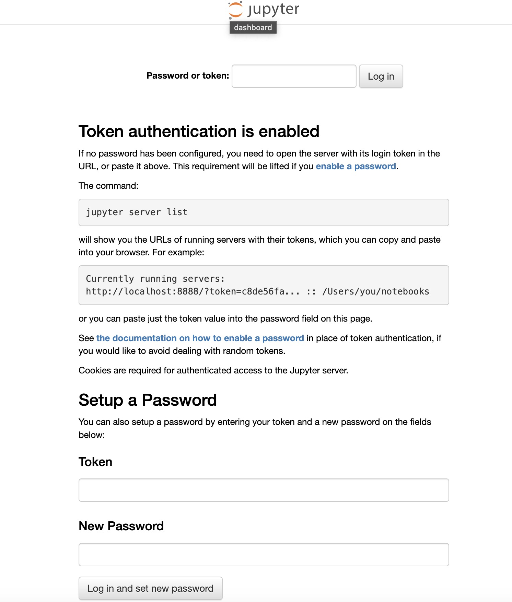
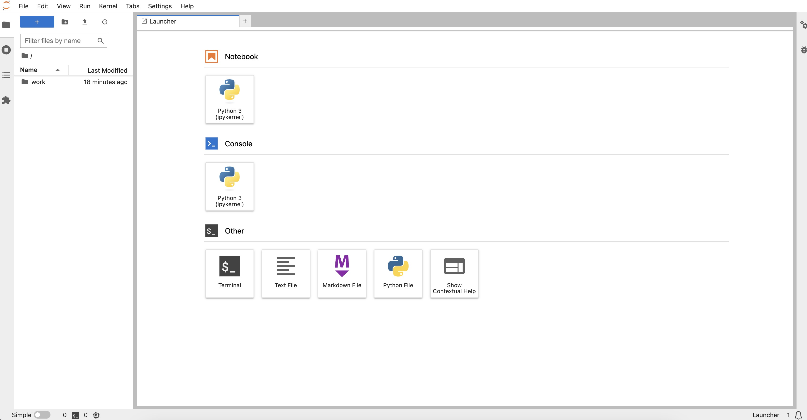

[JupyterLab](https://jupyter.org/) stands as the cutting-edge web-based interactive development environment, catering to notebooks, code, and data. With a flexible interface, users can easily configure and arrange workflows in data science, scientific computing, computational journalism, and machine learning.

## Deploying a Marketplace App

{}

{}


**Estimated deployment time:** JupyterLab should be fully installed within 10-15 minutes after the Compute Instance has finished provisioning.


## Configuration Options

- **Supported distributions:** Ubuntu 22.04 LTS
- **Recommended plan:** All plan types and sizes can be used.

### JupyterLab Options

- **Email address** *(required)*: Enter the email address to use for generating the SSL certificates.

{}

{}

{}

### Getting Started after Deployment

## Accessing the Jupyter Server

Launch your web browser and navigate to the custom domain you set during deployment or the reverse DNS (rDNS) domain associated with your Compute Instance (e.g., 192-0-2-1.ip.linodeusercontent.com). This will direct you to the Jupyter Server login page, where you'll need to enter a token or password. For guidance on locating your Linode's IP addresses and rDNS information, consult the [Managing IP Addresses](/docs/products/compute/compute-instances/guides/manage-ip-addresses/) guide.

## Obtaining the Jupyter Token

By default, Jupyter issues a token for authentication. The Jupyter access token was automatically generated during the initial install process and is stored in the `/home/$USERNAME/.credentials` file. To view the default token, log in to your Compute Instance either through the [LISH Console](/docs/products/compute/compute-instances/guides/lish/#through-cloud-manager-weblish) or via SSH, and check the contents of the file:

```command
cat /home/$USERNAME/.credentials
```

Copy and paste this token into the **Password or token:** field on the Jupyter login page. If you prefer password authentication, use the token to set a password in the **Setup a Password** section on the login page. Once this is done, you can employ both the token and the password for accessing JupyterLab.



Once you have used the token, you will be able to access the JupyterLab base page.



### More Information

You may wish to consult the following resources for additional information on this topic. While these are provided in the hope that they will be useful, we cannot vouch for the accuracy or timeliness of externally hosted materials.

- [Project Jupyter](https://jupyter.org/)
- [JupyterLab Documentation](https://jupyterlab.readthedocs.io/en/latest/)

{}