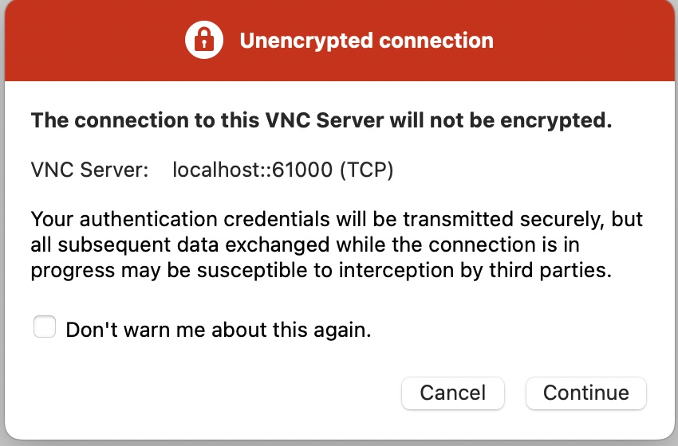
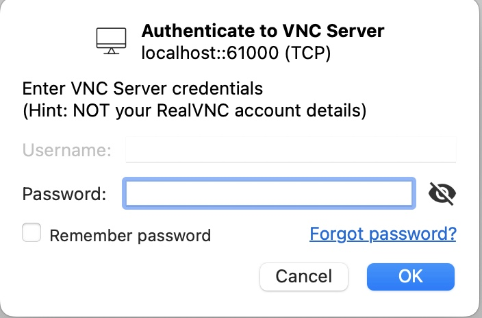

[Kali Linux](https://www.kali.org/) is a specialized Debian-based Linux distribution that has become an industry-standard tool for penetration testing. Kali Linux includes hundreds of free tools for reverse engineering, penetration testing, computer forensics, security audits, and more. It is open source and prioritizes simplicity.


This Marketplace App extends Linode's Kali Linux distribution image by allowing the user to preinstall one of the available metapackages.


## Deploying a Marketplace App

{}

{}


**Estimated deployment time:** Kali Linux should be fully installed within 5-10 minutes (Core), 15-20 minutes (Default), and 45-60 minutes (Everything) after the Compute Instance has finished provisioning. VNC installation takes approximately 5-10 additional minutes.


## Configuration Options

- **Supported distributions:** Kali Linux
- **Recommended plan:** We recommend a 4GB Dedicated CPU or Shared Compute Instance.

### Kali Options

- **Kali Linux Package** *(required)*: Select the Kali Linux metapackage to install:
  - **Core**. Installs the [kali-linux-core](https://www.kali.org/tools/kali-meta/#kali-linux-core) metapackage, which includes essential penetration testing tools.
  - **Default**. Installs the [kali-linux-default](https://www.kali.org/tools/kali-meta/#kali-linux-default) metapackage, which includes commonly used tools and utilities.
  - **Everything**. Installs the [kali-linux-everything](https://www.kali.org/tools/kali-meta/#kali-linux-everything) metapackage, which includes all available Kali packages.

- **Setup VNC Remote Desktop?** *(required)*. Choose whether to install and configure [TigerVNC](https://tigervnc.org/) with [XFCE Desktop](https://www.xfce.org/) for remote desktop access. This is recommended for the *Everything* package and adds desktop functionality to the Default and Core packages.

{}

- **VNC Username** *(Required only if VNC is enabled)*. It's the VNC username for this Compute Instance. This username has elevated privileges (`sudo`) and can access the VNC session.

{}

{}

## Getting Started after Deployment

After Kali Linux is deployed, you can log in through an SSH session as the `root` user and perform your workloads as needed. Your deployment credentials are stored in `/home/[username]/.credentials` for reference. To learn more, See the [Kali Linux documentation](https://www.kali.org/docs/) to learn how to further use your instance.

### Remote Desktop Connection with VNC

If you enabled VNC during deployment, [TigerVNC](https://tigervnc.org/) and the XFCE desktop environment are installed. This allows you to connect remotely to the desktop environment and access Kali's GUI tools.

To access your Kali Linux desktop through a VNC client:


There are many options for OS X and Windows, but this guide uses [RealVNC Viewer](https://www.realvnc.com/en/connect/download/viewer/).


1. From your desktop, create an SSH tunnel to your Compute Instance with the command below replacing `[username]` with the VNC username you created and `[ip]` with the IPv4 address of your Compute Instance. To learn more on viewing IP addresses, see [Managing IP Addresses](/docs/products/compute/compute-instances/guides/manage-ip-addresses/).

    ```output
    ssh -L 61000:localhost:5901 -N -l [username] [ip]
    ```

2. Open your preferred VNC viewer application and connect to your Compute Instance through the SSH tunnel you created. The format is `localhost:61000`.

    

    A warning may appear notifying you that the connection is unencrypted. Since you're using an SSH tunnel, your connection is encrypted over the internet. You can safely ignore this warning and continue.

    

4. Enter the password you created for the VNC user.

    

After connecting, the Kali Linux desktop appears.

{}
