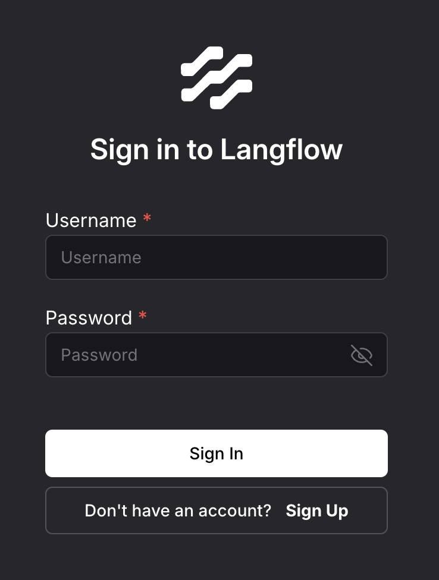

[Langflow](https://www.langflow.org/) is an open source, Python-based framework for building AI applications. It supports key AI functionality, such as agents and the Model Context Protocol (MCP), and it is not tied to any specific large language model (LLM) or vector store. Its visual editor simplifies prototyping application workflows, letting developers quickly turn ideas into working solutions.

## Deploying a Marketplace App

{}

{}


**Estimated deployment time:** Langflow should be fully installed within 5-10 minutes after the Compute Instance has finished provisioning.


## Configuration Options

- **Supported distributions:** Ubuntu 24.04 LTS
- **Recommended plan:** We recommend a plan with at least 4 GB of memory, such as the 4 GB Shared CPU plan. Langflow runs both the application and its PostgreSQL database as containers on the instance, so higher-tier plans improve responsiveness when building and running larger flows.

### Langflow Options

- **Email address** *(required)*: Enter the email address to use for generating the SSL certificates.

{}

{}

{}

## Getting Started after Deployment

### Accessing the Langflow Web Interface

1. Open your web browser and navigate to `https://[domain]`, where *[domain]* is the custom domain you entered during deployment or your Compute Instance's rDNS domain, for example, `192-0-2-1.ip.linodeusercontent.com`. To learn more about viewing IP addresses and rDNS, see the [Manage IP addresses](https://techdocs.akamai.com/cloud-computing/docs/managing-ip-addresses-on-a-compute-instance) guide.

    

2. Use the following credentials to log in:
    - **Username:** *admin*
    - **Password:** Enter the Langflow admin password stored in the credentials file on your server. To obtain it, log in to your Compute Instance via [SSH](https://techdocs.akamai.com/cloud-computing/docs/set-up-and-secure-a-compute-instance#connect-to-the-linode) or [Lish](https://techdocs.akamai.com/cloud-computing/docs/access-your-system-console-using-lish) and run:

        ```command
        cat /home/$USER/.credentials
        ```

    The credentials file also contains your limited sudo user's password and the PostgreSQL database credentials.

3. Once you are logged in to Langflow, go to the canvas.
4. Drag components from the left panel onto the board and connect them to build a flow. Running a flow that calls an LLM or embeddings provider requires you to add your own provider API key (for example, OpenAI) in the relevant component or under **Settings > Global Variables**. To learn more, see:

   - [Langflow Quickstart](https://docs.langflow.org/get-started-quickstart)
   - [Langflow Global Variables](https://docs.langflow.org/configuration-global-variables)

## Software Included

The Langflow Quick Deploy App installs the following software on your Compute Instance:

| **Software** | **Description** |
|:---|:---|
| [**Langflow**](https://www.langflow.org/) | An open source visual framework for building AI agents and workflows. |
| [**PostgreSQL**](https://www.postgresql.org/) | An open source relational database that serves as Langflow's backing store. |
| [**NGINX**](https://nginx.org/) | A web server and reverse proxy that fronts Langflow and terminates SSL. |
| [**Docker**](https://www.docker.com/) | A container runtime used to run the Langflow and PostgreSQL services. |
| [**Docker Compose**](https://docs.docker.com/compose/) | A tool for defining and running the multi-container Langflow deployment. |

{}
