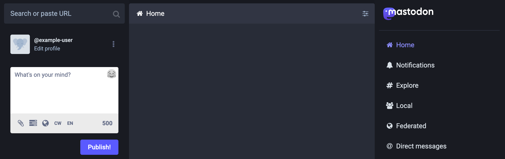
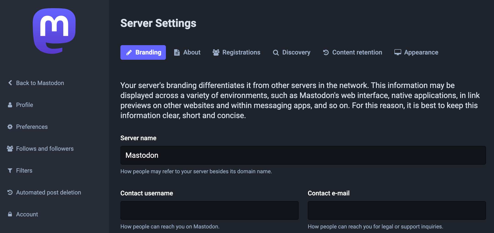

[Mastodon](https://docs.joinmastodon.org/) is an open-source and decentralized micro-blogging platform used to create a social network based on open web standards and principles. Like Twitter, it lets users follow other users and post text, photos, and video content. Unlike Twitter, Mastodon is decentralized, meaning that its content is not maintained by a central authority.

The Mastodon platform takes a federated approach to social networking. Each Mastodon instance operates independently — anyone can create an instance and build their community. Users from different instances can still follow each other, share content, and communicate. Mastodon participates in the [Fediverse](https://en.wikipedia.org/wiki/Fediverse), a collection of social networks and other websites that communicate using the [ActivityPub](https://en.wikipedia.org/wiki/ActivityPub) protocol. That allows different Mastodon instances to communicate and also allows other platforms in the Fediverse to communicate with Mastodon.

Mastodon servers range in size from small private instances to massive public instances and typically center on specific interests or shared principles. The biggest Mastodon server is [Mastodon.social](https://mastodon.social/about), a general-interest server created by the developers of the Mastodon platform. It has over 540,000 users and boasts a thorough [Code of Conduct](https://mastodon.social/about/more).

{}

## Deploying a Quick Deploy App

{}

{}


**Estimated deployment time:** Mastodon should be fully installed within 10-15 minutes after the Compute Instance has finished provisioning.


## Configuration Options

- **Supported distributions:** Ubuntu 24.04 LTS
- **Recommended minimum plan:** 2GB Shared CPU Compute Instance or higher

### Mastodon Options

{}

{}

{}

#### App Options

- **Email for the Let's Encrypt certificate** (*required*): The email you wish to use when creating your TLS/SSL certificate through Let's Encrypt. This email address receives notifications when the certificate needs to be renewed.
- **Username for the Mastodon Owner** (*required*): The username for the owner user that will be created for the Mastodon server.
- **Email Address for the Mastodon Owner** (*required*): The contact email for the Mastodon server's owner.
- **Single-user mode** (*required*): Enabling Single User Mode prevents other users from joining the Mastodon Server.

### Obtain the Credentials

Once the app is deployed, you need to obtain the credentials from the server. To obtain the credentials:

1. Log in to your new Compute Instance using one of the methods below:

    - **Lish Console**: Log in to Cloud Manager, click the **Linodes** link in the left menu, and select the Compute Instance you just deployed. Click **Launch LISH Console**. Log in as the `root` user. To learn more, see [Access your system console using Lish](https://techdocs.akamai.com/cloud-computing/docs/access-your-system-console-using-lish).
    - **SSH**: Log in to your Compute Instance over SSH using the `root` user. To learn how, see [Connect to the Linode](https://techdocs.akamai.com/cloud-computing/docs/set-up-and-secure-a-compute-instance#connect-to-the-linode).

2. Run the following command to access the contents of the `.credentials` file:

    ```command
    cat /home/$USERNAME/.credentials
    ```

This returns the admin password and other details that were automatically generated when the instance was deployed. Save them securely. After your credentials are saved, you can safely delete the file.

## Getting Started after Deployment

1. **Access Mastodon UI**. Open a web browser and navigate to `https:///auth/sign_in`, replacing  with the domain you entered when deploying Mastodon or the rDNS domain `https://203-0-113-0.ip.linodeusercontent.com`. This opens the login page. Enter the owner's email address you created and the password that you obtained in the credentials file.

    

1. **Access admin settings**. Navigate to `https:///admin/settings/` to view your site's administration settings. The administration page lets you alter the look, feel, and behavior of your site. Consider configuring each of these settings, including the site name, contact username, contact email, server description, and fields within other tabs.

    

1. The Mastodon instance also includes [Sidekiq](https://github.com/mperham/sidekiq) (background processing) and [PgHero](https://github.com/ankane/pghero) (a performance dashboard for Postgres). Both of these can be accessed through Mastodon Preferences page or by navigating to the following URLs:

    - **Sidekiq:** `https:///sidekiq`
    - **PgHero:** `https:///pghero`

1. The Mastodon server is configured to send emails for actions such as new users signing up or resetting a password. The installation includes only minimal DNS records and there may be limited deliverability without further configuration. Review the guide to [Sending Email on Linode](https://techdocs.akamai.com/cloud-computing/docs/send-email) for more information on DNS configurations and email best practices.

To learn more about Mastodon, check out the [official documentation](https://docs.joinmastodon.org/) and [Mastodon blog](https://blog.joinmastodon.org/) with news and articles related to Mastodon. Engage with the Mastodon administrative community on [Mastodon’s discussion forum](https://discourse.joinmastodon.org/), where you can peruse conversations about technical issues and community governance. When you are ready to make your instance known, you can add it to the list at [Instances.social](https://instances.social/admin) by filling out the admin form.

{}
