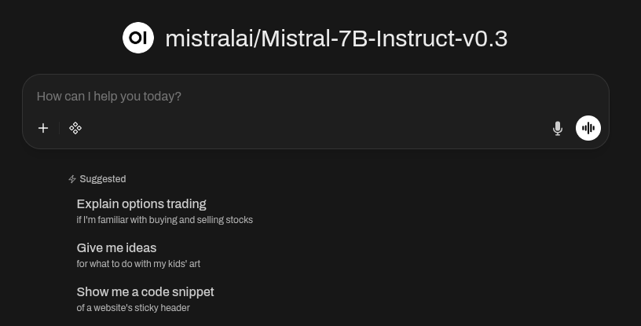

Open WebUI is an open-source, self-hosted web interface for interacting with and managing Large Language Models (LLMs). It supports multiple AI backends, multi-user access, and extensible integrations, enabling secure and customizable deployment for local or remote model inference.

The Quick Deploy App application deployed in this guide uses Mistral-7B-Instruct-v0.3 as an instruction-tuned, open-weight LLM model optimized for prompt following, reasoning, and conversational tasks. It is designed for efficient inference and integrates well with self-hosted platforms like Open WebUI for general-purpose assistance, coding, and knowledge-based workflows.

## Deploying a Quick Deploy App

{}

{}


Open WebUI with Mistral 7B Instruct should be fully installed within 5-10 minutes after the Compute Instance has finished provisioning.


## Configuration Options

- **Recommended plan:** RTX4000 Ada x1 Small


This Quick Deploy App only works with Akamai GPU instances. If you choose a plan other than GPUs, the provisioning will fail, and a notice will appear in the LISH console.


### Open WebUI Options

- **Linode API Token** *(required)*: Your API token is used to deploy additional Compute Instances as part of this cluster. At a minimum, this token must have Read/Write access to *Linodes*. If you do not yet have an API token, see [Get an API Access Token](/docs/products/platform/accounts/guides/manage-api-tokens/) to create one.

- **Email address (for the Let's Encrypt SSL certificate)** *(required)*: Your email is used for Let's Encrypt renewal notices. This allows you to visit Open WebUI securely through a browser.

- **Open WebUI admin name.** *(required)*: This is the name associated with your login and is required by Open WebUI during initial enrollment.

- **Open WebUI admin email.** *(required)*: This is the email used to login into Open WebUI.

{}

{}

## Getting Started After Deployment

### Accessing Open WebUI Frontend

Once your app has finished deploying, you can log into Open WebUI using your browser.

1.  Log into the instance as your limited sudo user, replacing `` with the sudo username you created, and `` with the instance's IPv4 address:

    ```command
    ssh @
    ```

2.  Upon logging into the instance, a banner appears containing the **App URL**. Open your browser and paste the link to direct you to the login for Open WebUI.


    

3.  Return to your terminal, and open the `.credentials` file with the following command. Replace `` with your sudo username:

    ```command
    sudo cat /home//.credentials
    ```

4.  In the `.credentials` file, locate the Open WebUI login email and password. Go back to the Open WebUI login page, and paste the credentials to log in. When you successfully login, you should see the following page.


    

Once you hit the "Okay, Let's Go!" button, you can start to use the chat feature in Open WebUI.


