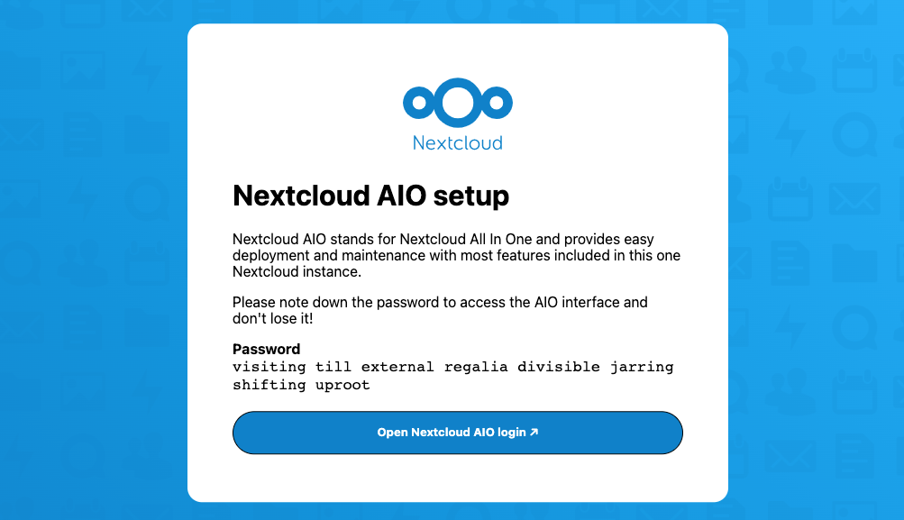
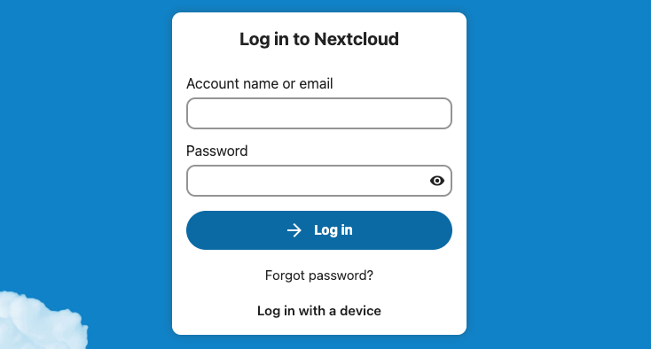

[Nextcloud](https://nextcloud.com/) is an open source solution to file hosting and sharing. With Nextcloud, you can synchronize files from a local computer to the Linode server and share them with collaborators. Nextcloud’s customizable security features and intuitive user interface help to keep files safe and easy to manage.

## Deploying a Marketplace App

{}

{}


**Estimated deployment time:** Nextcloud should be fully installed within 5-7 minutes after the Compute Instance has finished provisioning.


## Configuration Options

- **Supported distributions:** Ubuntu 22.04 LTS
- **Recommended minimum plan:** All plan types and sizes can be used.

### NextCloud Options

{}

{}

{}

## Getting Started after Deployment

### Configure and Start Your Nextcloud Instance {#configure-nextcloud}

Before you can use Nextcloud, you must set up your deployment with the [Nextcloud AIO](https://github.com/nextcloud/all-in-one) tool. This tool manages the containers, add-ons, and the configuration needed to run and maintain your Nextcloud instance.

1. Open a browser window and navigate to the following URL to access the NextCloud AIO interface: `https://[domain]:8443/`, replacing *[domain]* with the custom domain you entered during deployment or your Compute Instance's rDNS domain (such as `192-0-2-17.ip.linodeusercontent.com`).

    
    If the browser displays a message similar to *"Client sent an HTTP request to an HTTPS server"*, you are likely connecting using the HTTP protocol instead of HTTPS. Adjust your URL so that it starts with `https://`.
    

1. The initial Nextcloud AIO setup screen is displayed, which includes an automatically generated password. Save the password and click the **Open Nextcloud AIO login** button.

    

1. In the login page that appears, enter the password from the previous screen and click **Login**.

    

1. Once you have successfully logged in, you are prompted to either create a new AIO instance or restore from a backup. If your intention is to install a fresh Nextcloud instance, enter the domain you specified earlier when deploying the Marketplace app or use your [rDNS](/docs/products/compute/compute-instances/guides/manage-ip-addresses/#viewing-ip-addresses) value if no domain was specified. Then, click **Submit**.

    

1. In the next screen that appears, select any additional add-ons you'd like to enable for this instance, specify the time zone, and then click the **Start Containers** button. This button may be labeled **Download and start containers** if you are downloading a new version of Nextcloud. This process starts all of the containers required by your Nextcloud instance and will take a few minutes to complete.

1. Once all of the Nextcloud Containers are in a *Running* state, the Nextcloud admin username and password are displayed. Save these credentials in a secure location as they are required to log in to the Nextcloud app. If any of your containers appear to be stuck in a *Starting* state, click the reload button to refresh the status.

    

1. You have now successfully initialized your Nextcloud instance and have obtained the admin credentials. To log in to the instance, click the **Open your Nextcloud** button and enter your admin credentials or follow the [log in steps](#log-in-to-nextcloud) below.

### Log in to Your Nextcloud Dashboard {#log-in-to-nextcloud}

After performing the [initial setup and configuration steps](#configure-nextcloud) within Nextcloud AIO, you can now log in to your Nextcloud dashboard.

1. Open a browser window and navigate to `https://[domain]/login`, replacing *[domain]* with the custom domain you entered during deployment or your Compute Instance's rDNS domain (such as `192-0-2-17.ip.linodeusercontent.com`).

1. In the login prompt that appears, enter the credentials that were provided to you by Nextcloud AIO in the previous section. Then, click the **Log in** button.

    

1. Once you are successfully logged in, the Nextcloud dashboard is displayed. From here, you can view and manage your files, photos, calendars, contacts, and much more. To add a new user for yourself and to collaborate with your teammates, follow the Nextcloud [Creating a User](https://docs.nextcloud.com/server/latest/admin_manual/configuration_user/user_configuration.html#creating-a-new-user) guide.

    

## Next Steps

{}

- [Configure Nextcloud to use Linode Object Storage as an External Storage Mount](/docs/guides/how-to-configure-nextcloud-to-use-linode-object-storage-as-an-external-storage-mount/).  You can use Object Storage as a secondary place to store your Nextcloud files. Using Linode Object Storage to store files prevents you from running out of storage space that is limited by your Linode's plan size.
- Install the [Nextcloud desktop synchronization client](https://docs.nextcloud.com/desktop/2.3/installing.html) on a local computer to easily synchronize the desktop files to the Nextcloud server.