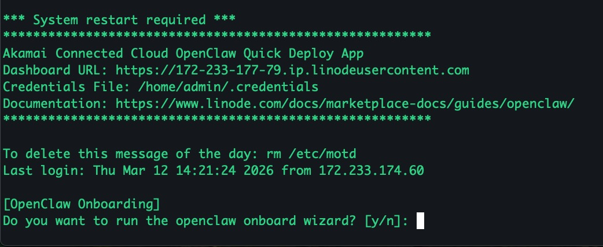
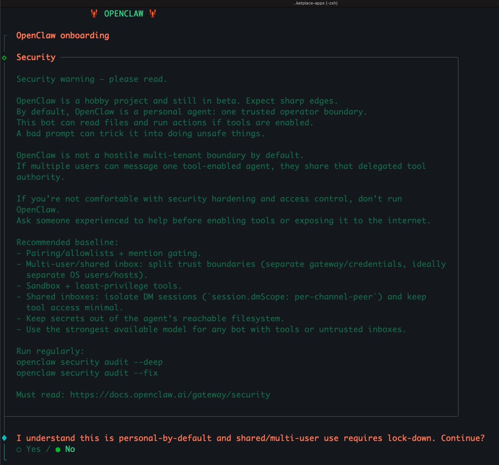
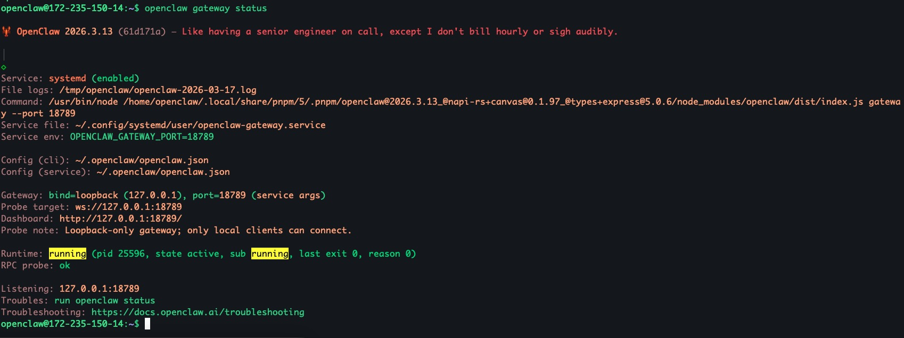
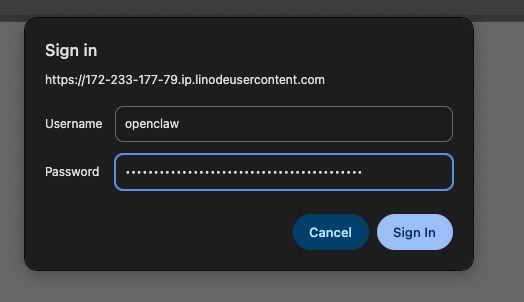

[OpenClaw](https://openclaw.ai/) is an open-source AI agent platform that runs locally and executes tasks through a persistent Gateway service. The Gateway connects communication channels, tools, and AI models, allowing the agent to receive messages, perform actions, and automate workflows. Administrators configure and manage the system through a CLI onboarding wizard and a local web dashboard. Our Quick Deploy App allows you to connect to the OpenClaw dashboard via a secure HTTPS endpoint protected by HTPASSWD.

This Quick Deploy App creates an OpenClaw limited user on the system called `openclaw`.

## Deploying a Quick Deploy App

{}

{}


**Estimated deployment time:** OpenClaw should be fully installed within 5-10 minutes after the Compute Instance has finished provisioning.


## Configuration Options

- **Supported distributions:** Ubuntu 24.04 LTS
- **Recommended plan:** All plan types and sizes can be used.

## OpenClaw Options

- **Email address** *(required)*: Enter the email address you want to use for generating the SSL certificates via Let's Encrypt.

{}

{}

{}

## Getting Started after Deployment

### Performing OpenClaw Onboard

Once the deployment is complete, `openclaw` will be installed on the instance but will not be running. Before you can start using OpenClaw, you will need to get through the onboarding wizard. This Quick Deploy App will trigger the onboarding for you when you log in as root.

1. Log into the instance

If you disabled root login to the server during the setup of the OpenClaw app, you will need to log into the server as the sudo user.

```command
ssh admin@YOUR_INSTANCE_IP
```

Replace `YOUR_INSTANCE_IP` with the IP address of your Linode and `admin` with the sudo user you created. 

2. Escalate privileges to root

Once you've logged in, you will notice the MoTD.
```output
*********************************************************
Akamai Connected Cloud OpenClaw Quick Deploy App
Dashboard URL: https://172-235-150-14.ip.linodeusercontent.com
Credentials File: /home/admin/.credentials
Documentation: https://www.linode.com/docs/marketplace-docs/guides/openclaw/
*********************************************************
```

Copy the sudo password from `~/.credentials.txt` and enter the following command from the terminal:

```command
sudo su -
```

When prompted for the password, paste the sudo password you just got from the `~/.credentials.txt` file. When you log in as **root**, you will notice the following message.



If you are ready to perform the onboarding, enter `y` and it will take you to OpenClaw's onboarding wizard where you can complete the setup.



Once the onboarding is complete the onboarding script will be removed.

### Confirm Gateway Status

At this time, you've configured OpenClaw on the server. To verify that the gateway is running, you will need to become the `openclaw` user. Enter the following from the terminal and the **root** user:

```command
su - openclaw
```

To view the gateway, status enter the following as the **openclaw** user:

```command
openclaw gateway status
```

That should yield the following output:



### Dashboard Access

Once the onboarding is complete and the gateway is running, you will be able to access the Dashboard from the domain you've configured in the initial deployment of the app. If you did not enter a domain name in from the start, the dashboard will be accessible via the instance's rDNS value. You can view the rDNS value from the [Linode's Network](https://techdocs.akamai.com/cloud-computing/docs/configure-rdns-reverse-dns-on-a-compute-instance#setting-reverse-dns) tab.

In this example, we'll use the domain `172-233-177-79.ip.linodeusercontent.com`.

To authenticate to the dashboard you will need to provide two methods of authentication:
1. Dashboard token:
    - If you didn't grab this from the onboarding earlier you will need to follow the next steps.
        1. Become the `openclaw` user:  
            `su - openclaw`.
        2. Run the following next:
            `openclaw dashboard --no-open`
        3. Grab the entire token value `#token=a0764fb` from the `Dashboard URL:` link
2. Nginx Basic Auth:
    - Grab the `Htpassword` password and `Htpasswd username` user from `/home/admin.credentials`.

At this point you have everything you need to access the dashboard. For example:

`https://172-233-177-79.ip.linodeusercontent.com/#token=a0764fb`

When you access the web page you will be prompted for the HTPASSWD details.



Enter the Username as **openclaw** and the Password you got from the  `/home/admin.credentials` file.

{}
