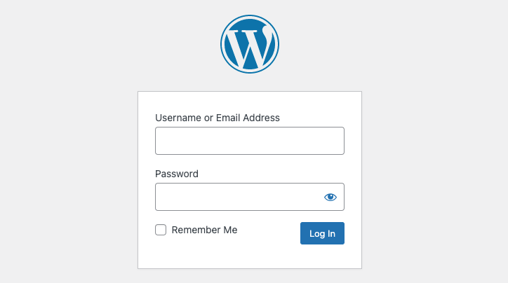
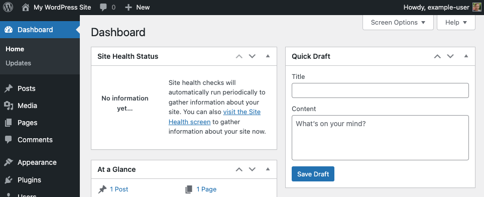
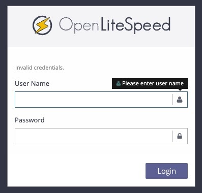
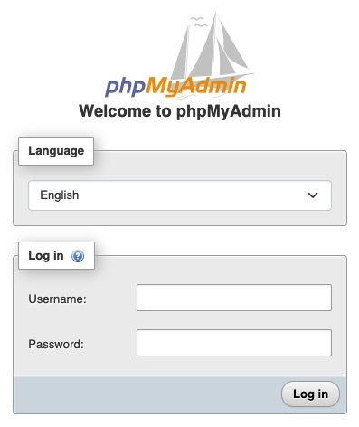

This Marketplace App installs the OpenLiteSpeed web server, WordPress, the LiteSpeed caching plugin for WordPress, as well as other necessary software. Together, these applications provide an accelerated hosting platform for WordPress. [OpenLiteSpeed](https://openlitespeed.org/) is the open source edition of the LiteSpeed web server. It combines speed, security, scalability, optimization, and simplicity in one friendly open-source package.

## Deploying a Marketplace App

{}

{}


**Estimated deployment time:** OpenLiteSpeed WordPress should be fully installed within 2-5 minutes after the Compute Instance has finished provisioning.


## Configuration Options

- **Supported distributions:** Ubuntu 22.04 LTS
- **Suggested minimum plan:** All plan types and sizes can be used.

### OpenLiteSpeed WordPress Options

- **Email address** *(required)*: Enter the email address you wish to use when configuring the WordPress admin user, generating SSL certificates, and optionally creating DNS records for a custom domain.
- **WordPress Admin Username** *(required)*: Username for your WordPress admin user account. Defaults to `admin` if no username is entered.
- **WordPress Database Username** *(required)*: MySQL username for the WordPress database user. Defaults to `wordpress` if no username is entered.
- **WordPress Database Name** *(required)*: Name for the WordPress MySQL database. Defaults to `wordpress` if no database name is defined.
- **Website Title:** Enter a title for your WordPress site.

    
    The passwords for the WordPress Admin User, WordPress Database User and MySQL root user are automatically generated and provided in the file `/home/$USERNAME/.credentials` when the WordPress deployment completes.
    

{}

{}

{}

## Getting Started After Deployment

Log in to your Compute Instance over SSH, using the `root` user or the sudo user created during deployment. See [Connecting to a Remote Server Over SSH](/docs/guides/connect-to-server-over-ssh/) for assistance. Once logged in, you should see Message of the Day output which includes OpenLiteSpeed HTTPS URLs:

```command
cat /etc/motd
```

```output
*********************************************************
Akamai Connected Cloud OpenLiteSpeed Wordpress Marketplace App
App URL:
* The Wordpress site: https://example-domain.tld/
* The Wordpress admin login site: https://example-domain.tld/wp-login.php
* The phpMyAdmin site: https://example-domain.tld/phpmyadmin
* The LiteSpeed admin site: https://example-domain.tld:7080/login.php
Credentials File: /home/$SUDO_USERNAME/.credentials
Documentation: https://www.linode.com/marketplace/apps/linode/openlitespeed-wordpress/
*********************************************************
```

The file `/home/$SUDO_USER/.credentials` includes chosen usernames and strong generated passwords for WordPress, OpenLiteSpeed and PHPMyAdmin users. It also includes passwords for the generated sudo user and MySQL root user.

### Accessing the WordPress Admin Dashboard

1.  Open your web browser and navigate to `https://[domain]/wp-admin/`, where *[domain]* can be replaced with the custom domain you entered during deployment or your Compute Instance's rDNS domain (such as `192-0-2-1.ip.linodeusercontent.com`). You can also use your IPv4 address, though the connection will not be secure. See the [Managing IP Addresses](/docs/products/compute/compute-instances/guides/manage-ip-addresses/) guide for information on viewing IP addresses and rDNS.

    

    
    A TLS/SSL certificate is automatically generated for your custom domain, enabling you to connect to the site over the `https` protocol. If you did not enter a custom domain, a TLS/SSL certificate is configured on the rDNS domain instead. Connections using your IP address are not secured and will use the `http` protocol.
    

1.  Within the login page that appears, enter the username (*admin username*) that you created when you deployed this instance and the associated password that was automatically generated. Then click the **Log In** button.

    

1.  Once logged in, the WordPress Admin Dashboard appears. From here, you can create new posts, add users, modify the theme, and adjust any settings.

    

1.  You can also access the OpenLiteSpeed Admin page for cache and webserver specific settings at `https://[domain]].tld:7080/login.php`.

    

1.  PHPMyAdmin Web UI is available at `https://[domain]/phpmyadmin`.

    

## Going Further

Now that OpenLiteSpeed WordPress has been fully deployed, you can begin adding content and modifying the sites. The following support documents are available:

- See the Linode tab at: https://docs.litespeedtech.com/cloud/images/wordpress/
- [WordPress Support](https://wordpress.org/support/): Learn the basic workflows for using WordPress.
- [Securing WordPress](/docs/guides/how-to-secure-wordpress/): Advice on securing WordPress through HTTPS, using a secure password, changing the admin username, and more.
- [WordPress Themes](https://wordpress.org/themes/#): A collection of *thousands* of WordPress themes.
- [Marketplace Apps Repository](https://github.com/akamai-compute-marketplace/marketplace-apps): Review the deployment Ansible playbooks.

### Software Included

The OpenLiteSpeed WordPress Marketplace App installs the following required software on your Linode:

| **Software** | **Description** |
|:--------------|:------------|
| [**MariaDB Server**](https://www.mysql.com/) | Relational database server forked from MySQL. |
| [**PHP 8**](https://www.php.net/) | Common programming language for web applications. |
| [**OpenLiteSpeed**](https://openlitespeed.org/) | Open source web server based on [LiteSpeed](https://www.litespeedtech.com/products/litespeed-web-server). |
| [**WordPress**](https://wordpress.org/) | Popular content management system (CMS) for building websites. |
| [**LiteSpeed Cache**](https://www.litespeedtech.com/products/cache-plugins/wordpress-acceleration) | Cache management plugin for WordPress. |

{}
