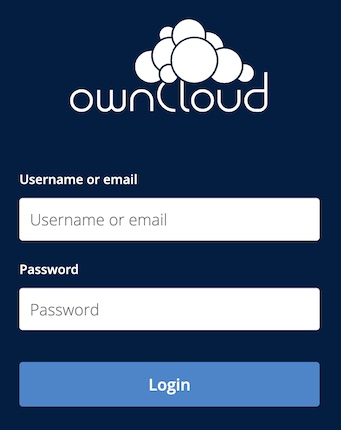

ownCloud is a self-hosted file sharing and collaboration platform. It allows users to securely access and share files, calendars, and contacts from any device. With ownCloud, you have complete control over your data and can easily share files with others while maintaining full privacy and security. The app is easy to configure and offers a wide range of features, including file syncing, versioning, access control, and more.

## Deploying a Marketplace App

{}

{}


**Estimated deployment time:** ownCloud should be fully installed within 2-5 minutes after the Compute Instance has finished provisioning.


## Configuration Options

- **Supported distributions:** Debian 11
- **Recommended plan:** All plan types and sizes can be used.

### ownCloud Options

- **The name of the admin user for ownCloud** *(required)*: Provide a name for the admin user with which you want to administrate ownCloud.
- **The password for ownCloud's admin user** *(required)*: Provide a secure password for the admin user with which you want to administrate ownCloud.
- **Admin Email for the ownCloud server** *(required)*: Provide the email address of the ownCloud admin user.
- **The root password for the database** *(required)*: Provide a secure password for the root user of the database. The root user has the ability to administrate the database. The password should be differ from the ownCloud admin password.
- **The password for the created database user** *(required)*: Provide a secure password for the user who will be used by ownCloud to write and read the database. The password should be differ from the ownCloud admin password and the database root password.
- **The name of the database** (default: "owncloud"): Enter the name you'd like to use for the ownCloud database, if different than the default value.
- **The name of the database user to create** (default: "owncloud"): Enter the name you'd like to use for user of the ownCloud database, if different than the default value.

{}

{}

## Getting Started after Deployment

After deployment, follow the instructions below to access your application.

### Access the ownCloud Site

1.  Open a web browser and enter the following URL, where *[domain]* is either your Compute Instance's default rDNS domain or your own domain name (if you entered one during deployment). See the [Managing IP Addresses](/docs/products/compute/compute-instances/guides/manage-ip-addresses/) guide for information on viewing the IP address and rDNS value.

    ```command
    https://[domain]/
    ```

    
    To change this domain, follow the instructions within the [Changing Your ownCloud URL](https://doc.owncloud.com/server/next/admin_manual/installation/changing_the_web_route.html) guide on ownCloud's documentation site.
    

1.  In the login prompt that appears, enter the admin user credentials you specified when creating the Compute Instance.

    

1.  After logging in for the first time, you may be provided with links to download the ownCloud desktop or mobile apps. If you'd like to use these native applications, learn more about them and download them through the links below:

    - [ownCloud Desktop Client](https://owncloud.com/desktop-app/) (compatible with macOS, Windows, and Linux)
    - [ownCloud iOS app](https://apps.apple.com/us/app/owncloud-file-sync-and-share/id1359583808)
    - [ownCloud Android app](https://play.google.com/store/apps/details?id=com.owncloud.android&hl=en_US&gl=US)

1.  Once you log in and dismiss the welcome screen, you should see the **Files** screen in ownCloud. By default, a few files and folders have been created for you. You can use these default files to start exploring some of ownCloud's file management features or you can delete them and upload your own. From here, you can also click on your username on the top right to access the site settings.

    

Now that you’ve accessed your ownCloud instance, check out [the official ownCloud documentation](https://doc.owncloud.com/server) to learn how to further use your ownCloud instance.

{}