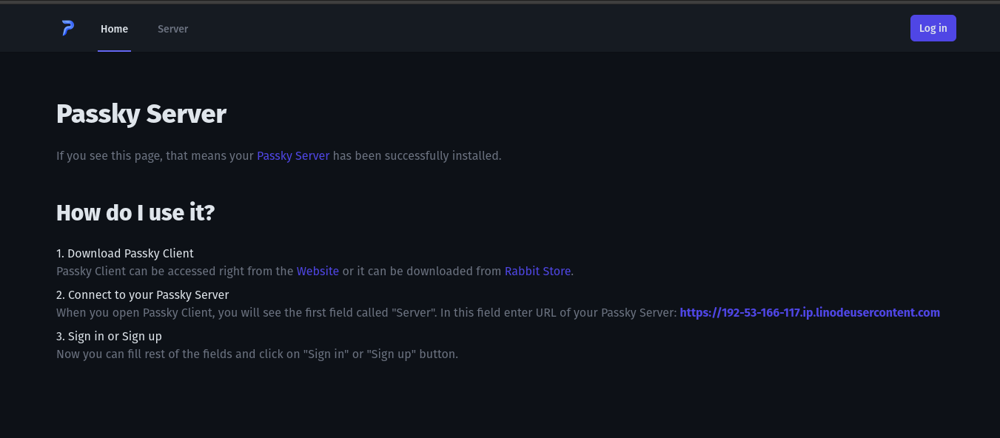

[Passky](https://github.com/Rabbit-Company/Passky-Server) is a simple, modern, lightweight and open-source password manager.

## Deploying a Marketplace App

{}

{}


**Estimated deployment time:** Passky should be fully installed within 5-10 minutes after the Compute Instance has finished provisioning.


## Configuration Options

- **Supported distributions:** Ubuntu 22.04 LTS and Debian 11
- **Recommended plan:** All plan types and sizes can be used.

### Passky Options

- **Email Address** *(required)*: The email address to use for generating TLS/SSL certificates.
- **Admin Username** *(required)*: The username for the Passky Admin user.
- **Admin Password** *(required)*: The password for the Passky Admin user.
- **MySQL Password** *(required)*: The password for the MySQL database.
- **Domain**: The domain name to be included in Apache vhost and used to generated SSL certificates. If none is provided the default rDNS is used.
- **Sub Domain**: The sub domain to be included in Apache vhost and used to generated TLS/SSL certificates.

{}

## Getting Started after Deployment

### Accessing the Passky App

1.  Open your web browser and navigate to the custom domain you entered during deployment or your Compute Instance's rDNS domain (such as `192-0-2-1.ip.linodeusercontent.com`). See the [Managing IP Addresses](/docs/products/compute/compute-instances/guides/manage-ip-addresses/#configuring-rdns) guide for information on viewing the rDNS value.

1. On the Passky front page, enter the username and password you set during deployment to access the server GUI.

    

1. The Passky GUI shows server resource information, the total accounts and passwords stored in the server, active licenses, and the server health.

1. To access the credentials stored in the Passky server you can use the client at the [Passky website](https://passky.org), by [self hosting](https://github.com/Rabbit-Company/Passky-Website#self-hosted), with a [browser extension](https://github.com/Rabbit-Company/Passky-Browser-Extension#installation) or through the [desktop application](https://github.com/Rabbit-Company/Passky-Desktop#installation).

{}