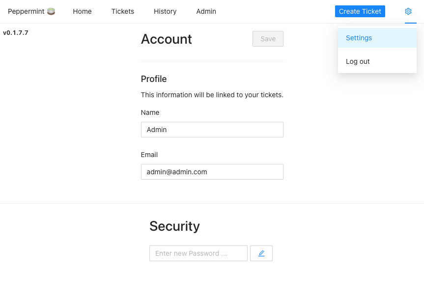

[Peppermint Ticket Management](https://peppermint.sh/) is a ticket management system that allows teams and solo users the ability create & track tickets, to-do items, and more. The project is meant to provide help desks and services desks manage internal and customer requests, but Peppermint is a good solution for anyone looking for a ticket management system that is free and easy to use.

## Deploying a Marketplace App

{}

{}


**Estimated deployment time:** Peppermint should be fully installed within 2-5 minutes after the Compute Instance has finished provisioning.


## Configuration Options

- **Supported distributions:** Ubuntu 22.04 LTS
- **Recommended plan:** All plan types and sizes can be used.

## Peppermint options

- **Email address** *(required)*: Enter the email address to use for generating the SSL certificates.

{}

{}

{}

### Access your Peppermint App

1. To access the Peppermint login screen, open your web browser and navigate to `https://DOMAIN/`, where *DOMAIN* can be replaced with the custom domain you entered during deployment or your Compute Instance's rDNS domain (such as `192-0-2-1.ip.linodeusercontent.com`). See the [Managing IP Addresses](/docs/products/compute/compute-instances/guides/manage-ip-addresses/) guide for information on viewing rDNS.

    

    The default credentials to log in to your Peppermint Ticket Management Panel are:

       Email: admin@admin.com
       Password: 1234

1. Once you log in to the Peppermint Ticket Management Panel, update the email and password you used to log in. To do this, click the Settings gear logo in the top right corner.

For more on Peppermint, consult the following resources:

- [Peppermint Github](https://github.com/Peppermint-Lab/Peppermint/blob/master/README.md)
- [Peppermint Documentation](https://docs.peppermint.sh/)

{}